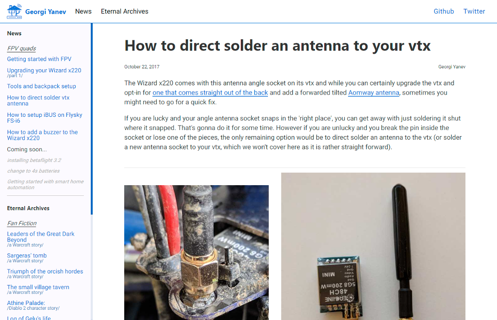

# blog.georgi-yanev.com

### :orange_book: Gatsby (React) based blog. Hosted on Firebase.

This blog uses Gatsby as a React based static site generator. I write articles about FPV quads, web dev, life-long learning and other topics from my personal experience.

To get started clone the repo and install the dependencies:

```
$ git clone https://github.com/jumpalottahigh/blog.georgi-yanev.com.git blog
$ cd blog
$ npm install
```

To run locally in dev mode:

`$ npm run develop`

To deploy to Firebase:

`$ npm run deploy`



## Social Links

- [www.georgi-yanev.com](https://www.georgi-yanev.com)
- [blog.georgi-yanev.com](https://blog.georgi-yanev.com)
- [Facebook](https://www.facebook.com/jumpalottahigh/)
- [Twitter](https://www.twitter.com/jumpalottahigh/)
- [LinkedIn](https://www.linkedin.com/in/yanevgeorgi/)
