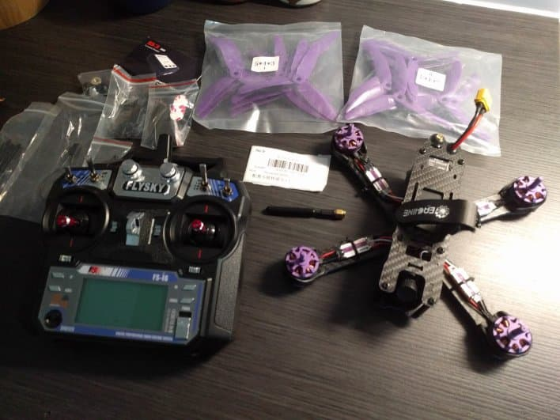
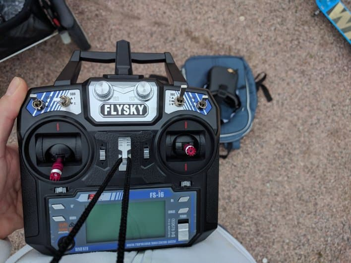
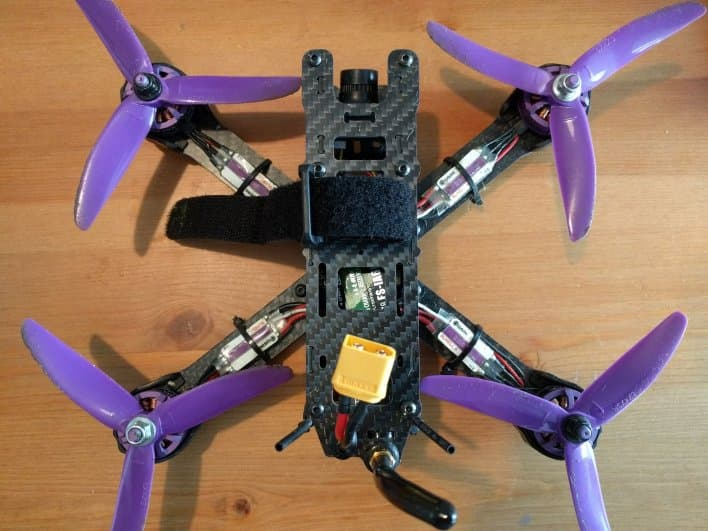
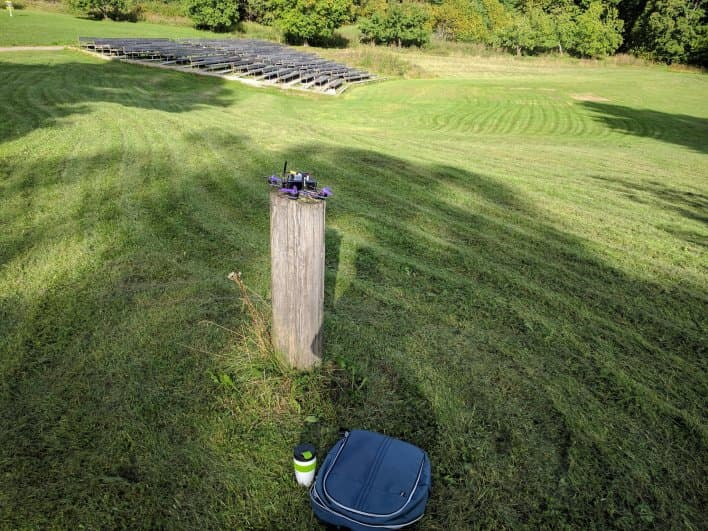
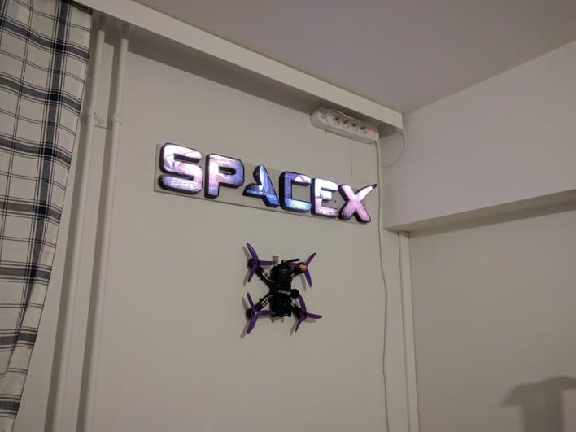

  Add <strong>your FPV spots</strong> on the map over at 
  <strong><a href="https://www.fpvtips.com/fpv-map">fpvtips.com/fpv-map</a></strong>.

About a month ago I stumbled accross a YouTube video of FPV quad footage. For whatever reason it felt quite captivating. So much so, that within a week I ended up ordering a ready to fly quad set - namely the [Wizard x220][1].

Before we get any further, I will assume you have at least a basic idea of what FPV drone racing is and what freestyle is. Here's what came in the mail about ~ 2 weeks after the order date:

The extra props are very well received, and even after only 2-3 flights I managed to break one already. I have even gone as far ahead to purchase even more extra props of roughly the same type as I read a lot of good reviews about the [Cyclone 5 inch 3 blade propeller][2]. They go for about 2.50 euro for a set of 4.

It is also pretty nice that the kit comes with some spare screws and zip ties. Partially because I did my first flight on gravel (!!!) instead of grass, I actually lost 1 screw and had to replace that, az well as one of the ESC zip ties broke.
Suffice it to say I am never again (until I get good at flying) flying on anything else but grass.
Here's quick and dirty mix of the first flight.

<iframe width="560" height="315" src="https://www.youtube.com/embed/oumHGODwJ-s?rel=0" frameBorder="0" allowFullScreen title="first test flight with eachine wizard"></iframe>

You also get this Flysky FS-i6 radio in the kit and from what I have gathered it seems to be a decent radio when you get into the hobby. The [Taranis][3] radio seems to be killing it in terms of popularity among pros, but for our noob needs, the Flysky totally handles things. I assume the Taranis are great radios, they also cost a bit more, but I cannot recommend a specific model, since I haven't gotten my hands on one just yet, so stay tuned. If for whatever reason you only have a quad here's the link to the [Flysky FS-i6][4] radio.

As far as FPV goggles go, I am using the [Eachine VR-007 Pro][5] (on top of the backpack in the picture). Those are super cheap (~ 35 euro), while Fatsharks or other more expensive and much higher quality brands can get up to 500 euro and beyond. I figured those are gonna be a perfect starting goggle for the price and I would never feel sorry about tossing them away in favor of a better set in the future.

Now, I am still a VERY long way from being even a half decent pilot. But for about ~ 5 flights of ~ 10mins or less each, I can really say I see progress. One thing I really recommend is connecting your controller to your computer and spending some time in a simulator. Some of those are surprisingly close to the real thing and they will save you a lot of crashes in the beginning, at least till you get the basics. That would hopefully reduce the chance of ending up with the quad on a tree or a broken quad arm.

After a few flights, still going strong.

I have tried so far 3 simulators and can recommend 2 out of them. Let's start with my favorite.

[FPV Freerider][6] has a trial version and can be tried for free and the full version costs as little as \$5. I am in no way affiliated with that project, but I think they are doing a great job. It is a pretty decent simulator and if you hook up your controller to your computer you can really get used to flying and build some muscle memory for the most common moves using FPV Freerider.

On top of that there is a [great video series by Joshua Bardwell][7] who teaches you how to fly using FPV Freerider.

The other worthy simulator in my opinion is [Rotor Rush][8]. Definitely not a bad choice, feels close to the real thing and you can get a week trial to test it out.

Last _and_ least, although I don't mean to be a hater - Velocidrone. I don't know, might have been a decent choice, but it kind of lost me. And I never looked back.

Other channels I follow on YouTube include [UAVfutures][9] (awesome vids with info and quad reviews as well as custom builds) and [Mr Steele][10] (absolute beast of a pilot).

In the end it is maybe worth mentioning I have already ordered a few upgrades but I'll write up on that later on as there is plenty more to discuss. There are also many more topics we did not cover - 3s vs 4s batteries, VTX and DVR, Go Pro, backpack, spare parts, Beta Flight 3.2 and many more which will look into in future articles.

In the end, the best things you can do to get up and running with FPV are:

- Get out there and fly
- Fly over grassy areas
- Practice on a simulator
- Have fun

If you would like to support the blog and I managed to convince you that FPV quads are an awesome hobby, you can use the affiliate links in the article when making a purchase.

- [Wizard x220, Flysky FS-i6 Radio (ready to fly set)][1]
- [Eachine VR-007 Pro][5]
- [Wizard x220 (quad only)][11]

[0]: Linkslist
[1]: https://bit.ly/eachine-wizardx220
[2]: https://bit.ly/dal-prop
[3]: https://bit.ly/taranis-x9d
[4]: https://bit.ly/flysky-fs-i6
[5]: https://bit.ly/eachine-vr007
[6]: https://fpv-freerider.itch.io/fpv-freerider
[7]: https://www.youtube.com/watch?v=391D5dX7LKg&list=PLwoDb7WF6c8kjYXam4m3msvRbkORU41GY
[8]: http://rotorrush.com/
[9]: https://www.youtube.com/channel/UC3ioIOr3tH6Yz8qzr418R-g
[10]: https://www.youtube.com/channel/UCQEqPV0AwJ6mQYLmSO0rcNA
[11]: https://bit.ly/only-wizard
