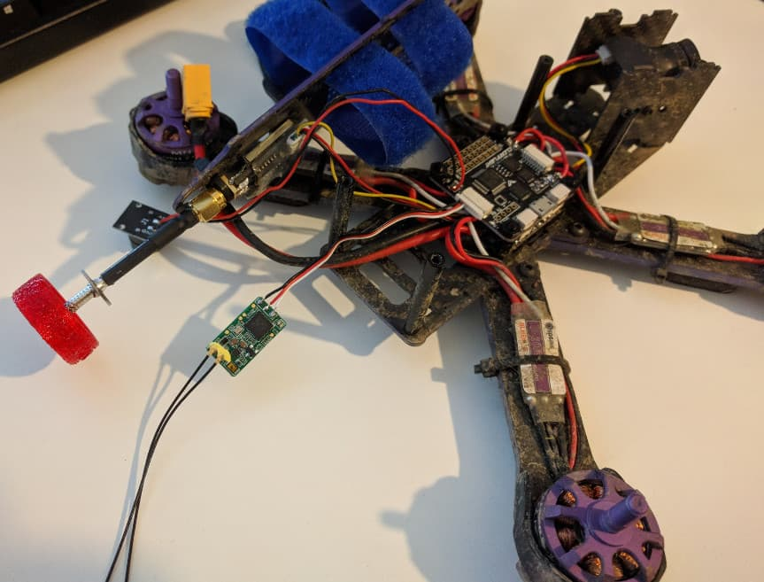
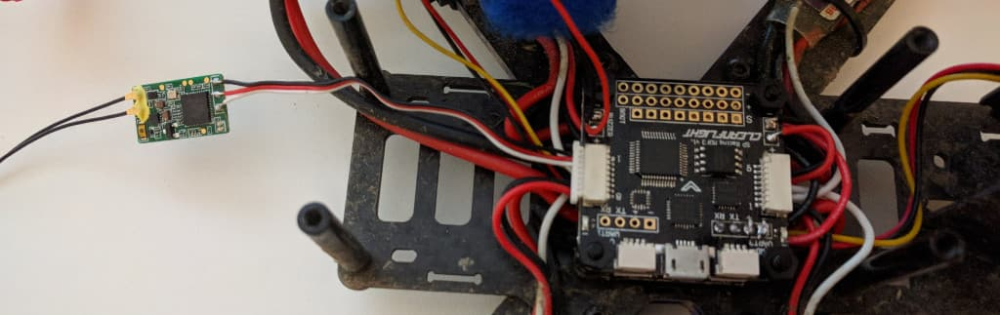
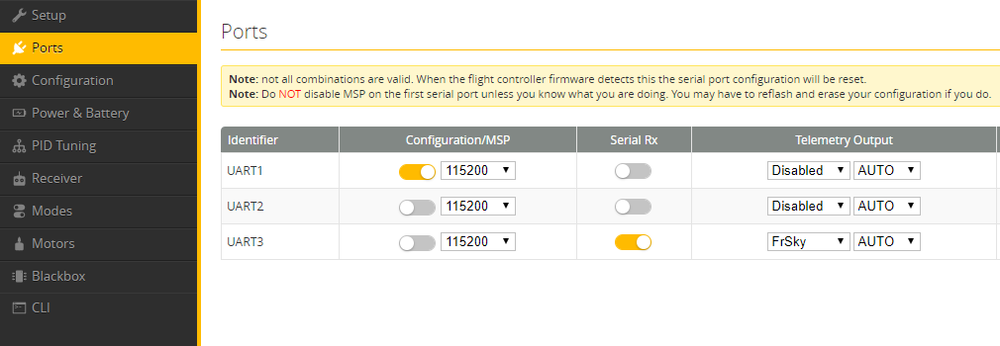
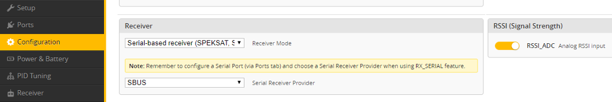

  Add <strong>your FPV spots</strong> on the map over at 
  <strong><a href="https://www.fpvtips.com/fpv-map">fpvtips.com/fpv-map</a></strong>.

The [Frsky XM+][1] receiver is an awesome little thing. Coming in at only \$14 it is a tiny, but full featured receiver for Taranis radios. Since I originally bought my [first drone][2] with a Flysky receiver, but lately transitioned to the [Taranis Q X7][3] radio, it only made sense to mod the Wizard x220 so I can fly it with my new favorite radio.

Here's the final product.

### Solder and connect the XM+

Let's look past how dirty my Wizard is - from learning to fly and crashing.
First thing to take a note of - I have plugged in the Frsky XM+ to the back port (normally the Flysky receiver is connected to the front port of the flight controller).

Solder the following wires to the receiver in the order you see (top to bottom):

**black (top) = ground**

**red (mid) = voltage**

**white (bottom) = signal**

Those go into the back UART port in the same order from top to down - **ground, voltage, signal**.

### Bind the radio to the receiver

To bind the radio to the receiver, take the props off (!!!) if you haven't already and put your transmitter in bind mode.
Then press and hold the bind button on the receiver as you plug in your quad's battery. After a few seconds if all is well the receiver should bind. Stop the binding function on your transmitter and power cycle the quad - turn it off and on. If all is well you should see solid green led on the receiver.

If at this point you have any issues (which happened to me) you might need to flash your receiver with the EU version of the firmware. This is not as hard as it sounds, but will be covered in another post.

### Configure Betaflight

In Betaflight you want to enable Serial Rx on UART3 in the Ports tab.

Then go to the Configuration tab and set receiver to SBUS and RSSI on.

That's about it. Don't forget to check all your other settings and make sure your radio channels work as expected in the receiver tab.
Happy flying!

#### Where to get those items?

###### FrSky XM+ - [Amazon][4] [Banggood][1]

###### Taranis Q X7 - [Amazon][5] [Banggood][3]

###### Taranis X-Lite - [Amazon][7] [Banggood][6]

###### Eachine Wizard x220 - [Amazon][9] [Banggood][8]

[0]: Linkslist
[1]: https://bit.ly/xm-plus
[2]: https://bit.ly/wizardx220
[3]: https://bit.ly/taranis-qx7
[4]: https://amzn.to/2I57CQu
[5]: https://amzn.to/2VszUYb
[6]: https://bit.ly/taranis-xlite
[7]: https://amzn.to/2I92UBh
[8]: https://bit.ly/eachine-wizardx220
[9]: https://amzn.to/2UBB9XH
