

  <strong>Update: 7 April 2019</strong> 
  A year later I'm still flying this quad, so I thought I'd share some of the changes to the build.
  <a href="#update-april-2019">Read about the updates at the end of this article.</a>

This build is heavily inspired by [UAVfutures' 110MPH build][1] with some changes. Building this quad had its ups and downs as you can tell from the rest of the article. While I don't give up easily in the face of challenge, I'd like to point out that after having issues with 2 of those Racerstar StarF4S boards, I **DO NOT RECOMMEND** them for your build and am myself looking for an alternative. The board was ok while it worked and <a href="#maiden-flight">I had a ton of fun flying my quad for a month and a half</a>, but having 2 of those boards fail within ~ 2 months is the threshold of my patience.

### 1. Initial test assembly

As some of the parts arrived I decided to do an initial test assembly of the frame to have a look at components and potential pitfalls and I did indeed find one. The screws that came with the [BrotherHobby Returner motors][2] were too short for the thick 6mm arms of the [Realacc Furious frame][3]. Luckily I had also ordered an assortment of screws and hope to find a fitting match there.

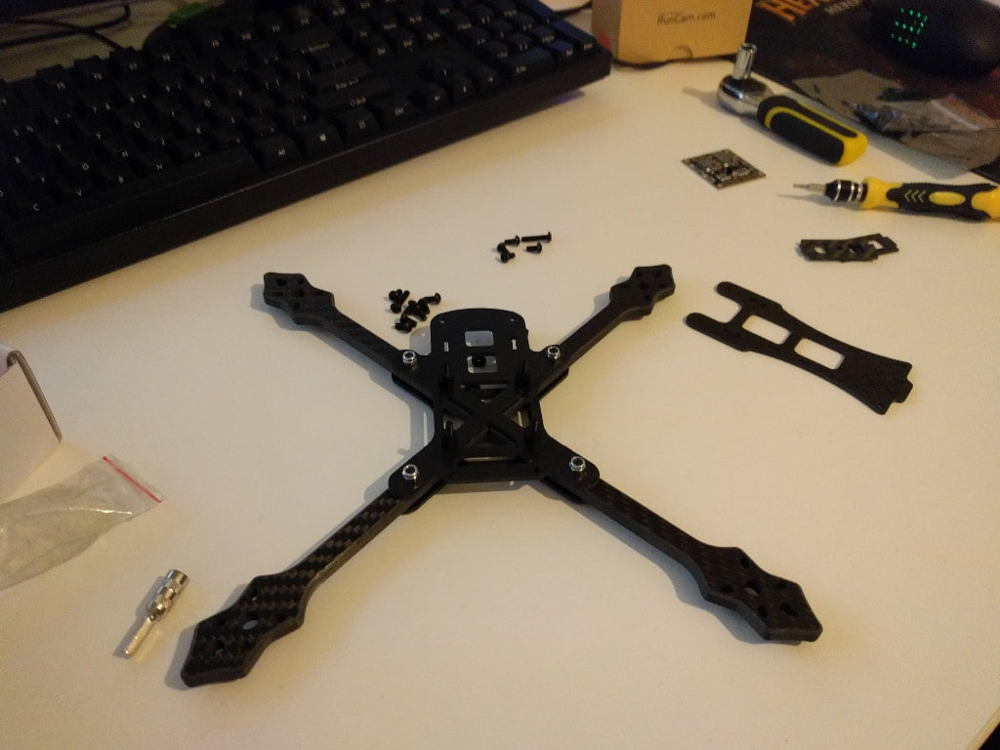

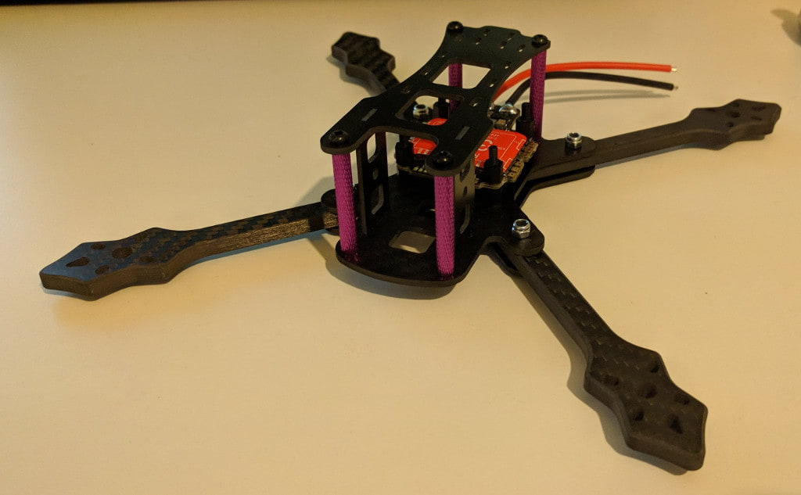

### 2. Mount the motors

It seemed that 10mm was the perfect length screw I needed to get through the frame arm and just enough into the motor. Additionally I used some loctite threadlocker and tightened the screws properly. Here's the frame with the motors mounted.

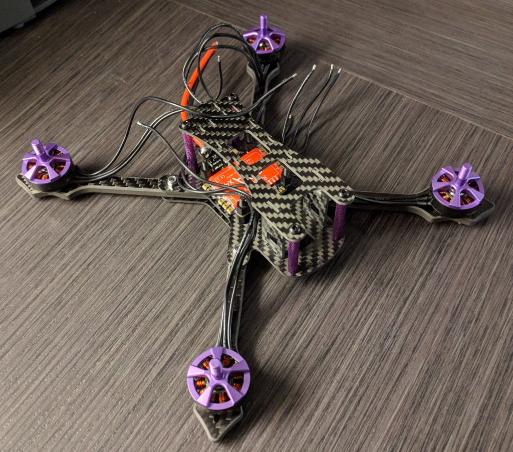

### 3. Solder the motors to the ESC

This step was rather straight-forward and consists of the following steps (repeated for each motor):

1.  Tin up the ESC pads.
2.  Cut wires to length, strip silicone and tin the ends.
3.  Solder to the ESC.

Caveats and things to look out for:

- Do a quick solder job
- Use well heated iron (I used 400C-450C [750F - 840F] with a 48 watt station)
- Use extra flux if your solder oxidizes too quickly to avoid cold solder joints
- Motor rotation will be adjusted with software.

The solder I used and have seen recommended widely is [63/37 tin lead rosin core 0.8mm 2% flux solder][4].

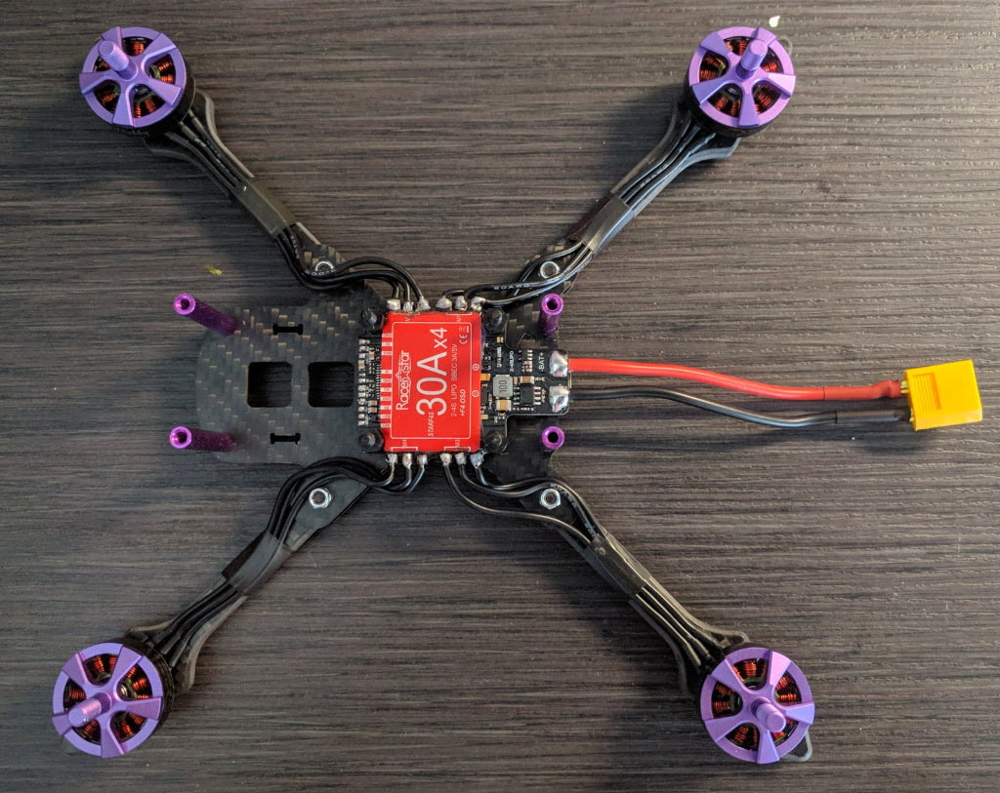

While at it, I also soldered an XT-60 connector to the battery leads. You do need to be careful for polarity. Here's how the wires should be connected.

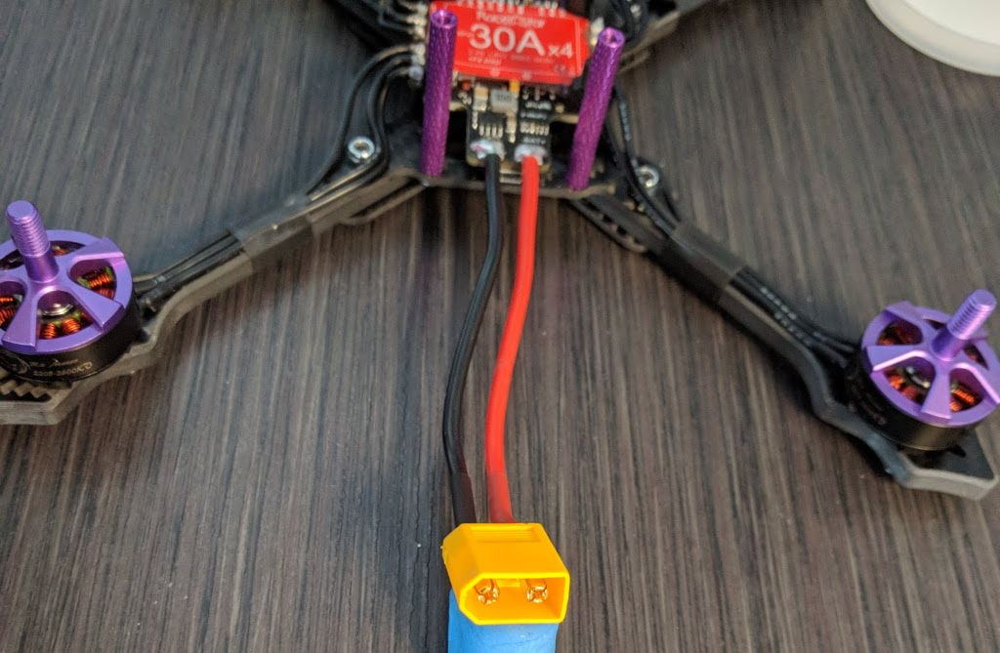

### 4. Solder and bind the receiver

Since the next item to arrive was the [Frsky XM+ receiver][5], I worked on that next.

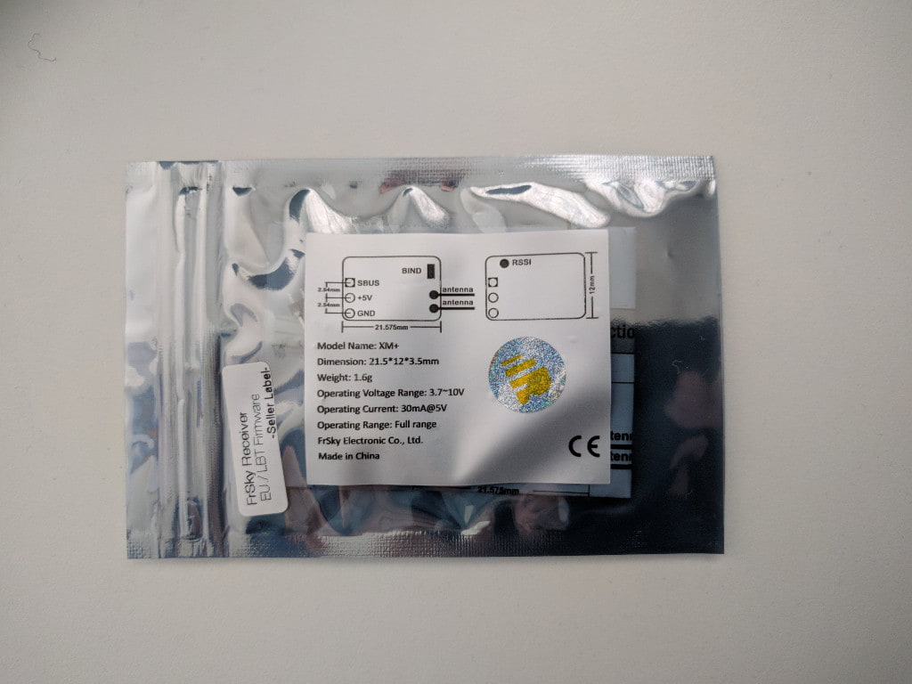

First solder some wires to the receiver as seen on the picture below:

- Black = Ground
- White = 5V
- Yellow = Signal

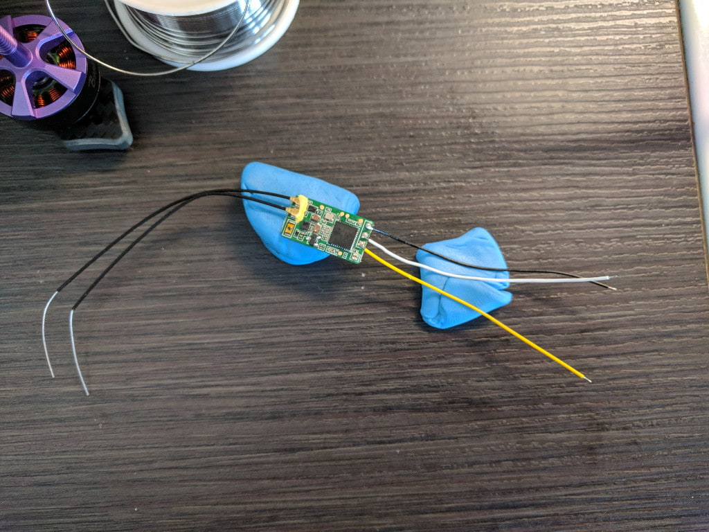

The other end of those wires go into the flight controller's front right hand solder pads as seen on this picture.

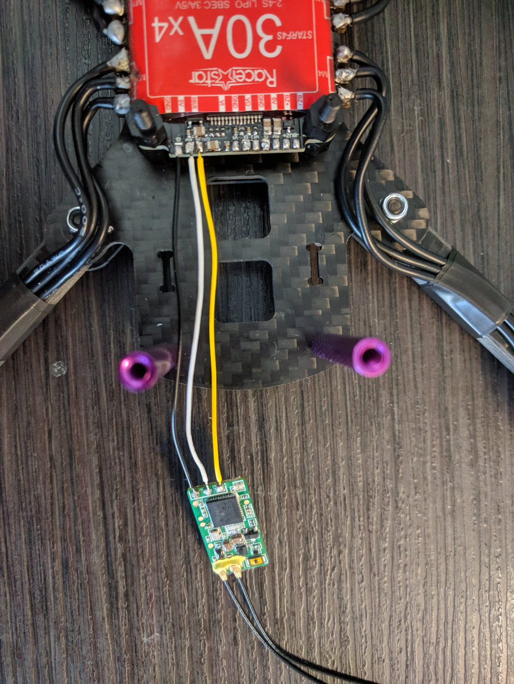

Basically look for SBUS, ground and 5V pads close to each other.
With the receiver soldered the next step is to bind it to the receiver.

- Create a new model in your transmitter
- Press `BND` and the transmitter will start chirping
- While holding the bind button on the receiver, connect the quad to a battery (PROPS OFF!!!)
- In a few seconds the bind is complete
- Exit the bind on the radio and turn it off
- Unplug the battery from the quad
- Turn on the radio and plug in the battery to the quad
- If your receiver's led is solid green, it's all good and your radio is bound

On the radio's Mixers page I mapped channels 5 and 6 to a couple of switches. I will use those later in Betaflight as AUX1 and AUX2 for arming and flight modes/beeper.

### 5. Motor test and setup in BLHELI configurator

With the receiver and radio all set up it's finally time for a motor test to see if everything works correctly (although 2 of the motors' direction still needs to be reversed with software).

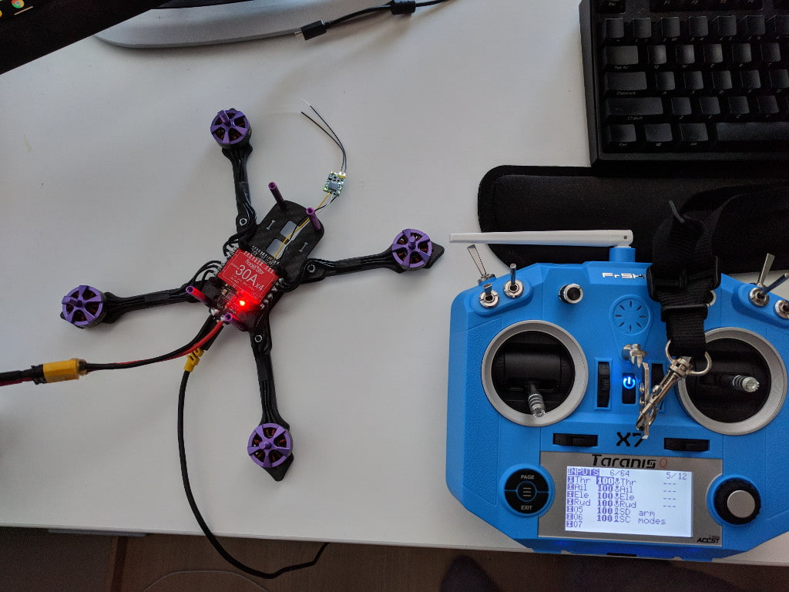

Again, can't stress that enough, **never have propellers on when working on your quad and / or the motors**.
In Betaflight I setup up and arming switch and chaned the receiver channel mode to `TAER` to match the mode in the transmitter. At that point the channels were mapped correctly and seemed to work fine.

Then I armed it for the first time and **all but one motor** worked. The front-right motor does not start up at all. As a first test I desoldered and resoldered it back but it still does not start up. To be continued...

Either way, here's how to setup the motor rotation in the [BLHELI configurator][6]. The first picture shows the default setup when I first plugged the quad in. The second picture is the end result.

As you can tell, the only difference was setting motors 2 and 3 to be in reverse direction. That does the trick.

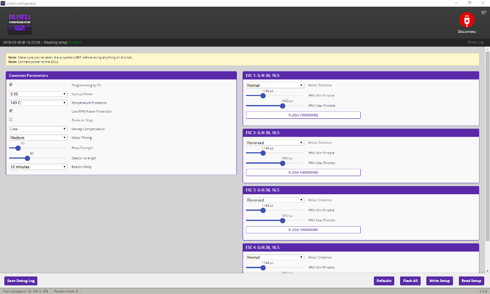

To top it all off, when I was trying to connect a micro USB cable to the flight controller the **micro USB connector fell off the board**...

### 6. Throubleshooting

Building and repairing quads certainly requires a lot of learning and investigation. It's one of the best parts of the hobby and also sometimes one of the most frustrating ones. When seriously stuck, taking a break always helps (works also with programming).

Having concluded that a dead ESC fried one of my motors, I purchased a new motor and requested a refund for the 4-in-1 board. While waiting for those to arrive I decided to also get my hands on a [multimeter][7] and make a [smoke stopped][8].

I can't stress it enough how much I recommend making your own smoke stopper. So much so, I decided to make a super quick guide, so if you are interested (and you should be) go here to read more about [how to make your own smoke stopper][8].

### 7. Recovery

Once the new motor and flight controller were here, it was time to resume the build. Once again, I quickly soldered in the motors to the ESCs, and the receiver to the SBUS.

I tested everything for continuity with the multimeter and plugged in the smoke stopper. It was finally time to plug in the battery and test the build.

The quad booted up and when I armed it, **all 4 motors started** 🎉!

### 8. Moving on

It was finally time to continue the build as all the rest of the components had arrived already.

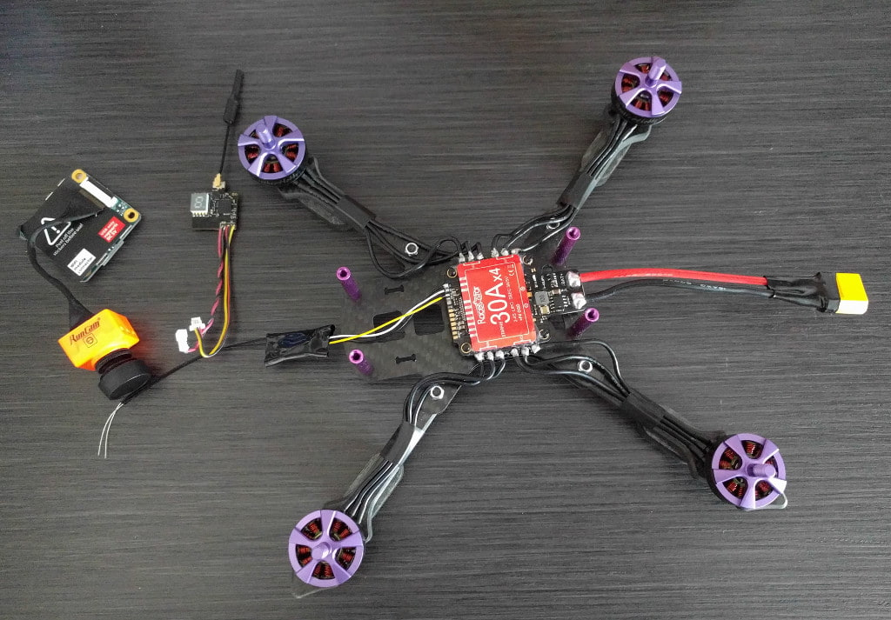

I decided to use a [Runcam Split 2][9] camera that I could just mount on the stack.

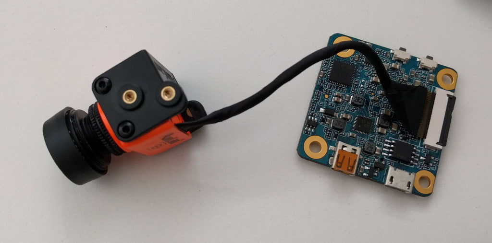

So I decided to first go for a test fit to see how things would go. It's nice to consider what length cables you would need and how things would really be in the end.

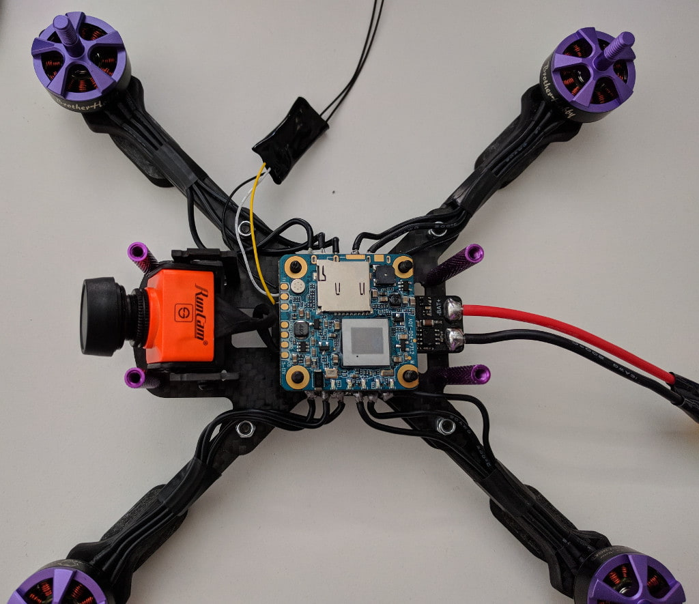

### 9. Soldering the VTX

The next easy step was to solder the [Eachine VTX03][10]. The black and red wire were soldered to the ground and 5V pads on the FC. The cluster with 3 wires, however required some work. The yellow wire was soldered to VO (Video Out). The other 2 wires from that cluster were obsolete and were cut at different lengths and shrink-wrapped to prevent shorts.

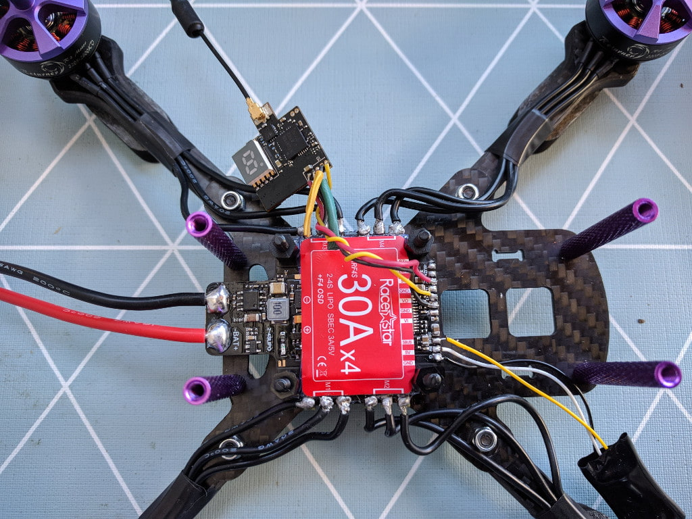

### 10. Soldering the camera

Next up, I prepared the [Runcam Split 2][9]. I had to solder 3 wires to the back solder pads: red to 5v, black to ground and yellow to video signal (not audio!).

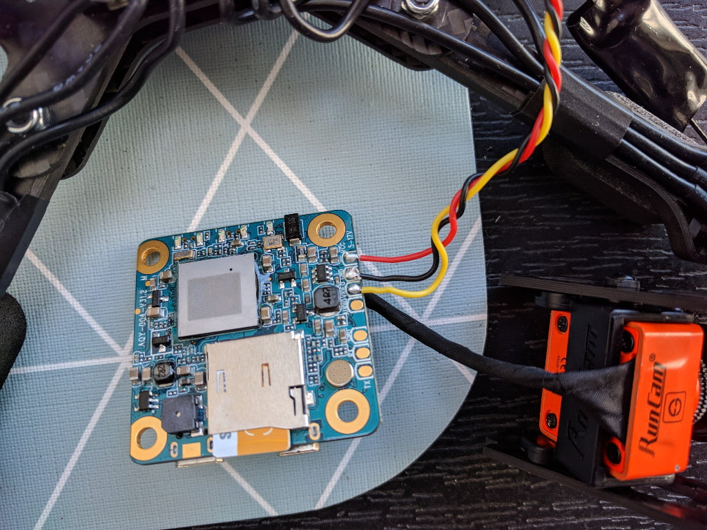

Then the yellow wire from the Runcam went into VI (Video In) on the flight controller. The black wire had to share the ground pad with the previously installed VTX ground. The red wire had to share the 5V pad with the VTX's red wire. A bit tricky but doable.

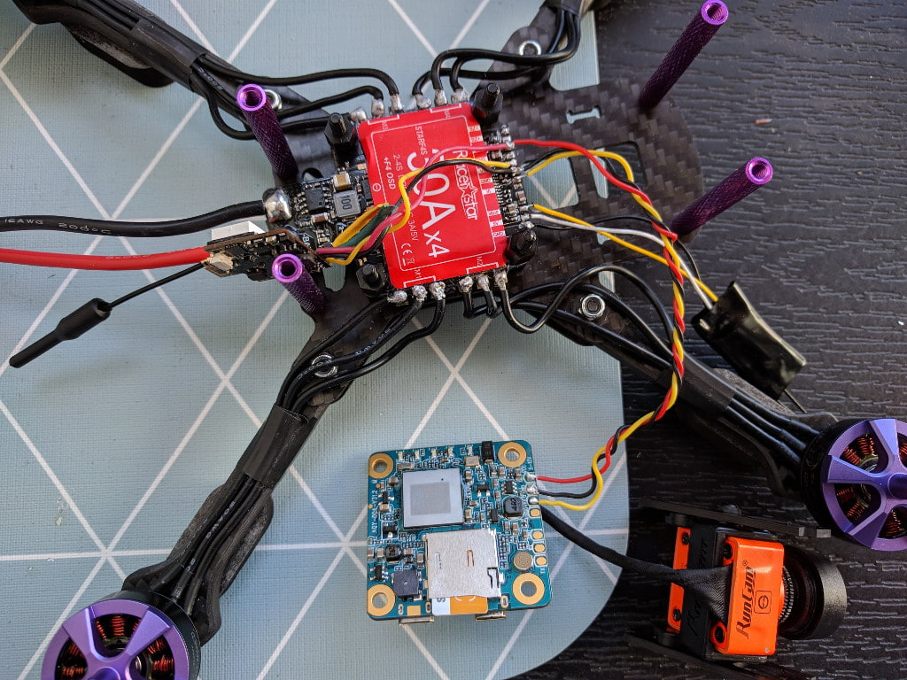

And a bit closer.

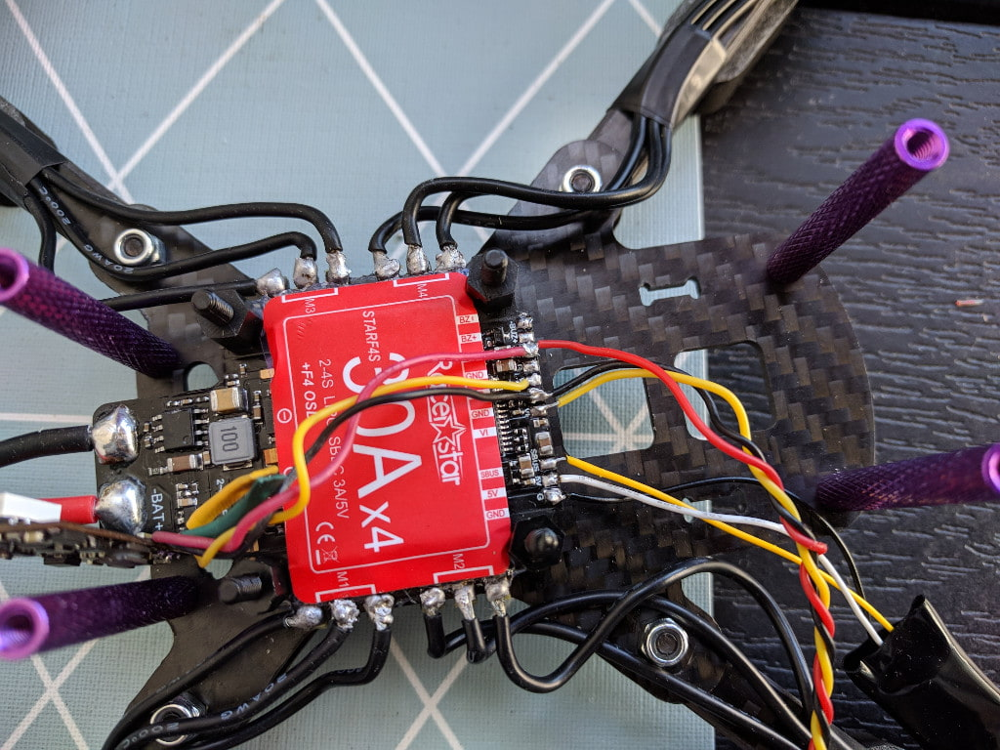

#### If you followed along, congrats! You just build a quad!

This was my first quad build and while there certainly were some setbacks and unpleasant moments, I learnt a lot and can't wait to have even less painful builds in the future as I get better at this.

For now let's take this quad for a maiden flight and ... realise that the motors are messed up. **Always verify the motor directions on a new build**. I trusted solely BLHELI and although motor 2 and 3 were indeed correctly reversed, I had to reverse 1 and 4 also (?!). Something with the wiring I guess. Whatever the case, make sure you test the rotation of the motors and make sure they are correctly setup.

Lastly, I'll upload a video of the maiden flight as soon as I have completed it! Happy flying!

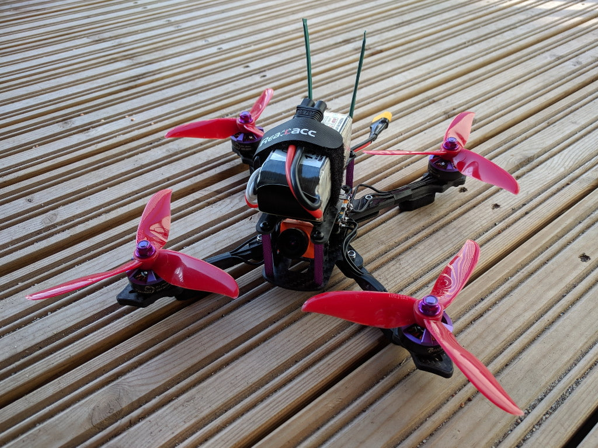

Here is some 1080p 60fps footage from the maiden flight:

  <iframe width="560" height="315" src="https://www.youtube.com/embed/398BDc5mvuA?rel=0" frameBorder="0" allowFullScreen title="Custom quad build maiden flight" referrerpolicy="strict-origin-when-cross-origin"></iframe>

### Update: April 2019

Because my other quad's one ESC and/or motor died, I started season 2019 by flying this custom build quad which I called `Phoenix`, as it had risen from the ashes multiple times.

Here is a list of the parts that I'm currently using in it:

**Camera - Runcam Split Mini**
 
[Banggood][11]
[Amazon][12]

_I had to swap that in as I'm using my full size RunCam Split 2 in another build. If you do decide to use the Split Mini yourself, make sure you grab the newer version._

---

**VTX - Eachine VTX03**
 
[Banggood][13]
[Amazon][14]

_No changes. This VTX has worked pretty fine so far, no issues._

---

**Receiver - FrSky XM+**
 
[Banggood][15]
[Amazon][16]

_No changes. Awesome little receiver for FrSky radios, and very cheap too._

---

**Flight controller, 4 in 1 ESC stack - Holybro Kakute F4 V2 Flight Controller Tekko32 35A 4 In 1 Blheli 32 3-6S Brushless ESC**
 
[Banggood][17]
[Amazon][18]

_The biggest change. You probably already read about my poor experience with the Racerstar StarF4S all in one boards. I ordered another board and had some more mishaps, which were in that case my fault. Finally I just got this Holybro stack of a 4 in 1 ESC board (Tekko32) and a Kakute F4 V2 Flight controller. It was somewhat pricey, but haven't looked back since. It was easy to install and flies smoothly._

---

**Motors - BrotherHobby Returner R2 2205 2800KV**
 
[Banggood][19]
[Amazon][20]

_No changes. These motors fly really well and I have yet to need to change one._

---

**Frame - Realacc Furious 220mm**
 
[Banggood][21]
[Amazon][22]

_No changes to the frame either. No damage, even though I have crashed it a number of times in dirt and gravel. Not on asphalt though._

---

Here's how the quad looks these days:

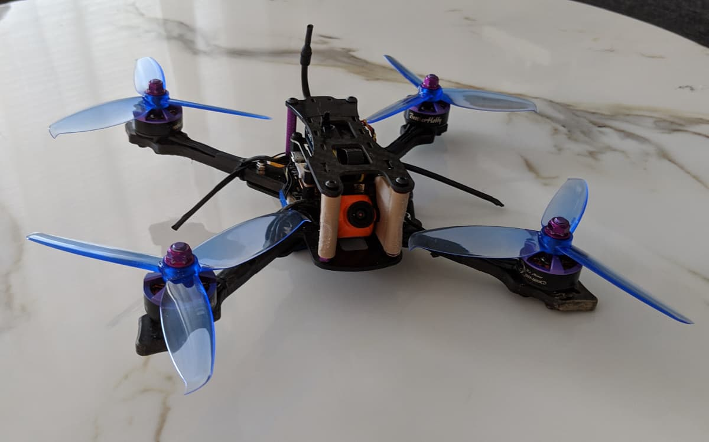

And here is some footage:

  <iframe width="560" height="315" src="https://www.youtube.com/embed/NM_6JpppqZg?rel=0" frameBorder="0" allowFullScreen title="Custom quad build a year later, video 1" referrerpolicy="strict-origin-when-cross-origin"></iframe>

  <iframe width="560" height="315" src="https://www.youtube.com/embed/SPCKjB2XKcI?rel=0" frameBorder="0" allowFullScreen title="Custom quad build a year later, video 2" referrerpolicy="strict-origin-when-cross-origin"></iframe>

  <iframe width="560" height="315" src="https://www.youtube.com/embed/PigsOtpozno?rel=0" frameBorder="0" allowFullScreen title="Custom quad build a year later, video 3" referrerpolicy="strict-origin-when-cross-origin"></iframe>

[0]: Linkslist
[1]: https://www.youtube.com/watch?v=evVP9_FpNSE
[2]: https://bit.ly/bh-returner
[3]: https://bit.ly/realacc-furious
[4]: https://bit.ly/solder-resin-core
[5]: https://bit.ly/xm-plus
[6]: https://github.com/blheli-configurator/blheli-configurator/releases
[7]: https://bit.ly/budget-multimeter
[8]: /fpv/make-a-smoke-stopper
[9]: https://bit.ly/runcam-split2s
[10]: https://bit.ly/eachine-vtx-03
[11]: https://bit.ly/runcam-split-mini-2
[12]: https://amzn.to/2I4np1N
[13]: https://bit.ly/eachine-vtx-03
[14]: https://amzn.to/2IhPKB0
[15]: https://bit.ly/xm-plus
[16]: https://amzn.to/2I57CQu
[17]: https://bit.ly/kakute-f4-tekko32
[18]: https://amzn.to/2CYYs3O
[19]: https://bit.ly/bh-returner
[20]: https://amzn.to/2UyNoEv
[21]: https://bit.ly/realacc-furious
[22]: https://amzn.to/2G500Ly
