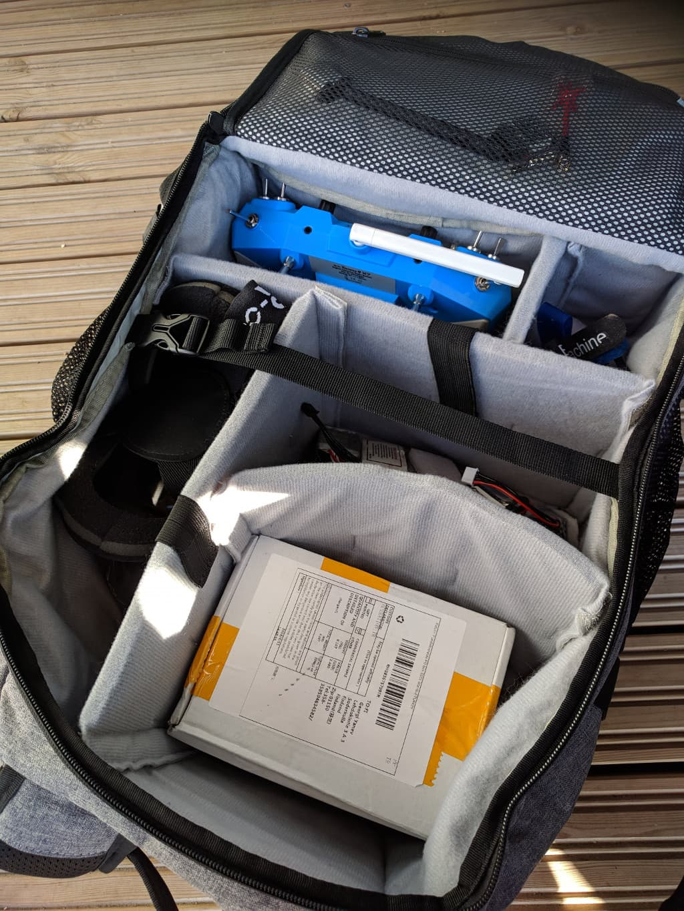

  <strong>Update: 9 July 2019</strong> 
  A year later I'm still absolutely loving the backpack. I took it abroad with me on two trips, and use it daily when flying drones.
  <a href="#update-july-2019">Read about the updates at the end of this article.</a>

A couple of weeks ago I switched to the new [Realacc backpack][1] and now the time has come to drop a few words on it.
Spoiler: It's pretty awesome!

The backpack looks pretty slick and comes with a rainproof cover. There are many pockets and the inside compartments are completely configurable. It comes with 1 drone strap in the middle and 2 extra hooks to the sides where you could attach 2 more quads if needs be with a doggie strap.

There are plenty of different ways to arrange the compartments inside because as mentioned they are completely configurable. Here's how my setup looks.

Additionally in the front pocket there is a tool holder sheet, and here is how I have populated mine:

Overall very happy with the backpack. It's surprisingly spacious, I'm not using even 80% of the space. For \$50 it's a good investment for your drone gear. Recommmend 10/10! And no, this is not a paid review, just my own experience with a pretty good product.

### Update: July 2019

Just wanted to follow up and reiterate what a good purchase this has really been. A year of heavy use later I still have had no issues with the backpack. It's pretty much as good as new. I took it on a few trips with me, packed with drone gear and clothes and it was a perfect carry on bag. In fact, I was surprised how much stuff you can fit in it.

On top of it all, the [Realacc backpack][1] carries three 5-inch quads on it with ease :) Love it, love it! Happy flying!

#### Where to buy it?

###### Realacc backpack - [Amazon][2] [Banggood][1]

[0]: Linkslist
[1]: https://bit.ly/realacc-backpack
[2]: https://amzn.to/2FYPS5v
