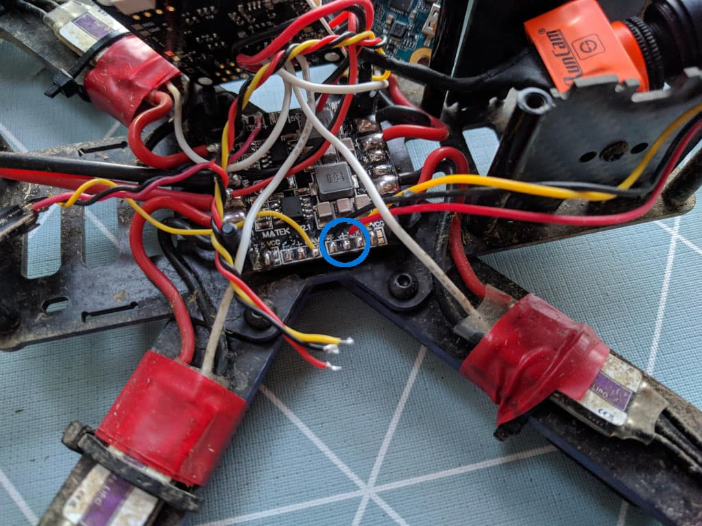
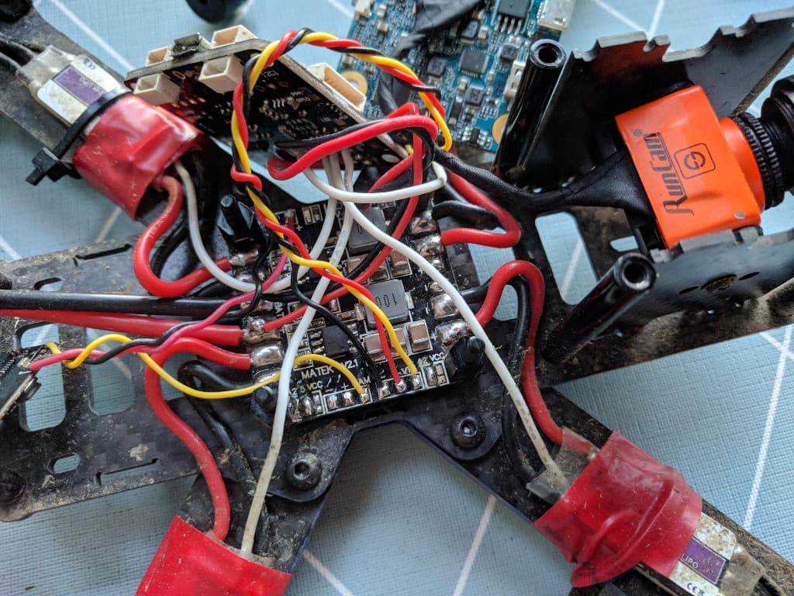
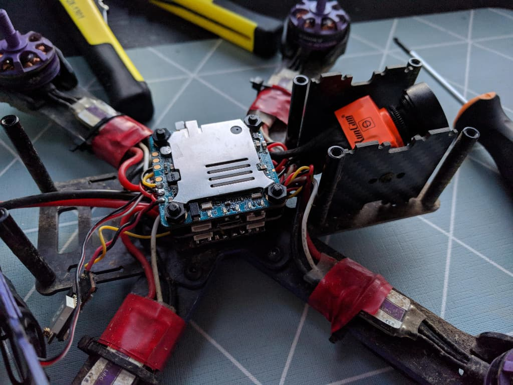
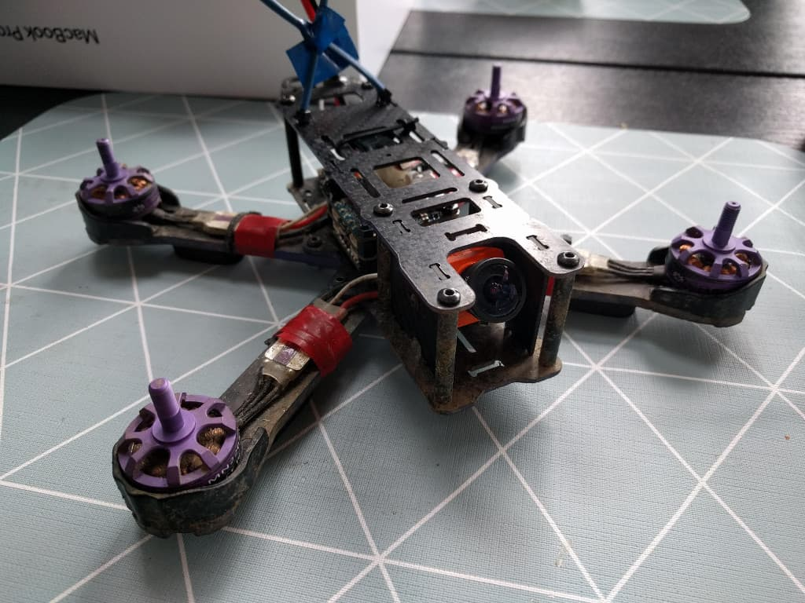

  Add <strong>your FPV spots</strong> on the map over at 
  <strong><a href="https://www.fpvtips.com/fpv-map">fpvtips.com/fpv-map</a></strong>.

One of the best upgrades you can do to your [Wizard x220][1] is definitely changing the stock camera. It is pretty much widely agreed upon that that camera is an underperformer. Here's my experience of upgrading to the [Runcam Split 2][2].

Now here's a quick disclaimer: unless you need the features that Runcam Split 2 provides, there is no need to go for it and you can just as easily get something like the [Runcam Swift 2][3] if you only need an FPV camera. That's gonna cost you only $40 where the Split 2 would set you back about $80.

In my case, I did want to record HD footage and I don't carry an extra GoPro. Runcam Split 2 records 1080p @ 60fps and has close to no latency on the transmitted video signal.

Let's get on with it!

#### 🔌 Desolder the stock camera wires from the PDB

Open up the wizard all the way till you get access to the power distribution board (PDB) at the bottom of the stack. Locate the 3 pads marked by a blue circle in the image below. They marked as 5V (red wire), ground (black wire) and the camera signal pad (yellow wire).

#### 🛠️ Solder up the Runcam Split 2

In the same way as the wires we removed, solder up a black wire for ground, red for voltage and yellow for signal.

Then solder those up to the Runcam Split 2 itself on the marked for that pads on the side - see image.
Because I swapped the original bigger Flysky receiver for a small [Frsky XM+ receiver][4] I had plenty of room on the stack for the camera board.

> **If space is an issue for you, but you go for the Runcam Swift 2, you should be fine. Either way, do some research before you decide what to go for and make sure you have space for the components.**

Put on the heatsink / sd card lock plate.

And go out and rip some packs! Enjoy the visual difference of the upgrade.

Here's how DVR recording looks on the Runcam Split 2:

  <iframe width="560" height="315" src="https://www.youtube.com/embed/gQ9qFVvzhms?rel=0" frameBorder="0" allowFullScreen title="Eachine Wizard x220 DVR footage from Runcam Split 2"></iframe>

And here's how the 1080p HD 60fps footage looks:

  <iframe width="560" height="315" src="https://www.youtube.com/embed/70tXXAfs-ks?rel=0" frameBorder="0" allowFullScreen title="Eachine Wizard x220 HD footage from Runcam Split 2"></iframe>

#### Where to buy that camera?

###### Runcam Split 2 - [Amazon][5] [Banggood][2]

[0]: Linkslist
[1]: https://bit.ly/eachine-wizardx220
[2]: https://bit.ly/runcam-split-2
[3]: https://bit.ly/runcam-switft-2
[4]: https://bit.ly/xm-plus
[5]: https://amzn.to/2KgtTN2
