<div class="article-update-notification">
This is a sponsored review. Be that as it may, I still stand by every word and this is my objective and honest review of the drone. I'd never write a misleading article or point anyone in the wrong direction.
</div>

I was very excited when the [Eachine Trashcan][1] finally arrived, and not only because it's winter in the northern hemisphere and micro drone flying happens more often. There has been a lot of hype about the Trashcan and rightfully so. Overall, in the microdrone (a tad bigger than a Tiny whoop type of drone) world interesting things have happened over the past year.

I bought a [Snapper7][2] in August 2018 and that was an awesome little fellow. But more importantly, it started a race. A few months later, the [Mobula7][3] came out and it was immediately crowned the best. Moreover, it could also sport 2S batteries and that was a game changer!

> **Then, a few months ago the [Trashcan][1] came out and knocked it out of the park.**

This is a micro quad that you could snatch up for as little as \$95. And you would get an amazing experience and a drone with crazy performance. But what makes it so good?

So let's have a look at what's in the box.

### Table of contents

- [Unboxing](#unboxing)
- [Parts overview](#parts-overview)
- [Betaflight configuration](#betaflight-configuration)
- [Binding to the radio](#binding)
- [Flying indoors (1s vs 2s vs throttle limits)](#flying-indoors)
- [Flying outdoors](#flying-outdoors)

### 📦 <span id="unboxing">Unboxing experience</span>

The Trashcan arrives in a nice protective hard case. Pretty neat. Very useful to keep the quad safe.

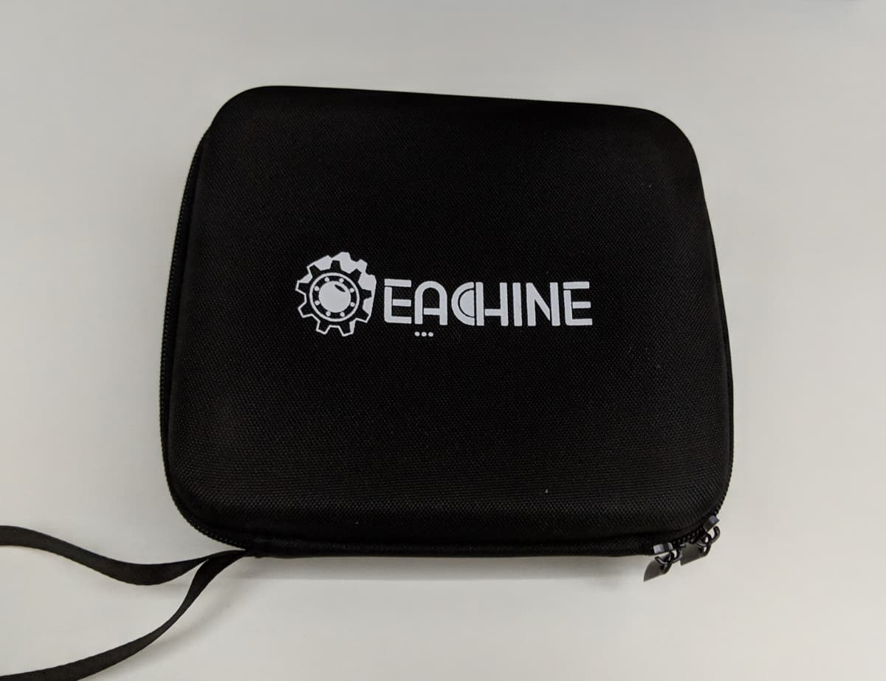

The case inside has soft foam with a slot for the drone, space for batteries, a small charger and a bag with tools and spare parts.

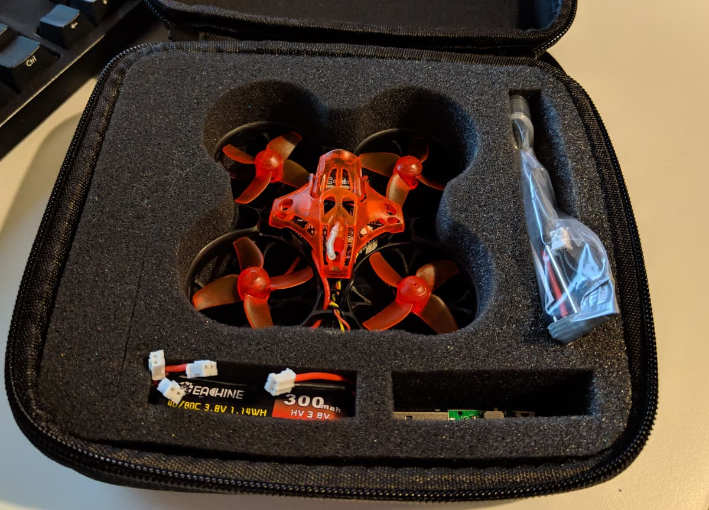

Here are all the items out of the case.

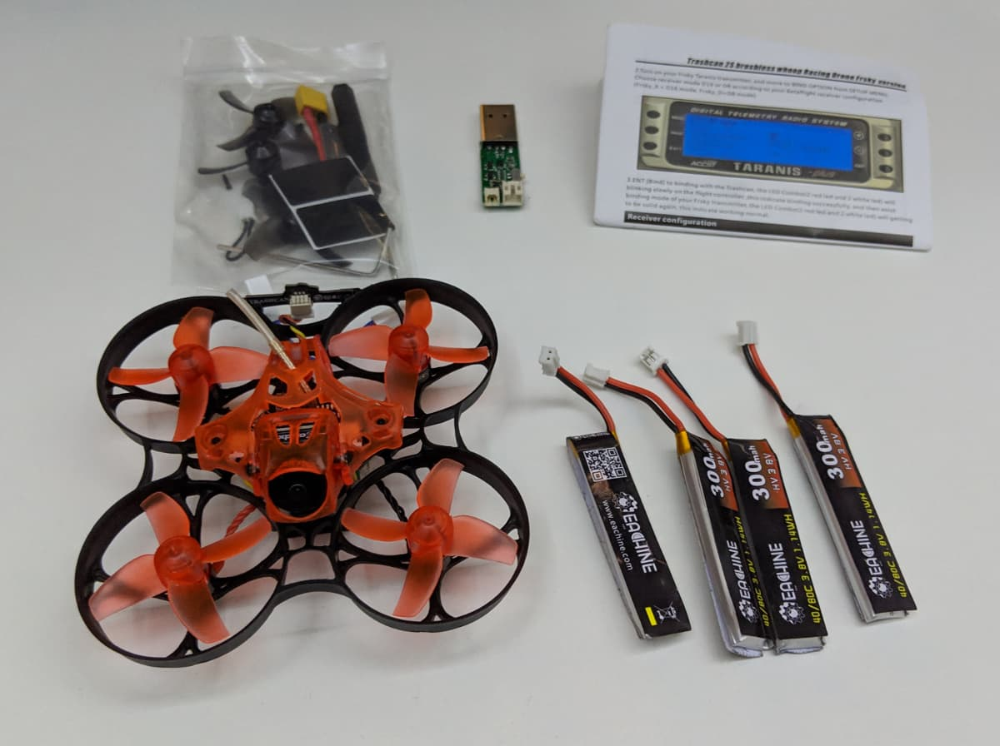

And a couple of close-up shots of the [Trashcan][1]

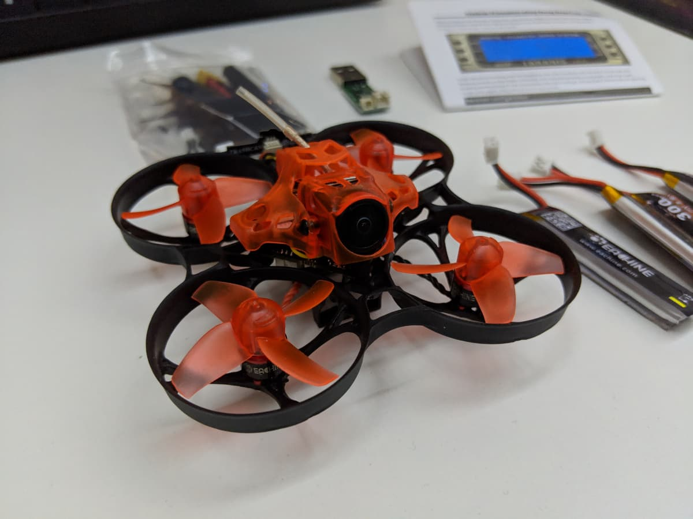

Bonus points for the "backplate" decoration! 🎉 Yay! It's a trashcan 🎉 It truly gives the little guy so much spirit.

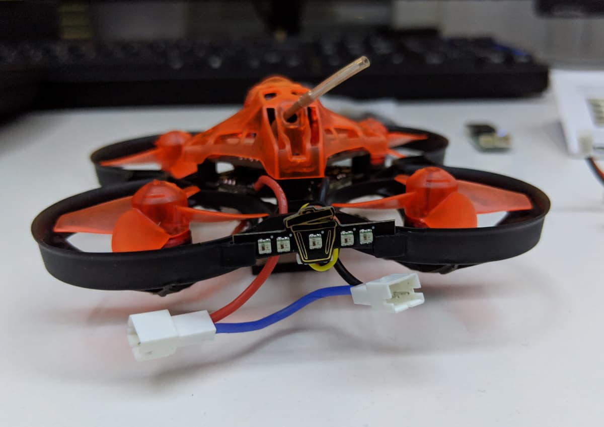

As you can tell, the quad comes with a small USB charger that can charge 1 battery at a time. If you still haven't, definitely consider grabbing a [parallel charging board][6], in order to simultaneously charge multiple batteries at the same time, as well as to charge your smaller batteries off of a bigger battery, for example, a 4S, on the go.

The Trashcan comes with 4 batteries, which is plenty to get you started, but you might find yourself outgrowing them soon and needing more, in which case, [grab yourself some more batteries][7].

The Trashcan comes also with a bunch of spare parts and tools.

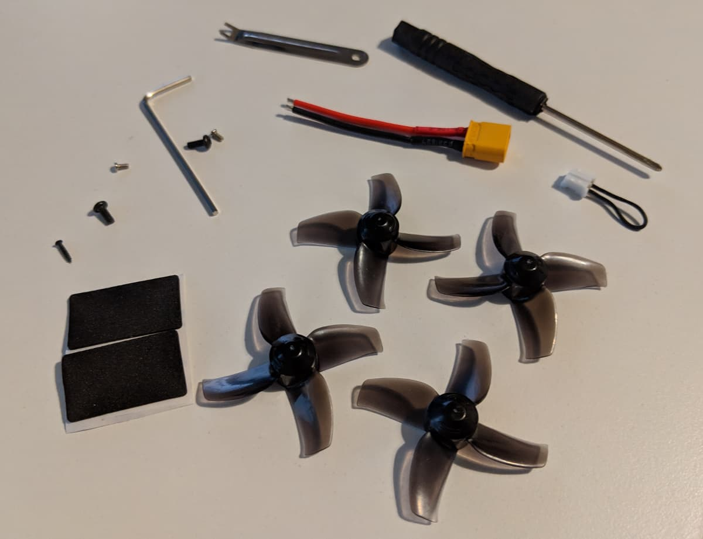

In the bag you will find: a prop prying tool, 4 spare props, a Philips head screwdriver, a hex head tool, a small plug to enable you to fly 1S and an XT-30 connector in case you decide to make the switch to full-time 2S batteries. Pretty neat!

### ⚙ <span id="parts-overview" class="offset-top-nav">Parts overview</span>

I'm not gonna go very much in depth of the parts break down, but there are a few things I'd like to mention.

First and foremost the camera! It's a Caddx camera, pretty high quality and the image is great. It's really great that Eachine had decided to use a good camera for the Trashcan and it shows!

Here's an example screenshot so you can also get a sense of the default OSD.

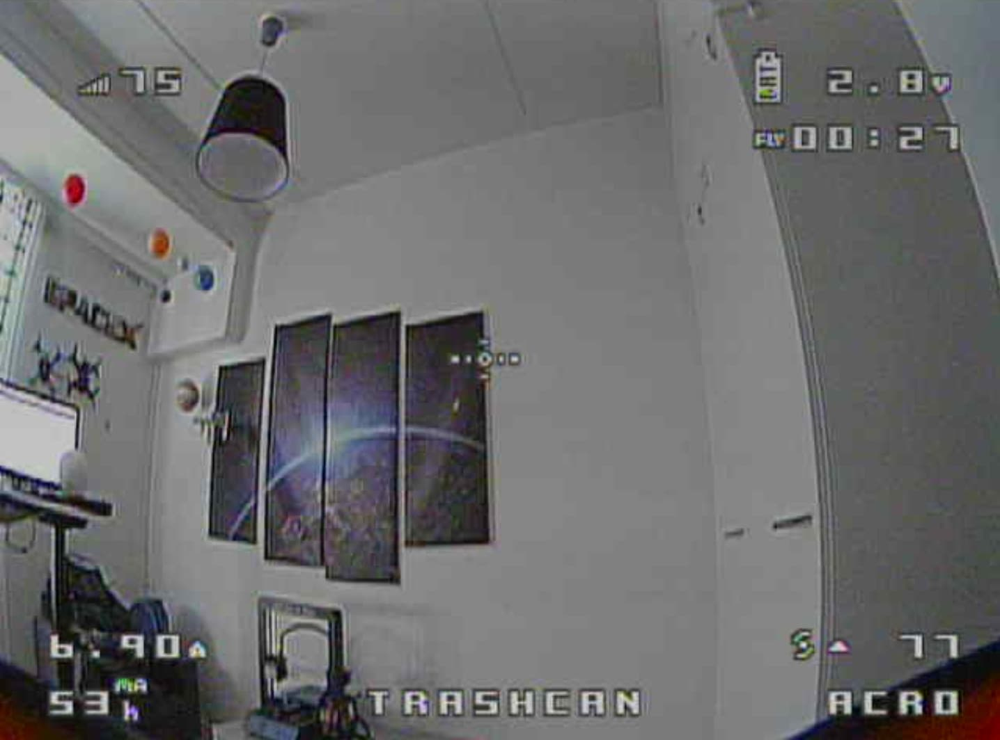

The VTX is up to 200mW which makes for decent range and penetration if you are legally allowed to run it at that power.

The flight controller is an F4 with 2 UARTs. Nice! Another "small" but very appreciated feature is the canopy that allows you to adjust the camera! So good! Now you can easily adjust the angle at which you prefer flying.

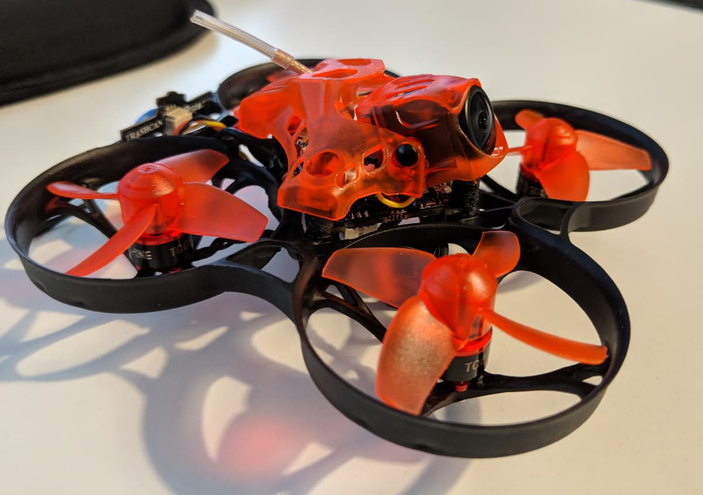

### 🛠 <span id="betaflight-configuration" class="offset-top-nav">Eachine Trashcan Betaflight configuration</span>

As far as Betaflight configuration goes, I didn't have to make too many changes. Because of personal preference, I switched off `MOTOR_STOP` as you can see below, to enable motor spinning when the quad is on, regardless of throttle value. I like it that way as it always indicates quite prominently that the drone is armed.

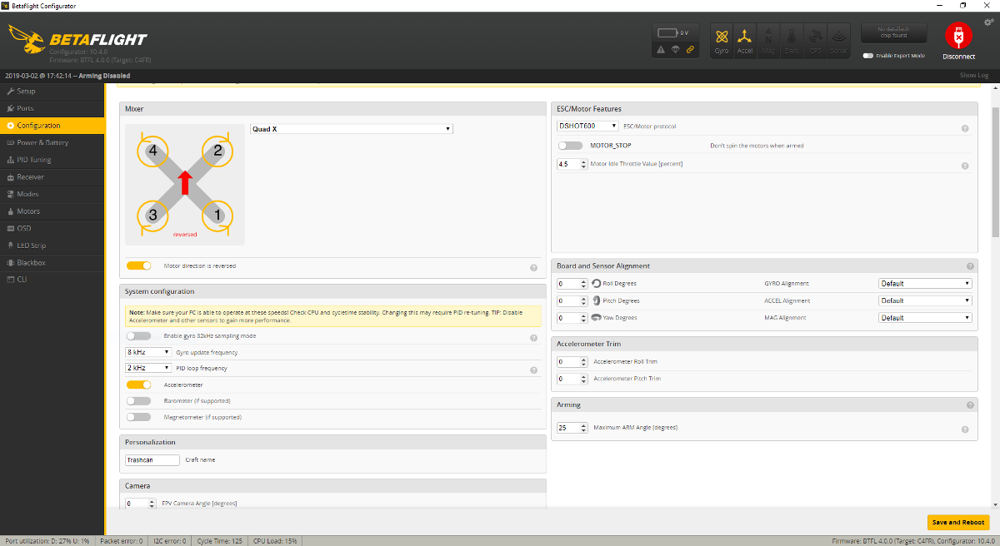

Additionally, on the same configuration tab, you have to pay attention to the receiver settings, but I'm not gonna go over those here, just follow the instructions you got with the quad and you will be fine.

In the screenshot below are my settings for a FrSky receiver and US firmware on the internal module.

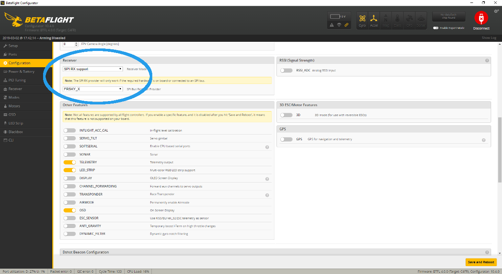

On the `PID Tuning` tab, I again touched nothing in the beginning until I decided to limit the throttle a little on 2S. More on that later in the article. The screenshot depicts the default options.

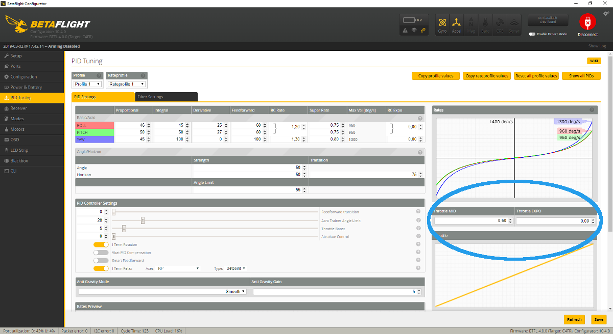

Finally, in the `Modes` tab, the present configuration was also just fine, I think I just tweaked the position of the switch to my liking. Making it so that I had only two modes: **acro** and **angle**.

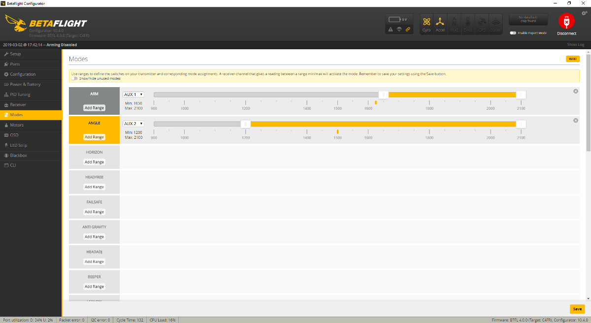

### 🔗 <span id="binding" class="offset-top-nav">Binding to the radio</span>

Binding the Trashcan is fairly straight-forward. Matter of fact, it's pretty easy. There is **no need** to hold the bind button while powering up the quad. Just plug the battery in and press the bind button to put the receiver in bind mode. This is explained nicely in the instructions that come with the drone. And here is a picture of the bind button that you need to locate and press.

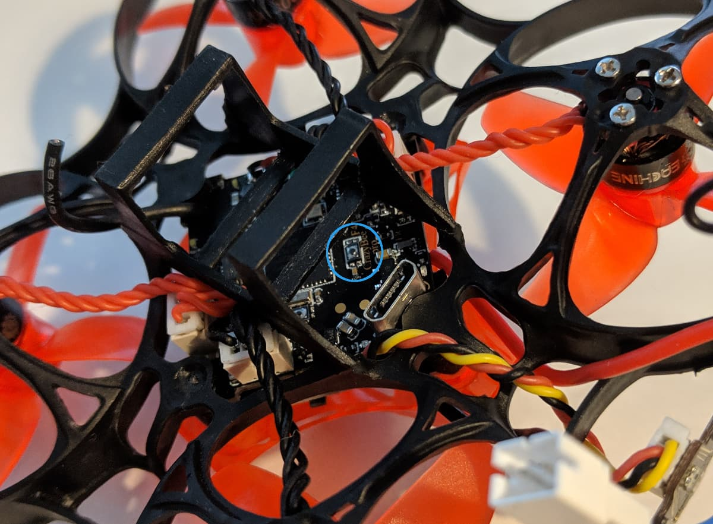

Then in your radio create a new model and go to your binding function. I'm using a [Taranis Q X7][4] and this is how my set up looks in the radio.

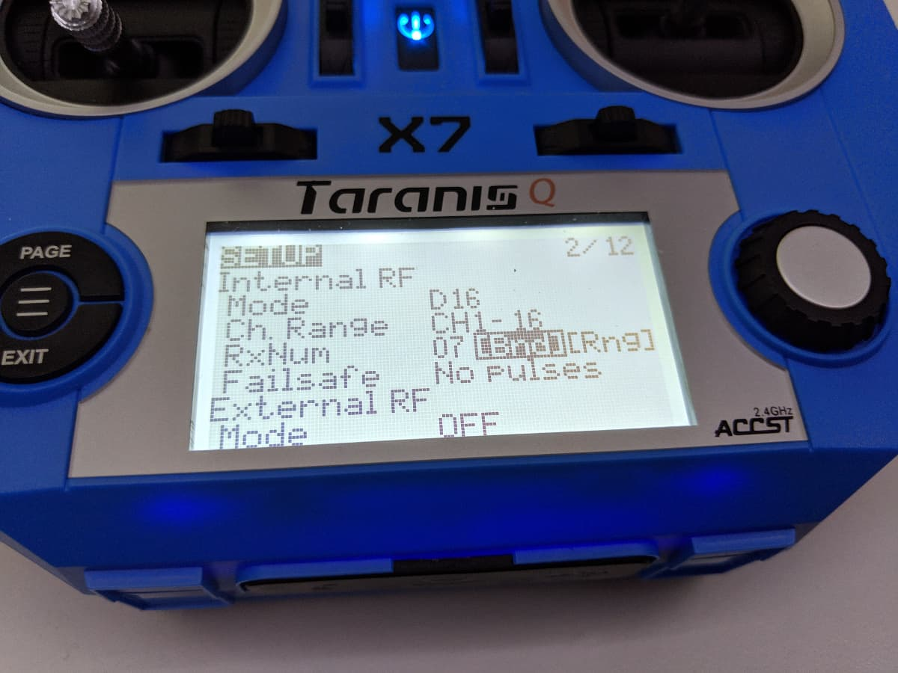

It is important to note that if you bought the drone with US (FCC) receiver, your Taranis internal module needs to be flashed with the FCC firmware, if you went for the EU (LBT) version, then again your radio needs to be flashed accordingly. Read this to understand [how to flash the Taranis Q X7's internal module][5].

### 🚁 <span id="flying-indoors" class="offset-top-nav">Flyig indoors</span>

#### 🔋 1S

When I first took off (without any throttle limits, on 1s, indoors) I was surprised how timid the little craft was. Comparing it to the [Snapper7][2] which was pretty unflyable in my relatively small home, the [Eachine Trashcan][1] behaved really nice. It was snappy to my instructions, which made for much easier control, however, even on just 1S, it packed a punch. Overall, I'm happy with the performance out of the box on 1S. The best thing about it is that the Trashcan comes with this small plug that makes it very easy to fly 1S.

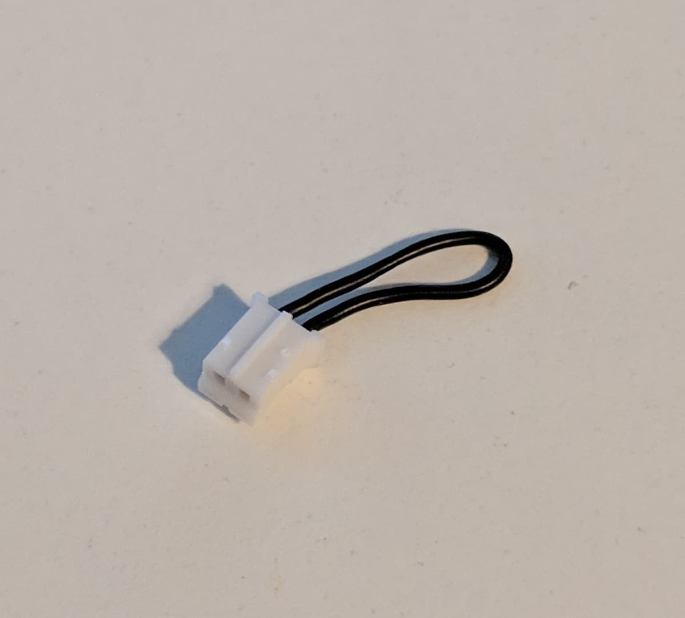

Just plug in the small bit into one of the battery connectors and plug in your battery in the other connector and you are set.

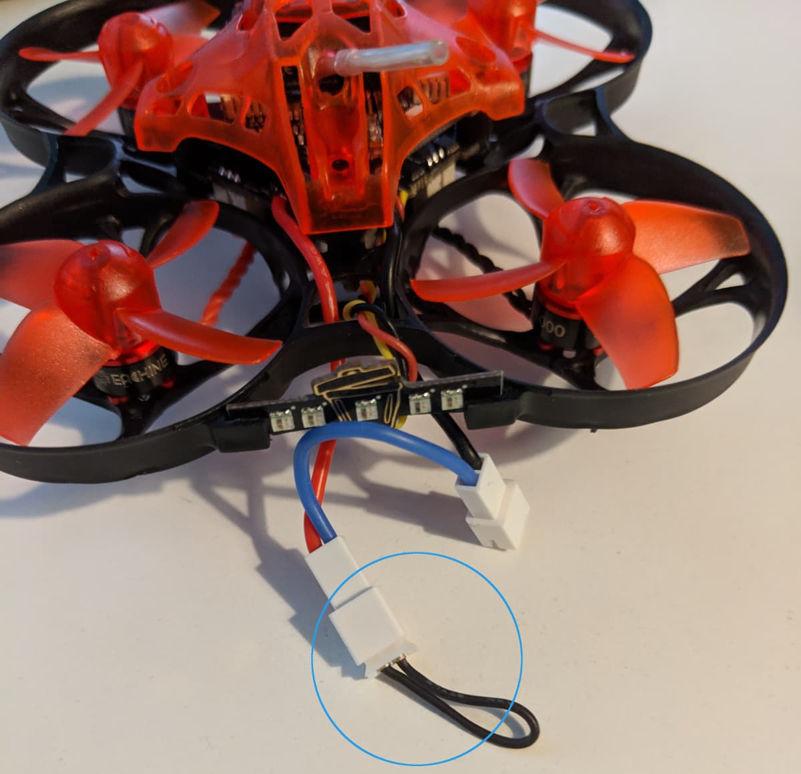

#### 🔋🔋 2S

The story is quite different on 2S. Here we get a lot of extra power, and it might be a bit challenging to navigate indoors if your premises are smaller, like in my case. What still did surprise me, was that it was still manageable. I was still able to fly even 2S indoors. Kudos, good job Eachine, I think the handling on the Trashcan is great and it would be an awesome quad even for beginners for that reason.

Additionally, the best part about flying 2S indoors is that you get much longer flight times, and much fewer voltage sags (if any at all). If you prefer this, go for it.

#### 🔝 <span id="throttle-limits" class="offset-top-nav">Throttle limits</span>

Lastly, I'd like to mention throttle limits. If you feel like you need to turn down the power just a bit in favor of increasing handling, you can easily do that in Betaflight. First, go to the PID tab and set `Throttle MID` to **0.30**, and `Throttle EXPO` to **0.70**. Finally, go to the `CLI` tab and paste in this command:

```sh
set throttle_limit_percent = 70
```

Try flying now, 1S or 2S up to you (I find that there is not much need for throttle limiting with 1S, but your experience may vary). You can go back to the settings in Betaflight and tweak them to your liking until you are happy with the response from the craft.

### 🚁 <span id="flying-outdoors" class="offset-top-nav">Flyig outdoors</span>

If you have applied any throttle limiting to your craft, remember to take it off before flying outdoors! This quad rips on 2S outdoors. The default settings are: `Throttle MID` to **0.50**, `Throttle EXPO` to **0.00** and paste this command in from the `CLI` tab:

```sh
set throttle_limit_percent = 100
```

Once you are up to the full potential of the Trashcan, rip some packs! For me, I have yet to try it out outside, unfortunately, it had been way too low temperatures in Finland, but I am absolutely looking forward to flying it outdoors and will upload some DVR footage as soon as I do so.

However, from what I have seen out there, from the settings in Betaflight, from the components it has and from the performance indoors, I have to admit I expect a lot from it and I have a feeling it will deliver. I mean even flying a Snapper7 outdoors was a hell of a lot of fun and I can imagine that the [Eachine Trashcan][1] will be at least twice as much fun if not more!

### 📝 Conclusion

**Should you get the Trashcan? Absolutely!** If you are in the market for a micro drone or if you are a beginner that wants to buy something that can scale with your skill as you get better, buy the [Trashcan][1].

If you want to fly in city parks or other more populated areas, but don't want to be a menace to society, get the Trashcan. You still need to be careful, but you probably cannot do any damage to anyone with this microdrone, compared to a full-fledged 5-inch quad.

Overall, it comes at a great price, it ticks all the checkboxes and get you some extra performance, it flies really well, it's easy to handle and get used to so if you have any of the use cases outlined above (or some other one), **I definitely recommend the [Eachine Trashcan][1] as your first or next micro drone**, and am personally looking forward to ripping around a lot with it this summer!

P.S.: My poor flying here did not take away from the fun had :)

<div style="text-align: center">
  <iframe width="560" height="315" src="https://www.youtube.com/embed/rKG9t7o2xws?rel=0" frameBorder="0" allowFullScreen title="eachine trashcan flight footage 1"></iframe>
</div>

<div style="text-align: center">
  <iframe width="560" height="315" src="https://www.youtube.com/embed/8Ax4gJNcXnI?rel=0" frameBorder="0" allowFullScreen title="eachine trashcan flight footage 2"></iframe>
</div>

<div style="text-align: center">
  <iframe width="560" height="315" src="https://www.youtube.com/embed/PDUrXlOS5ZA?rel=0" frameBorder="0" allowFullScreen title="eachine trashcan flight footage 3"></iframe>
</div>

[0]: Linkslist
[1]: https://bit.ly/eachine-trashcan
[2]: https://bit.ly/snapper-7
[3]: https://bit.ly/mobula7
[4]: https://bit.ly/taranis-qx7
[5]: /fpv/flash-xm-plus-and-setup-rssi
[6]: https://bit.ly/1s-board
[7]: https://bit.ly/micro-drone-batteries
