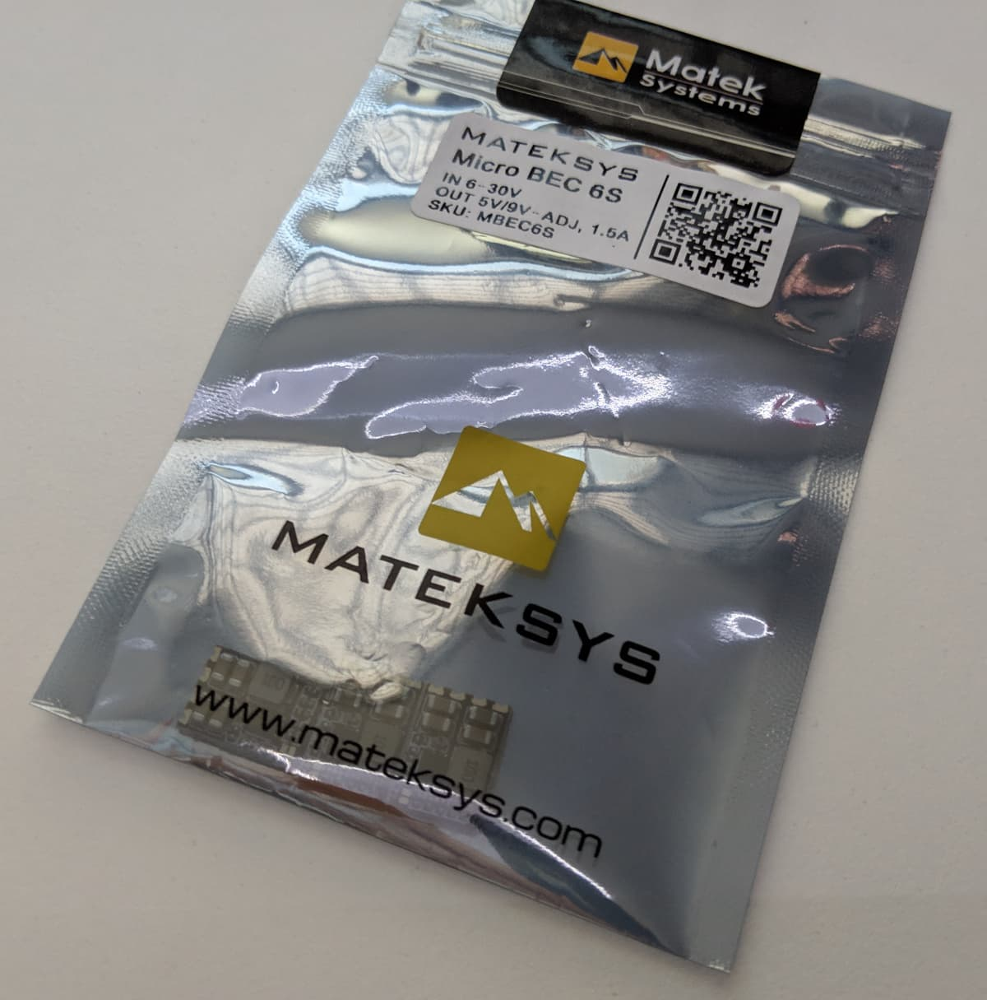
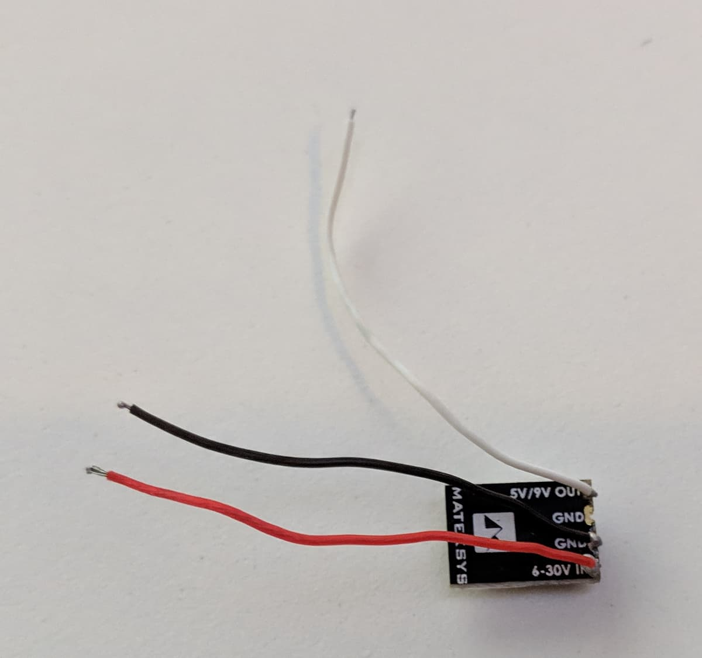
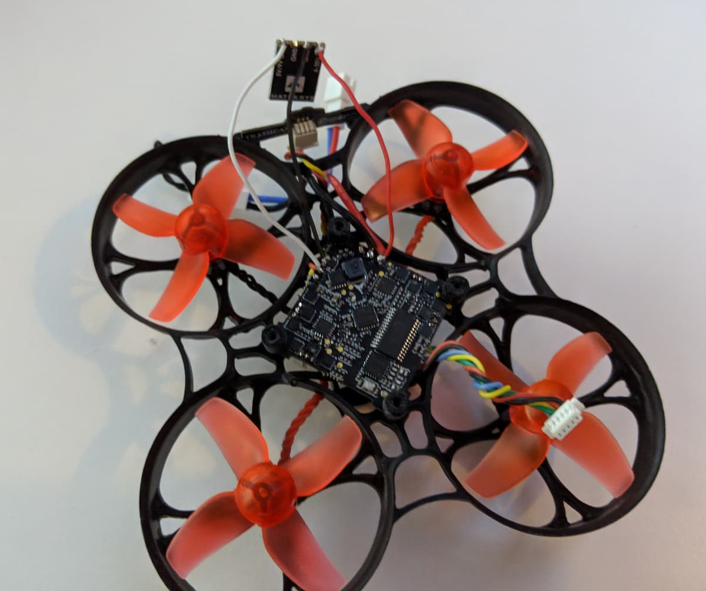

If you are one of the unlucky folks with a busted 5v regulator on your [Eachine Trashcan][1], fear not. There is a solution and the fix is easier to do than you might expect - add an external 5v regulator.

You can grab a [Matek Systems Micro BEC][2] which would get the job done just fine.

Solder a few wires to it. In my case, red silicon wire to the input voltage, black wire to ground and white wire to the 5V output.

Finally, solder the other end of the red wire to your battery positive pad. Solder ground to ground and the white wire to the positive 5V pad, for example where the Trashcan LEDs were connected.

That's it, enjoy, hopefully, this solves your problems. Do keep in mind that the regulator gets very hot, so mount it away from other components that get hot, such as the vtx, and avoid just keeping the quad plugged in without flying it.

[0]: Linkslist
[1]: https://bit.ly/eachine-trashcan
[2]: https://bit.ly/matek-bec
