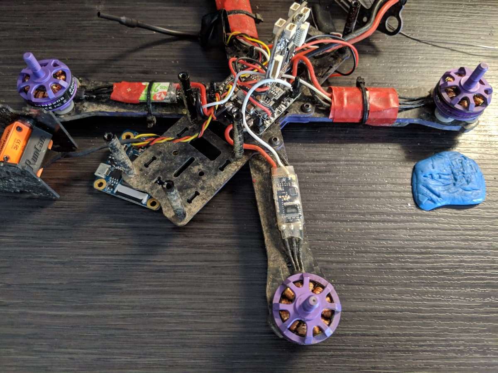
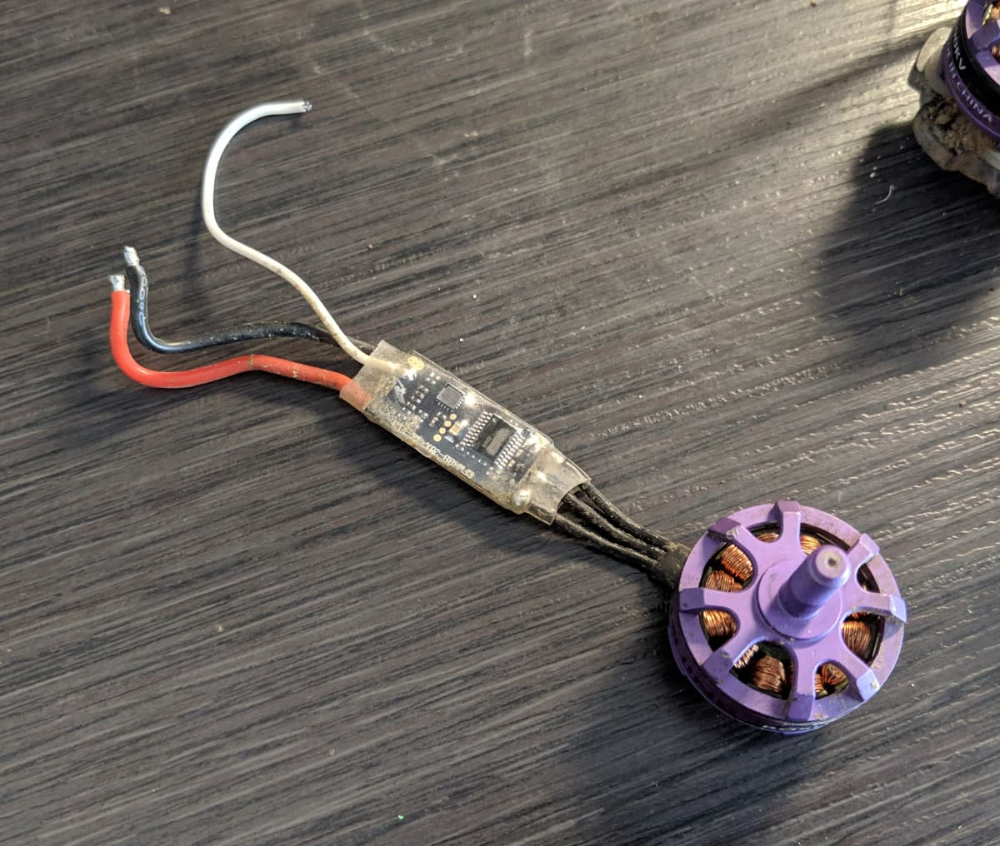
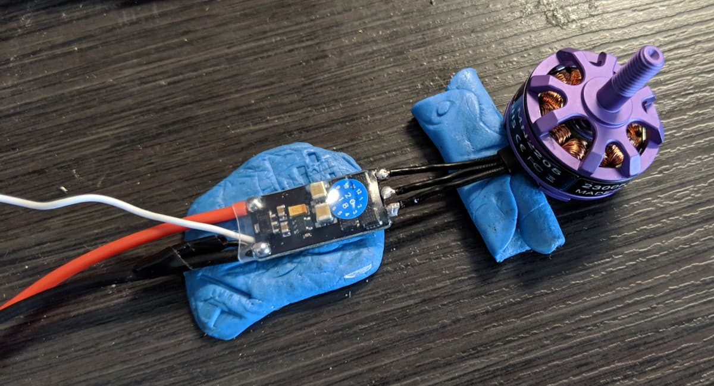

Every so often you might have an issue with an ESC. Even though in general I'm a fan of 4 in 1 ESC boards, it's pretty unpleasant to have to throw away the whole board with 3 working ESCs if one of them fails. That's not the case if you are rocking 4 standalone ESCs. And in the case of the original [Wizard x220][1] that's exactly the case.

My Wizard has been an amazing machine to get me into the hobby of FPV. I'm really thankful for it. Even though at this point [I have swapped most parts][3], after **flying that Wizard for 1 year and 9 months, I still enjoy flying it** and to this day only 2 ESCs have failed me (from what I consider old age).

That's quite acceptable in my opinion. And this brings us to today's topic - how do you go about swapping out and ESC or a motor on the Wizard, or any other quad for that matter.

> **Consider your options!** _This article is about what to get and how to carry out a **replacement** of a dead ESC / motor. But I do believe, you should be at least aware of the fact that there are other options and depending on whethere you want to go for a full ESC and / or motor **upgrade**, you might want to do some more research and go for that instead. Up to you._

## 🛒 What to get

This particular ESC serves as a replacement ESC for the Wizard x220 - [Racerstar RS20A V2 ESC][4]. If you need a motor, grab the [Eachine 2205 MN2205 2300KV motor][6].

## 🔧 Change the ESC or motor

Dismantle your drone all the way down to the power distribution board (PDB). **All props off!**. Don't judge me by how dirty my Wizard is; it's my learning quad and as I mentioned I've had it (and been crashing it) for almost 2 years 😅.

To remove the faulty ESC and motor we need to desolder the correct signal wire from the bottom of the flight controller (FC) and the voltage and ground wires from the PDB. Just trace the wires from the faulty ESC.

Here's the signal wire out from the flight controller and the exposed voltage wires. Do be careful not to melt the nylon standoffs as they are very close to the ground wire pad on the PDB.

Finally, here's the faulty ESC and motor completely detached. For all we know, if only the ESC is dead, could be the motor still works. You can test it and reuse it if you so desire. In my case it's about time I change a motor too, so I'm ok with that.

To prepare the new ESC, cut and strip the wires to length. It's always a good idea to leave just a bit of slack, as the wires can be curved a bit, but it's always better to have just a bit extra wire, than to have not enough and not be able to use the entire wire, because you cut too short.

Here's my new ESC prepared with the wires cut to length and tinned. Additionally, I have shortened the secondary ground wire as it is not needed, and I have made sure to wrap it in [electrical tape][8] to prevent potential shorts.

Next, tin up the solder pads on the ESC and the 3 motor wires.

Solder the motor wires to the ESC. The order does not matter. I just solder them in order. One way to reverse the motor's direction is to swap any 2 wires, the other way is to do it in the BLHELI configurator software.

Then solder the signal wire (white in this case) to the bottom of the flight controller to the same place the previous ESC was soldered to.

Finally solder the ESC voltage and ground wires to the PDB. Again, care for the nylon standoff.

## 🧪 Testing

It's always a good idea to test for continuity using a multimeter to make sure you haven't bridged anything and created shorts.
It's also a good idea to use a [smoke stopped][9] when first plugging in the quad after soldering work, to avoid the unpleasant situation of burning up your new componets after all the hard work.

## ⚙ Calibration and configuration

To flash firmware on the ESC (if needed) and to do configuration and setup, to reverse motor direction and more, you will need to get the [BLHELI configurator][10]. Grab the version for your platform from the link and install it.

![screenshot of the BLHELI configurator][]

Here is where you can change the direction of the motor without soldering and swapping wires.

Finally, head on over to Betaflight so we can calibrate the motors. If you followed along your quad's props have been already taken off, but it's that important, so let's make sure we say it again: **TAKE OFF ALL PROPS BEFORE PROCEEDING**.

![image of Betaflight motors tab][]

Plug in your drone to the computer using the micro USB port on the flight controller. On the motors tab in Betaflight, click the toggle button to allow controlling the motors using the UI in Betaflight. Then, slide the master slider all the way up. At this point, plug in a LiPo to your quad to power the ESCs. Listen for the ESC tones to finish. When they are done, slide the master slider all the way down and wait to hear the new beeps. Once done, you have calibrated the ESCs successfully. Unplug the LiPo and unplug the drone from the usb.

That's it! Test arming your drone without any props to verify that the new motor moves in the direction you want it to move. If not, reverse the direction in BLHELI configurator. I hope it all worked out well for you so you can enjoy flying once again!

#### Where to get it?

###### Eachine Wizard x220 - [Amazon][2] [Banggood][1]

###### Racerstar RS20A V2 ESC - [Amazon][5] [Banggood][4]

###### Eachine 2205 MN2205 2300KV motor - [Amazon][7] [Banggood][6]

  <iframe width="560" height="315" src="https://www.youtube.com/embed/skG-tLCe6jo?rel=0" frameBorder="0" allowFullScreen title="Chill November flight with the Eachine Wizard x220"></iframe>

[0]: Linkslist
[1]: https://bit.ly/wizardx220
[2]: https://amzn.to/2UBB9XH
[3]: /news/?tag=wizard
[4]: https://bit.ly/wizard-esc
[5]: https://amzn.to/2UoV9xx
[6]: https://bit.ly/wizard-motors
[7]: https://amzn.to/2FV4Qd1
[8]: https://bit.ly/electrical-tape
[9]: /fpv/make-a-smoke-stopper/
[10]: https://github.com/blheli-configurator/blheli-configurator/releases
