<div class="article-update-notification">
This is a sponsored review. Be that as it may, I still stand by every word and this is my objective and honest review. I love FPV and want to help people enjoy the hobby.
</div>

The [Mobula7 HD][1] is right up there at the top of the line micro quads, along with side other drones such as the [Eachine Trashcan][6], [Mobula7][7], [Snapper7][8] and others. Being the latest and greatest quad in Happymodel's lineup means it comes with the best overall specs, but it **also does something, that none of these other micro drones listed above do - it records 1080p 60fps video**.

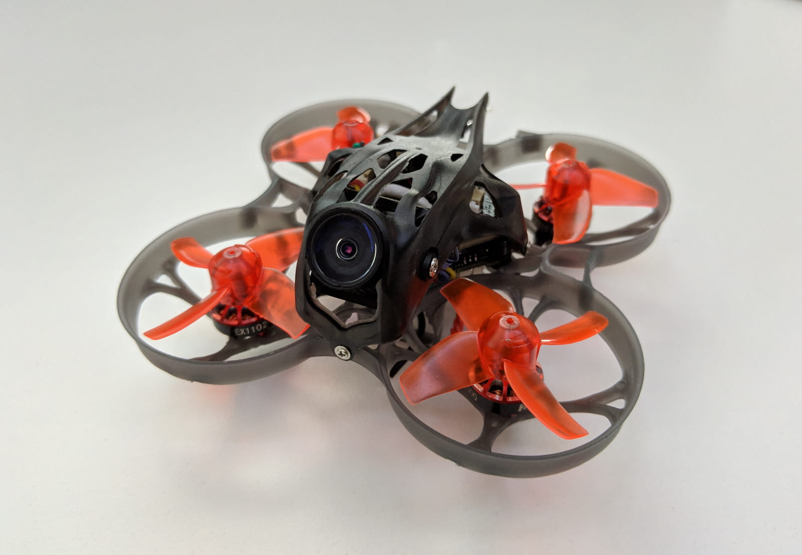

The [Mobula7 HD][1] falls into a class of micro quads called `cinewhoops`, which stems from the fact that it carries capabilities to record **1080p video at 60 fps**. To achieve that it uses a Caddx Turtle V2 camera. As such, this quad targets a specific audience - people to whom recording high definition footage is important and given that you can't really carry a Go Pro on top of a micro drone, you are stuck with the option of using an FPV camera that doubles in functionality as a high def video recorder.

Really, really neat! Now, I do say that as a fan of such cameras, in fact, I've been using [Runcam Split 2][9] and [Runcam Split Mini][10] for a while now and for my needs, those cameras are enough. I get fairly crisp 1080p 60fps footage to review my flight or [upload to YouTube][17].

However, the cool thing about the [Mobula7 HD][1] is that it is a micro quad and that means it comes with all the safety that comes with a micro quad. You have prop guards, the chance of you doing damage to yourself or other people is nearly negligible (but of course please don't try). In turn, this means that you can fly this in parks without being a menace to society.

### Table of contents

- [Unboxing](#unboxing)
- [Components](#components)
- [Setup and binding](#setup-binding)
- [Flying](#fly)
- [Batteries](#batteries)
- [Upgrades](#upgrades)
- [Conclusion](#conclusion)

### 📦 <span id="unboxing">Unboxing</span>

Let's have a look at what you get in the box.

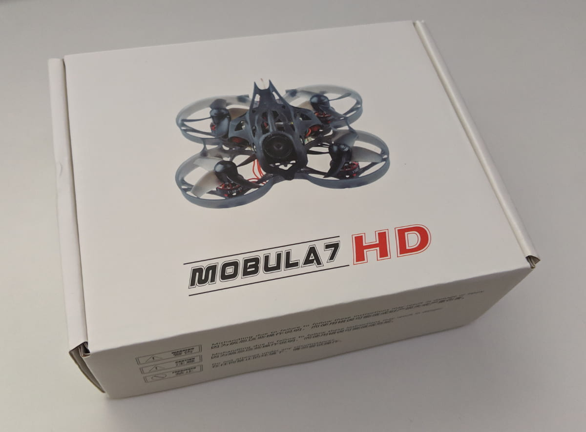


Inside the box, we find the Mobula7 HD as expected, a manual, one 3S battery and a couple of packages with more stuff inside.

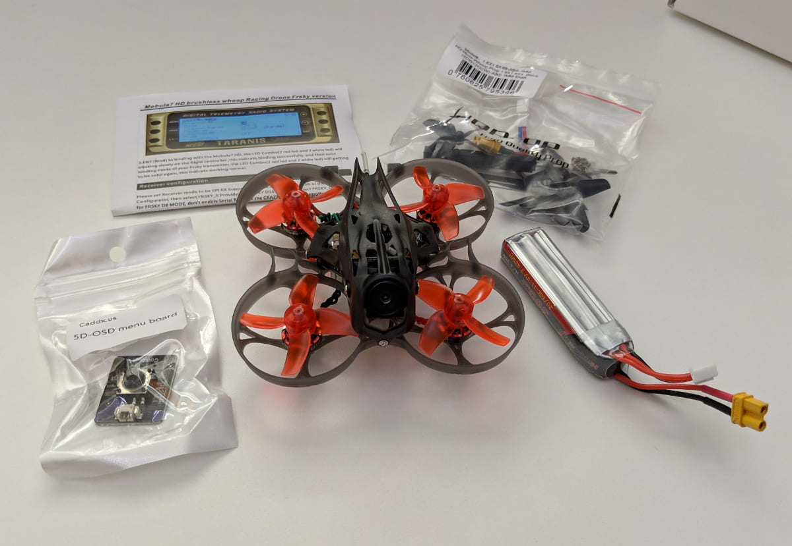

One of the packages contains a controller for the [Caddx Turtle FPV][3] camera. The other one - the more or less regular stuff for a micro quad: a screwdriver, a prop remover tool, some extra screws, 4 spare props (completely different set than the ones that are already installed) and an xt30 to two ph2.0 connector.

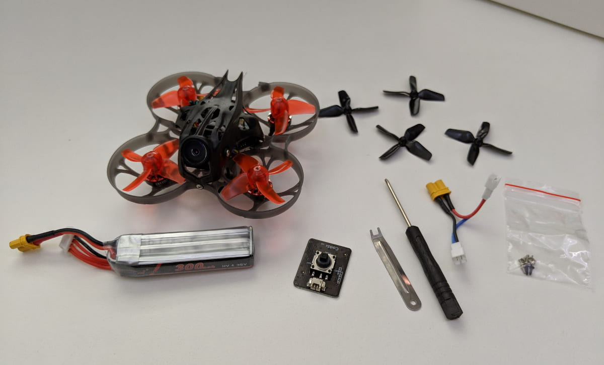

And here are a few shots of the Mobula7 HD...

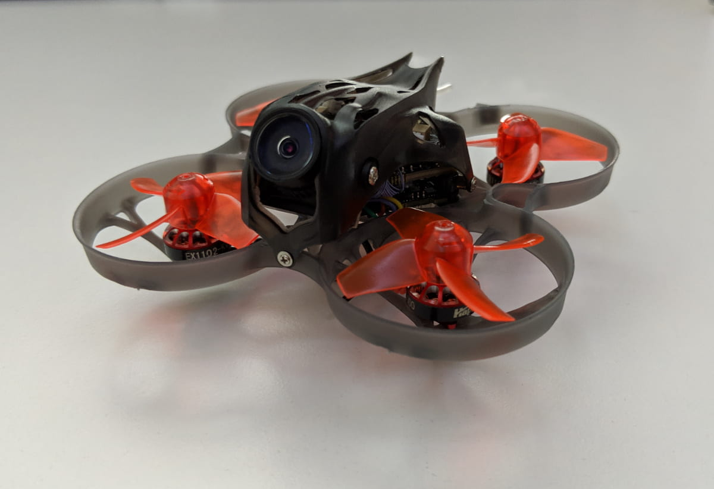

... top down ...

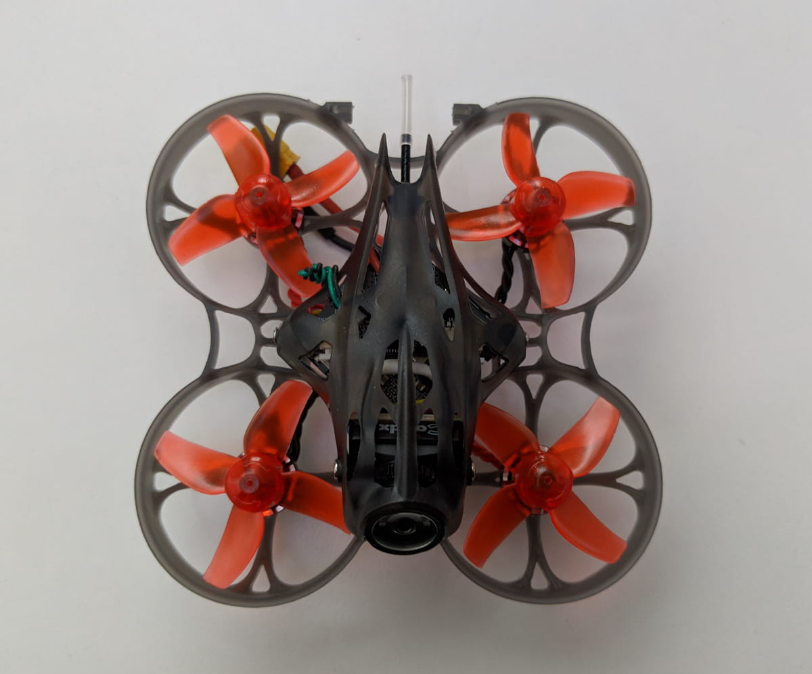

... bottom up ...

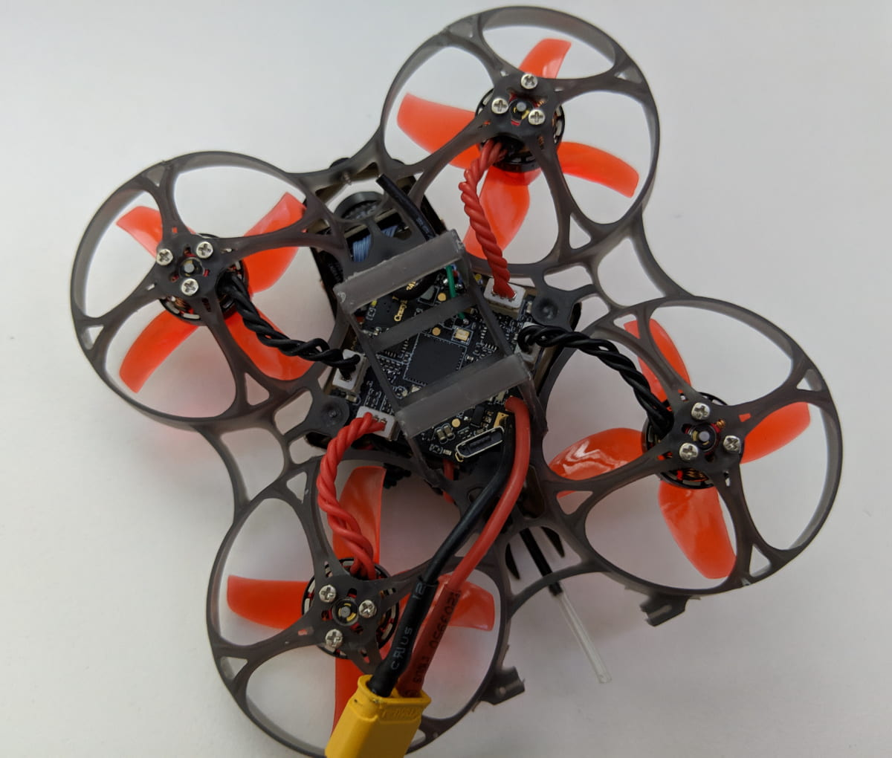

... overall looking pretty slick!

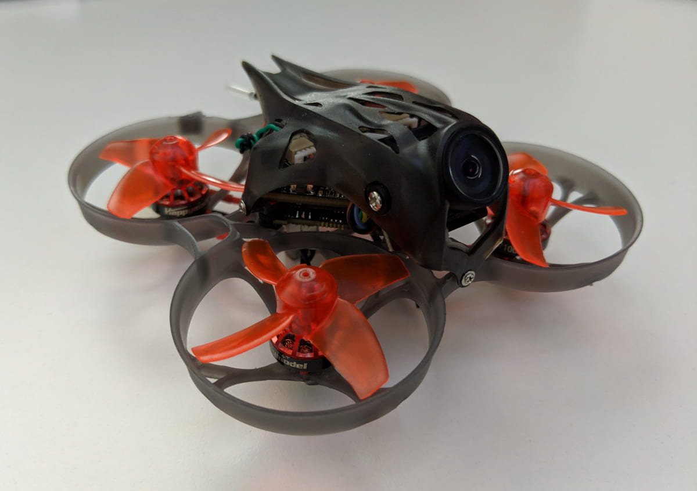

### 🔬 <span id="components" class="offset-top-nav">Components overview</span>

The Mobula7 HD comes with a [Crazybee F4 PRO V2.0 Flight Controller][11] that takes in anywhere between 1S and 3S batteries. You can choose whether you want the flight controller (FC) to have a built-in FrSky or Flysky receiver or no receiver at all. The board has 5A 4 in 1 ESCs.

The VTX is 5.8G 40CH with a power range of 25-200mW that can be adjusted.

The motors are [EX1102 10000KV][12], but depending on when you get the quad, you might get the 9000KV version, because as it's stated on the Mobula7 HD listing in Banggood:

_"In order to reduce risk from the Mobula7 HD (10000kv motor version )esc burnt, we suggest to limit the throttle scales to 75 %.
Performance is almost the same as new 9000KV version."_

If you only fly on 2S and not planning to fly on 3S, you probably can get away without any throttle scaling.

The main star of the show here is the camera. That's the [Caddx Turtle V2][3]. Check the link for the full details and specs, but it's worth mentioning that the FPV feed is clear and the HD recording is decent too. **Just having a 1080p 60fps recording off of a microdrone like that still blows my mind and is definitely super awesome!**

Here's how the default OSD looks like:


And here's some example 1080p 60fps footage (and more videos are available at the end of the article):

<div style="text-align: center">
  <iframe width="560" height="315" src="https://www.youtube.com/embed/fRrUNozEI_0?rel=0" frameBorder="0" allowFullScreen title="Mobula7 HD flying in Central Park in Plovdiv, Bulgaria"></iframe>
</div>

### ⚙ <span id="setup-binding" class="offset-top-nav">Setup & binding</span>

I didn't really have to do much in terms of setup when I first tried out the Mobula7 HD, which is definitely a good thing. I wanted to get a feel of how it comes configured literally out of the box. **And to be frank, I was very pleased with the initial configuration.**

The by far easiest way to bind the drone to your radio is to plug it into your computer, open Betaflight, go to the CLI tab and type `bind`. Hit enter. I love this, it makes binding so easy. Now that the Mobula is in bind mode, go to your radio (I'm using a [Taranis X-Lite][13], but I also bound it to a [Taranis Q X7][14]) and after creating a new model, start the binding process from the radio. That's it. The Mobula will blink a few times to indicate a successful bind (you can read about the [exact meaning of the different flashes in the manual][5]). Alternatively, you can press the bind button at the bottom of the flight controller, if you prefer to bind this way.

I set up 3 switches mapped to AUX1, AUX2, and AUX3. The Mobula7 HD's ESCs support DSHOT and as such you can use Turtle mode (flip over after crash) and Beeping through ESCs.

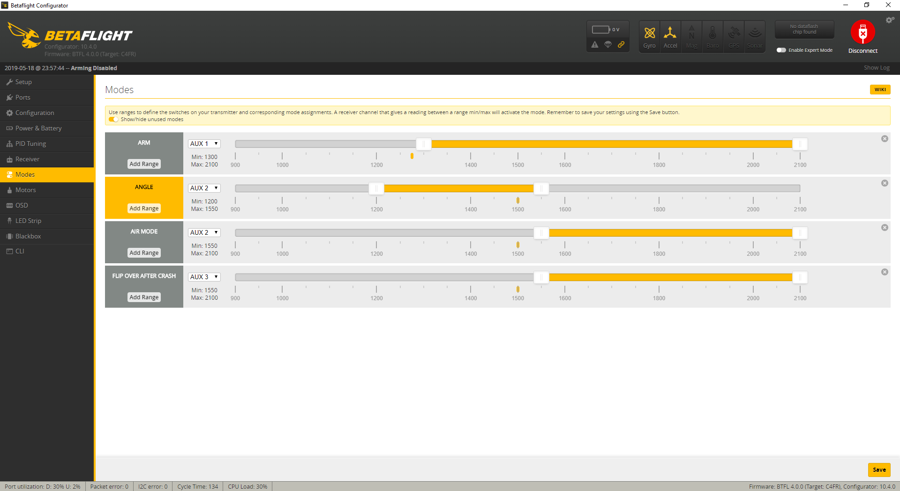

In my case, I setup AUX1 for arming on one switch, AUX2 for flight modes (acro and angle), AUX3 for turtle mode (so useful).

> _If you haven't heard of Turtle mode before, basically, it allows you to 'arm' the quad in a special mode where moving the pitch and roll stick corresponds to a particular motor and only moves that side of the quad. Useful when you have crashed and are upside down and want to flip the quad over, without having to walk to do it manually._

Again do note that on the Mobula7 HD listing in Banggood they warn about some potential issues with Betaflight if you are using the latest version of the configurator (10.5.0 or 10.5.1):

_"New betaflight configurator 10.5.0 and 10.5.1 are not compatible for Mobula7 HD very well for now.
We suggest using Betaflight configurator 10.4.0"_

I have been using Betaflight Configurator 10.4.0 and had no issues whatsoever. Here's the full stock configuration.

**Ports tab**
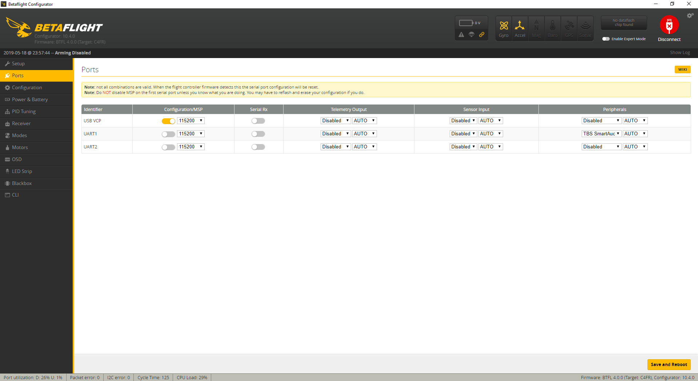

**Configuration tab, part 1**
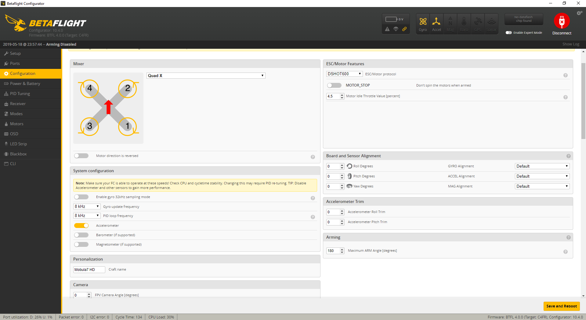
Do note that the Mobula7 HD comes configured in **props in** mode, so pay attention to that if you are swapping props.

**Configuration tab, part 2**
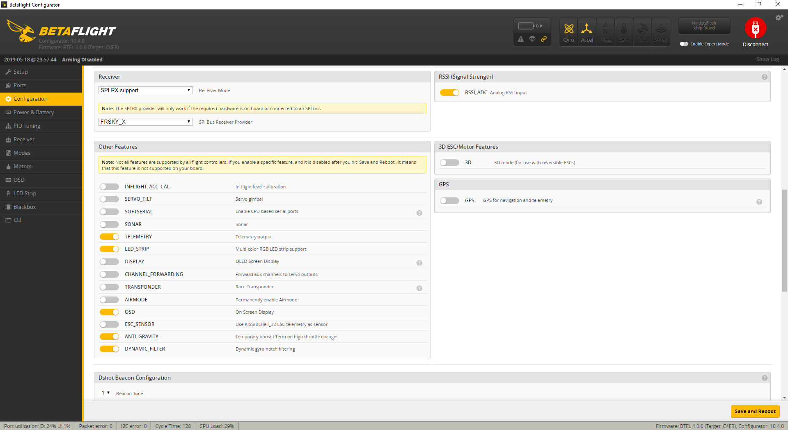
I'm using the FrSky built-in receiver version, hence my config looks as such.

**PID tuning tab**

Didn't touch any PID configuration, to begin with.

**Receiver tab**
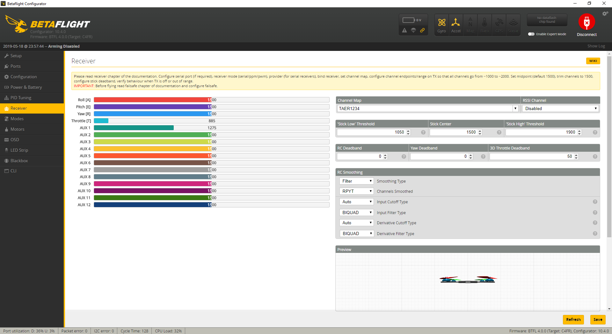

One thing I suggest setting up, to make your life easier with the HD recording, is to connect the camera controller board to the camera via the little cable tucked under the canopy and set it up so that it starts recording as soon as a new battery is plugged in.

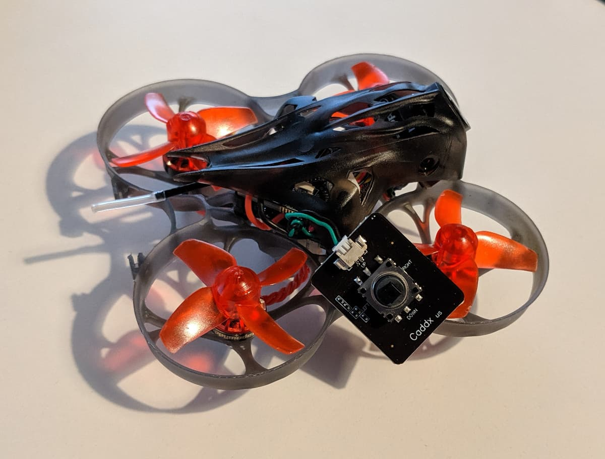

That way there never is any manual need to start recording. You just plug in a battery and fly.

Now is a good time to slot in a micro sd card. It's recommended to use a class 10 card, I'm using a [32 GB sd card][18], but you can also grab a smaller or a bigger card up to 64GB. To give you a rough idea, after flying 5 packs, each of about 4 minutes, I come home with 4-5 GB of footage.

Another bonus tip is: **check and tighten the screws every few flights**. It's not uncommon to lose some screws, and that can be prevented to a large degree by just tightening them up every 10 or so packs you fly.

### 🚁 <span id="fly" class="offset-top-nav">Flying</span>

**I do love flying this thing!** One of the best things about this micro quad is the fact that it comes with a bit of weight and as such is just a bit more "floaty" than most micros which is great for freestyle flying. If you try the [Mobula7 HD][1] you will be amazed by how much it feels and flies like a 5-inch quad. Really, really cool!

Here are a few different videos of flying in very different places in terms of weather conditions.

Flying at the top of a hill in Plovdiv, Bulgaria at 272m above sea level, and dealing with some pretty strong winds at the top after gaining another 30 meters altitude.

<div style="text-align: center">
  <iframe width="560" height="315" src="https://www.youtube.com/embed/OwuMUXXG87A?rel=0" frameBorder="0" allowFullScreen title="Mobula7 HD flying on a hill in Plovdiv, Bulgaria"></iframe>
</div>

A smooth flight in a park, with average humidity, no wind and a temperature in the early 20s.

<div style="text-align: center">
  <iframe width="560" height="315" src="https://www.youtube.com/embed/A0Isy6_wdJQ?rel=0" frameBorder="0" allowFullScreen title="Mobula7 HD flying in Central Park in Plovdiv, Bulgaria"></iframe>
</div>

Windy park flight by the Bulgarian seaside.

<div style="text-align: center">
  <iframe width="560" height="315" src="https://www.youtube.com/embed/jM-l8LQ9B5U?rel=0" frameBorder="0" allowFullScreen title="Mobula7 HD flying in the Sea Garden in Burgas, Bulgaria"></iframe>
</div>

All those flights were carried out on [2S BetaFPV][15] batteries, which naturally brings us to the batteries discussion.

### 🔋 <span id="batteries" class="offset-top-nav">Batteries: 1S, 2S, 3S</span>

As I mentioned the flight controller - [Crazybee F4 PRO V2.0][11] is 1-3S capable.

#### 🔋 1S

**There probably aren't many reasons to run the Mobula7 HD on 1S**. The Mobula7 HD really shines in freestyle, acro flying and even zipping around indoors is better on 2S. I only tested flying 1S with a [GNB 450mah lipo][16], which are a bit heavier for the already heavy micro to run just off of 1S.

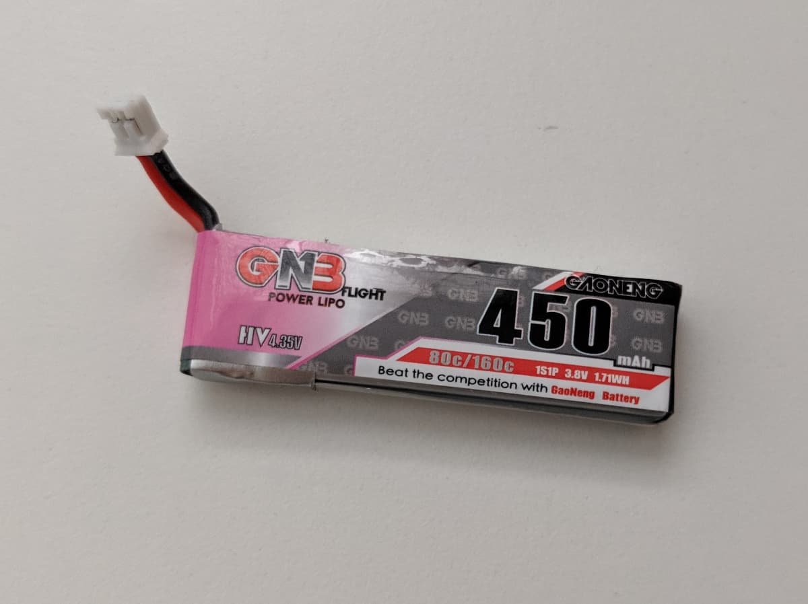

Then you add to that the fact that if you don't want to do soldering just to try out flying on 1S, then you have to use the xt30 to ph2.0 connector and that adds extra weight as well.

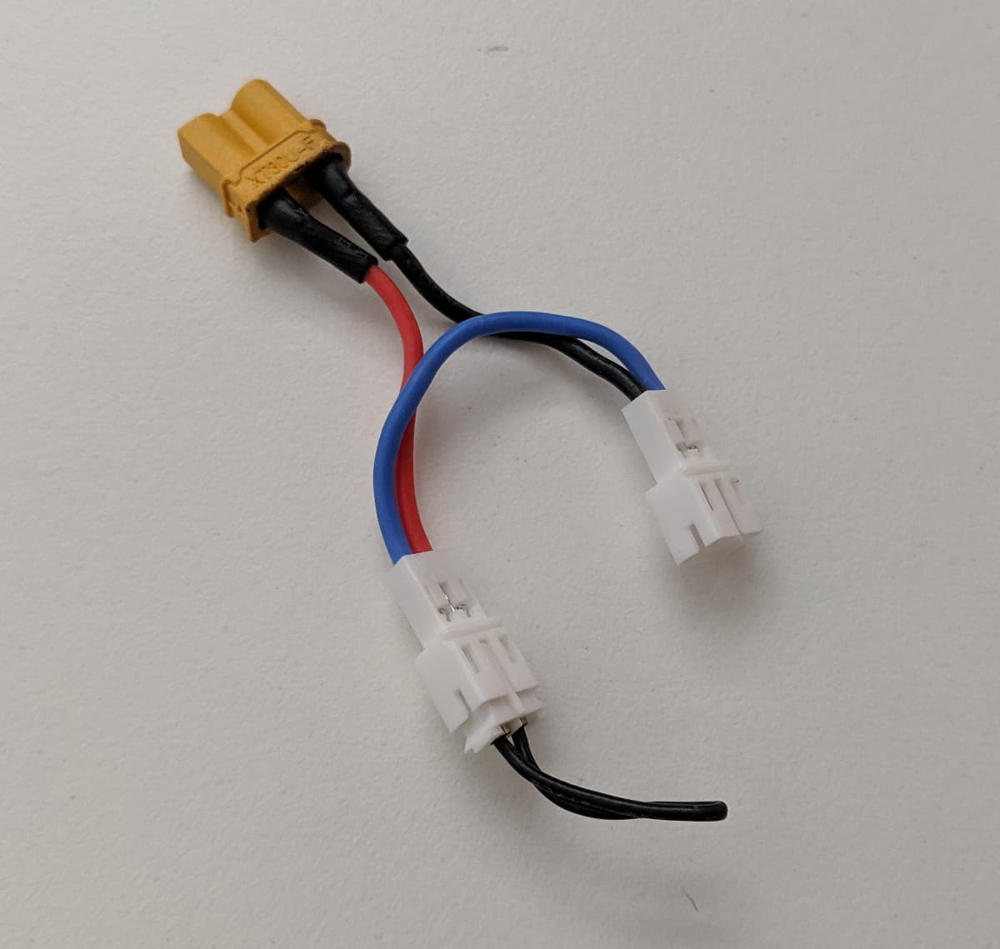

As I mentioned, did it just for testing purposes, didn't get much out of it, and that's ok, there really isn't any need to run on 1S.

#### 🔋🔋 2S

**2S works really good 🔥 🚀.** Both indoors and outside. In my tests, I used the [BetaFPV 2S 350mah lipo][15] batteries and had no issues whatsoever. I got decent flight times per pack of about **4 minutes**, which if I'm being honest is pretty cool. Even if I punched the throttle more often without keeping it at 70% at all times, I still got more than 3:00 - 3:30 minutes of flight time. Check it out for yourself by watching the videos.

These are the Beta FPV batteries I mentioned:

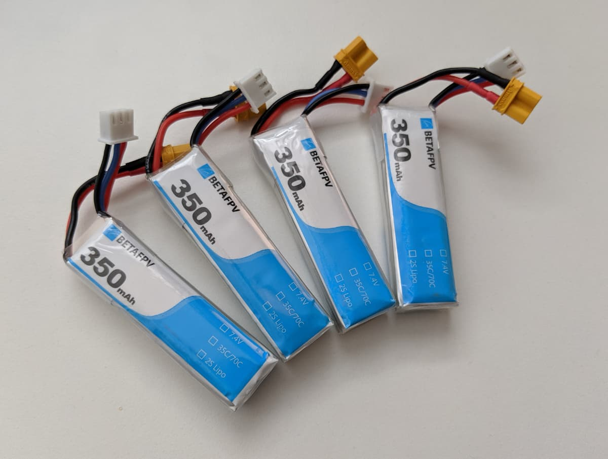

#### 🔋🔋🔋 3S

In terms of 3S, I have only tried the stock battery that comes with the quad. **I'm somewhat on the fence if 3S is really required.** If you consider raw performance, there is no denying that 3S zips around faster, that's a fact. However, Happymodel recommends that you limit the throttle scaling to 75% if you are running the 10000KV motors, to reduce the risk of burning ESCs.

You can do that by pasting the following commands in the Betaflight CLI:

```sh
set throttle_limit_type = scale
 set throttle_limit_percent = 75
 save
```

Try it out for yourself and see what you prefer. I'll come back and update the post as soon as I test with some other 3S batteries. **Personally, for now, I prefer flying 2S with no throttle limits.** I find the experience very satisfactory and hassle-free, with no extra configuration required.

### 🔝 <span id="upgrades" class="offset-top-nav">Potential upgrades</span>

I'd come back here soon enough when I'm ready to share some tune-ups and upgrades, so stay tuned, maybe subscribe to the newsletter at the bottom of the page.

#### 🔄 Props

All of the footage you have seen so far was recorded with the stock props, but just recently I upgraded to these [Gemfan props][19]. The flight is smooth and the Mobula7 HD got just a bit quieter.

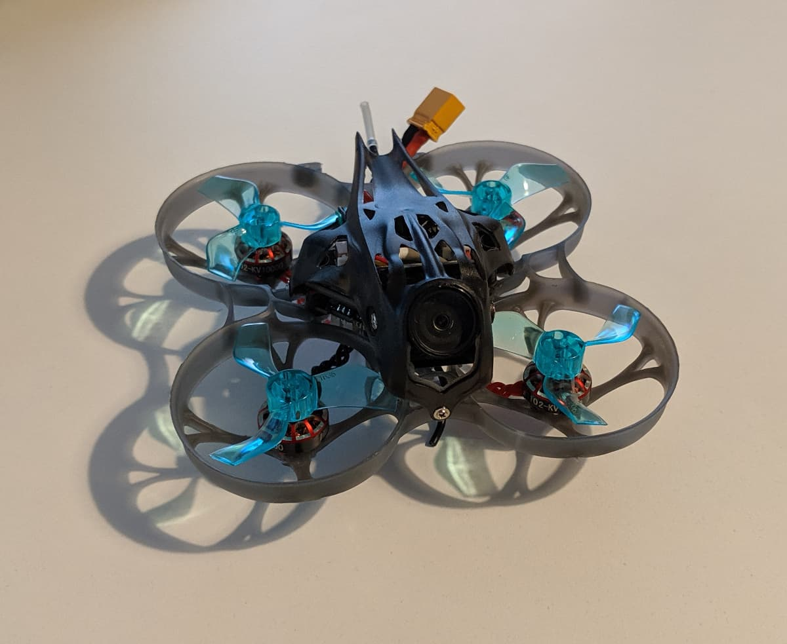

And this is how flying with those Gemfan props looks like:

<div style="text-align: center">
  <iframe width="560" height="315" src="https://www.youtube.com/embed/CLIyXOPPF-Y?rel=0" frameBorder="0" allowFullScreen title="Mobula7 HD flying with Gemfan props"></iframe>
</div>

#### ⚡ XT30 with a capacitor

I haven't done this upgrade yet myself, but it's officially recommended by Happymodel and I think it's legit, especially if you prefer to fly mostly or only on 3S batteries. Adding a capacitor or just swapping out to this [XT30 with a capacitor][20], should help out with those voltage spikes when you plug in a 3S battery.

### 📑 <span id="conclusion" class="offset-top-nav">Conclusion</span>

In conclusion, I can easily recommend this quad to almost anyone who can afford it. Whether you are new to the hobby or an experienced pilot and just want to fly safely in somewhat public areas, such as parks, this quad is indeed a great fit.

> **Simply put, the Mobula7 HD carries on the momentum of its predecessors - the Snapper7 and the original Mobula7, and innovates on top of that.**

You can't go wrong if you pick one up. The top of the line parts, make sure you get a quality build. Sure, the [Mobula7 HD][1] is a bit heavier than its predecessor and as such maybe not just as snappy, but it does offer for better freestyle, similar to the experience you would get with a 5-inch quad.

On top of it all, if `cinewhoops` are your thing, I'd crown the Mobula7 HD the **queen of cinewhoops for 2019**. I know I, for one, absolutely love flying parks and playgrounds safely and getting that sweet, sweet 1080p 60fps footage.

So if you are in the market for such a micro quad, grab yourself a [Mobula7 HD][1] and you won't be sorry! Happy flying!

#### Where to get it?

###### Mobula7 HD - [Amazon][2] [Banggood][1]

###### Caddx Turtle V2 - [Amazon][4] [Banggood][3]

[0]: Linkslist
[1]: https://bit.ly/mobula7-hd
[2]: https://amzn.to/2Ee04Hx
[3]: https://bit.ly/caddx-turtle-v2
[4]: https://amzn.to/2LZJTDI
[5]: http://www.happymodel.cn/wp-content/uploads/2019/03/Mobula7-HD-Frsky-version-manual.pdf
[6]: https://bit.ly/eachine-trashcan
[7]: https://bit.ly/mobula7
[8]: https://bit.ly/snapper-7
[9]: https://bit.ly/runcam-split-2
[10]: https://bit.ly/runcam-split-mini
[11]: https://bit.ly/crazybee-f4-v2
[12]: https://bit.ly/mobula7hd-motors
[13]: https://bit.ly/taranis-xlite
[14]: https://bit.ly/taranis-qx7
[15]: https://betafpv.com/collections/batteries/products/350mah-2s-lipo-battery-2pcs
[16]: https://bit.ly/micro-drone-batteries
[17]: https://www.youtube.com/watch?v=NM_6JpppqZg&list=PLt8_2AobQjAdlDU6cV66yfXOCfg1FaXbX
[18]: https://bit.ly/sd-card-32
[19]: https://bit.ly/gemfan-micro
[20]: https://bit.ly/xt30-cap
