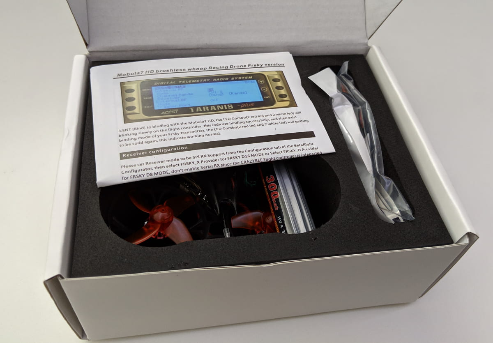
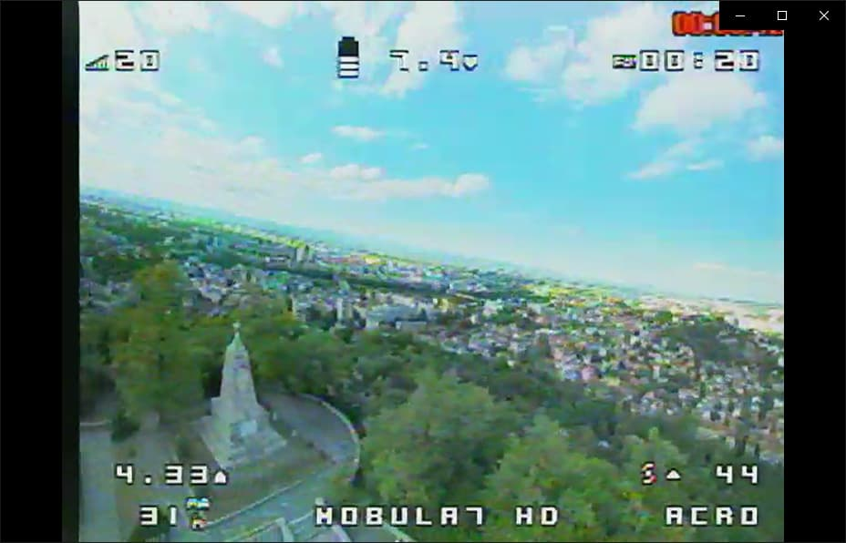

<div class="article-update-notification">
This is a sponsored review. Be that as it may, I still stand by every word and this is my objective and honest review. I love FPV and want to help people enjoy the hobby.
</div>

The [Mobula7 HD][1] is right up there at the top of the line micro quads, along side other drones such as the [Eachine Trashcan][], [Mobula7][], [Snapper7][] and others. Being the latest and greatest quad in Happymodel's lineup, means it comes with the best overall specs, but it also does something, that none of these other micro drones listed above does.


The Mobula7 HD falls into a class of micro quads called `cinewhoops`, which steams from the fact that it carries capabilities to record **1080p video at 60 fps**. To achieve that it uses a Caddx Turtle v2[vl] camera. As such, this quad targets a specific audience - people to whom recording high definition footage is important and given that you can't really carry a Go Pro on top of a micro drone, you are stuck with the option of using an FPV camera that doubles in functionality as a high def video recorder.

Really, really neat! Now, I do say that as a fan of such cameras, in fact, I've been using Runcam Split 2 and Runcam Split Mini for a while now and for my needs, those cameras are enough. I get fairly crisp 1080p 60fps footage to review my flight or [upload to youtube][playlist].

However the cool thing about the [Mobula7 HD][1] is that it is a micro quad and that means it comes with all the safety that comes with a micro quad. You have prop guards, the chance of you doing damage to yourself or other people is nearly negligible (but of course please don't try). In turn this means that you can fly this in parks without being a menace to society.

The Mobula7 HD takes in 1S, 2S or 3S batteries and depending on that you will get very different flight characteristics.

### Table of contents

- [a](#a)
- [b](#b)

### 📦 Unboxing

Let's have a look at what you get in the box.




Inside the box we find the Mobula7 HD as expected, a manual, 1 3S battery and a couple of packages.


One of the packages contains a controller for the [Caddx Turtle FPV][3] camera. The other one - the more or less regular stuff for a micro quad: a screwdriver, a prop remover tool, some extra screws, 4 spare props (complete different set than the ones that are already installed) and an xt-30 to two xjt [?] connector.


### 🔬 Components overview

The Mobula7 HD comes with a [Crazybee F4 PRO V2.0 Flight Controller][] that takes in anywhere between 1S and 3S batteries. You can choose whether you want the flight controller (FC) to have a built in FrSky or Flysky receiver or no receiver at all. The board has 5A 4 in 1 ESCs.

The VTX is 5.8G 40CH with a power range of 25-200mW that can be adjusted.

The motors are [EX1102 10000KV][], but depending on when you get the quad, you might get the 9000KV version, because as it's stated on the Mobula7 HD listing in Banggood:

_"In order to reduce risk from the Mobula7 HD (10000kv motor version )esc burnt , we suggest to limit the throttle scales to 75% .
Performance is almost the same like new 9000KV version."_

If you only fly on 2S and not planning to fly on 3S, you probably can get away without any throttle scaling.

The main star of the show here is the camera. That's the [Caddx Turtle V2][3]. Check the link for the full details and specs, but it's worth mentioning that the FPV feed is clear and the HD recording is decent too. **Just having a 1080p 60fps recording off of a micro drone like that still blows my mind and is definitely super awesome!**

Here's how the default OSD looks like:



And here's some example 1080p 60fps footage (and more videos are available at the end of the article):

<div style="text-align: center">
  <iframe width="560" height="315" src="https://www.youtube.com/embed/fRrUNozEI_0?rel=0" frameBorder="0" allowFullScreen title="Mobula7 HD flying in Central Park in Plovdiv, Bulgaria"></iframe>
</div>

### ⚙ Initial setup & binding

I didn't really do much in terms of setup when I first tried out the Mobula7 HD. I wanted to get a feel of how it comes configured literally out of the box. **And to be frank, I was quite satisfied**.

The by far easiest way to bind the drone to your radio is to plug it in to your computer, open Betaflight, go to the CLI tab and type `bind`. Hit enter. I love this, it makes binding so easy. Now that the Mobula is in bind mode, go to your radio (I'm using a [Taranis X-Lite][], but I also bound it to a [Taranis Q X7][]) and after creating a new model, start the binding process from the radio. That's it. The Mobula will blink a few times to indicate a successful bind (you can read about the [exact meaning of the different flashes in the manual][5]).

Of course, as always, setup 2-3 switches mapped to AUX1, AUX2 and AUX3. The Mobula7 HD's ESCs support DSHOT and as such you can use Turtle mode and Beeping through ESCs.

In my case, I have setup AUX1 for arming on one switch, AUX2 for flight modes (acro and angle), AUX3 for turtle mode (so useful). If you haven't heard of Turtle mode before, basically, it allows you to 'arm' the quad in a special mode when moving the pitch and roll stick corresponds to a particular motor and only moves that side of the quad. Useful when you have crashed and are upside down and want to flip the quad over, without having to walk to do it manually.

[A few screenshots of my default config in Betaflight]

Again do note that on the Mobula7 HD listing in Banggood they warn about some potential issues with Betaflight if you are using the latest version of the configurator (10.5.0 or 10.5.1):

_"New betaflight configurator 10.5.0 and 10.5.1 are not compatible for Mobula7 HD very well for now.
We suggest to use Betaflight configurator 10.4.0"_

I have been using Betaflight Configurator 10.4.0 and had no issues whatsoever.

### 🚁 Fly

**I do love flying this thing!** One of the best things about this micro quad is the fact that is comes with a bit of weight and as such is just a bit more "floaty" than most micros which is great for freestyle flying. If you try the [Mobula7 HD][] you will be amazed by how much it feels and flies like a 5 inch quad. Really, really cool!

Here are a few different videos of flying in very different places in terms of weather conditions.

Flying at the top of a hill in Plovdiv, Bulgaria at 272m above sea level, and dealing with some pretty strong winds at the top after gaining another 30 meters altitude.

<div style="text-align: center">
  <iframe width="560" height="315" src="https://www.youtube.com/embed/OwuMUXXG87A?rel=0" frameBorder="0" allowFullScreen title="Mobula7 HD flying on a hill in Plovdiv, Bulgaria"></iframe>
</div>

A smooth flight in a park, with average humidity, no wind and a temperature in the early 20s.

<div style="text-align: center">
  <iframe width="560" height="315" src="https://www.youtube.com/embed/A0Isy6_wdJQ?rel=0" frameBorder="0" allowFullScreen title="Mobula7 HD flying in Central Park in Plovdiv, Bulgaria"></iframe>
</div>

Windy park flight by the Bulgarian sea side.

<div style="text-align: center">
  <iframe width="560" height="315" src="https://www.youtube.com/embed/jM-l8LQ9B5U?rel=0" frameBorder="0" allowFullScreen title="Mobula7 HD flying in the Sea Garden in Burgas, Bulgaria"></iframe>
</div>

All those flights were carried out on [2S BetaFPV][] batteries, which naturally brings us to the batteries discussion.

### Batteries: 1S, 2S, 3S

As I mentioned the flight controller - [Crazybee F4 PRO V2.0][] is 1-3S capable.

#### 🔋 1S

**There probably aren't many reasons to run the Mobula7 HD on 1S**. The Mobula7 HD really shines in freestyle, acro flying and even zipping around indoors is better on 2S. I only tested flying 1S with a [GNB 450mah lipo][], which are a bit heavier for the already heavy micro to run just off of 1S.


Then you add to that the fact that if you don't want to do soldering just to try out flying on 1S, then you have to use the xt-30 to xjt connector and that adds extra weight as well.


As I mentioned, did it just for testing purposes, didn't get much out of it, and that's ok, there really isn't any need to run on 1S.

#### 🔋🔋 2S

**2S works really good 🔥 🚀.** Both indoors and outside. In my tests I used the [BetaFPV 2S 350mah lipo][] batteries and had no issues whatsoever. I got decent flight times per pack of about **4 minutes**, which if I'm being honest is pretty cool. Even if I punched the throttle more often without keeping it at 70% at all times, I still got more than 3:00 - 3:30 minutes of flight time. Check it out for yourself by watching the videos.

These are the Beta FPV batteries I mentioned:


#### 🔋🔋🔋 3S

In terms of 3S I have only tried the stock battery that comes with the quad. **I'm somewhat on the fence if 3S is really required.** If you consider raw performance, there is no denying that 3S zips around faster, that's a fact. However, Happymodel recommends that you limit the throttle scaling to 75% if you are running the 10000KV motors, to reduce the risk of burning ESCs.

You can do that by pasting the following commands in the Betaflight CLI:

```
set throttle_limit_type = scale
 set throttle_limit_percent = 75
 save
```

Try it out for yourself and see what you prefer. I'll comeback and update the post as soon as I test with some other 3S batteries. **Personally for now, I prefer flying 2S with no throttle limits.** I find the experience very satisfactory and hassle free, with no extra configuration required.

### Who is it for?

### Setup record on start of flying

### What batteries to get?

### Potential upgrades

- https://www.banggood.com/Happymodel-XT30-Plug-Pigtail-Power-Wire-with-100F-Capacitor-for-Mobula7-HD-TRASHCAN-UR85-UR85HD-Crazybee-F3-F4-PRO-Flight-Controller-p-1476203.html?rmmds=search

### What props to get?


TODO:

- videos at end
- links
- check spelling in grammarly
- add emojis
- make a pass to highlight certain passages of text

NOTE ON THIS:

```
Notice:
New betaflight configurator 10.5.0 and 10.5.1 are not compatible for Mobula7 HD very well for now.
We suggest to use Betaflight configurator 10.4.0


In order to reduce risk from the Mobula7 HD (10000kv motor version )esc burnt , we suggest to limit the throttle scales to 75% .
Performance is almost the same like  new 9000KV version.
The cli command is :
set throttle_limit_type = scale
set throttle_limit_percent = 75
save
```

#### Where to get it?

###### Mobula7 HD - [Amazon][2] [Banggood][1]

###### Caddx Turtle V2 - [Amazon][4] [Banggood][3]

[0]: Linkslist
[1]: https://bit.ly/mobula7-hd
[2]: https://amzn.to/2Ee04Hx
[3]: https://bit.ly/caddx-turtle-v2
[4]: https://amzn.to/2LZJTDI
[5]: http://www.happymodel.cn/wp-content/uploads/2019/03/Mobula7-HD-Frsky-version-manual.pdf
