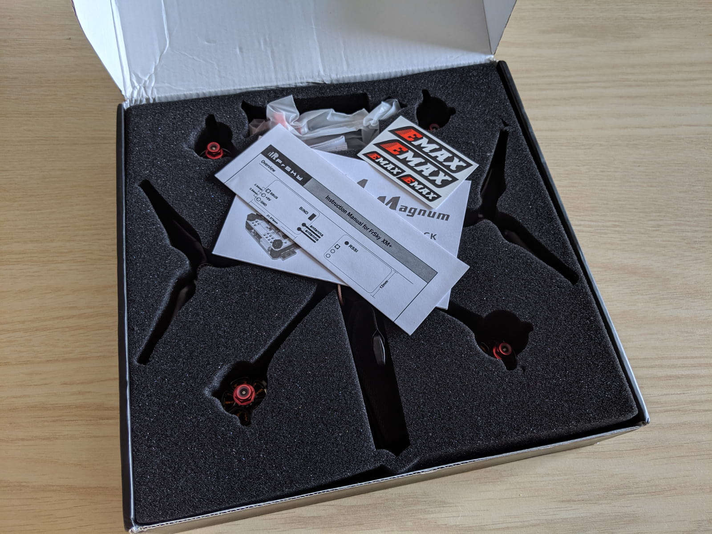
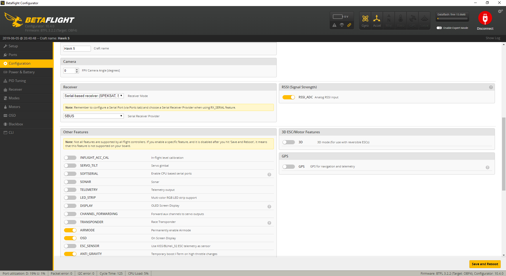

The quickest I have ever gone from opening a box with a prebuilt quad to actually flying it.
Binding it, 3 minutes config on my radio, 3 minutes in Betaflight. Putting props on took more time than the rest 😅.
Today we are having a look at the [Emax Hawk 5][1] BNF 5 inch quad. Let's get to it.

### Table of contents

- [Unboxing](#unboxing)
- [Components](#components)
- [Setup and binding](#binding)
- [Betaflight configuration](#betaflight)
- [Flying](#flying)
- [Upgrades](#upgrades)
- [Conclusion](#conclusion)

### 📦 Unboxing

The unboxing experience was pretty good. No damage on the box on the outside, and a slick design.

The quad, props and all other parts are sunk deep in foam and well protected from all angles.

We are greeted by some manuals for the different components, for the stack, for the xm+ receiver and some Emax stickers.

Very cool packaging, and I'd be very surprised if there were any defects because of shipping. Not a change when everything is wrapped with soft foam.

But let's get to the good stuff, let's see what we get.

We get the [Emax Hawk 5][1]. Even at a glance the build quality is stellar, but more on that in a sec. We get a couple of LHCP Pagoda II antennas, which is a nice touch since they are LHCP, you can put one on the quad and one on your goggles or goggle video receiver.

However, we also note that the quad already has a small dipole whip antenna installed, which could be enough in some cases depending on how you fly. Of course, we get the necessary connector, should we make the transition to the Pagoda antennas.

We get a couple of battery straps, which at least in my case were way too short to hold any battery (I used [1300 mah 4S][4] and [1500 mah 4S][5] batteries in my tests). I use these [battery straps][3] instead. They might not be ruberized, but I have only snapped one so far after almost 2 years of using it (lol), and they are long and cheap. And I've been crashing too :)

You also get 4 sets of props, which is pretty cool.

And those are [Avan Flow][6] props too! If you haven't used them before, just know that they are very aggressive pitch props, that also offer plenty of control, but do tend to draw more amps from your battery when you really punch the throttle. At low and mid throttle they are fairly power efficient. They are also a joy to fly, indeed!

We also find a spare arm in case you break one, that's a great addition and it basically means that a hard crash is not gonna render your entire quad obsolete if you break an arm.

Additionally we also get a controller for tuning the Foxeer FPV camera, as well as another pouch with screws, washers and a few short zipties. Onto the components overview.

### 🧪 Components

I already mentioned that the build was pretty solid and the components are very high quality too. But we also haven't mentioned how much this drone costs. Currently you can snatch up an [Emax Hawk 5][1] for about \$250 on Banggood.

And to be honest for what you get that price is quite fine. However, that is also not one of the cheapest BNF options, and as such, naturally we expect to get quality components and tune. **And you get exactly that!**

**Frame**. The Emax Hawk is quite light, coming in at about 270 grams without battery. The frame is made of high quality aerospace grade carbon fiber, and allows for swapping out arms in case you break one. At the bottom of the frame there is a rubberized padding that provides extra battery grip, which is useful if you mount the battery there.

Alternatively you can mount a battery on top as well, by runnning a battery strap between the two mini top side plates and the top plate.

**Stack: Flight Controller, 4 in 1 ESC, VTX and Receiver**. The FC is an Emax Magnum Omnibus F4 with OSD, the ESC is a 30A 4 in 1 BLHeli_S DSHOT600 capable. The whole stack is soft mounted with rubber grommets to damped vibrations. At the top of the stack you will notice the vtx and the receiver (provided that's the version you purchased too).

In my case, I got my trusty [FrSky XM+][7]. The receiver antennas are already prepped and mounted to the sides with zipties and shrink tube. **You can run the receiver antennas off the sides, keep them closer inside within the frame or run them up through the small cut outs on top of the frame.**

The VTX is a 48 channel 5.8GHz and can be switched between 25mW and 200mW. You can change the channels via an easily accessible button on the side. **To change the output power, press and hold the button for 10 seconds until you can see an extra dot (.) on the small led screen.** Speaking of which, 10/10 for adding that small top frame cut out! It's a lovely touch and makes it very convenient to see your VTX channel.

The battery leads have a zip tie to reduce some of the potention impact / pull tension and there also is a capacitor soldered to the battery leads to soak up some unwanted voltage spikes.

**Camera**. In the front we have the Foxeer Micro Arrow V2 camera. The picture quality and the detail is trully great and the flying experience is solid overall.

However, I'm not sure if it is the camera tune but I haven't been getting very good results late at night when the sun is low on the horizon. In particular, when I fly with the sun behind me, the camera produces a gorgeous image, but flying towards the sun leads to almost pitch black picture. I will make sure to update the post if I solve this by tweaking the camera settings.

However, the reality of it all is that, I'm comparing against the RunCam Split 2 and the WDR on the RunCam is not all over the place in the same conditions and I am able to fly in each direction with decent picture and no issues, with the stock tune on the RunCam Split 2.

**Motors**. The motors are the Emax LS 2206 Lite Spec 2300KV.

They are definitely performers, never had issues with motors getting hot in my tests. Very zippy overall, especially paired with the...

**Props**. Avan Flow 5 inch props. This is the most aggressive tri-blade prop I have flown to date and ... I love it. I give so much of the overall flight characteristic to the Avan Flow props. In simplest terms the craft is very fast and snappy, but also super controllable and behaving in turns and really just goes where you tell it. It is an AWESOME flight experience delivered by the good components and the excellent tune.

### 🔗 Binding and radio setup

Binding the [Emax Hawk 5][1] is very straightforward. **Take the props off**. Then, you have to take off the top plate in order to access the bind button on the FrSky XM+.

In your radio create a new model. I'm using the [X-Lite][9] here, but the setup is nearly identical for most FrSky radios.

Change to the setup screen, navigate to and activate the Bind function.

Plug in a battery to the quad (remember props off) while holding the bind button on the receiver depressed. If you don't have 3 hands you are out of luck :) It's a bit tricky sometimes but you can do it. Alternatively, if you have a [smoke stopper with a button (like mine)][10], it could make it a bit easier, as you can plug in the battery before hand and then only hold the receiver bind button while pressing the smoke stopper power on button.

Next, let's jump to the Mixer screen and setup 2-3 switches.

**Add some switches to channels 5,6,7**. You can certainly do less than that, if you don't want to. Or more. I normally have an arm dedicated switch, a modes 3 step switch and sometimes a buzzer switch.

**BONUS: Adjust Radio Outputs**. While we are here, we might aswell trim the channel outputs. If the outputs are not dead center, like in my case, you can adjust them from the Outputs screen. By moving the sticks you can tell which one controls the current channel as the number in the top middle of the screen will start changing (in case you are lazy like me to learn them by heart). Once you have identified the correct stick and axis, corresponding to channel 1, long press the menu button and select edit to change the min and max values.

Here in the end screen (picture below) we want to achieve 3 things. We want to have a steady value of 1500 when stick is centered, a value of 1000 when the stick is at it's lowest point and a value of 2000 when the stick is at it's max position. We want those values to be steady and not twitching.

To achieve this, deflect fully the stick in a given position and hold it there. The number at the top right will reflect those changes. Whilte holding the stick at that value tweak the Min or Max values accordingly until you achieve the desired steady end points. If when the stick is centered the value is off from 1500, you can adjust that with subtrim.

Here's how my end points ended up being.

Next, let's jump into Betaflight and set up the switches.

### ⚙ Betaflight configuration

I mentioned already perfect tune. Like, literally my first flight experience, from the first second, the PID tuning just clicked with me. Every roll, every flip, was spot on axis, very easy to perform. Amazing work there by Emax. In fact here's the DVR footage from the maiden flight and my first ever time flying this quad.

  <iframe width="560" height="315" src="https://www.youtube.com/embed/yaP5ZEdxjeQ?rel=0" frameBorder="0" allowFullScreen title="Emax Hawk 5 Maiden 1"></iframe>

  <iframe width="560" height="315" src="https://www.youtube.com/embed/fJIqgj6Id9U?rel=0" frameBorder="0" allowFullScreen title="Emax Hawk 5 Maiden 1"></iframe>

I am simply in love with that tune. Out of the box with 0 extra tuning. Impressive!

**Setup modes**. Pretty much the only thing we have to do in Betaflight is to set up some modes. That will allow us to trigger those modes with the switches we set up in the radio mixer. Remember we set up CH5, CH6, CH7? Those correspond to AUX1, AUX2, AUX3 here in the modes tab.

Make sure you have at least an arming switch setup (AUX1 in my case). Again if you are doing any live debugging with plugged in quad, remove the props before pluging in a battery. If your transmitter is correctly bound, you will see the yellow notch move when you flip a switch. You can adjust when a switch is considered active by adjusting the yellow sliders.

I have Angle mode (I don't ever fly it, maybe I need to reconsider, but as a safety option I like keeping an angle / horizon mode around), and turtle mode (flip over after crash) on AUX2. And a beeper on AUX3.

If you are itching to fly, at this point you are good to go. Don't forget to hit save to save your changes. Additionally, double check and make sure your Failsafe is setup and working on the radio (I use the 'No Pulses' setting).

Here's the rest of the stock configuration:

Let's verify that SBUS is set and also with the XM+ receiver we get RSSI output on channel 12, which is neat and can be then shown on the OSD. You can enable it here in the configuration tab.

**Receiver tab:**

Then here under RSSI Channel select channel 12.

**OSD tab:**

Finally in the OSD tab select to output the RSSI value.

**PID Tuning tab:**

**Motors tab:**

If you want, you can test and make sure the motor directions are correct, but if you do so, take off the props :)

Here's the [full stock Betaflight configuration dump + my modes changes](BTFL_cli_Hawk_5_20190628_220337.txt).

Now let's go rip some packs!

### 🚁 Flying

TODO: PUT FOOTAGE HERE

In my tests I flew mostly [1300 mah 4S][4] packs, and a few [1500 mah 4S][5]. I don't think you can feel the difference that much, although it does indeed make the quad a bit heavier. I do prefer to rip 1300 mah packs.

**I think this is hands down the best quad I have flown to date!** My custom build quad doesn't fall too short either, although it cost a bit less to make, but I'm not sure about the value comparison if I factor in the time I put in it and all the issues I had to go through. You can [read about my entire experience building it here][11]. I mean building is fun, but if you wanna fly quick, BNF is probably one of the fastest ways to get in the sky. At least before you get good at building, if that's your cup of tea.

TODO: PUT FOOTAGE HERE

The PID tune really clicked with me from the first pack, the quad was really snappy and fast. It cuts the corners nicely and simply put is just a joy to fly. It definitely packs a punch and is truly so much fun to fly. Very responsive as well.

TODO: PUT FOOTAGE HERE

I was curious to what degree that pretty unique flight characteristic was because of the Avan props, so I went ahead and did a test flight with these [Gemfan Hurricane][12] props.

The bottom line? The [Hawk 5][1] still flies nice, but with the same rates, I actually had to noticably deflect the sticks further to perform the same maneuvers. I feel like the power consumption was lower (haven't measured, so this is just a gut feel, take it for what it is), but also the Hawk lost some of its punch. I will continue testing and experimenting with different props for fun, but **I am convinced that the [Avan Flow][6]'s are probably the best match for this particular craft**.

### 🔝 Upgrades

There are [plenty of Emax Hawk 5 projects on Thingiverse][8] you can use to print different mounts and parts. So far I have printed this wall mounting bracket...

...and this pagoda mount, if you consider upgrading to Pagoda antennas.

The thing that is very easy to do, but definitely comes to mind first is - **add some electric tape to the shrinktubes on the arms** that hold the motor wires down. That's fairly easy to do, but don't underestimate it - the shrinktubing does tend to slide out and the motor wires are really right there in the way of the props. You don't want to be that guy or girl, definitely fix them in place.

I'm currently expecting a [RunCam 5][13] to arrive and definitely planning on testing how the Hawk behaves carrying a camera.

I'm also considering modding the Emax Hawk with a camera that records HD footage, maybe a [RunCam Split Mini 2][14] or a [Caddx Turtle V2][15]. And will make sure to post an update if I do. If you are interested, [subscribe to the newsletter][16] and get notified.

### 🔝 Conclusion

Want my verdict and to move on with your life? Should you buy the [Emax Hawk 5][1] if you are in the market for a 5 inch quad? **Yes, absolutely! I am very happy to recommend this quad to anyone - beginner or experienced pilot!**

First of all this drone is really great value for money. It hits a sweet spot around the \$250 mark. It's not cheap, coming with parts you will change in a month, but it is also not way too expensive. It flies amazing and the tune is top notch.

Can you build something similar for less? Possibly. If you are not experienced with building quads and soldering, it might end up costing you more if you factor in all the expenses and issues. That literally happened to me on my first build. In my case I'm fine with it cause I wanted to learn how to build quads and I valued the experience. But was it hard? Yeah. Did it take a hell of a lot of time? Yep. Did I wish I had a quad to fly at certain points last summer, due to issues? Yea.

I guess my point is that, sometimes it makes sense to buy a BNF or a prebuilt quad. If you decide to do that, going for the Emax Hawk 5 is an amazing option.
In which case I'd like to remind you that you could support the blog by clicking the purchase link below, which I would really appreciate. Happy flying!

#### Who is this for? Grab this if you care about:

- Ease of getting started
- Beginner or experienced pilot
- Having a near perfect tune out of the box
- Good value for money and good parts

#### Where to get it?

###### Emax Hawk 5 - [Banggood][1]

TODO: Publish unlisted video? and new unlisted video - https://www.youtube.com/watch?v=htWUFSzpH14

https://www.youtube.com/watch?v=WDDIkdS-HBA

Over cast day
https://www.youtube.com/watch?v=2jHrFx6P_iI

Sunny day

Very late night Finnish sunny summer day (sun very low on the horizon).

TODO: 5 Published Lunch break videos
https://www.youtube.com/watch?v=EHGsctmuK5E
https://www.youtube.com/watch?v=TrDwLlx1DGA
https://www.youtube.com/watch?v=E-O2FAFXRC4

[0]: Linkslist
[1]: https://bit.ly/emax-hawk-5
[2]: https://amzn.to/2Wq1KJ6
[3]: https://bit.ly/battery-straps
[4]: https://bit.ly/cnhl-1300
[5]: https://bit.ly/4s-battery-graphene
[6]: https://bit.ly/avan-flow
[7]: https://bit.ly/xm-plus
[8]: https://www.thingiverse.com/search?q=emax+hawk+5&dwh=25d1516d79598b
[9]: https://bit.ly/taranis-xlite
[10]: /fpv/make-a-smoke-stopper/
[11]: /fpv/build-a-quad/
[12]: https://bit.ly/gemfan-hurricane
[13]: https://bit.ly/runcam--5
[14]: https://bit.ly/runcam-split-mini-2
[15]: https://bit.ly/caddx-turtle-v2
[16]: https://tinyletter.com/jumpalottahigh
