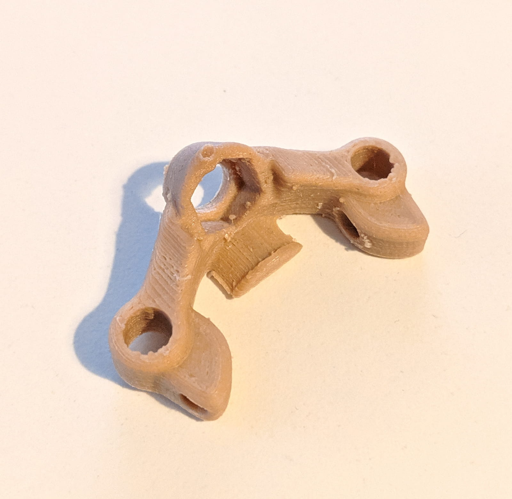

The quickest I have ever gone from opening a box with a prebuilt quad to actually flying it.
Binding it, 3 minutes config on my radio, 3 minutes in Betaflight. Putting props on took more time than the rest 😅.
Today we are having a look at the [Emax Hawk 5][1] BNF 5 inch quad. Let's get to it.

### Table of contents

- [Unboxing](#unboxing)
- [Components](#components)
- [Setup and binding](#binding)
- [Betaflight configuration](#betaflight)
- [Flying](#flying)
- [Upgrades](#upgrades)

### 📦 Unboxing

The unboxing experience was pretty good. No damage on the box on the outside, and a slick design.

The quad, props and all other parts are sunk deep in foam and well protected from all angles.

We are greeted by some manuals for the different components, for the stack, for the xm+ receiver and some Emax stickers.

Very cool packaging, and I'd be very surprised if there were any defects because of shipping. Not a change when everything is wrapped with soft foam.

But let's get to the good stuff, let's see what we get.

We get the [Emax Hawk 5][1]. Even at a glance the build quality is stellar, but more on that in a sec. We get a couple of LHCP Pagoda II antennas, which is a nice touch since they are LHCP, you can put one on the quad and one on your goggles or goggle video receiver.

However, we also note that the quad already has a small dipole whip antenna installed, which could be enough in some cases depending on how you fly. Of course, we get the necessary connector, should we make the transition to the Pagoda antennas.

We get a couple of battery straps, which at least in my case were way too short to hold any battery (I used [1300 mah 4S][4] and [1500 mah 4S][5] batteries in my tests). I use these [battery straps][3] instead. They might not be ruberized, but I have only snapped one so far after almost 2 years of using it (lol), and they are long and cheap. And I've been crashing too :)

You also get 4 sets of props, which is pretty cool.

And those are [Avan Flow][6] props too! If you haven't used them before, just know that they are very aggressive pitch props, that also offer plenty of control, but do tend to draw more amps from your battery when you really punch the throttle. At low and mid throttle they are fairly power efficient. They are also a joy to fly, indeed!

We also find a spare arm in case you break one, that's a great addition and it basically means that a hard crash is not gonna render your entire quad obsolete if you break an arm.

Additionally we also get a controller for tuning the Foxeer FPV camera, as well as another pouch with screws, washers and a few short zipties. Onto the components overview.

### 🧪 Components

I already mentioned that the build was pretty solid and the components are very high quality too. But we also haven't mentioned how much this drone costs. Currently you can snatch up an [Emax Hawk 5][1] for about \$250 on Banggood.

And to be honest for what you get that price is quite fine. However, that is also not one of the cheapest BNF options, and as such, naturally we expect to get quality components and tune. **And you get exactly that!**

**Frame**. The Emax Hawk is quite light, coming in at about 270 grams without battery. The frame is made of high quality aerospace grade carbon fiber, and allows for swapping out arms in case you break one. At the bottom of the frame there is a rubberized padding that provides extra battery grip, which is useful if you mount the battery there.

Alternatively you can mount a battery on top as well, by runnning a battery strap between the two mini top side plates and the top plate.

**Stack: Flight Controller, 4 in 1 ESC, VTX and Receiver**. The FC is an Emax Magnum Omnibus F4 with OSD, the ESC is a 30A 4 in 1 BLHeli_S DSHOT600 capable. The whole stack is soft mounted with rubber grommets to damped vibrations. At the top of the stack you will notice the vtx and the receiver (provided that's the version you purchased too).

In my case, I got my trusty [FrSky XM+][7]. The receiver antennas are already prepped and mounted to the sides with zipties and shrink tube. **You can run the receiver antennas off the sides, keep them closer inside within the frame or run them up through the small cut outs on top of the frame.**

The VTX is a 48 channel 5.8GHz and can be switched between 25mW and 200mW. You can change the channels via an easily accessible button on the side. **To change the output power, press and hold the button for 10 seconds until you can see an extra dot (.) on the small led screen.** Speaking of which, 10/10 for adding that small top frame cut out! It's a lovely touch and makes it very convenient to see your VTX channel.

The battery leads have a zip tie to reduce some of the potention impact / pull tension and there also is a capacitor soldered to the battery leads to soak up some unwanted voltage spikes.

**Camera**. In the front we have the Foxeer Micro Arrow V2 camera. The picture quality and the detail is trully great and the flying experience is solid overall.

However, I'm not sure if it is the camera tune but I haven't been getting very good results late at night when the sun is low on the horizon. In particular, when I fly with the sun behind me, the camera produces a gorgeous image, but flying towards the sun leads to almost pitch black picture. I will make sure to update the post if I solve this by tweaking the camera settings.

However, the reality of it all is that, I'm comparing against the RunCam Split 2 and the WDR on the RunCam is not all over the place in the same conditions and I am able to fly in each direction with decent picture and no issues, with the stock tune on the RunCam Split 2.

**Motors**. The motors are the Emax LS 2206 Lite Spec 2300KV.

They are definitely performers, never had issues with motors getting hot in my tests. Very zippy overall, especially paired with the...

**Props**. Avan Flow 5 inch props. This is the most aggressive tri-blade prop I have flown to date and ... I love it. I give so much of the overall flight characteristic to the Avan Flow props. In simplest terms the craft is very fast and snappy, but also super controllable and behaving in turns and really just goes where you tell it. It is an AWESOME flight experience delivered by the good components and the excellent tune.

### 🔗 Binding and setup

#### Binding

- Taking off the top plate.
-

#### Radio Setup

- Create 3 extra switches: arm, modes, buzzer
- Adjust outputs

### ⚙ Betaflight configuration

I mentioned already perfect tune. Like, literally my first flight experience, from the first second, the PID tuning just clicked with me. Every roll, every flip, was spot on axis, very easy to perform. Amazing work there by Emax. In fact here's the DVR footage from the maiden flight and my first ever time flying this quad.

  <iframe width="560" height="315" src="https://www.youtube.com/embed/yaP5ZEdxjeQ?rel=0" frameBorder="0" allowFullScreen title="Emax Hawk 5 Maiden 1"></iframe>

  <iframe width="560" height="315" src="https://www.youtube.com/embed/fJIqgj6Id9U?rel=0" frameBorder="0" allowFullScreen title="Emax Hawk 5 Maiden 1"></iframe>

I am simply in love with that tune. Out of the box with 0 extra tuning. Impressive!

TODO: Screenshots of all screens
TODO: DIFF DUMP

- Setup modes based on switches at AUX1, AUX2, AUX3

- Check configuration tab for SBUS (FrSky); BONUS: configure RSSI on channel 12

- Test motors spin direction

- Configure OSD

### 🚁 Flying

DVR with 4S 1300mah
DVR 4S 1500mah

### 🔝 Upgrades

There are [plenty of Emax Hawk 5 projects on Thingiverse][8] you can use to print different mounts and parts. So far I have printed this wall mount bracket...

...and this pagoda mount, if you consider upgrading to Pagoda antennas.

TODO: Upgrade - Test with different props and write section.

TODO: Upgrade - Considering upgrading to a RunCam Split Mini

Publish unlisted video? - https://www.youtube.com/watch?v=htWUFSzpH14

TODO: Footage with a RunCam 5

5 Published Lunch break videos
https://www.youtube.com/watch?v=EHGsctmuK5E
https://www.youtube.com/watch?v=TrDwLlx1DGA
https://www.youtube.com/watch?v=E-O2FAFXRC4
https://www.youtube.com/watch?v=WDDIkdS-HBA
https://www.youtube.com/watch?v=2jHrFx6P_iI

TIPS: wrap arm shrink tubing with electric tape to keep it in place

[0]: Linkslist
[1]: https://bit.ly/emax-hawk-5
[2]: https://amzn.to/2Wq1KJ6
[3]: https://bit.ly/battery-straps
[4]: https://bit.ly/cnhl-1300
[5]: https://bit.ly/4s-battery-graphene
[6]: https://bit.ly/avan-flow
[7]: https://bit.ly/xm-plus
[8]: https://www.thingiverse.com/search?q=emax+hawk+5&dwh=25d1516d79598b
