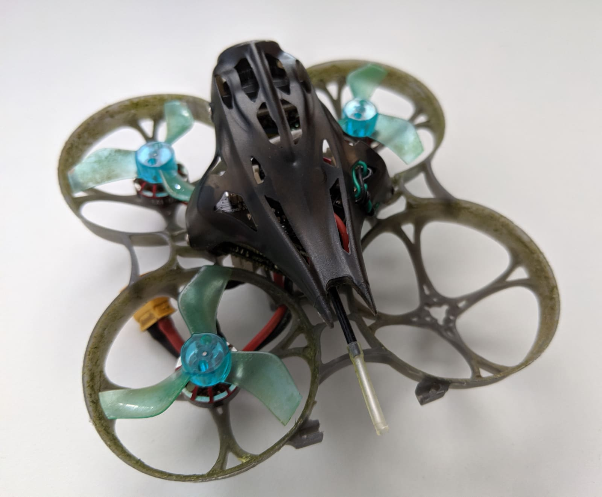
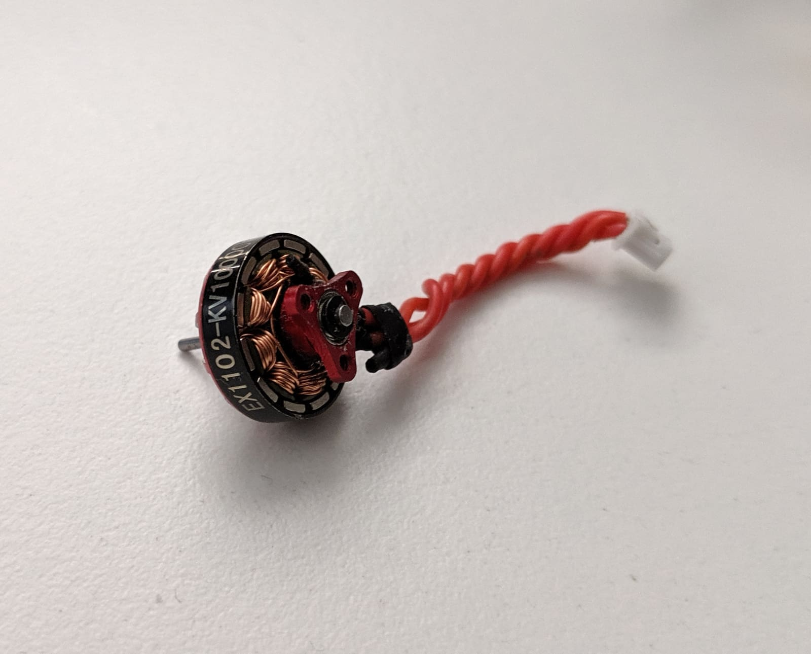
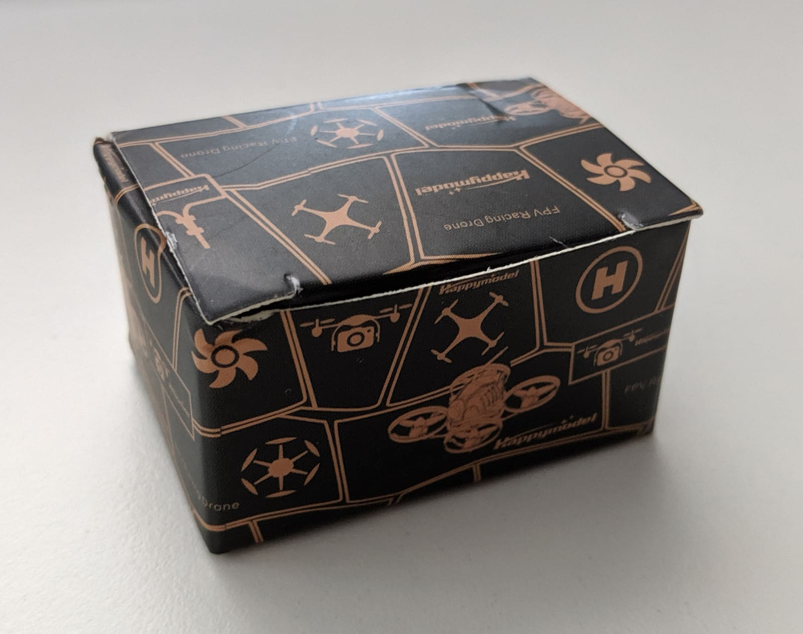
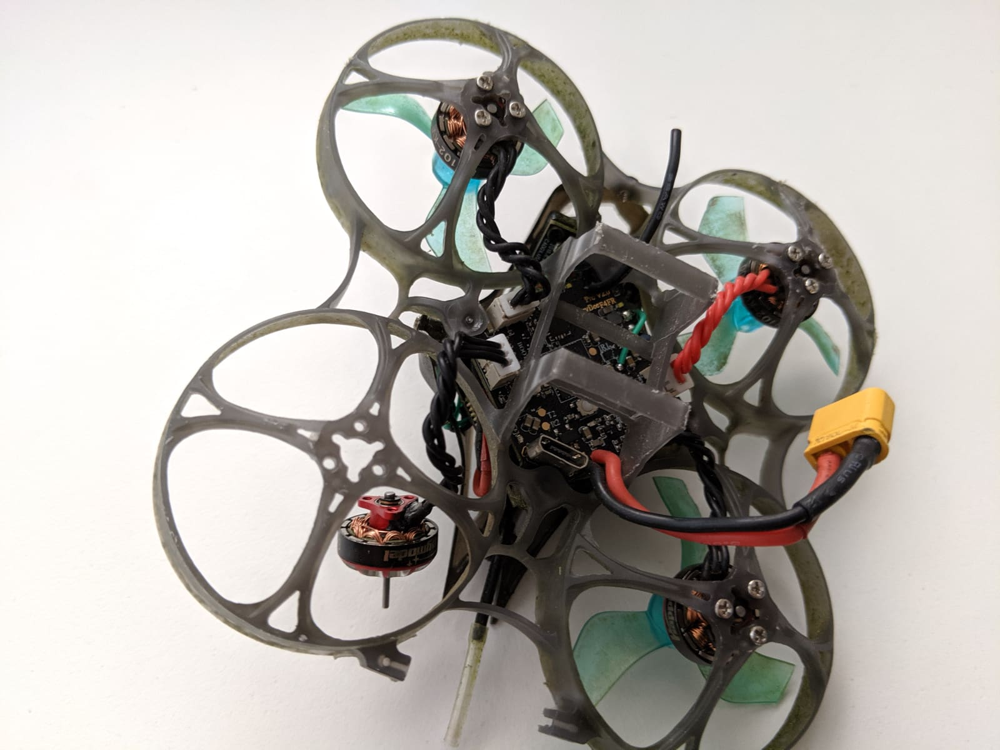
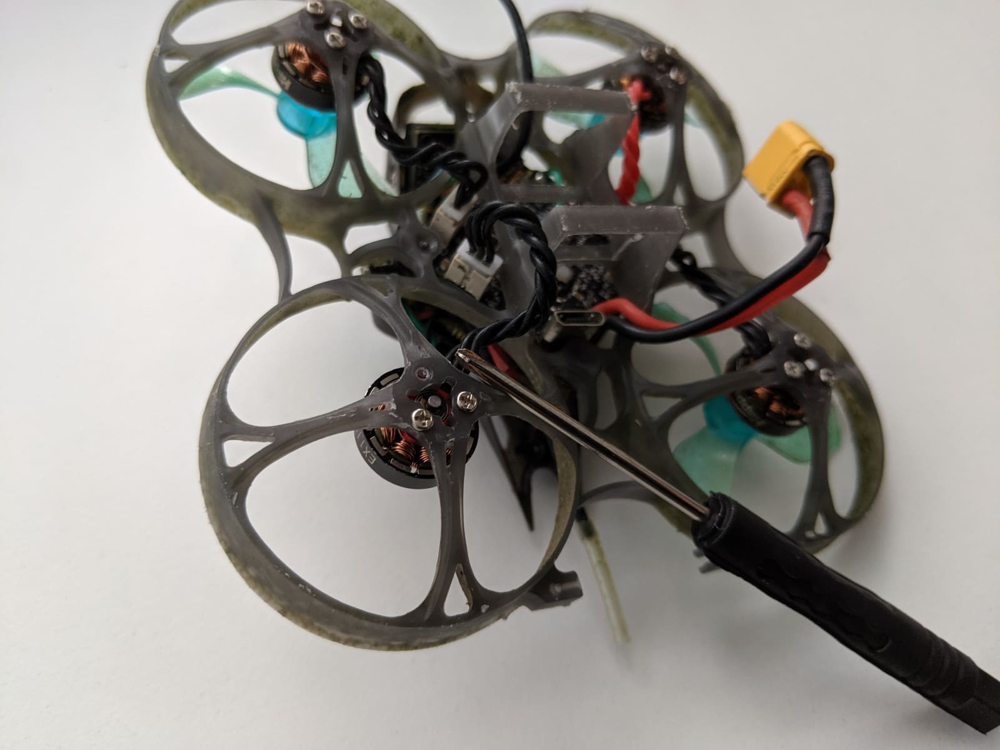
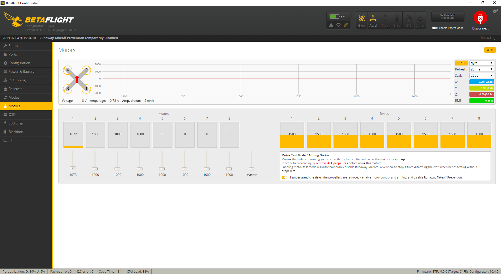
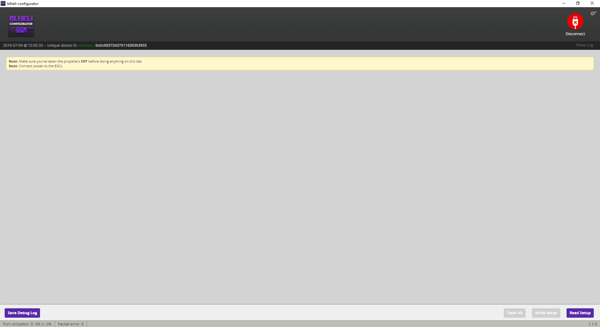
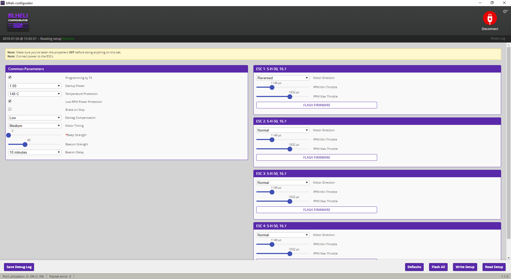
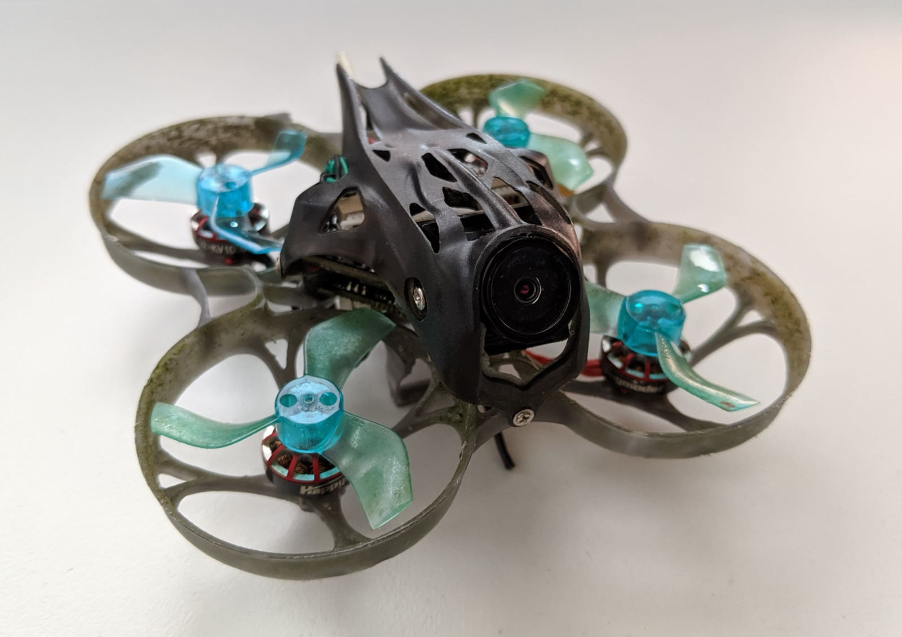

Changing a motor on the [Mobula7 HD][1] is a fairly straight forward process, but there might be a few gotchas, particularly if you are new to the hobby. However, fear not, as we are gonna go over the whole process. So say a motor on your quad won't spin, or makes weird grinding noises or acts glitchy.

Let's first make sure it really is indeed the motor to blame and not the ESC or something else entirely.
Maybe one of the fastest and most efficient ways to figure out the real cause is to try a process of elimination.

If all your other 3 motors are working just fine and only one is not spinning or barely showing any signs of life, the best thing you could do is to **take the faulty motor off and swap it out with a working motor**. If the motor still won't spin, that's good news! **It means that the issue is probably with the motor indeed and that your ESC is fine**. And most times (especially in our case with the Mobula7 HD) it's easier and cheaper to change a motor than to replace the [whole flight controller + ESC board][2] (unless you are very capable with debugging electrical circuits and great at [SMD soldering][3]).

In our example let's assume that you have made sure your motor really doesn't work and that turned out to be the case even after swapping it out with a working motor.

_You have two options. You can try to repair the motor, or you can buy a new motor._

You can do a lot to repair a motor yourself, depending on what's wrong with it. You can:

- Rewind the copper wire
- Glue loose magnets
- Resolder snapped wires

**Make your choice depending on how much time you are willing to spend on this, how much you want to do it for fun and learning.**

In my case, I had other projects I wanted to focus on, so even though my issue was just having a broken wire, I decided to [purchase a new motor][4]. If I ever repair the old one, it wouldn't hurt to have it lying around as a spare anyway.

Plus the [motors for the Mobula7 HD][4] are pretty cheap. Just make sure you pay attention to what KV you buy. My Mobula7 HD is the older version rocking the 10000 KV motors, but depending on when you got your quad it could be with 9000 KV motors instead. For shaft diameter, I had to select 1mm. Select wisely, the link to the motors is the same, just make sure you grab the correct KV and shaft diameter.

Once you have your hands on the new motor, the next bit is simple - plug the motor connector into the flight controller board and then slot the motor into the frame.

Secure the motor in place with its screws.

Now, depending on which motor you changed and what configuration you were running, you might have to reverse the motor direction, or you might be lucky and already have the motor spin in the direction you need it to spin in.

Whatever the case, we have to check and the easiest way to do so is via the [Betaflight configurator][5]. Connect the Mobula 7 HD to your computer, fire up Betaflight and go to the motors tab.

Plug a battery in the Mobula and click the `I understand the risks` button. Look at the diagram at the top left and take note which motor number is the one you are interested in. In my case, I'm dealing with the back-right motor or motor number 1 as it is in the diagram. This means that I want to adjust the position of slider 1, in order to spin the motor with the corresponding number. Don't go too crazy on it, you want to start slowly and give it a very low value. **In fact, a pro tip is to click the slider (in order to give it focus) and then use the up and down arrow keys on your keyboard to adjust the values in very small increments**.

In my case, the motor was indeed going in the wrong direction for me, so I have to reverse it. To do that, let's jump out of Betaflight and into [BLHELI Configurator][6].

Plug a battery in the quad, and click the `Read Setup` button in the bottom right-hand side of the screen.

If all went well you will be presented a screen similar to this:

Don't get spooked and you definitely don't need to understand any of that in depth. Here are the parts we care about.

On the right half of the screen, you should see the configuration for each ESC, so 4 separate boxes. If you see less than 4, you might have an ESC issue. If you see all 4, and you need to change the direction of the motor, click the drop-down menu for that button and change it appropriately.

If in your case the selected option was `Normal`, then select `Reversed`. Or if it was already `Reversed` then select `Normal`.

**Remember to save your changes by clicking the `Write Setup` button.**

If you want you can go make sure the changes were applied, by checking it again through the Betaflight configurator, or if you are bold enough you could also just take straight to the skies.

> _Because this is a micro quad, it may be fine to be a bit less strict, but if you work on a 5-inch quad, you can never be too cautious. Always take props off when doing motor work and definitely double check your configuration. Mistakes happen._

Happy flying!

Here's a playlist of about ~ 66 packs I've flown on the Mobula7 HD to this day and loving it!

  <iframe width="560" height="315" src="https://www.youtube.com/embed/cRzGT1Ltwq4?rel=0&list=PLt8_2AobQjAd_y_vSbyHq-PQWNGL_RnWT&index=47" frameBorder="0" allowFullScreen title="Georgi FPV Mobula7 HD footage"></iframe>

#### Where to get it?

###### Mobula7 HD - [Banggood][1]

###### Mobula7 HD motor (9000KV / 10000KV) - [Banggood][4]

[0]: Linkslist
[1]: https://bit.ly/mobula7-hd
[2]: https://bit.ly/crazybee-f4-v2
[3]: https://en.wikipedia.org/wiki/Surface-mount_technology
[4]: https://bit.ly/mobula7hd-motor
[5]: https://github.com/betaflight/betaflight-configurator/releases
[6]: https://github.com/blheli-configurator/blheli-configurator/releases
