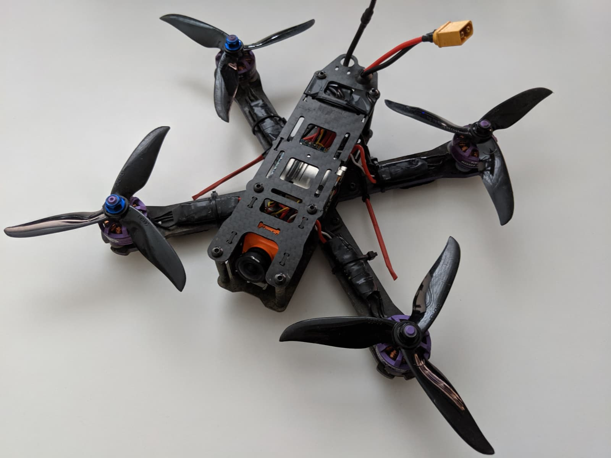
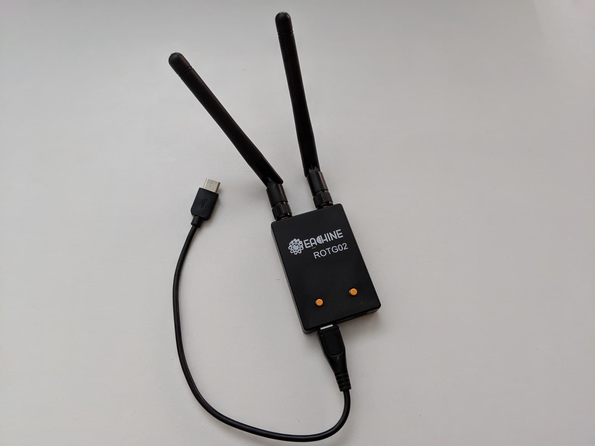

The gear I use in 2019 and the quads I fly the most! To get a sense of how I fly, [follow FPVTIPS on Instagram][26] or have a look at these [Georgi FPV videos][27] on YouTube. We are gonna take a look at anything from quads, goggles, and transmitters to props, batteries and other accessories.

### Table of contents

- [🤓 Goggles & antennas](#goggles)
- [📡 Transmitters](#transmitters)
- [🚁 Drones](#drones)
- [🔩 Custom Builds](#custom-builds)
- [🔋 Batteries](#batteries)
- [🔌 Chargers](#chargers)
- [📷 Cameras](#cameras)
- [🔨 Tools](#tools)
- [🎒 Backpack](#backpack)
- [🌀 Props](#props)

**Legend:**

🔥 = highly recommended (a mix of high quality and great value for money)

### 🤓 Goggles & antennas

- [Skyzone SKY02X][1] 🔥

> Will start testing the Skyzone goggles in July 2019 and will update this post accordingly when I have more to share.

- [AOMWAY Commander][3] 🔥

> Been using the Aomway Commanders for over a year and I love them. Great value, in terms of what you get for how much you pay. Bonus points for being a complete package - comes with a built-in diversity receiver module. No need to buy your own module on top of buying the goggles.

- [Aomway 5.8GHz FPV 4 Leaf Clover Antenna][9] 🔥

- [Realacc Triple Feed Patch Antenna][2] 🔥

- [Pagoda 60mm 5.8G 2dBi FPV Antenna][13]

- [RP-SMA Female right angle connector][36] or [SMA Female right angle connector][37]

> So you don't have to bend your antennas again.

All those antenna options are pretty solid, been using some of those for almost 2 years, still no issues.

### 📡 Transmitters

- [FrSky Taranis X-Lite][4] 🔥

> I started testing the X-Lite on April 6th, 2019 and kind of switched to it as my main radio since then. It's actually a pretty awesome radio with a different form factor than most traditional radios, but also full-featured. [Read the full review and set up guide][28].

- [FrSky Taranis Q X7][5] 🔥

> I loved my Taranis Q X7, used it for over a year, recently switched to X-Lite, but might still fly my Q X7 every once in a while, it's still a great radio and an awesome value for money. [How to set up the Taranis Q X7][29].

### 🚠Drones

- [Emax Hawk 5][24] 🔥🔥🔥 (mini quad)

> Started testing the Emax Hawk 5 in June 2019. I immediately fell in love with the tune and the Avan Flow 5 props on it. The quad itself has high-quality parts, the build quality is very good and the tune is outstanding. Great value for money and a highly recommended purchase for beginners and more advanced pilots alike. [Read the full review and setup guide][30].

- [Mobula7 HD][11] 🔥🔥🔥 (micro 2S / 3S quad, cinewhoop)

> The Mobula7 HD was my first `cinewhoop`, my 2nd quad from HappyModel, and my 4th micro drone. I absolutely love flying it! Even though it's a micro quad, it flies really almost like a 5-inch quad. You can fly it safely in parks and playgrounds and even somewhat close around other people without being scared of injuring anyone. [Read my full review and setup guide][31] or [Watch the video review on FPVTIPS][32].

- [Eachine Wizard X220][6] 🔥🔥 (mini quad)

> I have crashed my wizard so many times, as it was my learning quad, and [I have swapped out so many of its parts][33] that it is hardly a wizard anymore. Nevertheless, I still love flying it.

- [Eachine Trashcan][7] 🔥🔥 (micro 1S / 2S quad)

> I loved flying my Trashcan last winter. [Read the full review][34].

### 🔩 Custom Build Drone "Phoenix" Parts:

> This was my first quad build from 2018, still alive and kicking and I still love flying it! The parts list is below. It will cost you about \$270 to build in parts alone. You can definitely build for cheaper, but this build was focused on good value high-quality components. [Read about my experience building this quad][35].

**Parts list:**

- [Holybro Kakute F4 V2 Flight Controller Tekko32 35A 4 In 1 Blheli 32 3-6S Brushless ESC][25]
- [Frsky XM+ Receiver][12] 🔥
- [BrotherHobby Returner R2 2205 2600KV Brushless Motor][14] 🔥
- [Eachine VTX03][15] 🔥
- [RunCam Split Mini 2 FPV Camera][16] 🔥
- [Realacc Furious 220mm Carbon Fiber Racing Frame][17] 🔥

### 🔋 Batteries

I currently fly mostly these battery brands.

**4S**

- [CNHL 4S 1300mAh 100C LiPo Battery][40]
- [Infinity 4S 1300mAh 85C LiPo Battery][39]
- [Infinity 4S 1500mAh 85C LiPo Battery][10]

**3S**

- [Happymodel 3S 300mAh batteries][42]

**2S**

- [BetaFPV 2S 350mAh batteries][41] 🔥🔥

**1S**

- [GNB 1S 450mAh battery][43]

**Radio batteries**

- [18500 Li-Ion 1200mAh Battery for Taranis X-Lite][38]

- [7.4V 2S 2000mAh Lipo Battery for Frsky Taranis Q X7][19]

**Accessories**

- [Realacc Waterproof and Fireproof Lipo Bag][44]

### 🔌 Chargers

I mostly don't do parallel charging yet, except on 1S batteries. I prefer charging 2 batteries at a time on separate chargers.

- [imax B6 LiPro Balance Charger][47]

- [Charsoon 2-4S Li-poly/Li-ion Battery Charger][45]

- [XTAR USB Battery Charger For 18500, 18650 Battery][48]

- [1S Parallel charging board][46]

- [XT60 to Banana Plug][49]
- [XT30 to Banana Plug][50]
- [XT60 to DC][51]

### 📷 Cameras

- [RunCam 5][52]

> RunCam 5 is pretty awesome, especially having in mind it costs only \$99. [Read the full review and setup guide][60] or [subscribe to FPVTIPS on YouTube][59] for the upcoming video review. In addition you can watch this [RunCam 5 vs RunCam Split 2 comparison video][61] or this [playlist showcasing all of RunCam 5's different resolution settings][62].

### 🔨 Tools

- [ANENG AN8008 Digital Multimeter][20]
- [Drillpro 4pcs 1.5/2.0/2.5/3.0mm Hex Screwdriver Set][21]
- [Eachine ROTG02][53]

> The Eachine ROTG02 is very useful for recording DVR (or just watching and sharing with other people) on your smartphone. They have an iPhone version as well. I'm using the Android version on my Pixel 3. [Read more how to set it up and which app to use][54].

### 💠Backpack

- [Realacc FPV Racing Backpack][22] 🔥💜

> I have been using this backpack for a while now ([read more about my experience here][55]) and it's been awesome having it around! It can take a massive amount of gear inside and compartments you can arrange any way you want really help with that.

### 🌀 Props

- [Dalprop Cyclone T5040][23]

> I fly this prop by far the most and on everything.

- [Ethix S3 Watermelon Propellers][56]

- [Gemfam Hurricane][57]

- [Avan Flow 5][58]

Happy Flying!

[0]: Linkslist
[1]: https://bit.ly/skyzone-02x
[2]: https://bit.ly/realacc-triple-feed-patch
[3]: https://bit.ly/aomway-commander
[4]: https://bit.ly/taranis-xlite
[5]: https://bit.ly/taranis-qx7
[6]: https://bit.ly/wizardx220
[7]: https://bit.ly/eachine-trashcan
[8]: https://bit.ly/ts100-soldering-iron
[9]: https://bit.ly/aomway-antenna
[10]: https://bit.ly/4s-battery-graphene
[11]: https://bit.ly/mobula7-hd
[12]: https://bit.ly/xm-plus
[13]: https://bit.ly/antenna-pagoda
[14]: https://bit.ly/bh-returner
[15]: https://bit.ly/eachine-vtx-03
[16]: https://bit.ly/runcam-split-mini-2
[17]: https://bit.ly/realacc-furious
[19]: https://bit.ly/taranis-lipo
[20]: https://bit.ly/budget-multimeter
[21]: https://bit.ly/drillpro-set
[22]: https://bit.ly/realacc-backpack
[23]: https://bit.ly/dalprop-cyclone-5040
[24]: https://bit.ly/emax-hawk-5
[25]: https://bit.ly/kakute-f4-tekko32
[26]: https://www.instagram.com/fpvtips/
[27]: https://www.youtube.com/channel/UC2gwYMcfb0Oz_fl9W1uTV2Q/videos
[28]: /fpv/set-up-taranis-x-lite-update-opentx/
[29]: /fpv/setup-taranis-qx7/
[30]: /fpv/emax-hawk-5-unboxing-review-and-setup/
[31]: /fpv/mobula7-hd-review-and-setup/
[32]: https://www.youtube.com/watch?v=FhtL0zSx1AU
[33]: /news/?tag=wizard
[34]: /fpv/unbox-review-setup-eachine-trashcan/
[35]: /fpv/build-a-quad/
[36]: https://bit.ly/rpsma-female-right-angle
[37]: https://bit.ly/sma-female-right-angle
[38]: https://bit.ly/18500-batteries
[39]: https://bit.ly/infinity-4s-1300
[40]: https://bit.ly/cnhl-1300
[41]: https://betafpv.com/collections/batteries/products/350mah-2s-lipo-battery-2pcs
[42]: https://bit.ly/happymodel-3s-battery
[43]: https://bit.ly/micro-drone-batteries
[44]: https://bit.ly/realacc-lipo-bag
[45]: https://bit.ly/simple-4s-charger
[46]: https://bit.ly/1s-board
[47]: https://bit.ly/imax-b6-lipo-charger
[48]: https://bit.ly/18650-charger
[49]: https://bit.ly/xt60-to-banana-plug
[50]: https://bit.ly/xt30-to-banana-plug
[51]: https://bit.ly/xt60-to-dc
[52]: https://bit.ly/runcam--5
[53]: https://bit.ly/eachine-rotg2
[54]: /fpv/record-fpv-dvr-with-smartphone/
[55]: /fpv/backpack-upgrade/
[56]: https://www.getfpv.com/ethix-s3-watermelon-propellers.html
[57]: https://bit.ly/gemfan-hurricane
[58]: https://bit.ly/avan-flow
[59]: https://www.youtube.com/channel/UCCh3SK2EktDdOQkEOTDmSCg
[60]: /fpv/runcam-5-review-setup-superview/
[61]: https://www.youtube.com/watch?v=R_31tQNzBpA
[62]: https://www.youtube.com/watch?v=FtngCmiQQoE&list=PLLsZew4NRcdcroePNThuW-2bBq8Xoze7S
