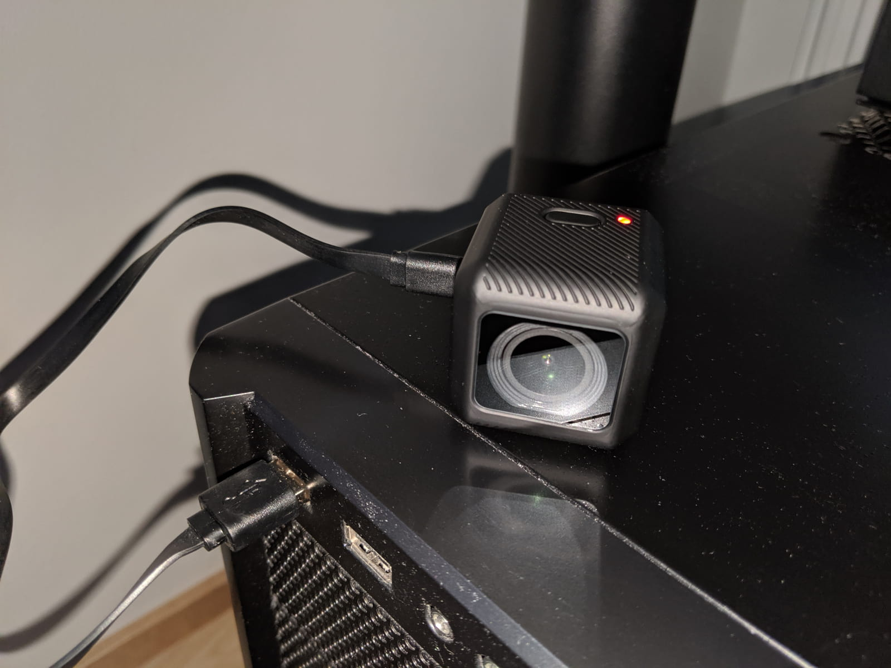

It's finally here! RunCam's latest GoPro competitor camera - the [RunCam 5][1]. In the meantime, GoPro has discountinued the Session 5 - many FPV pilots' favorite camera, leaving people with the option to grab a refurbished one from Ebay, buy used from elsewhere or move on to use a
Hero 6 with a slightly different form factor. In this market, a couple of contenders have risen - amely RunCam and Foxeer.

There are a number of comparison videos on the Internet so feel free to do some more research, but for many reasons I'm very much interested in RunCam's offering. My excitement stems mainly from the fact that RunCam makes cameras especially dedicated for FPV pilots. Furthermore I have been using RunCam's Split cameras for over a year now and I am very pleased with the fpv feed when flying, as well as the 1080p HD video recording.

Overview: So light!

### Table of contents

- [📦 Unboxing](#unboxing)
- [⚙ Setup](#setup)
- [📝 Specs](#specs)
- [🎥 Video samples](#video-samples)
- [🎦 Post processing](#postprocessing)
- [🆚 RunCam Split 2 comparison](#comparison)
- [Conclusion](#conclusion)

### 📦 Unboxing

pictures, description

### 📦 Specifications

### ⚙ Setup

For the complete setup instructions you can always refer to the [RunCam 5 user manual][2].

#### Charge it up

You can charge the RunCam 5 via its micro USB port. The battery is built in and it's not intended to be taken out. Instead, you plug in a micro USB cable and charge the camera that way.

#### Insert an SD card

#### Configure the settings

- via file
- via app

#### Mounting options

### 🎥 Video samples

### 🎦 Postprocessing video files

#### Copying files

#### Stretching from 4:3 to 16:9 (1440p)

### 🆚 RunCam Split 2 comparison

Now this part is a bit far fetched for a number of reasons and is not necessarily very scientific, but I found it interesting nevertheless and wanted to share the findings. We are going to compare the footage from the [RunCam 5][1] with footage from the [RunCam Split 2][3] (this link is for the slightly newer RunCam Split 2S version).

Why is this interesting? I've mentioned a number of times that I personally am a fan of split cameras. In fact, [my raw, unedited, single pack flight footage YouTube channel][4] is full of RunCam Split 2 and RunCam Split Mini videos. There's a lot of convenience in this setup and it works nicely if you need decent, although not the best of the best footage quality.

Here are the caveats:

- I'm using the RunCam Split 2 (the original oldest version), since then a RunCam Split 2S has come out, and it seems like a RunCam Split 3 might be well underway. TODO: check more info

Both comparison videos are using stock camera settings. The RunCam 5 costs $100, the Split 2S costs $80.E

---

The same port can be used to transfer files, if you have plugged it into a computer. To be able to access the SD card contents through the RunCam 5

- how to mount
  mounting bracket

* save and share config image

- distortion correction (almost go pro's super view)
- plus free tool for 1440p stretchin, credit go guy and to JB

### Conclusion

Who is this for?

- GoPro deal in US BestBuy via their warranty policy
- Decent camera for just 100 bucks
- Non hardcore usage? Just good enough

Video comparisons:

**with distortion correction**
1440p 60 fps superview with GO tool

**without distortion correction**
NO DISTORTION CORRECTION
in order of settings:
0000 - 1080p 60fps
0001 - 1080 60 XV
0003 - 1080 120fps
0004 - 1440p 60fps (\* best so far) even better stretched!
0005 - 2,7k 50fps
0006 - 4k 30fps (\* 3rd best so far)
0007 - 4k 30fps XV (\* 2nd best so far)

---

0009 - 2,7k 50 fps (small pack)
0010 - 1080p120 fps (full pack)

TODO: add screenshots of app and of settings file edited

#### Where to get it?

###### RunCam 5 - [Banggood][1]

[0]: Linkslist
[1]: https://bit.ly/runcam--5
[2]: https://www.runcam.com/download/runcam5/RunCam5-Manual-EN.pdf
[3]: https://bit.ly/runcam-split2s
[4]: https://www.youtube.com/channel/UC2gwYMcfb0Oz_fl9W1uTV2Q
