It's finally here! RunCam's latest GoPro competitor camera - the [RunCam 5][1]. In the meantime, GoPro has discountinued the Session 5 - many FPV pilots' favorite camera, leaving people with the option to grab a refurbished one from Ebay, buy used from elsewhere or move on to use a Hero 6 with a slightly different form factor. This is where RunCam's new offering comes in.

There are a number of comparison videos on the Internet so definitely do some more research before you purchase anything, but for many reasons I'm very much interested in the RunCam 5 camera. My excitement stems mainly from the fact that RunCam makes cameras especially dedicated for FPV pilots. Furthermore **I have been using RunCam's Split cameras for over a year now and I am very pleased with the fpv feed when flying, as well as the 1080p HD video recording**.

Is the [RunCam 5][1] a worthy competitor and costing only a \$100 (a fraction of the price of a GoPro camera) is it an option to consider switching to?

Let's find out!

### Table of contents

- [📦 Unboxing](#unboxing)
- [📝 Specs](#specs)
- [⚙ Setup](#setup)
- [🎥 Video samples](#video-samples)
- [🎦 Post processing](#postprocessing)
- [🆚 RunCam Split 2 comparison](#comparison)
- [📑 Conclusion](#conclusion)

### 📦 Unboxing

RunCam's products almost always offer a premium unboxing experience with almost Apple-like quality. This one comes in a solid hard cardboard box with a slide-on top.

Underneath the box you can find a field to scratch off and expose a code for verifying your product.

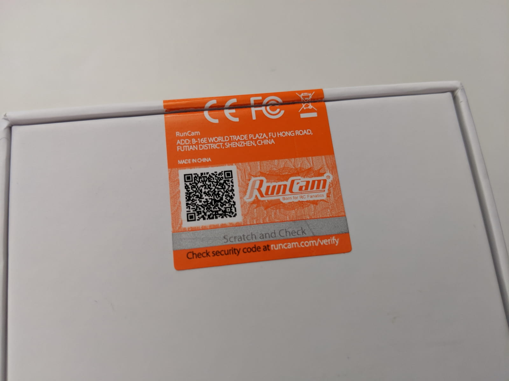

Inside we find the camera sitting in the middle of a bed of a sponge like soft material, wrapped from all sides.

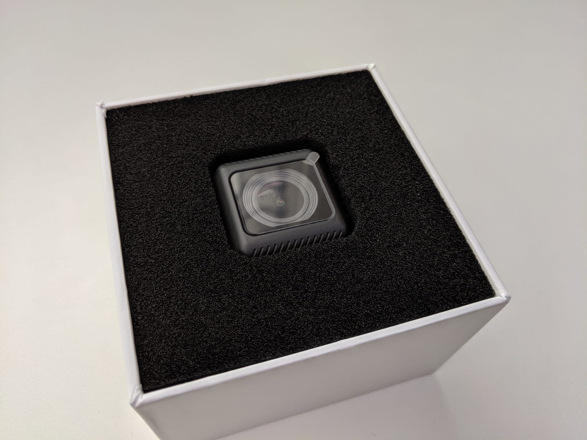

The lense has a protective plastic layer that needs to be peeled off before usage. We also notice a single button on top and an LED.

On the left hand side there is a micro USB port for charging or connecting to a computer for accessing the SD card contents without taking out the SD card.

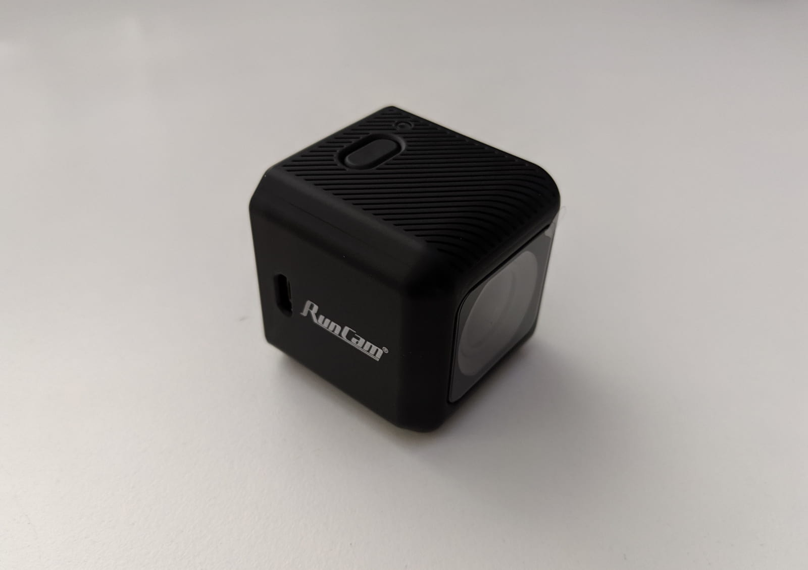

On the right hand side there is a **sliding panel, that when slid open exposes the SD card slot where you can put your memory card**. Slide it shut and your SD card is decently protected from getting lost while you're flying. Above the SD card slot there is a reset button, should you ever need to use it.

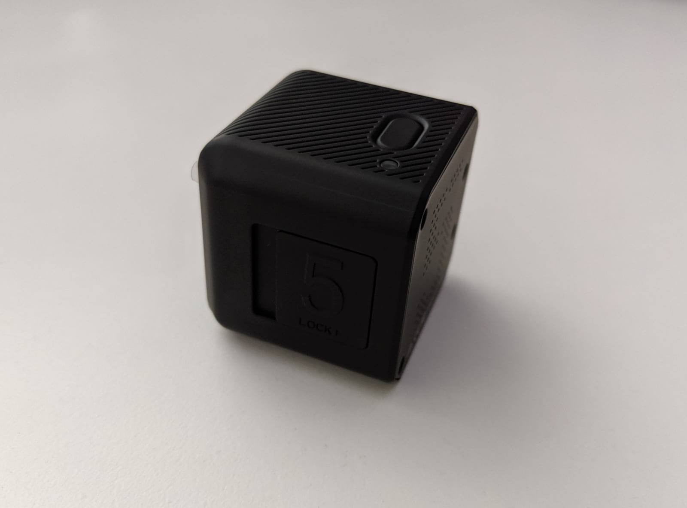

And here's a shot from the back of the camera.

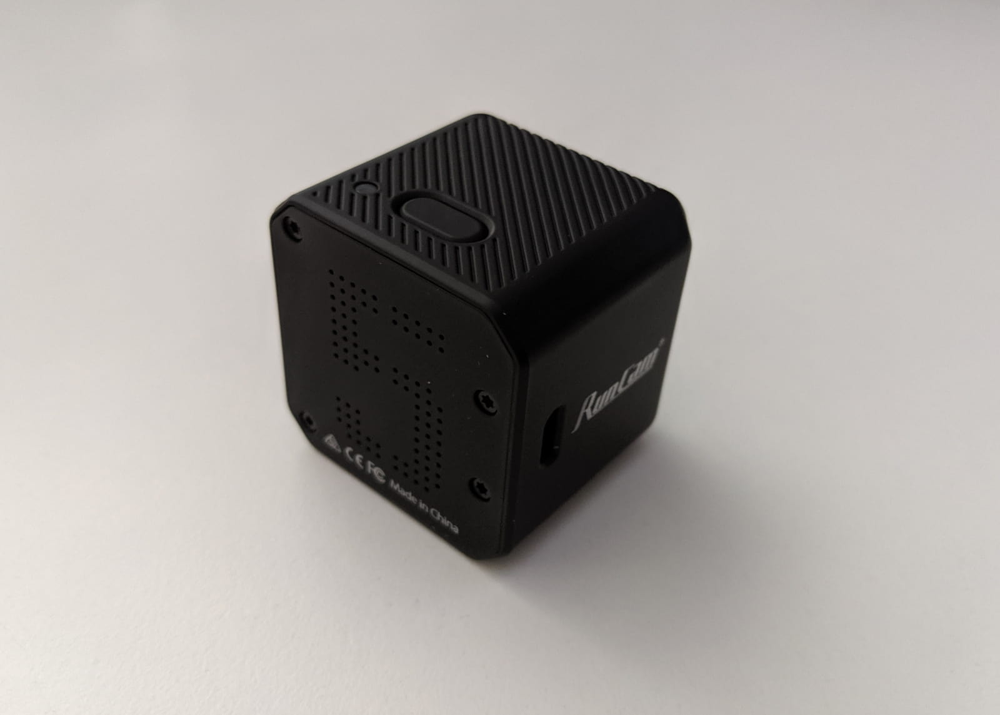

In addition, you get a manual and a small box with a few accesories.

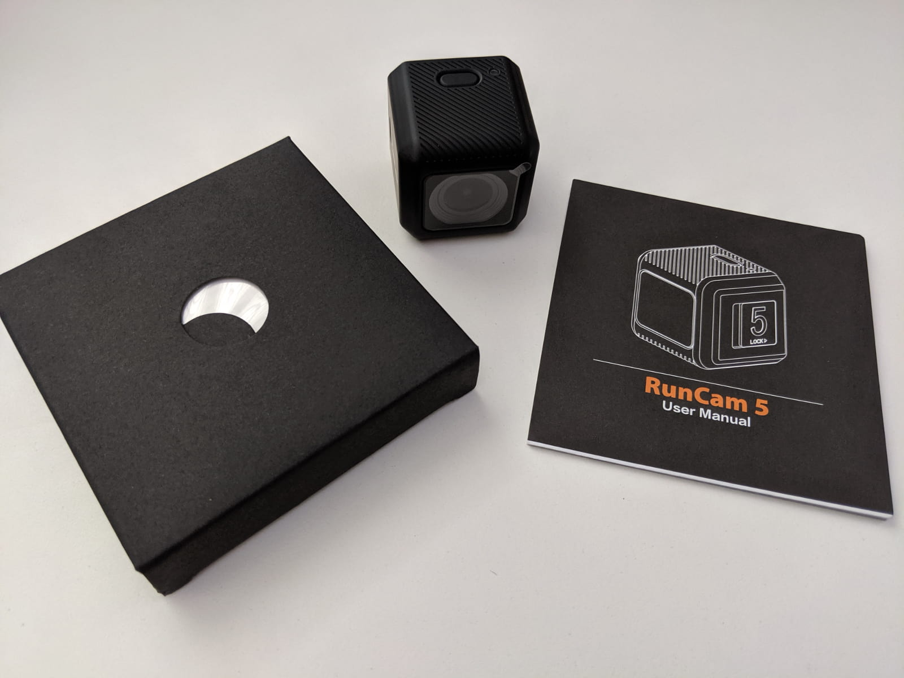

Inside that box we find a USB to micro USB cable for charging and video downloads and two high-quality rubberized velcro straps.

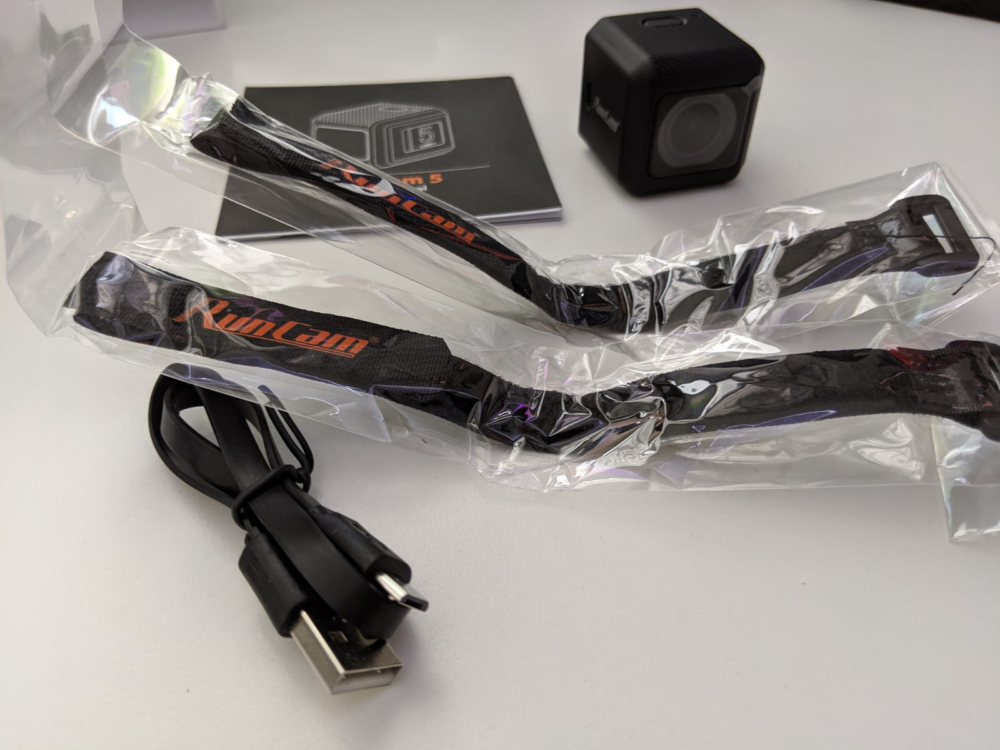

The straps are indeed of decent quality and the rubberized coating definitely helps a ton with gripping tightly around the camera.

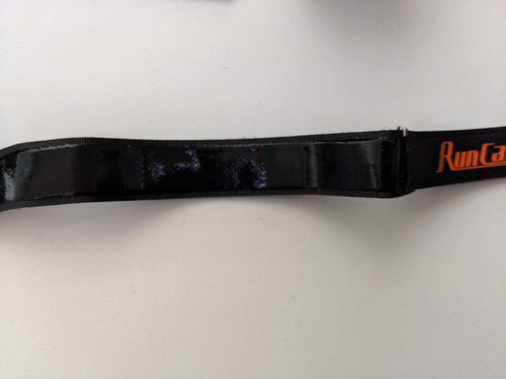

### 📦 Specifications

One of the most outstanding features of the [RunCam 5][1] is its weight! **It's by far one of the (if not THE) lightest camera in its class!** It comes in at just **56 grams**. That's very, very light. In comparison the Hero 5 Session weighs 74 grams. Here are the rest of the technical specifications:

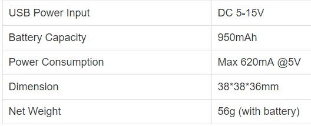

In terms of **dimensions**, they are quite similar to the GoPro Hero Session 5 and that means that the RunCam 5 would fit in all existing TPU mounts. I use [this mount][5] and had no issues, the fit is nice and snug and you can also use one of the provided rubberized velcro straps to hold the camera in place extra tight.

As far as battery capacity goes, **RunCam claim the built-in 960 mAh battery should get you more than 90 minutes of 1080p 60fps recording time, or about 60 minutes of 4k 30fps recording time**. And yes, the battery is irreplaceable, built-in battery. Which might be one of the necessary shortcuts RunCam had to take in order to drive the price of the camera that low. I personally don't mind at all that the battery is built-in.

To charge, use the micro USB port and DC current in the range of 5V - 15V.

Onto the video specs:

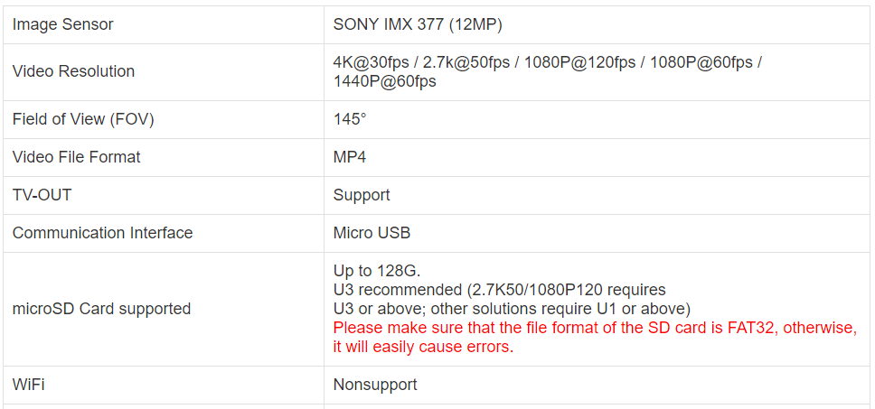

The RunCam 5 has a 12MP Sony sensor with a field of view of 145 degrees. The output is in MP4 format, it supports resolutions from 1080p to 4K which we will dive in deeper in a minute.

Depending on what resolution and framerate video you shoot you will need a U1 or U3 SD card. The supported capacity is up to 128 GB.

The RunCam 5 does not support WiFi connections, so let's look into what does that mean for setting the camera up.

### ⚙ Setup

For the complete setup instructions you can always refer to the [RunCam 5 user manual][2]. Here's a quick breakdown of the camera button's functions:

- **Long press** - will turn the camera on (if off) and will turn it off (if on). This is indicated by a green LED or lack thereof.
- **Short press** - when the camera is on will start recording (indicated by a blinking greed LED). A subsequent short press will stop recording, making the LED solid green.
- **Double press** - when the camera is on will change it to setting mode, ready for reading a QR code (the LED will indicate that by changing to blue).

There are a few things to do to get up and running: **⚡ Charge the camera up**, **📇 Insert a formatted SD card**, **📱 Choose your video settings** and **🏇 Mount it on a drone**.

#### ⚡ Charge it up

You can charge the RunCam 5 via its micro USB port. Plug it into a computer or something and let it be until the LED goes off. That indicates that the battery is full.

#### 📇 Insert an SD card

Insert a high-quality, formatted SD card with decent capacity. We will be writing a lot of data and you need a fast card to do so. Don't underestimate the formatting step, as it can save you from headaches and lost footage issues. If you are unable to format your SD card via a computer, you can do that through the RunCam itself. Get a decent capacity card, I recommend at least 32 GB, but you know yourself better, take what makes sense. **Just note that 4-5 battery packs yield about 6-7 GB of footage easily**.

#### 📱 Configure the settings

I mentioned the camera does not have WiFi connection capability and it does not have Bluetooth either. So how do we change the settings on it? You see, the RunCam 5's config lives in a file on the SD card you plug in, called `CameraConfig.ini`. There are at least two ways to change the configuration. **By changing the values in a config file or by using a QR code to apply the new config**.

- **by updating the config file**

> I don't recommend this approach, although there's certainly nothing wrong with it, it's just that I found using the app easier. Either way, I'll guide you through this way of changing the settings as well.

> First, **connect the camera to a computer via micro USB**. The LED will go red to indicate the camera is charging. Press and hold the button for a couple of settings. This will power on the camera and will mount its SD card into your filesystem so you can access it. The LED will go green to indicate the camera is on (your LED might look even a bit orange if it is still charging).

> Access the `CameraConfig.ini` file on the mounted SD card. Ideally use an editor like [Notepad++][6] or [VS Code][7] to edit the file to avoid issues.

> Here's a short example of how a part of my camera config file looks like:

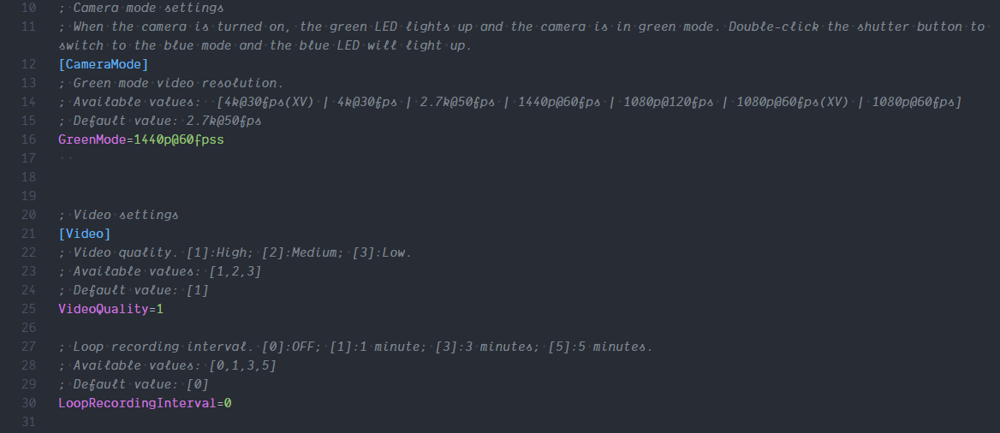

> And here is the [complete configuration I'm currently using](CameraConfig.ini) when shooting with the RunCam 5.

> It might look like a lot at first but in reality, it's quite simple. The lines that start with `;` are comment lines - they are helpful messages for you to understand the functionality and have no programatic meaning. RunCam has listed nicely in those comments the possible options you could change to.

> For example if I wanted to change my `VideoQuality` setting to Low (why would I though), I would just change its value from 1 to 3. That's all there is to it.

> As I mentioned I don't use this approach to change the settings, but one nice thing about this is that it allows you to easily create "profiles" by creating separate complete configuration files and keeping them somewhere in your computer. Then awapping them in as necessary.

- **by using the RunCam app**

> The other way to change the settings is by using the `RunCam App` which you can get on the [Google Play store][8] or [iOS App Store][9].

On the first screen select your product (RunCam 5) and tap the **QR Code Configuration** button.

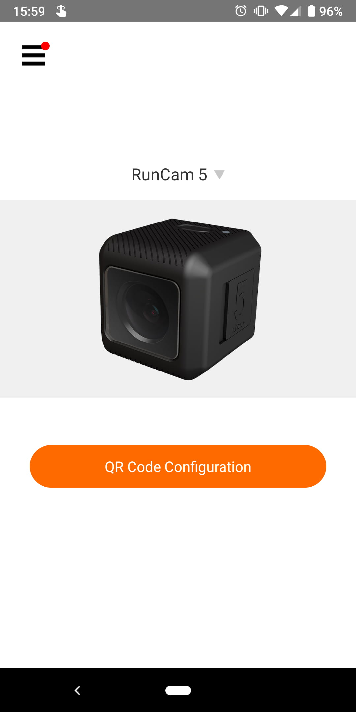

The Video Settings are broken down onto two screens. The first you are presented immediately and is called `Video` as seen in the bottom navigation buttons. The other screen of options is called `General` and you can access it by tapping the corresponding button in the bottom navigation.

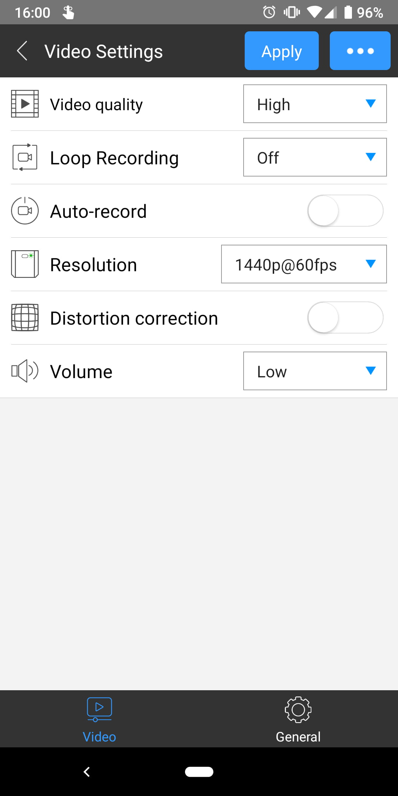

I'm not gonna go in great detail over every single option, in fact I think most of them are very self explanatory. **Video quality** you probably wanna keep at High and have very little reason to use anything else. **Loop recording** would split your video recordings in 3 minute or so chunks of footage. I don't do that; I like starting and stopping my recordings. **Auto record** is something don't use either, I'll get into much more detail about the available resolutions in the next section when we talk about video samples, comparisons and post processing. And **Volume** you probably want to keep at Low as well as that's already pretty loud.

Below is the general screen of video settings. Here you can turn off things like the RunCam logo and Date stamp, you can flip the screen if you have mounted the RunCam 5 upside down. You can adjust a number of sensor settings here such as: **saturation, exposure compensation, contrast, sharpness, white balance**. Do change the **Power supply frequency** from 50Hz to 60Hz if you are living in the US.

For now, I have left everything to their default values for the sake of testing the camera with its out of the box settings.
I will make sure to come back and add an update to this article if I find particular settings that improve the image quality by a lot.

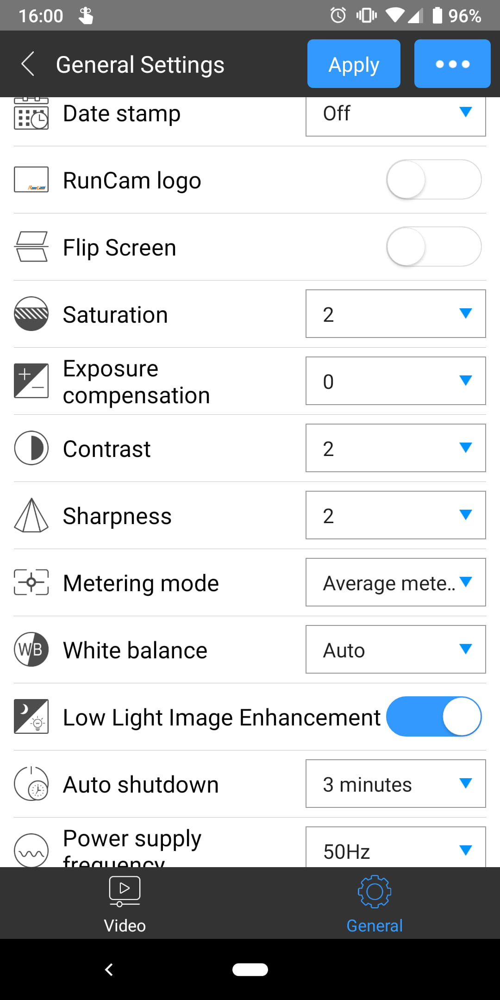

Clicking the three dots at the top right brings up a menu that allows you to restore the default settings or to format the SD card.

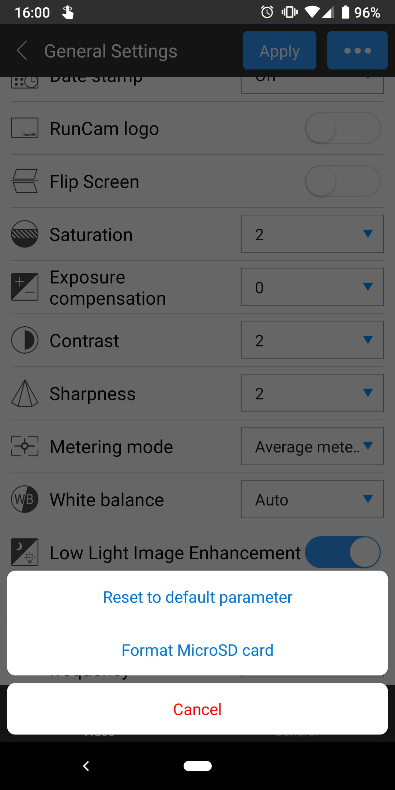

And finally, clicking the `Apply` button brings up a generated QR code that would apply the settings to your camera, when read by it. To do that, power on your camera with a long press of the button. When it's on with a green LED signaling that, **double press** the button (that's two presses in a quick succession). You will know you have done it right if the LED changes to blue, indicating that the camera is in Setting mode and will try to read a QR code if you show it one.

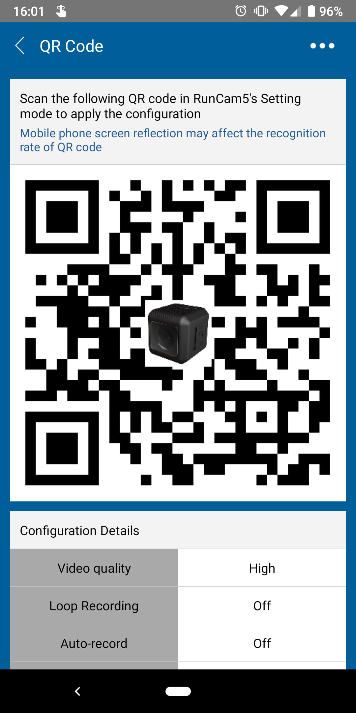

Next show the QR code to the camera by keeping it directly in front of it. If you hear a beep you will know the camera has accepted the new settings and will then transition back to greed mode indicated by its LED.

This may sound somewhat finicky at first, but it's actually very easy and straightforward and dare I say fast to do.

#### 🏇 Mount the RunCam 5 on a quad

Finally, let's mount the camera onto a quad. There are probably many ways to do so, plenty of projects on https://thingiverse.com that you could print, or just [purchase a mount like this one][5] from an online store.

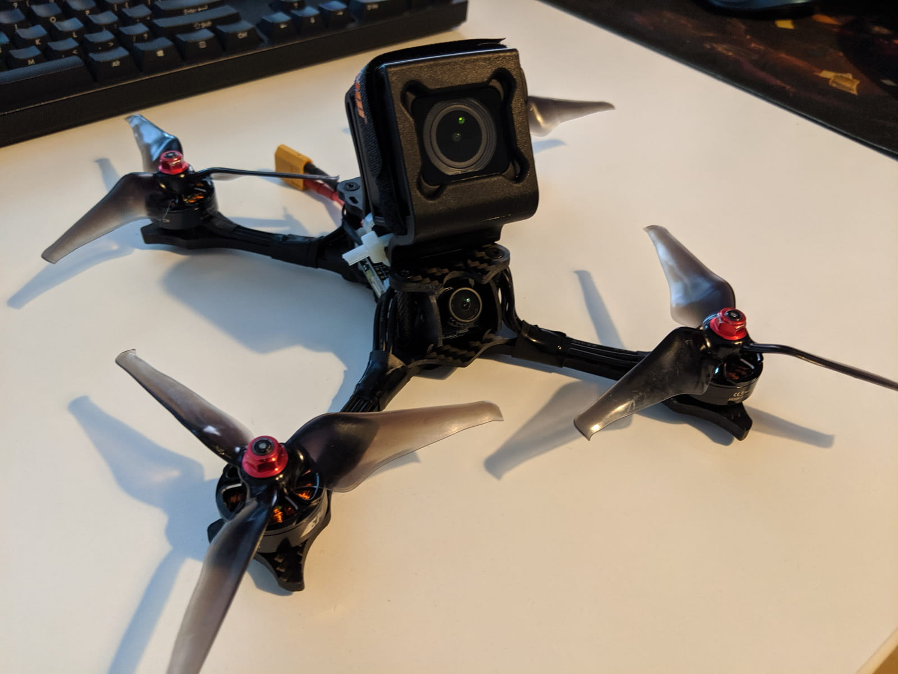

This mount worked pretty good. Attached it with a couple of thicker zip ties and in addition ran around the rubberized velcro strap too.

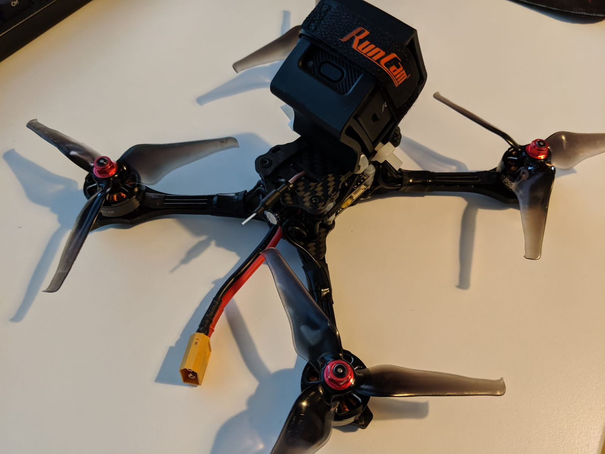

Let's go fly!

### 🎥 Video samples

### 🎦 Postprocessing video files

#### Copying files

#### Stretching from 4:3 to 16:9 (1440p)

### 🆚 RunCam Split 2 comparison

Now this part is a bit far fetched for a number of reasons and is not necessarily very scientific, but I found it interesting nevertheless and wanted to share the findings. We are going to compare the footage from the [RunCam 5][1] with footage from the [RunCam Split 2][3] (this link is for the slightly newer RunCam Split 2S version).

Why is this interesting? I've mentioned a number of times that I personally am a fan of split cameras. In fact, [my raw, unedited, single pack flight footage YouTube channel][4] is full of RunCam Split 2 and RunCam Split Mini videos. There's a lot of convenience in this setup and it works nicely if you need decent, although not the best of the best footage quality.

Here are the caveats:

- I'm using the RunCam Split 2 (the original oldest version), since then a RunCam Split 2S has come out, and it seems like a RunCam Split 3 might be well underway. TODO: check more info

Both comparison videos are using stock camera settings. The RunCam 5 costs $100, the Split 2S costs $80.E

---

The same port can be used to transfer files, if you have plugged it into a computer. To be able to access the SD card contents through the RunCam 5

- how to mount
  mounting bracket

* save and share config image

- distortion correction (almost go pro's super view)
- plus free tool for 1440p stretchin, credit go guy and to JB

### 📑 Conclusion

Who is this for?

- GoPro deal in US BestBuy via their warranty policy
- Decent camera for just 100 bucks
- Non hardcore usage? Just good enough
- Very light, so if weight is an issue, could be worth picking this up

Video comparisons:

**with distortion correction**
1440p 60 fps superview with GO tool

**without distortion correction**
NO DISTORTION CORRECTION
in order of settings:
0000 - 1080p 60fps
0001 - 1080 60 XV
0003 - 1080 120fps
0004 - 1440p 60fps (\* best so far) even better stretched!
0005 - 2,7k 50fps
0006 - 4k 30fps (\* 3rd best so far)
0007 - 4k 30fps XV (\* 2nd best so far)

---

0009 - 2,7k 50 fps (small pack)
0010 - 1080p120 fps (full pack)

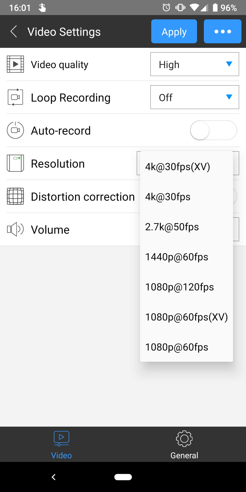

[0]: Linkslist
[1]: https://bit.ly/runcam--5
[2]: https://www.runcam.com/download/runcam5/RunCam5-Manual-EN.pdf
[3]: https://bit.ly/runcam-split2s
[4]: https://www.youtube.com/channel/UC2gwYMcfb0Oz_fl9W1uTV2Q
[5]: https://bit.ly/runcam5-mount
[6]: https://notepad-plus-plus.org/download/v7.7.1.html
[7]: https://code.visualstudio.com/
[8]: https://play.google.com/store/apps/details?id=com.runcam.runcam2
[9]: https://apps.apple.com/us/app/runcam-app/id1015312292
