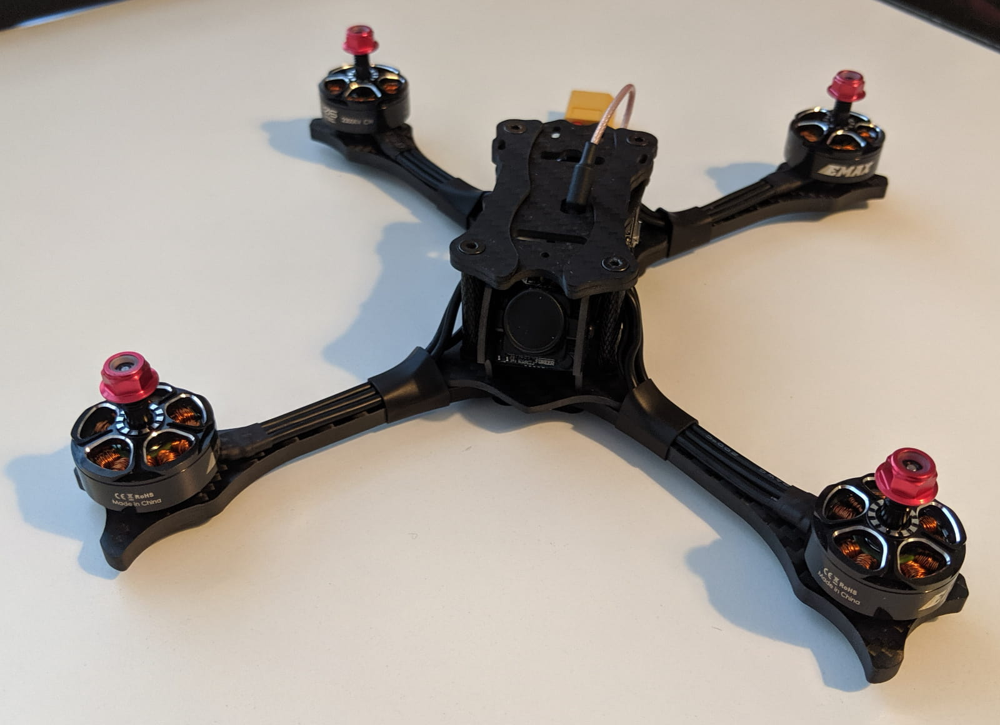
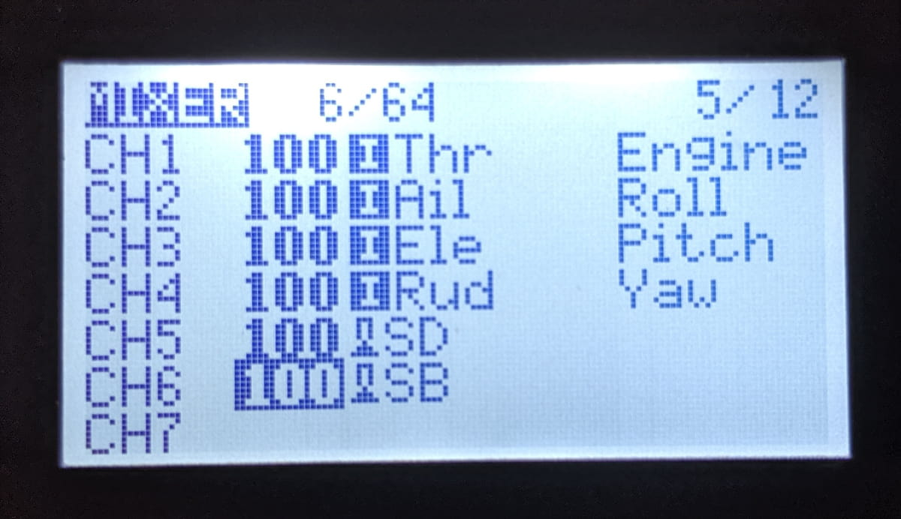
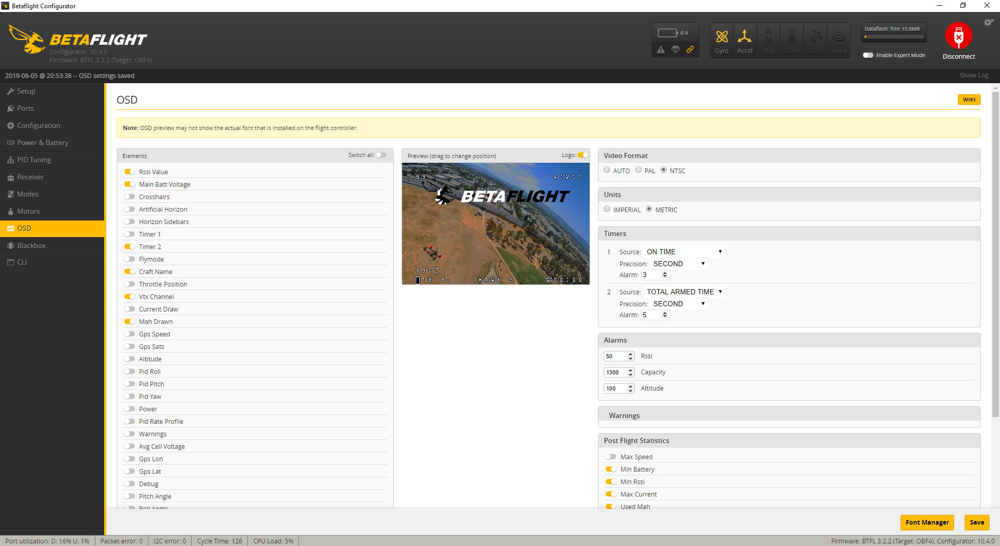

The quickest I have ever gone from opening a box with a prebuilt quad to actually flying it.
Binding it, 3 minutes config on my radio, 3 minutes in Betaflight. Putting props on took more time than that 😅.

## Unboxing

## Quick setup

### Binding

- Taking off the top plate.
-

### Radio Setup

- Create 3 extra switches: arm, modes, buzzer
- Adjust outputs

### VTX Setup

- Press and hold for 10 seconds to switch between 25mW and 200mW

### Betaflight Setup

- Setup modes based on switches at AUX1, AUX2, AUX3

- Check configuration tab for SBUS (FrSky); BONUS: configure RSSI on channel 12

- Test motors spin direction

- Configure OSD

## Fly

DVR with 4S 1300mah
DVR 4S 1500mah

https://www.youtube.com/watch?v=EHGsctmuK5E
https://www.youtube.com/watch?v=TrDwLlx1DGA
https://www.youtube.com/watch?v=E-O2FAFXRC4
https://www.youtube.com/watch?v=WDDIkdS-HBA
https://www.youtube.com/watch?v=2jHrFx6P_iI

[0]: Linkslist
[1]: https://bit.ly/emax-hawk-5
[2]: https://amzn.to/2Wq1KJ6
