It's finally here! RunCam's latest GoPro competitor camera - the [RunCam 5][1]. In the meantime, GoPro has discontinued the Session 5 - many FPV pilots' favorite camera, leaving people with the option to grab a refurbished one from eBay, buy used from elsewhere or move on to use a Hero 6 with a slightly different form factor. This is where RunCam's new offering comes in.

I'm very interested in the RunCam 5 camera. My excitement stems mainly from the fact that RunCam specializes in making FPV cameras and does that exceptionally well. Furthermore **I have been using RunCam's Split cameras for over a year now and I am very pleased with the fpv feed when flying, as well as the 1080p HD video recording**.

Is the [RunCam 5][1] a worthy competitor and costing only a \$100 (a fraction of the price of a GoPro camera) is it an option to consider switching to?

Let's find out!

### Table of contents

- [📦 Unboxing](#unboxing)
- [📝 Specs](#specs)
- [⚙ Setup](#setup)
- [🎥 Video samples](#video-samples)
- [🎦 Post-processing](#post-processing)
- [🆚 RunCam Split 2 comparison](#comparison)
- [📑 Conclusion](#conclusion)

If you prefer watching, check out the full video review on my YouTube channel:

<div style="text-align: center">
  <iframe width="560" height="315" src="https://www.youtube.com/embed/fvExmj3n4rU?rel=0" frameBorder="0" allowFullScreen title="RunCam review on FPVtips on YouTube"></iframe>
</div>

### 📦 <span id="unboxing">Unboxing</span>

RunCam's products almost always offer a premium unboxing experience with almost Apple-like quality. This one comes in a solid hard cardboard box with a slide-on top.


Underneath the box, you can find a field to scratch off and expose a code for verifying your product.

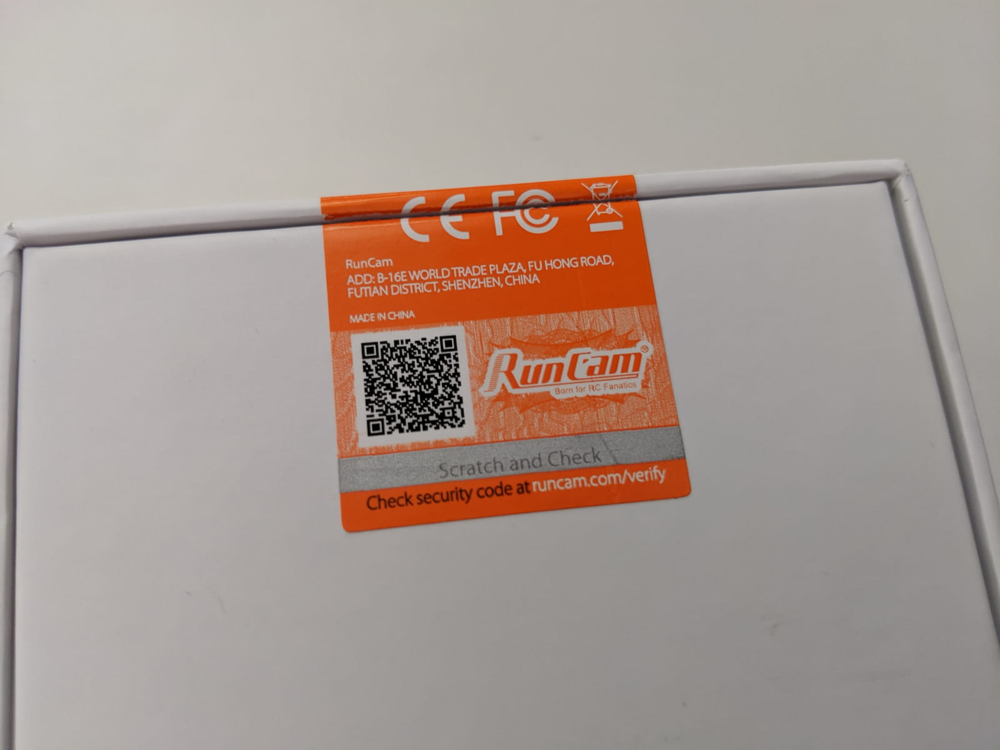

Inside we find the camera sitting in the middle of a bed of sponge-like soft material, wrapped from all sides.


The lens has a protective plastic layer that needs to be peeled off before usage. We also notice a single button on top and an LED.

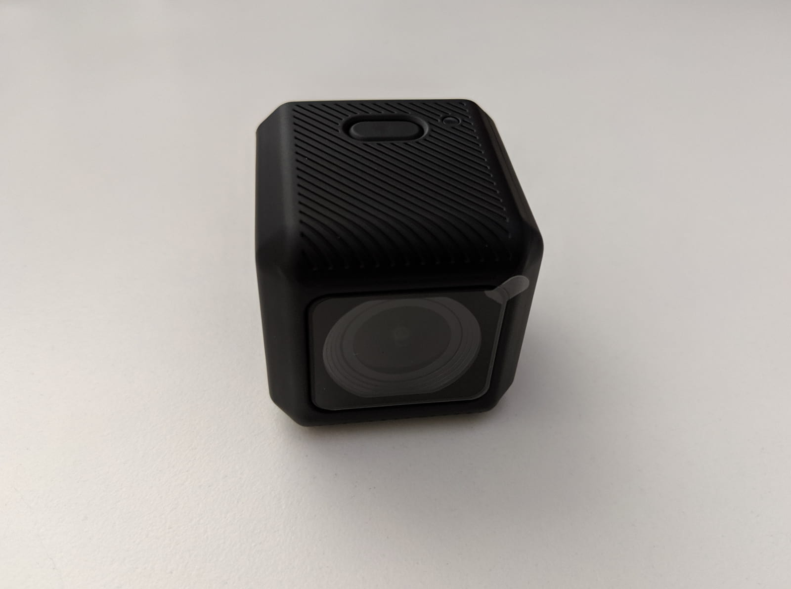

On the left-hand side, there is a micro USB port for charging or connecting to a computer for accessing the SD card contents without taking out the SD card.

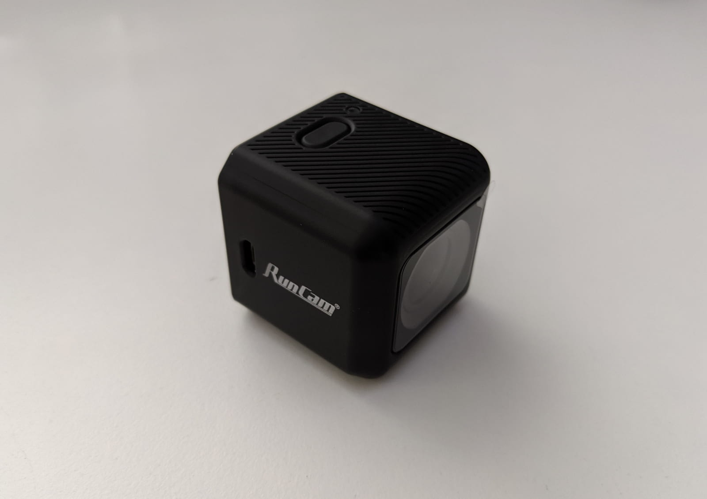

On the right-hand side, there is a **sliding panel, that when slid open exposes the SD card slot where you can put your memory card**. Slide it shut and your SD card is decently protected from getting lost while you're flying. Above the SD card slot there is a reset button, should you ever need to use it.


And here's a shot from the back of the camera.

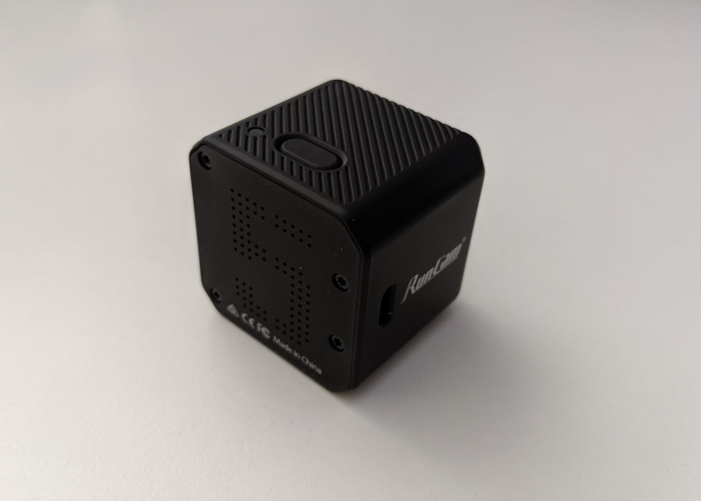

In addition, you get a manual and a small box with a few accessories.


Inside that box, we find a USB to micro USB cable for charging and video downloads and two high-quality rubberized velcro straps.


The straps are indeed of decent quality and the rubberized coating definitely helps a ton with gripping tightly around the camera.

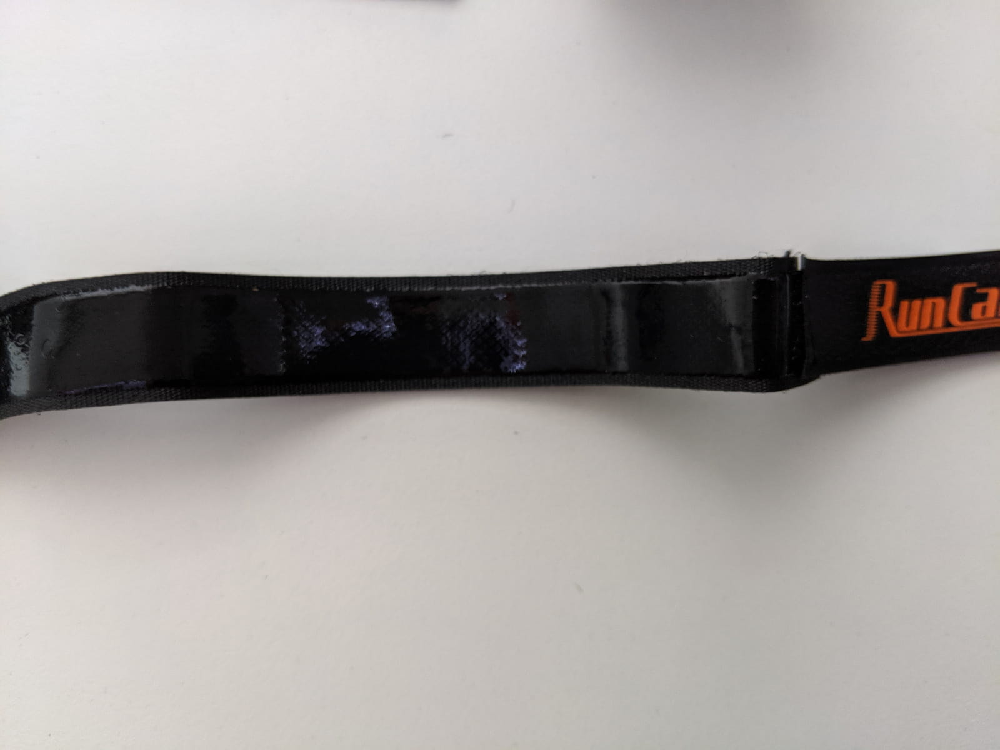

### 📝 <span id="specs" class="offset-top-nav">Specifications</span>

One of the most outstanding features of the [RunCam 5][1] is its weight! **It's by far one of the (if not THE) lightest cameras in its class!** It comes in at just **56 grams**. That's very, very light. In comparison, the Hero 5 Session weighs 74 grams. Here are the rest of the technical specifications:


In terms of **dimensions**, they are quite similar to the GoPro Hero Session 5 and that means that the RunCam 5 would fit in all existing TPU mounts. I use [this mount][5] and had no issues, the fit is nice and snug and you can also use one of the provided rubberized velcro straps to hold the camera in place extra tight.

As far as battery capacity goes, **RunCam claims the built-in 960 mAh battery should get you more than 90 minutes of 1080p 60fps recording time, or about 60 minutes of 4k 30fps recording time**. And yes, the battery is irreplaceable, built-in battery. Which might be one of the necessary shortcuts RunCam had to take in order to drive the price of the camera that low. I personally don't mind at all that the battery is built-in.

To charge, use the micro USB port and DC current in the range of 5V - 15V.

Onto the video specs:

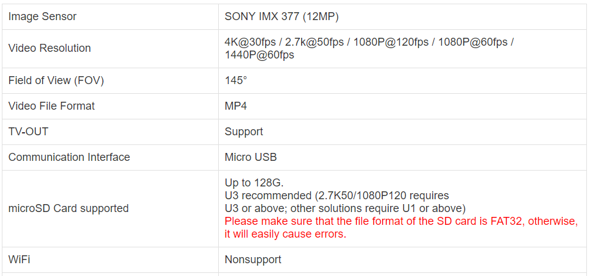

The RunCam 5 has a 12MP Sony sensor with a field of view of 145 degrees. The video output is in MP4 format, it supports resolutions from 1080p to 4K which we will dive in deeper in a minute.

Depending on what resolution and framerate video you shoot you will need a U1 or U3 SD card. The supported capacity is up to 128 GB.

The RunCam 5 does not support WiFi connections, so let's look into what does that mean for setting the camera up.

### ⚙ <span id="setup" class="offset-top-nav">Setup</span>

For the complete setup instructions, you can always refer to the [RunCam 5 user manual][2]. Here's a quick breakdown of the camera button's functions:

- **Long press** - will turn the camera on (if off) and will turn it off (if on). This is indicated by a green LED or lack thereof.
- **Short press** - when the camera is on will start recording (indicated by blinking greed LED). A subsequent short press will stop recording, making the LED solid green.
- **Double press** - when the camera is on will change it to setting mode, ready for reading a QR code (the LED will indicate that by changing to blue).

There are a few things to do to get up and running: **⚡ Charge the camera up**, **📇 Insert a formatted SD card**, **📱 Choose your video settings** and **🏇 Mount it on a drone**.

#### ⚡ Charge it up

You can charge the RunCam 5 via its micro USB port. Plug it into a computer or something and let it be until the LED goes off. That indicates that the battery is full.

#### 📇 Insert an SD card

Insert a high-quality, formatted SD card with decent capacity. We will be writing a lot of data and you need a fast card to do so. Don't underestimate the formatting step, as it can save you from headaches and lost footage issues. If you are unable to format your SD card via a computer, you can do that through the RunCam itself. Get a decent capacity card, I recommend at least 32 GB, but you know yourself better, take what makes sense. **Just note that 4-5 battery packs yield about 6-7 GB of footage easily**.

#### 📱 Configure the settings

I mentioned the camera does not have WiFi connection capability and it does not have Bluetooth either. So how do we change the settings on it? You see, the RunCam 5's config lives in a file on the SD card, called `CameraConfig.ini`. There are at least two ways to change the configuration. **By changing the values in a config file or by using a QR code to apply the new config**.

- **by updating the config file**

> I don't recommend this approach, although there's certainly nothing wrong with it, it's just that I found using the app easier. Either way, I'll guide you through this way of changing the settings as well.

> First, **connect the camera to a computer via micro USB**. The LED will go red to indicate the camera is charging. Press and hold the button for a couple of settings. This will power on the camera and will mount its SD card into your filesystem so you can access it. The LED will go green to indicate the camera is on (your LED might look even a bit orange if it is still charging).

> Access the `CameraConfig.ini` file on the mounted SD card. Ideally, use an editor like [Notepad++][6] or [VS Code][7] to edit the file to avoid issues.

> Here's a short example of how a part of my camera config file looks like:

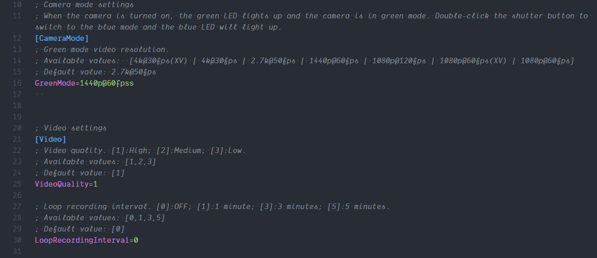

> And here is the [complete configuration I'm currently using](CameraConfig.ini) when shooting with the RunCam 5.

> It might look like a lot at first but in reality, it's quite simple. The lines that start with `;` are comment lines - they are helpful messages for you to understand the functionality and have no programmatic meaning. RunCam has listed nicely in those comments all the possible options for a particular setting, as well as its default value.

> For example if I wanted to change my `VideoQuality` setting to Low (why would I though), I would just change its value from 1 to 3. That's all there is to it.

> As I mentioned I don't use this approach to change the settings, but one nice thing about this is that it allows you to easily create "profiles" by creating separate complete configuration files and keeping them somewhere in your computer. Then swap them in as necessary.

- **by using the RunCam app**

> The other way to change the settings is by using the `RunCam App` which you can get on the [Google Play store][8] or [iOS App Store][9].

On the first screen select your product (RunCam 5) and tap the **QR Code Configuration** button.

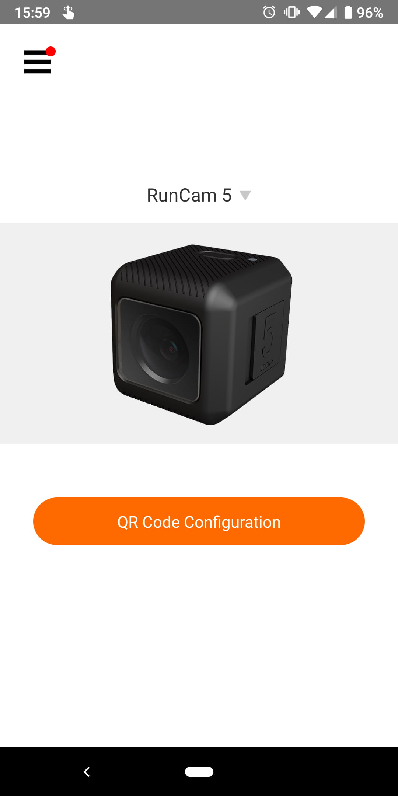

The Video Settings are broken down onto two screens. The first you are presented immediately and is called `Video` as seen in the bottom navigation buttons. The other screen of options is called `General` and you can access it by tapping the corresponding button in the bottom navigation.

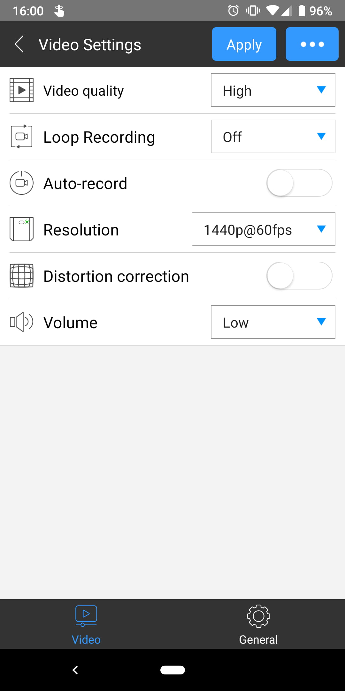

I'm not gonna go in great detail over every single option, in fact, I think most of them are very self-explanatory. **Video quality** you probably wanna keep at High and have very little reason to use anything else. **Loop recording** would split your video recordings in 3 minute or so chunks of footage. I don't do that. I like starting and stopping my recordings. **Auto record** is something I don't use either. I'll get into much more detail about the available resolutions in the next section when we talk about video samples, comparisons, and post-processing. And **Volume** you probably want to keep at Low as well as that's already pretty loud.

Below is the general screen of video settings. Here you can turn off things like the **RunCam logo** and **Date stamp**, you can **flip the screen** if you have mounted the RunCam 5 upside down. You can adjust a number of sensor settings here such as **saturation, exposure compensation, contrast, sharpness, white balance**. Do change the **Power supply frequency** from 50Hz to 60Hz if you live in the USA.

For now, I have left everything to their default values for the sake of testing the camera with it's out of the box settings.
I will make sure to come back and add an update to this article if I find particular settings that improve the image quality by a lot (subscribe to the blog using the form at the end to keep up with updates).

### <span id="new-settings" class="offset-top-nav">Update: August 2019</span>

I have now played a bunch with the different settings on the RunCam. Here's what I find to work:

`Contrast=1` (Down from the default 2)
`Sharpness=1` (Down from the default 2)
`White balance` - set to the current conditions instead of auto.

Here's a comparison video I put together that compares the default settings versus the ones I mentioned above.

<div style="text-align: center">
  <iframe width="560" height="315" src="https://www.youtube.com/embed/yE98RnLp_Lg?rel=0" frameBorder="0" allowFullScreen title="RunCam 5 comparison of default versus new settings"></iframe>
</div>

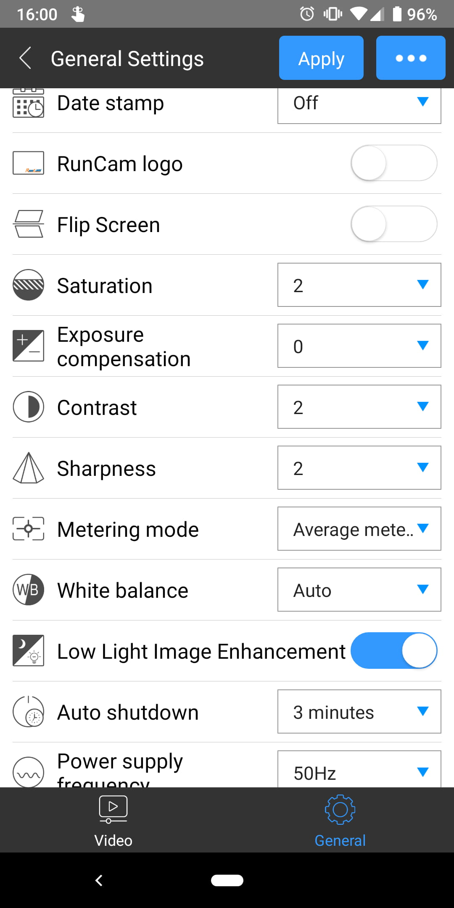

Clicking the three dots at the top right brings up a menu that allows you to restore the default settings or to format the SD card.

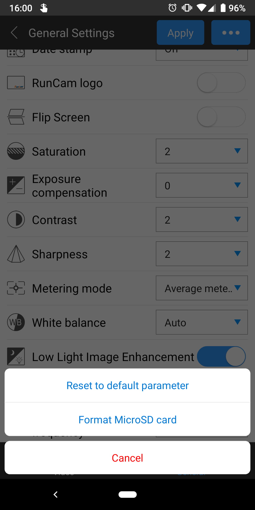

And finally, clicking the `Apply` button brings up a generated QR code that would apply the settings to your camera, when read by it. To do that, power on your camera with a long press of the button. When the camera is on and the LED is solid green **double press** the button (that's two presses in quick succession). You will know you have done it right if the LED changes to blue, indicating that the camera is in Setting mode and will try to read a QR code if you show it one.

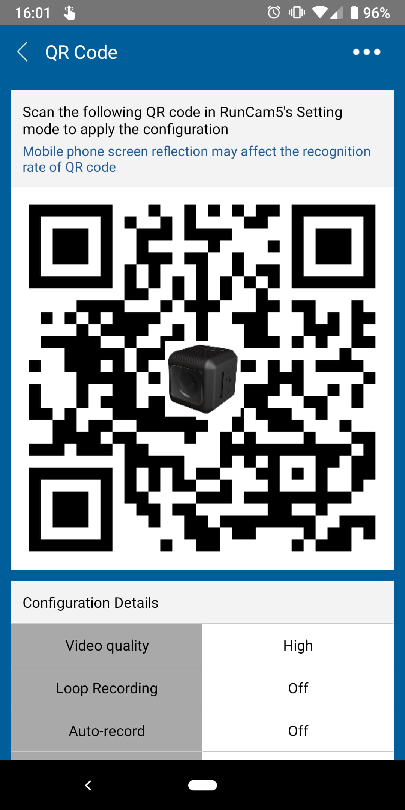

Next show the QR code to the camera by keeping it directly in front of it. If you hear a beep you will know the camera has accepted the new settings and it will then transition back to greed mode indicated by its LED.

This may sound somewhat finicky at first, but it's actually very easy and straightforward and dare I say fast to do.

I did my tests on a Pixel 3 phone and had no issues with the camera reading the code. The app will automatically increase the brightess of your phone's screen while displaying the QR code. If brightness is an issue for you, you can also print out the QR code on a piece of paper and use that instead.

#### 🏇 Mount the RunCam 5 on a quad

Finally, let's mount the camera onto a quad. There are probably many ways to do so, plenty of projects on https://thingiverse.com that you could print, or just [purchase a mount like this one][5] from an online store.


This mount worked pretty well. Attached it with a couple of thicker zip ties and in addition, ran around the rubberized velcro strap too.

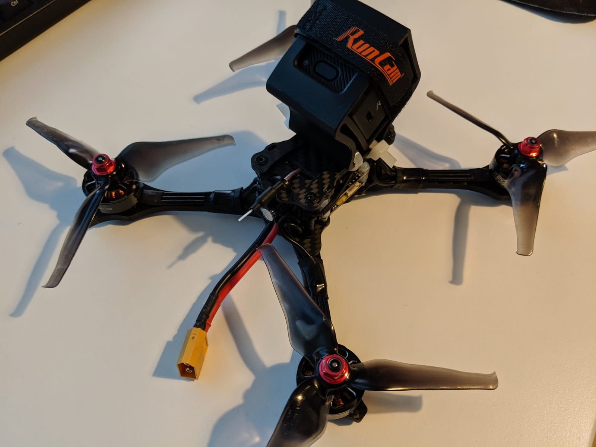

Let's go fly! Here's some example flight footage with the default settings, except for being recorded in 1440p 60fps and stretched from its 4:3 ratio to a 16:9.

<div style="text-align: center">
  <iframe width="560" height="315" src="https://www.youtube.com/embed/RMMOBtqfAi0?rel=0" frameBorder="0" allowFullScreen title="Emax Hawk 5 flying with a RunCam 5 1440p 60fps video"></iframe>
</div>

Onto more video samples for science!

### 🎥 <span id="video-samples" class="offset-top-nav">Video samples</span>

The RunCam 5 offers you the following 7 resolution and framerate variants:

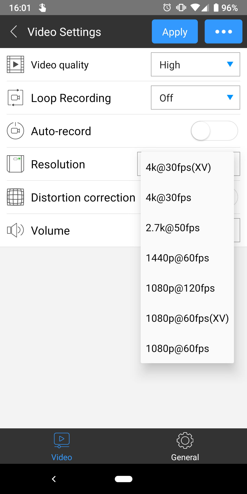

So I went ahead and **recorded a sample 1 min clip of me doing the same thing 7 times each time with a different resolution** selected. I think this playlist allows for somewhat decently quick comparison of all different possible resolutions.

> _All clips were recorded on the same day, in sunny, but late evening daylight conditions, flying against and away from the sun to really put the camera to the test. All clips were recorded using the default camera settings, the only thing changed between flights being the resolution. There was no post-processing of the clips, except whatever compression YouTube applies to videos. You will notice that the available resolution options are 7 and the clips in the playlist are 8. That's because **clip #5 in the playlist demonstrates how dynamic stretched 1440p video looks**. The other caveat is that you cannot really preview the full 120fps on video #2 as YouTube only supports up to 60fps._

Check out all the different samples. To show the playlist click the playlist button at the top right of the video player.

<div style="text-align: center">
  <iframe width="560" height="315" src="https://www.youtube.com/embed/FtngCmiQQoE?rel=0&list=PLLsZew4NRcdcroePNThuW-2bBq8Xoze7S" frameBorder="0" allowFullScreen title="RunCam 5 sample videos with all different resolutions"></iframe>
</div>

Here's the thing about FPV videos. You are the judge of what you prefer watching and how you would like to express yourself in the videos you make. For instance, to me, it's more important to have the video with buttery smooth 60fps than to have a 4k resolution. In fact, I don't think there even is a need for 4k. 2.7k at 60fps would be awesome, but alas, the RunCam 5 records 2.7k at up to 50fps. It's not the end of the world, but it sure is not 60fps.

**Since I got the RunCam 5 I've recorded a bunch of videos, and I have come up to use mostly the largest possible 60 fps option - 1440p.** And I didn't very much like the linear stretch of the `XV` resolution options. What that does is basically stretch the entire image.

And this brings us naturally to the video post-processing part.

### 🎦 <span id="post-processing" class="offset-top-nav">Post-processing video files</span>

Video processing is not among my strongest knowledge points, I definitely have a lot more to learn and that's the reason why I really enjoy the dynamic stretch solution I'm about to show you.

#### Dynamic Stretching of 1440p from 4:3 to 16:9 ration

I'm just sharing what I learned, but I really feel I need to give all the credit possible to [Joshua Bardwell][10] for sharing about the tool to stretch videos. The tool in question is called `superview` and lives in [this open-source repository][11] on GitHub. Follow the requirements and installation instructions on that page. You want to do two things - download and add `FFmpeg` to your path (there's a link in the readme file in the repository) and grab a copy of the superview binary for your operating system from the [releases page][12].

Once you have those, the way to use the binary is as follow from a command line:

```sh
./superview.exe -i RC_0001_1234.MP4 -o RC_0001.MP4
```

What did we do here? First, we type in the filename of the executable we want to run - `superview` (in this case I'm using a Windows machine, hence the `.exe`). Next, we have to provide an input filename after the `-i` flag. This is our original 1440p 4:3 input file. The `-o` flag points to output, after which you need to provide a name for the output (different than the original and don't forget to add the `.MP4` file extension). This example assumes the superview executable and the file you are transforming are in the same directory, as well as you have FFmpeg in the path.

Let me know if something is not working for you or you have questions by using the **Ask a question** button below the article.

Why this dynamic stretching is better than linear stretching is because it tries to keep the center of the video as unstreteched as possible, but stretching mostly the sides and then progressively reducing the amount of stretch towards the middle. I think it looks much better than just linear stretch.

### 🆚 <span id="comparison" class="offset-top-nav">RunCam 5 vs RunCam Split 2 comparison</span>

Now, this part is a bit far fetched for a number of reasons and is not necessarily very scientific, but I found it interesting nevertheless and wanted to share the findings. We are going to compare the footage from the [RunCam 5][1] with footage from the [RunCam Split 2][3] (this link is for the slightly newer RunCam Split 2S version).

Why is this interesting? I've mentioned a number of times that I personally am a fan of split cameras. In fact, [my raw, unedited, single pack flight footage YouTube channel][4] is full of RunCam Split 2, RunCam Split Mini and Caddx Turtle V2 videos. There's a lot of convenience in this setup and it works nicely if you need decent, although not the best of the best footage quality.

Here are some things to keep in mind:

- I'm using the RunCam Split 2 (the original oldest version), since then a RunCam Split 2S has come out, and it seems like a RunCam Split 3 might be underway (I know nothing, just guessing).
- Both comparison videos are using stock camera settings.
- The RunCam 5 costs $100, the Split 2S costs $80. However, $20-$30 of those $80 can be considered as the money you would anyway need to spend on an FPV camera for flying, so the actual money comparison is more like $100 vs \$50.
- You will see the props and the stand-off or parts of the frame through the fpv camera, and you would not see those through the RunCam 5.

<div style="text-align: center">
  <iframe width="560" height="315" src="https://www.youtube.com/embed/R_31tQNzBpA?rel=0" frameBorder="0" allowFullScreen title="RunCam 5 vs RunCam Split 2 raw video and audio comparison"></iframe>
</div>

### 📑 <span id="conclusion" class="offset-top-nav">Conclusion</span>

Ok, so who is this NOT for? If you really want, need and must have the best of the best footage quality AND have a lot of money, then the answer is probably still GoPro (although that gap is closing very fast and is starting to be less and less of a factor).

If you live in the States and can make use of BestBuy's return policy, then again GoPro is still the answer, as you can then easily turn in your broken GoPro and replace it for a fraction of its price.

But if you are anywhere else (like me), if you want very crisp HD footage for a fraction of the price of a GoPro, then the [RunCam 5][1] might be for you. If you don't fly a hell of a lot of concrete or asphalt, and mostly do grassy or dirt areas, chances are your crashes might not be as devastating and the RunCam 5 might survive longer.

I personally am very happy with the quality of the footage that comes out of the RunCam 5, especially the 1440p stretched one, still at 60 fps. And for just \$100 the initial investment is really not that significant. **Basically, you get 90% of a GoPro for 33% of its price.** That's my personal opinion and I love what the RunCam 5 brings to the table! And most of all, at this price point I'm sure it's going to make taking high-quality HD footage accessible for many more people.

Happy flying!

If you are still with me, thanks for reading all of that. I tried to make it interesting and useful to you. If you are considering purchasing the RunCam 5, or anything else really, I'd like to remind you that if you use the links in this blog to Banggood, you would also support the blog and I would really appreciate that. Thanks!

[0]: Linkslist
[1]: https://bit.ly/runcam--5
[2]: https://www.runcam.com/download/runcam5/RunCam5-Manual-EN.pdf
[3]: https://bit.ly/runcam-split2s
[4]: https://www.youtube.com/channel/UC2gwYMcfb0Oz_fl9W1uTV2Q
[5]: https://bit.ly/runcam5-mount
[6]: https://notepad-plus-plus.org/download/v7.7.1.html
[7]: https://code.visualstudio.com/
[8]: https://play.google.com/store/apps/details?id=com.runcam.runcam2
[9]: https://apps.apple.com/us/app/runcam-app/id1015312292
[10]: https://www.youtube.com/user/loraan/videos
[11]: https://github.com/Niek/superview
[12]: https://github.com/Niek/superview/releases
