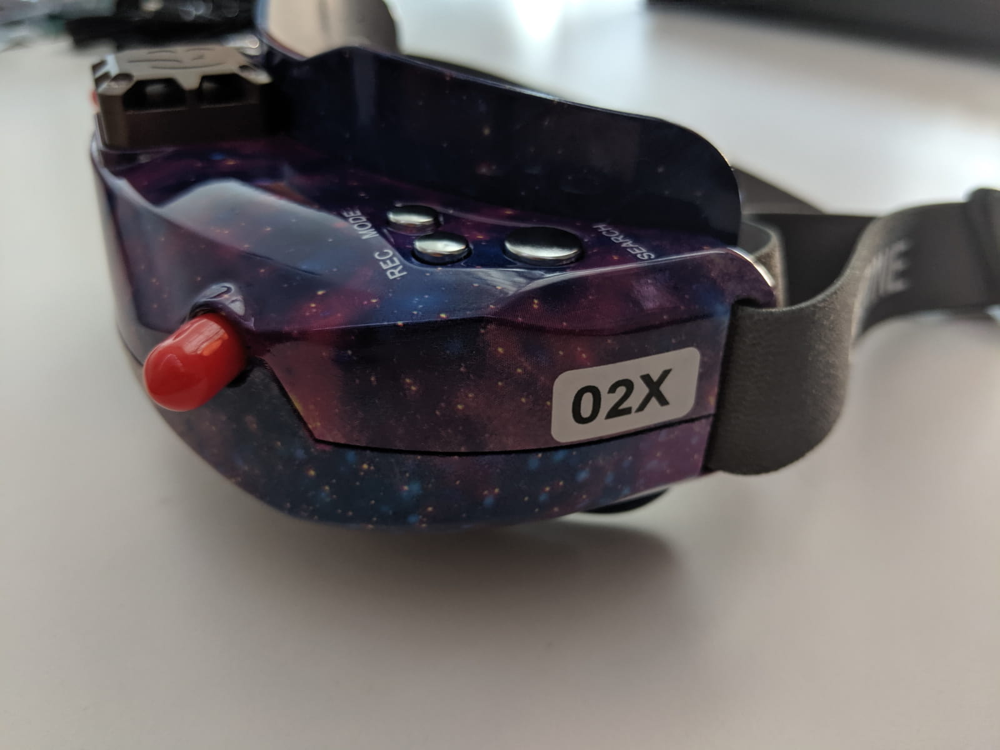

TODO: Intro

### Table of contents

- [📦 Unboxing](#unboxing)
- [📝 Specs](#specs)
- [⚙ Setup](#setup)
- [📑 Conclusion](#conclusion)

### 📦 Unboxing

### 📠Specifications

### ⚙ Setup

- Remove faceplace in order to take out the plastic diopters.
- Install the foam

### 📑 Conclusion

[0]: Linkslist
[1]: asd
