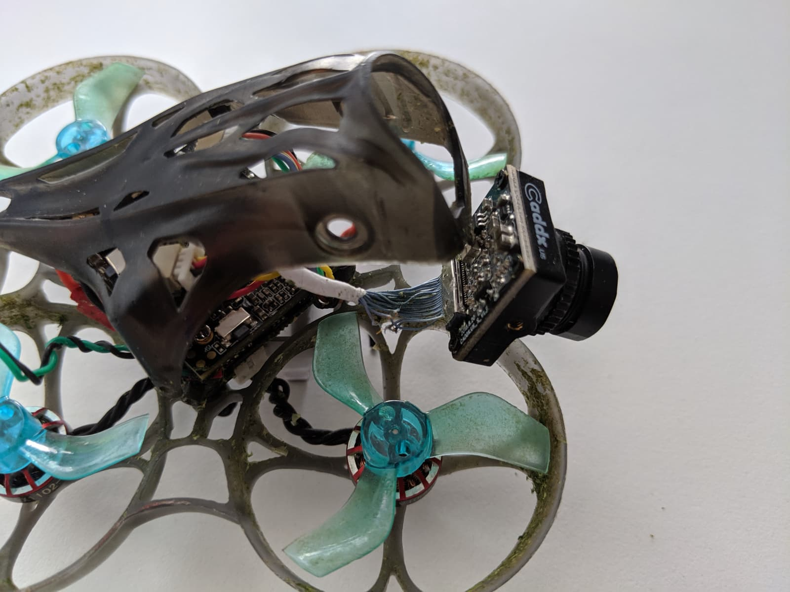
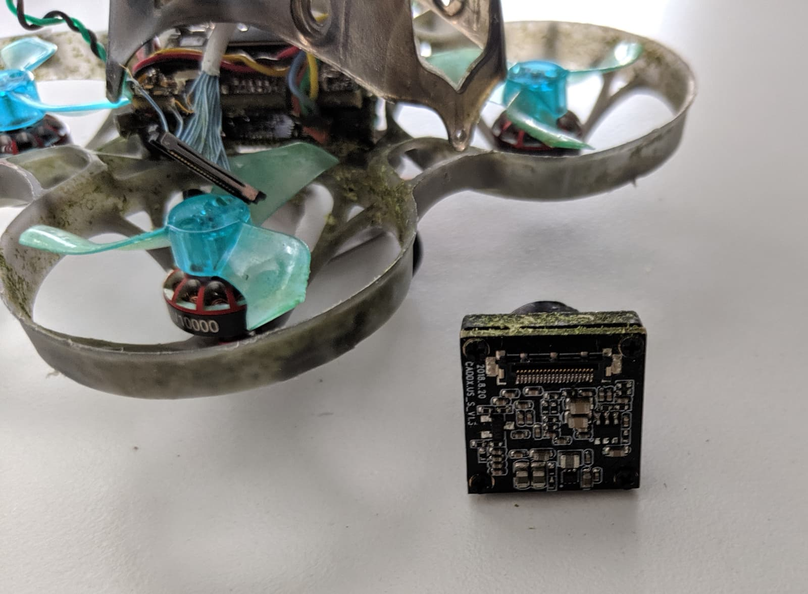
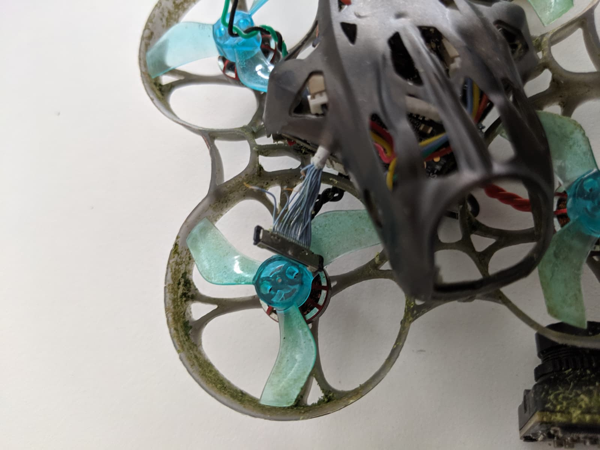
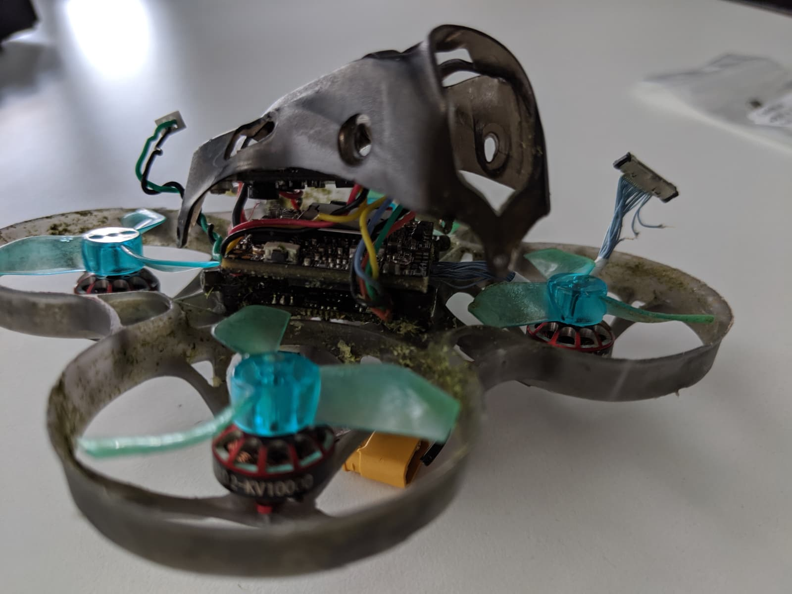
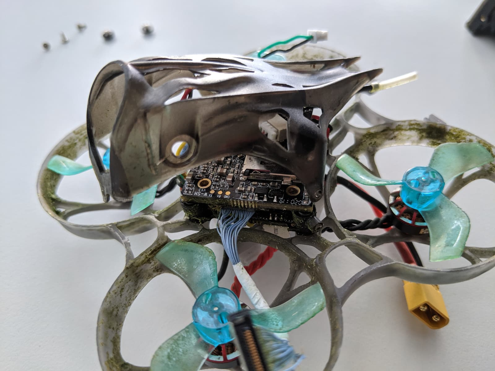
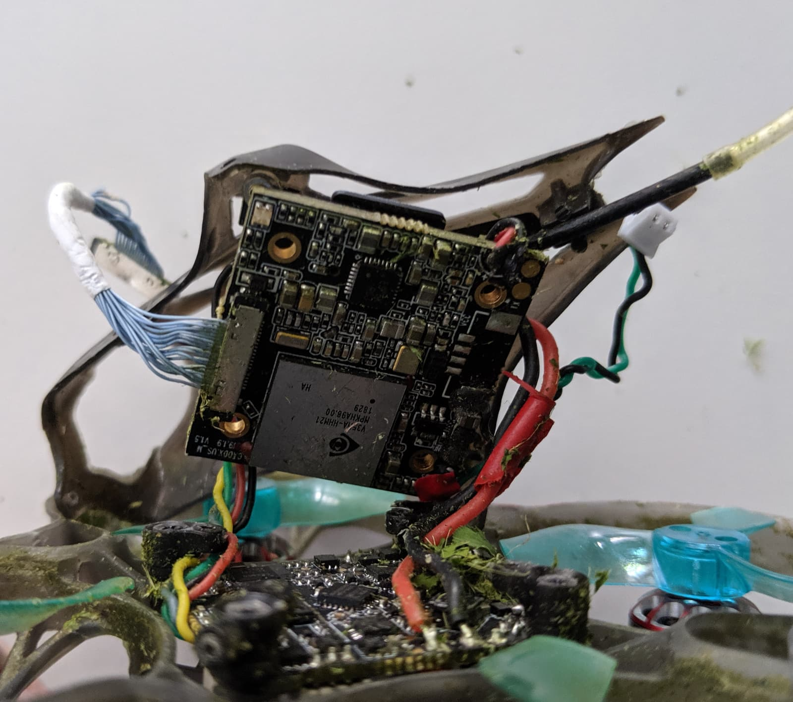
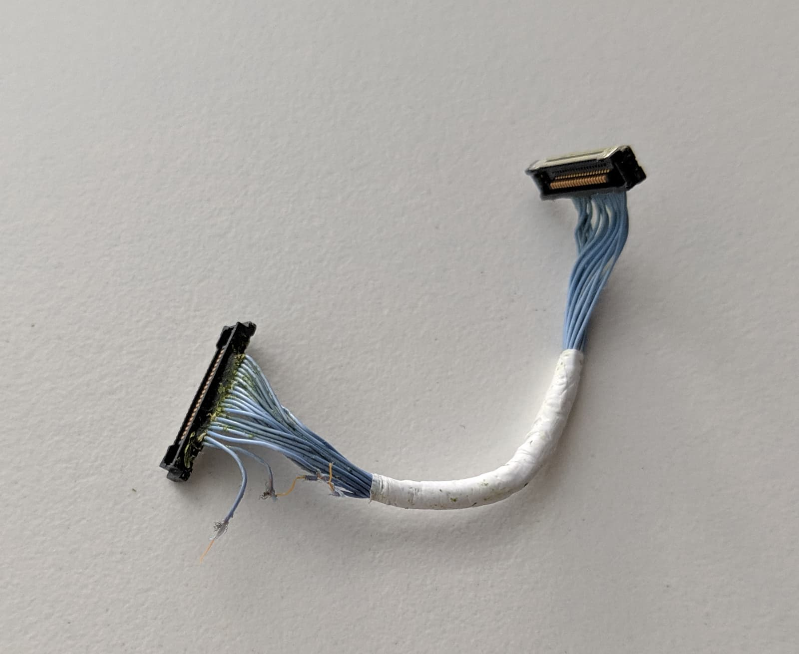
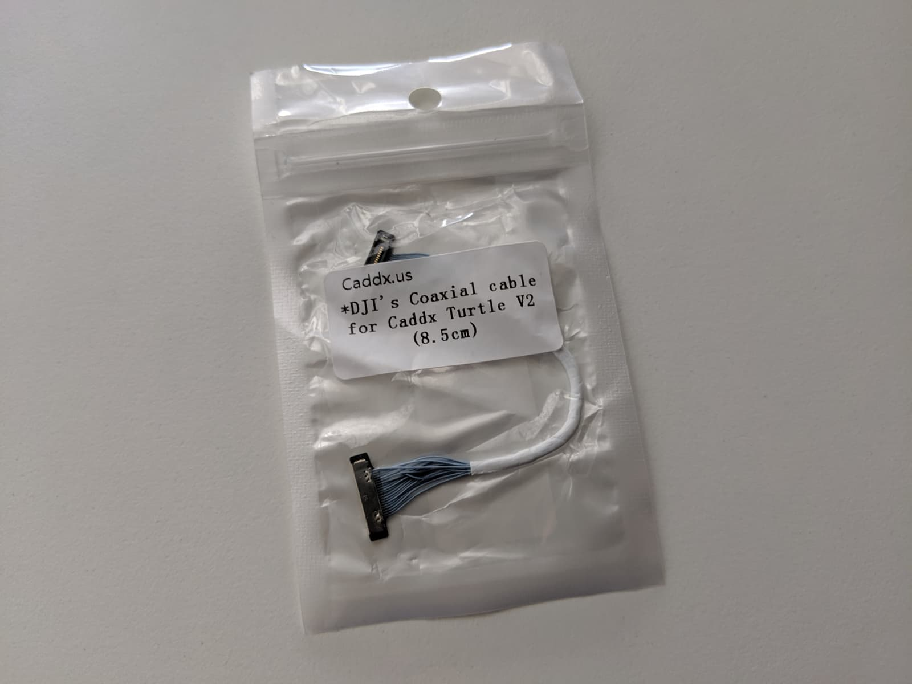
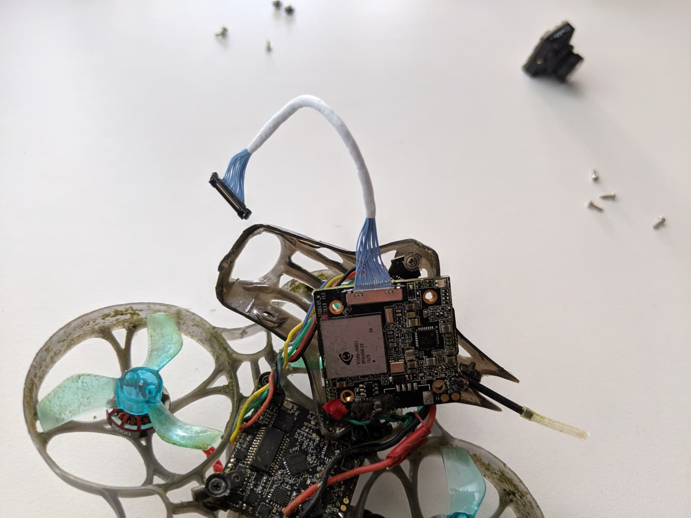

If you like me recently saw the infamous yellow screen of death on your [Caddx Turtle V2 camera][2] on your [Mobula7 HD][1] (or another drone), here's one way to solve it.

To the best of my knowledge the yellow screen indicates camera issues - it is not VTX related, as all camera feed and recording should not be working. You can verify that by plugging in an SD card and checking to see if your [Caddx Turtle V2][2] records any footage. In my case, the camera was not recording anything.

Upon closer inspection, looking at the camera's ribbon cable, it became obvious that my issue was with a broken cable. 😅 Phew, at least the fix for that is easy, but I hope you have another drone to fly while waiting for the spare cable to arrive.

If you unscrew the front screw and the two side screws that hold the canopy in place, you get access to the camera fairly easily.

The proper way to remove the ribbon ([coaxial cable][3]) is by lifting up and away from the camera the two black side notches. You can do one at a time, just go easy on them.

I had three of those small cablets completely torn. Funny thing is, I remember still flying and recording some footage even with one of them torn, but I guess it couldn't handle more than two or three broken. _Tinfoil hat off_.

To reach the other end of the cable, we do need to unmount the camera PCB from the stack.

That's held in place by 4 screws, one in each corner of the board.

The back one was a bit tricky to get, so I had to guide my screwdriver through the canopy in order to reach it.

You should now have access to the other end of the coaxial cable and be able to remove it from the camera board. Please excuse my Mobula7 HD, call sign `Grasscutter` 😅.

I wonder if this cable is repairable and can be soldered together? For a moment I considered doing it for science, but I deemed it's not worth it. Let me know in the section below if you managed to salvage yours.

I had ordered a [replacement cable][3] a while back and was now ready to replace the broken one.

Next, install the cable to the camera board and the camera. After that, you have 2 options. You can mount the camera upside down, so that the coaxial cable is at the top, forever out of the reach of the props, or you can just mount it as it was and try better cable management.

I went for option number two. It was easiest, and there was enough space to safely tug the cable away. If you do decide to mount the camera upside down, don't forget to flip the image in the camera settings. Congrats! I hope your Mobula7 HD works like new once again!

Here's my first flight after I changed the coaxial cable...

 <iframe width="560" height="315" src="https://www.youtube.com/embed/CiIYsMnCeGA?rel=0" frameBorder="0" allowFullScreen title="Mobula7 HD first flight after caddx cable repair" referrerpolicy="strict-origin-when-cross-origin"></iframe>

... and here is the full Mobula7 HD review on my FPVtips channel on YouTube:

 <iframe width="560" height="315" src="https://www.youtube.com/embed/FhtL0zSx1AU?rel=0" frameBorder="0" allowFullScreen title="Mobula7 HD review on the FPVtips YouTube channel" referrerpolicy="strict-origin-when-cross-origin"></iframe>

Happy Flying!

[0]: Linkslist
[1]: https://bit.ly/mobula7-hd
[2]: https://bit.ly/caddx-turtle-v2
[3]: https://bit.ly/caddx-turtle-v2-cable
