I'm very excited to review the [Skyzone SKY02X][1] fpv goggles because it's always easy to write about a well-rounded, high-quality product that works well!

That being said, **goggle reviews are VERY subjective by definition**. There are many person-specific elements, ranging from how the goggles fit on your face, to what you use them for and what and where you fly.

I'll try to cover almost all cases and be as objective as possible, while also mentioning what's my personal opinion on some topics. Let's get to it!

### Table of contents

- [📦 Unboxing](#unboxing)
- [📝 Specifications](#specs)
- [⚙ Setup](#setup)
- [🚁 Flying](#flying)
- [📑 Conclusion](#conclusion)

If you prefer watching, check out the full video review on my YouTube channel:

  <iframe width="560" height="315" src="https://www.youtube.com/embed/8DyISPMRlNk?rel=0" frameBorder="0" allowFullScreen title="Skyzone 02X review and setup"></iframe>

### 📦 Unboxing

The good impression of the [Skyzone 02X][1] starts with the unboxing experience.

The goggles come in high quality, sturdy box.

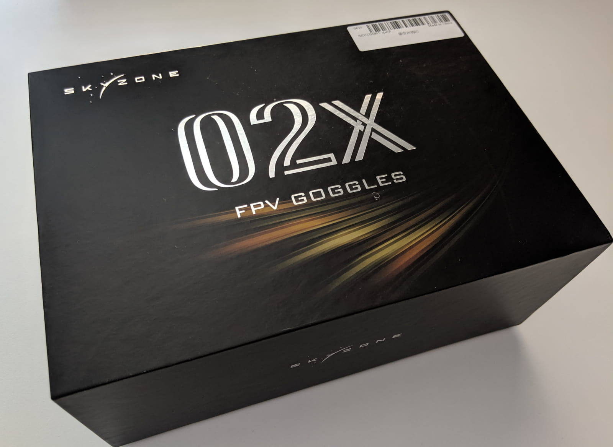

Inside you find the manual...

... and the rest of the gear packaged neatly in smaller boxes.

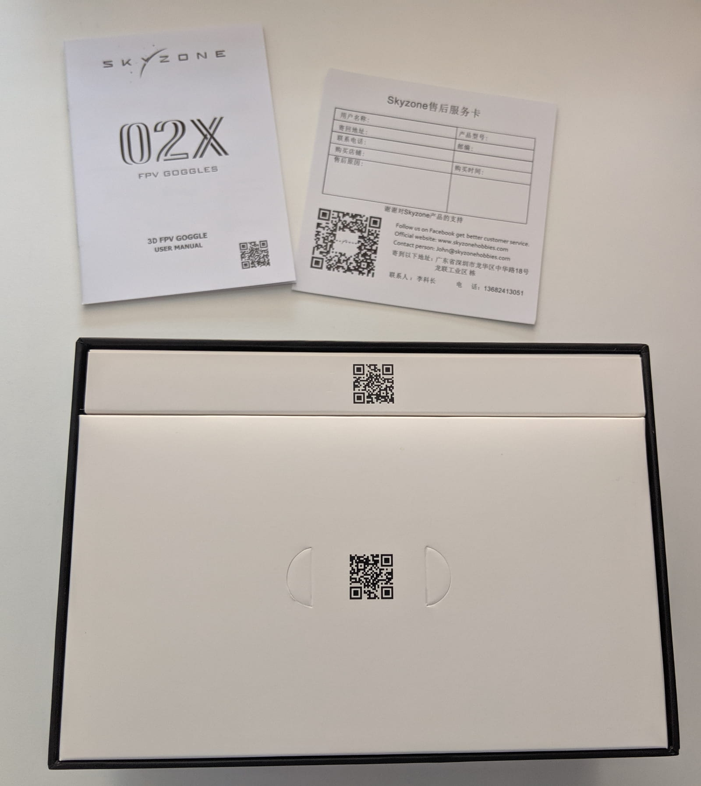

There are two boxes inside, a smaller and a bigger one.

Accessories for the [Skyzone 02X][1]. In terms of accessories, you get a JR data cable, DC barrel jack to an XT60 power cable, an AV cable, Futaba data cable, and two 5.8GHz antennas.

When you open the other box, you find inside the goggle case.

The case is pretty solid, high quality.

Will do well for daily transportation of the goggles, and even has a hook you can use to attach it to the outside of your backpack (why would you do that though).

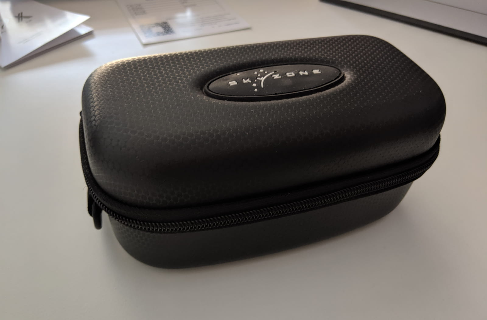

Inside the case, we find the [Skyzone 02X][1] FPV goggles as expected.

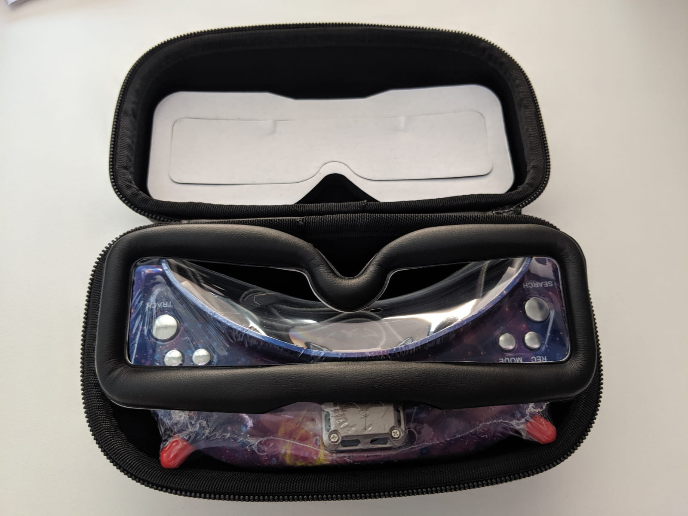

You also get 2 different face foams - one softer and thicker, like on the [Aomway commanders][3] and one leathery and thinner similar to the one on the [Fatshark goggles][2].

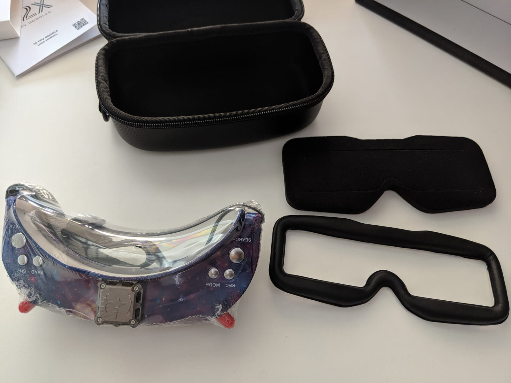

Here's where you need to apply the face foam.

The strap for the goggle is only around the head. There is no over the head strap.

The fan is on top, as well as 6 buttons, which we'll go over in the next section.
Because this is the 02X version, it comes with a small camera in the front of the goggles, that you can toggle on and off and see things in real life, even as you are wearing the goggles.

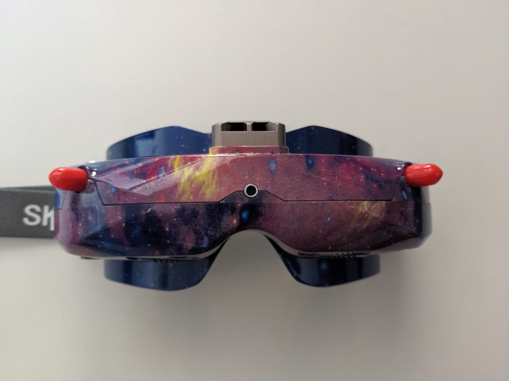

### 📝 Specifications

The [Skyzone 02X][1] fpv goggles have a 30-degree field of view (FOV) and a resolution of 854 x 480 (WVGA). The interpupillary distance is adjustable via the slider on the bottom and can be adjusted between 59-69mm.

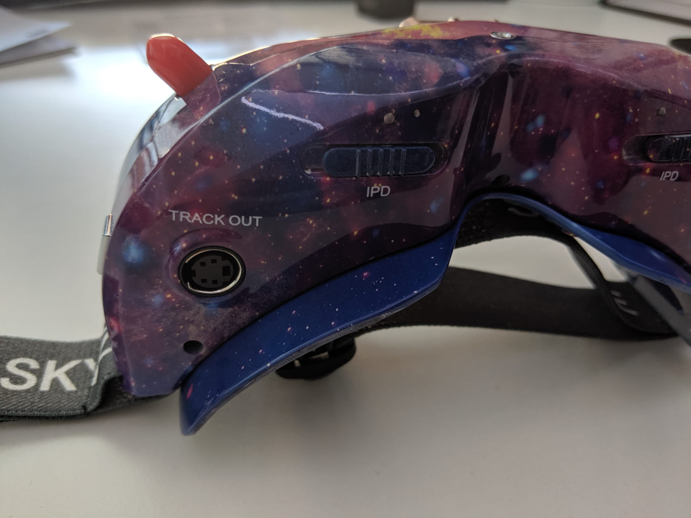

This is important and something to consider, and of course depends mostly on your face's shape whether these goggles would be a good fit for you. For me, this was just fine.

**The screens are high quality and very bright**.

The goggles have diversity receivers, as it's pretty much a standard in 2019, with 2 SMA antenna connectors.

The fan on the top can be toggled on and off via the power button on the side and is used to defog the goggles, as well as reduce the internal temperature of the unit.

**And yes, the [Skyzone 02X][1] have a POWER BUTTON! Yay!**. A long press turns the goggles on and off, which allows you to keep your power lead in at all times. Very neat and comfy!

Speaking of power, the Skyzone 02X goggles take in anywhere from 7 to 26V in (so pretty much 2S ~ 6S battery).

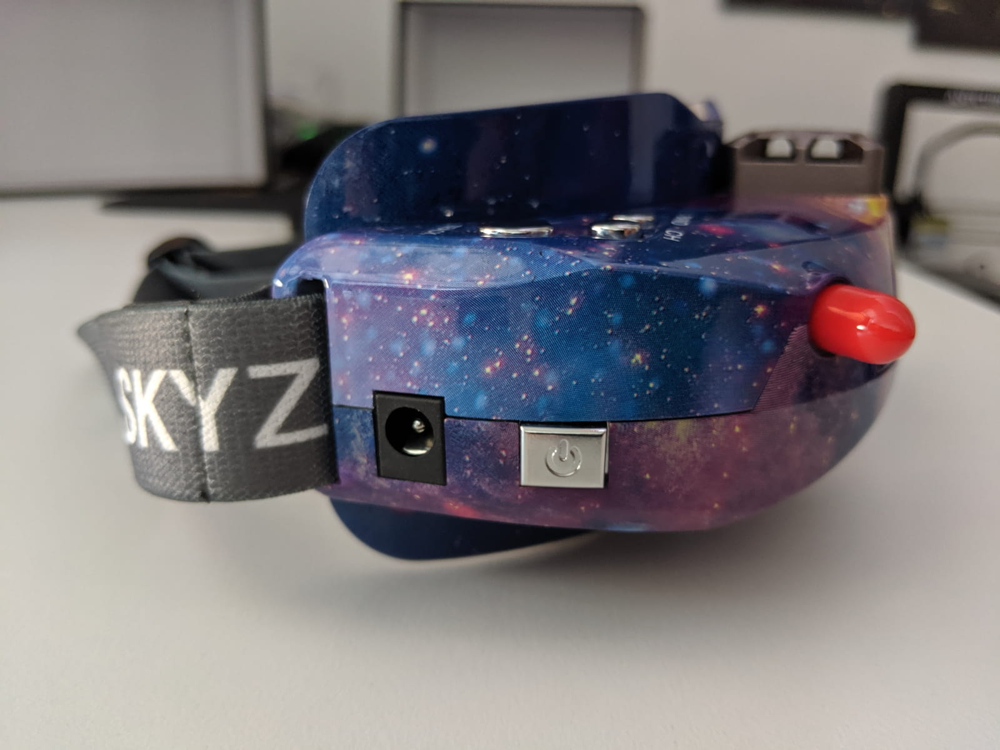

The front camera has a FOV of 60 degrees and a resolution of 640 x 480.

The goggles claim to support SD cards up to 32 GB (it works just fine for me with a 64 GB card though) for recording DVR and record at 30fps into AVI files. The goggles are pretty light coming in at about 210g.

The [Skyzone 02X][1] has a lot of different ports to support plenty of different use cases and needs. There is a mini HDMI port, micro USB, AV IN, and AV OUT, 3.5 mm headphone jack and you will also find the SD card slot in this area.

And here are the full specifications:

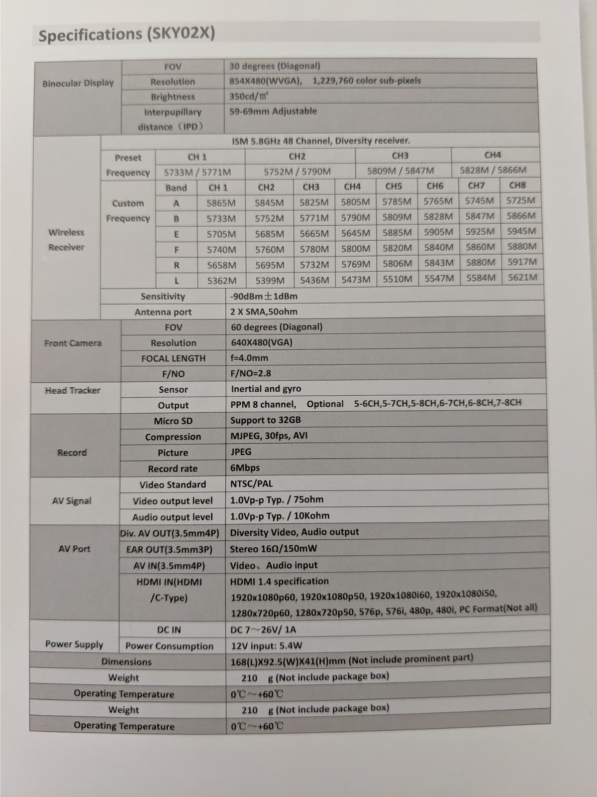

### ⚙ Setup

To get up and running with the [Skyzone 02X][1] fpv goggles, the bare minimum of what you have to do is this: **🥽 Install the face foam**, **📡 Install antennas** and **🔋 Plug in a battery**.

#### 🥽 Install the face foam

This is much easier than it may look like. First, you want to detach the faceplate from the goggles carefully.

This would give you access to remove the lens protector pieces.

Slide those out towards the center to remove them.

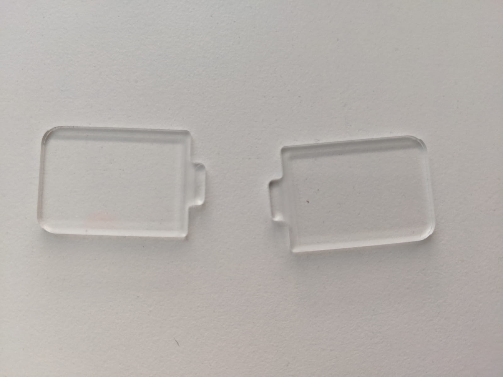

Now pick your foam of choice and apply it to the faceplate. In my case, I thought about using the leathery foam padding, but it wasn't thick enough and I would have too much light leakage. I guess I have a somewhat more narrow face. The other foam type, however, worked just fine, so I applied that and it fit like a glove. **Definitely experiment and test, before you apply the foam completely**.

When you are ready, attach the faceplate back to the goggles.

#### 📡 Install antennas

If you have been in FPV for a while, you probably know that you should toss those antennas you got in the box immediately. Unless you have no other choice, there's no good reason to use them and hopefully, if you do have to use them, it's temporary.

There are many good options for antennas but your choice will depend on how and where you fly. **The choice pretty much boils down between 2 omnidirectional antennas vs 1 omnidirectional and a patch antenna**.

> If you never fly more than a couple of hundred meters away from yourself, you fly a lot all around yourself within that range, you could easily go for a setup with 2 omnidirectional antennas.

> If you do fly further away from yourself in a particular direction you know beforehand, so you can position yourself accordingly, grab a patch antenna and an omni antenna.

Whatever you choose, here are some antennas worth having:

- [Aomway Clover Leaf Omni][4]
- [Realacc Tripple Feed Patch][5]
- [Lumenier Stubby][7]

**Do pay attention that you need to get an `SMA Male` antenna because the goggles antenna connector is `SMA Female`**.

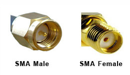

In addition, I recommend one of those [90-degree angle connector][6], so you don't have to bend your antenna to keep it up.

**After that, if you have 2 omnis, position them at 90 degrees to each other, if you have an omni and a patch antenna, keep the omni up and the patch in the direction of where you're flying**.

In my case I'm using an omni and a patch antenna, although in all fairness I fly open areas, no concrete buildings, and I don't go further than 200 - 300 meters, so I could easily do what I do with 2 omnis as well and might switch to using a couple of stubby omnis just because of the smaller form factor.

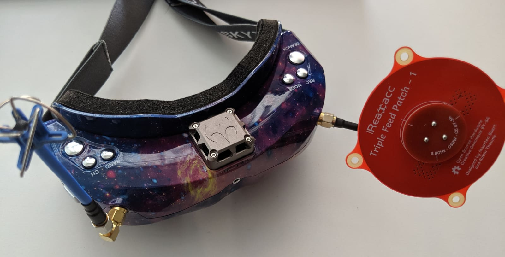

#### 🔋 Plug in a battery

I mentioned the [Skyzone 02X][1] fpv goggles take a pretty wide range of voltage, which is convenient. I use an old 3S lipo battery to power mine.

If you have a small battery you could suspend it on the side of the goggle strap. In that case, you do add more weight to them as well though.

The provided DC to XT60 cable is pretty long, and I'm using that to keep the battery in my pocket while flying. **This makes the goggles truly feel ultra light**.

### 🚁 Flying

#### ⚡ Quick start

You probably noticed that the Skyzones have a lot of buttons, which is handy as it makes using them very easy. You should not feel overwhelmed, however, as you don't need to know too much about all the functions to just fly daily.

The quickest way to get started is to plug in a battery and hold the power button to boot up the goggles. Then, press and hold the `SEARCH` button until the channel OSD panel comes up, then just press `SEARCH` and wait for it to complete. Once on the correct channel, press and hold `SEARCH` again to close the OSD panel.

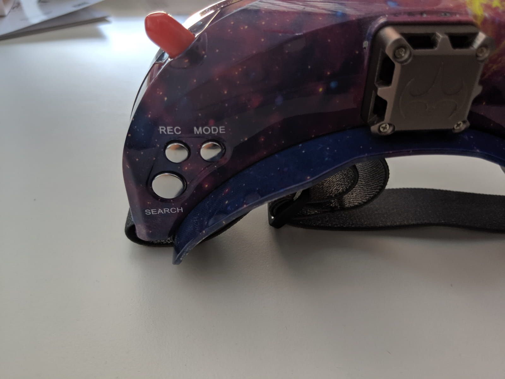

#### 🎥 Recording DVR

Don't forget to insert and SD card, and then the recording is as simple as pressing the `REC` button. The OSD will indicate with a red dot when the recording has been started successfully.

Here is some example DVR overlayed in the corner of an HD video.

 <iframe width="560" height="315" src="https://www.youtube.com/embed/Bi6uK1E2tkQ?rel=0" frameBorder="0" allowFullScreen title="Skyzone SKY02X DVR overlay"></iframe>

And here is a FULL DVR only video:

 <iframe width="560" height="315" src="https://www.youtube.com/embed/fG4mwlPwN10?rel=0" frameBorder="0" allowFullScreen title="Skyzone SKY02X DVR of Emax Hawk 5"></iframe>

#### 🔝 Other functions

You can also adjust the image settings, toggle the front camera on and off, playback previously recorded DVR and more. Just explore all the different menu options.

I have to admit that I thought I might use the front camera a lot more than what I ended up using it, which is pretty much not at all.

As far as **playback of recorded DVR** goes, I had a situation last year when that feature on the Aomway commanders saved me a lot of time when I crashed a quad in a huge open field without too many orienteering indicators. I just replayed the recorded DVR and found my quad in less than 5 minutes.

With the HDMI in you can set up things like a [simulator straight to your goggles, as I've explained here][8].

To fine-tune channels and band, use the buttons on the right-hand side of the goggles.

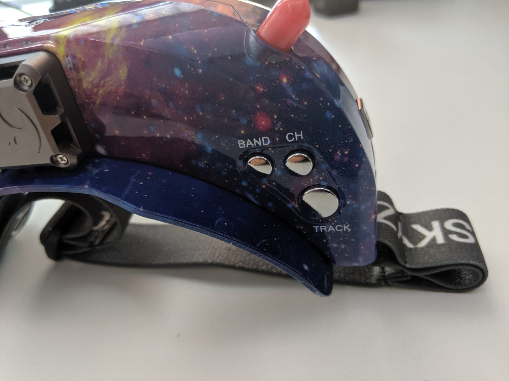

For more details on all button functions, [refer to the manual](skyzone-sky02x-manual.pdf).

But the best part about any FPV goggles is in my opinion, the goggles getting out of your way, letting you forget you are wearing them and just letting you enjoy flying. Which brings me to the conclusion for the [Skyzone SKY02X FPV goggles][1].

### 📑 Conclusion

Are the [Skyzone SKY02X][1] the goggles for you? In many ways and for most people I believe that the answer is just **ABSOLUTELY YES**! Quite simply the Skyzones are **possibly the best fpv goggles for 2019**.

And while as I mentioned earlier goggle reviews are by definitions pretty subjective, I'll try to make this as objective as possible. Here's what I think.

I'm someone who started with a cheap set of box goggles before I knew I was gonna get seriously into FPV. Then I switched to the [Aomway Commander][3] goggles and loved flying those for over a year. I'm well aware of the top of the line setups such as [Fatshark HDOs][2] with a RapidFire module (or similar). That might be great and for some people, but in many cases, unless you are performing like a top of the line pilot and fly at very difficult locations, you really may not need all of that, which adds up to well over double the price of the [Skyzone 02X][1]. And that's not to say that the Skyzones won't perform well for top of the line pilots, on the contrary, not only do they perform rather excellent, but they are also a CRAZY good value for money.

But this is not just a money argument, it is a value and ease of use argument as well. **You are probably getting about 85% of the performance (if not more) of a top of the line setup, right here in the Skyzones and that's at about 40% of the price**.

Heck, if you grab the [Skyzone SKY02C][9] version, those go as low at \$265 at the moment. That's cheap for a high-quality goggle with awesome bright screens, great resolution, perfect diversity reception, all sorts of functionality and overall feel.

Light weight and comfortable on the head, no module hassle, no nothing, just put on a couple of decent antennas and you are quite literally off to the races!

All my thumbs up for the Skyzones, which I think I will also probably call best FPV product of 2019. Happy flying!

[0]: Linkslist
[1]: https://bit.ly/skyzone-02x
[2]: https://bit.ly/fatshark-hdo
[3]: https://bit.ly/aomway-commander
[4]: https://bit.ly/aomway-antenna
[5]: https://bit.ly/realacc-triple-feed-patch
[6]: https://bit.ly/sma-female-right-angle
[7]: https://bit.ly/lumenier-stubby
[8]: /fpv/set-up-fpv-drone-simulator/
[9]: https://bit.ly/skyzone-sky02c
