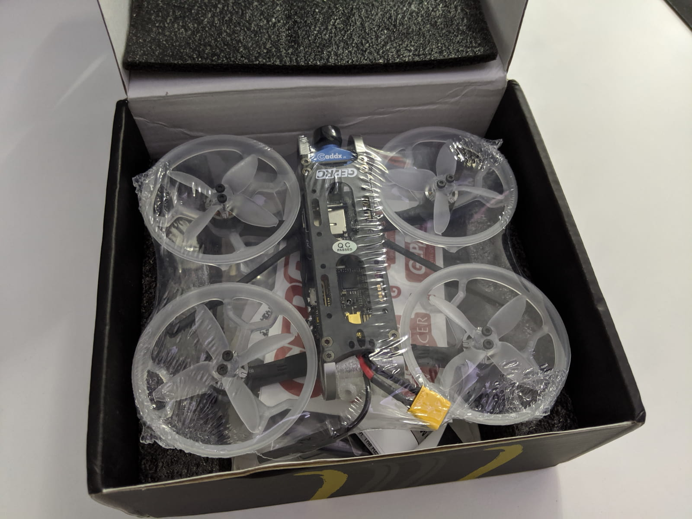
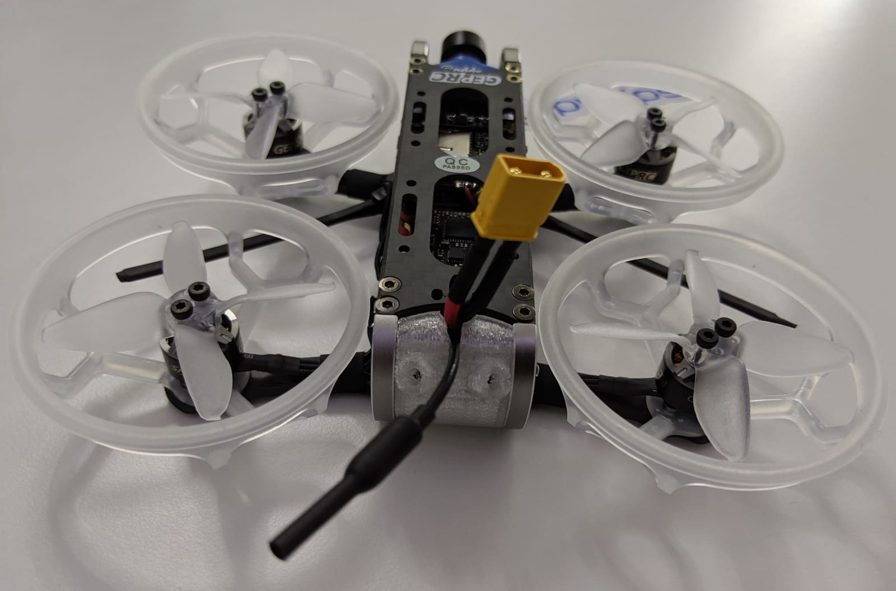

INTRO

### Table of contents

- [📦 Unboxing](#unboxing)
- [📝 Specifications](#specs)
- [⚙ Setup](#setup)
- [🚁 Flying](#flying)
- [📑 Conclusion](#conclusion)

### 📦 Unboxing

### 📠Specifications

### 🚠Flying

### 📑 Conclusion

[0]: Linkslist
[1]: https://bit.ly/geprc-cinepro-4k
