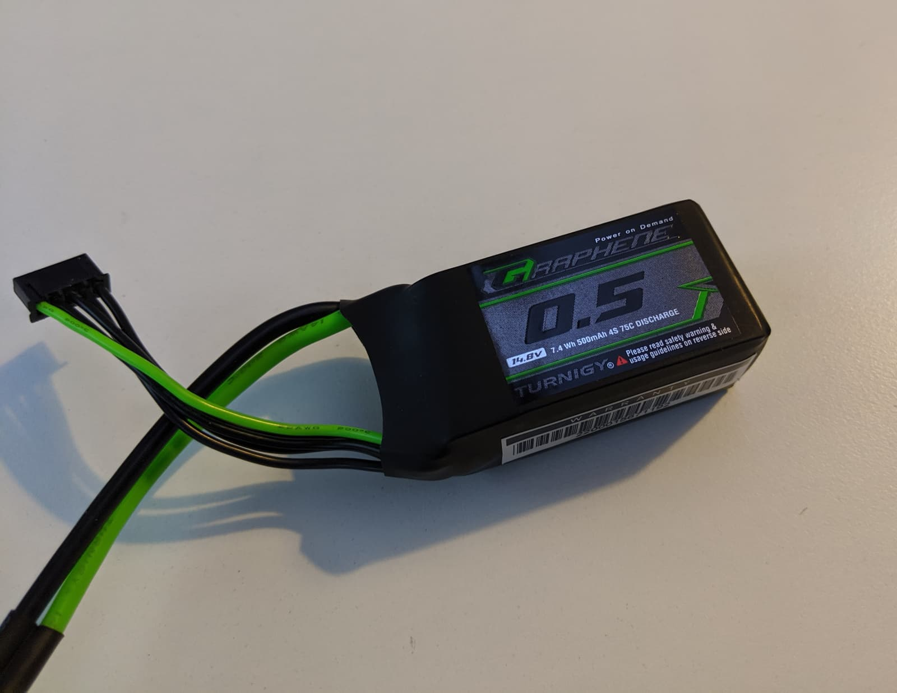

It seemed to me that on the cinewhoop front, there have been a lot of advancements lately, in particular, models such as the [GEPRC CinePro][1] that carry a [Caddx Tarsier 4K camera][2] with 2 separate sensors, definitely catch the eye and excite me. In this review and setup guide, we're gonna have a look at the **advanced version** of this drone with the [FrSky XM+ receiver][5] (BNF).

One of the quads I've flown the most during 2019 is the [Mobula7 HD][6] (which **I love flying!** - just [look at the number of videos in that playlist on my channel][7]). And while in general I prefer and started with 5-inch drones, there's something super cool about being able to whip this little quad out and just fly it in a park without disturbing other people. My only desire with the Mobula7 HD was to just have a full range receiver, as the built-in SPI based receiver only gets you about 100 meters or so. **This was the other main reason why I was very curious to test the GEPRC CinePro as it comes with a full range receiver**.

Whether you are a cinewhoop veteran, or just considering getting into cinewhooping, I think you will find this post useful. Let's get to it!

### Table of contents

- [📦 Unboxing](#unboxing)
- [📝 Specifications](#specs)
- [⚙ Setup](#setup)
- [🚁 Flying](#flying)
- [📑 Conclusion](#conclusion)

If you prefer watching, check out the full video review on my YouTube channel:

  <iframe width="560" height="315" src="https://www.youtube.com/embed/cfssLvuPOO4?rel=0" frameBorder="0" allowFullScreen title="GEPRC CinePro 4K cinewhoop"></iframe>

### 📦 Unboxing

When I think of the [GEPRC CinePro 4K][1] cinewhoop unboxing experience, I think of two things: **minimalistic and high-quality gear**.

Once you open the box, you are immediately presented the quad, which looks like a piece of art, but more on that in a sec.

The quad is wrapped in this protective film.

You get a card with a VTX frequency table ...

... some stickers, a couple of velcro straps, antenna tubes and an extra set of spare props. Those props are [Dalprop Cyclone Q2035C][3], quad blade high-quality propellers. The props that the quad comes with already installed are also high quality - [Emax Avan 2 inch][4]. Both sets offer very different flight experiences, as we'll see a bit later.

The components are very high quality, the quad is gorgeous and the assembly work - top notch. Shiny solder joints, well-placed antennas and shrink wrap, really superb build quality, which is great, given that the [GEPRC CinePro 4K][1] comes with a price tag of about \$270.

### 📝 Specifications

Sturdy high-quality carbon fiber frame. Dead cat shape and 115mm motor to motor diagonal distance, versus 69mm between the front and the back motor. This makes sure you never get your props in the shot.

Thick plastic prop guards, not flimsy at all. The props are secured with 2 screws each. Also, note that this quad comes configured in **props out** mode, so pay attention to that if you are swapping props.

I fly almost all my quads in what I believe also to be more common **props in** setup.

Metal cage to protect the Caddx Tarsier 4K camera, which is easily the star of this whole show 💃.

As you can tell the camera tilt is not at all aggressive which is somewhat expected when we are talking about a cinewhoop, as the goal is probably not so much to rip packs like crazy, but rather capture slower, more cinematic footage.

Plenty of space on top for mounting a battery, as well as 2 slots for guiding the velcro straps through.

Receiver antennas mounted on the front arms, pointing backward, at a 90-degree angle to each other 💙.

Back VTX whip antenna away from the props and won't get caught in them. The VTX supports up to 500 mW. XT30 plug for batteries.

The motors are the GEP-GR1105 5000KV and the recommended battery is a 4S lipo for those.

Two separate camera sensors, one for the FPV feed and one dedicated for 4K or HD video recording.

And here is the FrSky XM plus receiver, zip-tied under the camera boards.

### ⚙ Setup

In terms of setup, here's what we need to do to get up and running: **🔗 Bind the receiver to the radio**, **📇 Insert an SD card**, **⛓ Install the velcro straps**, **📡 Configure RSSI, channel mapping and modes in Betaflight** and **🎥 Configure the Caddx Tarsier 4K camera via the app**.

#### 🔗 Bind the receiver to the radio

The process was the same as usual (I use FrSky XM+ on almost all of my models). Put your radio in bind mode, press and hold the bind button on the receiver, while plugging in a battery. An extra set of hands helps a great deal with this, but you can also do just fine on your own, although a bit tricky. The receiver will then bind. After that turn off the binding function on your radio, unplug the quad and finally power it on again.

**If all went well, after the final power cycle, the XM+ will have its led in solid green to indicate that it's now linked to your transmitter.**

#### 📇 Insert an SD card

Fairly straight forward - the only thing is, the ducts are a bit in the way, but luckily just **pushing them down slightly allows for just enough space** to insert the SD card in its slot.

#### ⛓ Install the velcro straps

Installing the battery straps is also pretty straight forward. Depending on what batteries you're using you might be able to get away with just one of them, but I had to use both. I set up mine by guiding them through the designated slots on the top frame.

#### 📡 Configure RSSI, channel mapping and modes in Betaflight

First thing you'll notice is that the micro USB port is somewhat tricky to access. I'm happy to report that **it is still accessible** with a smaller, slimmer cable. I had this cable laying around and was able to use it to configure the CinePro. Alternatively, you could use an [L type right angle micro USB adapter][8]. Worst case scenario you might have to unscrew the motor screws to take off the duct and plug in your USB cable.

##### RSSI

My [GEPRC CinePro][1] drone didn't come with RSSI configured correctly for XM+ receivers, so definitely check yours and set it up accordingly. That's a quick 3 step process:

On the **Configuration** tab locate `RSSI_ADC` and make sure it's turned off.

On the **Receiver** tab set `RSSI Channel` to AUX12.

Finally, in the OSD tab enable `RSSI value` to allow displaying it in the OSD.

##### Channel mapping

My [GEPRC CinePro][1] came with its channel map configured to `AETR` and I'm always using `TAER` channel mapping so I had to change it. If you don't want things going wrong or best case scenario driving out to the field just to find out you can't arm your quad because of your channel mapping (or having to change it in your radio), make sure to configure this beforehand here.

In my case, after changing to `TAER1234` all the channels were responding correctly.

##### Modes and switches

Finally, let's set up an arm switch and some flight modes on a switch. Jump over to the **Modes** tab in Betaflight.

I have this convention where my arming switch is `Channel 5` on `AUX 1` and this is the right-hand side 2 position switch on my radio. Then my modes are on the 3 position switch next to it and those correspond to `Channel 6` or `AUX 2` in Betaflight.

For a Taranis radio you need to add your switch sources to `Channel 5` and `Channel 6` in the radio mixer screen, then assign `AUX 1` to ARM and `AUX 2` to some modes. I have Angle and Horizon mode on that switch, but by default in its starting position is in Acro as that's what I use to fly.

That's it in terms of setup. Here are all the other Betaflight settings, which are pretty much the defaults and left as is.

##### Complete Betaflight configuration

Setup:

Ports:

Configuration part 1:

Configuration part 2:

Configuration part 3:

Power and battery:

PID tuning

And here is the complete [GEPRC CinePro Betaflight configuration CLI dump](BTFL_cli_CinePro_F7_20190901_133123.txt) with the default configuration plus my updates to it.

#### 🎥 Configure the Caddx Tarsier 4K camera via the app

The last thing we have to do before we can go out and fly is to set up the Caddx Tarsier camera. Unfortunately, even though this is an outstanding camera in terms of both FPV feed and recorded footage, the user experience of the setup via the app is suboptimal, to say the least.

First thing you want to do is to go download the [CaddxFPV][9] from Google Play (or the Apple AppStore).

Also, something to note is that **if you are going to be providing power to the whole quad with a lipo, you probably wanna be quick** as the VTX gets pretty toasty pretty quick (unlike while you're flying when it can cool off).

The camera has 2 buttons on the side. One for powering it on and off and the other one for initiating the WiFi connection.

Long press the WiFi button for 8 seconds until you see blinking green light from the camera board.

Open the CaddxFPV app and tap `Connect camera`. That's gonna take you to your wifi settings where you need to tap on the **CADDX** network.

The default password is `12345678` (you can change that in the camera settings later).

Going back to the app and tapping the `Access camera` button (or something similar) will finally present you the first screen of camera options.

If you are getting stuck and are unable to access the camera, try stopping your 4G / LTE temporarily (not sure how this is related exactly, but I couldn't access the camera via the app, until I did this).

Below are 2 screenshots of the default settings of the Caddx Tarsier camera.

Some of the available resolution options are `4k 30fps`, `2.7k 60fps` and down to `1080p`. I've only recorded at 4k 30fps and 2.7k 60fps. The audio can be enabled and disabled and it's surprisingly usable, given how the props sound on such a tiny quad. You can change the video encoding between H.264 and H.265, adjust the white balance, exposure and ISO. I didn't touch any of those as I wanted to review the stock experience first. I've also been told not to touch EIS (some sort of stabilization, which is buggy at the moment). Will update this article as soon as this is no longer the case.

If you tap `Device Settings` you get to the second screen of options.

Here you probably want to change the default `Start Action` from Loop Video to Normal Video, to allow for normal video recording with no shenanigans as soon as you plug in a battery. You can change the default WiFi password, the video standard, factory reset the camera or **format the SD card**. That last one you probably really want to do, because it solves an issue I ran into.

I was connected to the camera, could see the live video feed just fine and I decided to test the camera by recording a clip.

So I pressed the big red record button and saw this message `No Sd Card`.

But I know there is an SD card inserted. So I headed onto the formatting option via the app and did just that.

After that, I was able to record clips just fine. Or ... sort of. So my advice to you is **make sure you format your SD card via the Caddx app**. It's better to do it anyway and test to avoid disappointments with missing or corrupted footage.

Speaking of which, I had my fair share of the latter and the former. My biggest issue was with my last battery of the day always ending up to be a 1.4 MB file, corrupted and unplayable. I've recorded at 4k 30fps, at 2.7k 60fps and I know it's not the quality or the speed of my card, as it records every other battery pack I fly just up to the last one just fine. I know I'm not running out of space either. I feel like for whatever reason the camera is not able to write that last file. It could be something I'm doing wrong, but never the less if it happens to me it could happen to other people too and it's better if you are aware of this as well. One thing I'll try next would be to unplug and then re-plug the battery after the last flight and "give it time to write the recording" to the SD card. That's my tinfoil hat assumption of what might be going on. I will come back here and update the article as soon as I have more information.

For now, take it for what it is, but this definitely adds to the poor user experience even if "I'm doing something wrong". I'm doing the same thing with my Caddx Turtle V2, RunCam Split Mini and RunCam Split 2 and all of the always record and save all the footage correctly to the SD card.

Now even if the user experience suffers, I have to point this out - the **Caddx Tarsier 4K** camera is outstanding and does remarkable things for our hobby. The FPV feed is one of the best I have seen to date, the recorded DVR is crisp. The 4K sensor is pretty unrivaled too. In September 2019 there's still no other 4K FPV cameras on the market (or are just starting to come out) and the quality of the video recording is superb.

### 🚁 Flying

We are finally ready to go fly and here's how the maiden flight turned out. This is the 4K 30fps flight footage. Unfortunately, that flight ended up with a failsafe about less than a hundred meters to my 8 o'clock. I'm not sure what was that about, but the GEPRC records black box data in built-in on-board flash memory and I will investigate this further.

  <iframe width="560" height="315" src="https://www.youtube.com/embed/rpRIFKZXyGQ?list=PLt8_2AobQjAeWqgpphjAtnjsbxNO32tOs&index=0&rel=0" frameBorder="0" allowFullScreen title="GEPRC CinePro maiden flight failsafe"></iframe>

I enjoyed flying the CinePro a lot. It was very different than most other quads I had flown to date. I love 5-inch drones and zippy micro quads with brushless motors. But the [GEPRC CinePro][1] is surely different and that's ok because it has a completely different purpose.

I tried flying it "cinewhoop styled" as much as I could - small camera tilt, slow, smooth. My first observation was **damn, this thing is so easy to operate in tight spaces**. You could get it to move very slow and steady and stall so much almost as if standing still. This is particularly important if you are shooting in 4k 30fps and want steady and slow shots - I think the GEPRC CinePro would do remarkably well in such conditions.

That's also not to say that the CinePro can't pull its weight, it could zip around pretty nice too, even if not at top speeds. Check out the slightly faster paced 2.7k 60fps footage below. You can also get a sense for how the props sound through the camera's microphone (albeit the volume was reduced, but still usable sound quality).

  <iframe width="560" height="315" src="https://www.youtube.com/embed/nWYBfPPcicQ?list=PLt8_2AobQjAeWqgpphjAtnjsbxNO32tOs&index=3" frameBorder="0" allowFullScreen title="GEPRC CinePro maiden flight failsafe"></iframe>

I mentioned the maiden resulted in a failsafe and although the quad dropped from pretty low, I still lost 1 motor screw and the Caddx Tarsier's wifi antenna. The camera's position also changed due to the impact.

My advice for you is to **make sure you tighten all motor screws every few flights or so**, to avoid this (or go for a Loctite solution to the problem), and maybe **take the wifi antenna off and keep it off the craft while flying**. If I'm honest I'm not sure what it accomplishes as you can still access the camera just fine, so maybe it's just that the bandwidth would suffer if you copy over files via wifi. I don't do that anyway, as I find it way easier to copy over files straight from the SD card on a computer.

As far as the changed camera position goes, make sure to tighten those screws nicely, but I'll surely be paying attention if they keep on getting loose over time.

All of the above has been tested with the default Avan Flow 2 props that come preinstalled on the quad. And I'm in the process of waiting for some sunny weather to go fly the Dalpros and see how the flight characteristics compare. I'll make sure to come back and add the relevant footage as soon as I do.

You could also subscribe to my [Georgi FPV][10] YouTube channel where I drop all single pack unedited footage and see the dalprop footage as soon as I upload it.

`UPDATE:` here is the video of the GEPRC CinePro with the Dalprop Cyclone q2035c props. The quad still flies smooth and nice, I do feel that the handling with the Avan Flow props is a bit easier, but they are also more amp hungry. Both prop options work really well with this quad.

  <iframe width="560" height="315" src="https://www.youtube.com/embed/HCHy9sUj7LU?list=PLt8_2AobQjAeWqgpphjAtnjsbxNO32tOs&index=4" frameBorder="0" allowFullScreen title="GEPRC CinePro flight with Dalprop Cyclone q2035c props"></iframe>

🔋 Batteries

I used 4S batteries for my tests which to my understanding are recommended by GEPRC. You can also fly it on 3S if you have such batteries laying around.

I used a 500 mah Turnigy Graphene battery...

... as well as [GNB 4S 520mah high voltage batteries][11] (although I still only charged them up to 4.20 volts per cell).

I think the performance was slightly better with the GNB batteries in general, maybe slightly longer, but for the most part, it was rather similar. That's understandable, given they offer you 20 mah more. They also fit better and are a bit less clunky. If you go the extra mile and charge them up to 4.35 volts as they are high voltage batteries, I'd say you can't go wrong if you go with those batteries.

### 📑 Conclusion

What's the verdict? Is the [GEPRC CinePro 4k][1] for you? **The answer is that it depends!**

Are you excited to do some cinewhooping? And you wanna make your entry into this subset of FPV with the best components, highest quality build, the best 4K split-type camera on the market? **Then, by all means, go for it!** The [GEPRC CinePro 4k][1] is well worth the money it asks from you and you will have an awesome time flying and shooting cinematic videos safely really anywhere. It's a great offer, though to beat.

The quad flies superb, is decently tuned, flies smooth and is ridiculously easy to handle in VERY tight spots and I mean it!

If you want a quad that's closer to a freestyle/racer type of a drone, I'd hold my horses on that one. That's not to say that the CinePro is slow or anything, it's plenty fast, but it should not be compared to freestyle or racing drones as it is designed for a fundamentally different thing and it does that exceptionally well. This is truly a **cinewhoop** in the best possible meaning of the word and a **top of the line cinewhoop** too.

I'd wrap it up saying that the [GEPRC CinePro 4k][1] is one of the easiest ways to get into high-quality 4K cinewhooping. Happy flying!

[0]: Linkslist
[1]: https://bit.ly/geprc-cinepro-4k
[2]: https://bit.ly/caddx-tarsier-4k
[3]: https://bit.ly/dalprop-cyclone-q2035c
[4]: https://bit.ly/emax-avan-2
[5]: https://bit.ly/xm-plus
[6]: https://bit.ly/mobula7-hd
[7]: https://www.youtube.com/channel/UC2gwYMcfb0Oz_fl9W1uTV2Q/playlists
[8]: https://bit.ly/right-angle-micro-usb-adapter
[9]: https://play.google.com/store/apps/details?id=com.gku.caddxfpv
[10]: https://www.youtube.com/channel/UC2gwYMcfb0Oz_fl9W1uTV2Q
[11]: https://bit.ly/gnb-4s-520mah
