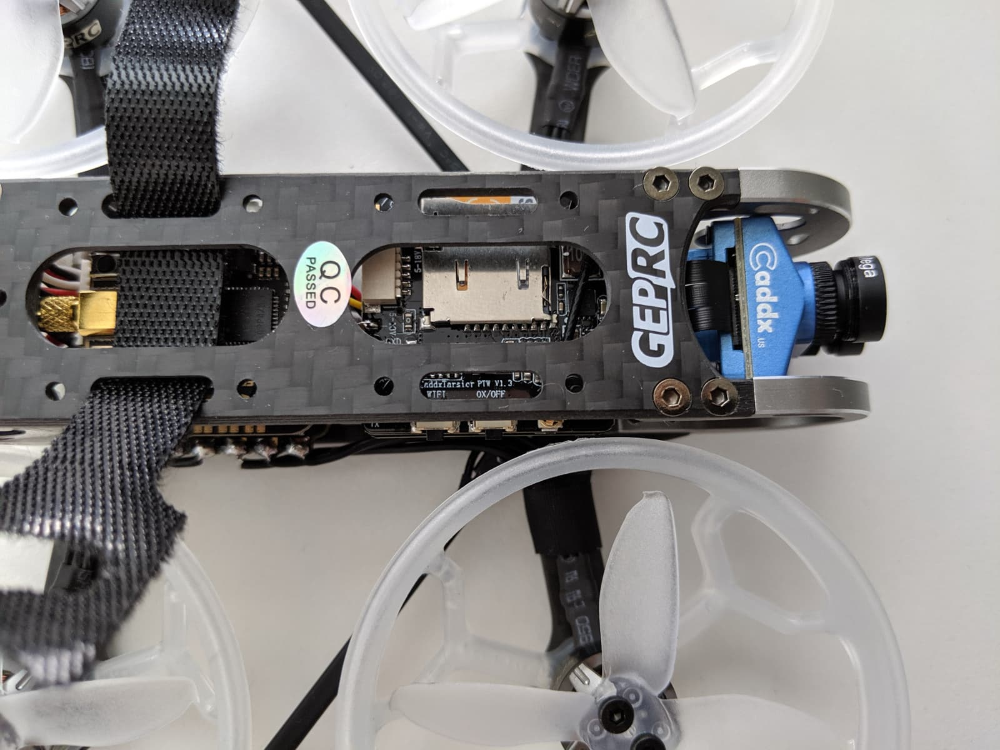

It seemed to me that on the cinewhoop front, there have been a lot of advancements lately, in particular, models such as the [GEPRC CinePro][1] that carry a [Caddx Tarsier 4K camera][2] with 2 separate sensors, definitely catch the eye and excite me. In this review and setup guide we're gonna have a look at the **advanced version** of this drone with the [FrSky XM+ receiver][5] (BNF).

One of the quads I've flown the most during 2019 is the [Mobula7 HD][6] (which **I absolutely love flying!** - just [look at the number of videos in that playlist on my channel][7]). And while in general I prefer and started with 5 inch drones, there's something super cool about being able to whip this little quad out and just fly it in a park without disturbing other people. My only desire with the Mobula7 HD was to just have a full range receiver, as the built in SPI based receiver only gets you about 100 meters or so. **This was the other main reason why I was very curious to test the GEPRC CinePro as it comes with a full range receiver**.

Whether you are a cinewhoop veteran, or just considering getting into cinewhooping, I think you will find this post useful. Let's get to it!

### Table of contents

- [📦 Unboxing](#unboxing)
- [📝 Specifications](#specs)
- [⚙ Setup](#setup)
- [🚁 Flying](#flying)
- [📑 Conclusion](#conclusion)

### 📦 Unboxing

When I think of the [GEPRC CinePro 4K][1] cinewhoop unboxing experience, I think of two things: **minimalistic and high quality gear**.

Once you open the box, you are immediately presented the quad, which looks like a piece of art, but more on that in a sec.

The quad is wrapped in this protective film.

You get a card with a VTX frequency table ...

... some stickers, a couple of velcro straps, antenna tubes and an extra set of spare props. Those props are [Dalprop Cyclone Q2035C][3], quad blade high quality propellers. The props that the quad comes with already installed are also high quality - [Emax Avan 2 inch][4]. Both sets offer very different flight experiences, as we'll see a bit later.

The components are very high quality, the quad is gorgeous and the assembly work - top notch. Shiny solder joins, well placed antennas and shrink wrap, really superb build quality, which is great, given that the [GEPRC CinePro 4K][1] comes with a price tag of about \$270.

### 📝 Specifications

Sturdy high-quality carbon fiber frame. TODO: measure arm sizes?

Thick plastic prop guards, not flimsy at all. The props are secured with 2 screws each. Also note that this quad comes configured in **props out** mode, so pay attention to that if you are swapping props.

I personally fly almost all my quads in what I believe also to be more common **props in** setup.

Metal cage to protect the Caddx Tarsier 4K camera, which is easily the star of this whole show 💃.

As you can tell the camera tilt is not at all aggressive which is somewhat expected when we are talking about a cinewhoop, as the goal is probably not so much to rip packs like crazy, but rather capture slower, more cinematic footage.

Plenty of space on top for mounting a battery, as well as 2 slits for guiding the velcro straps through.

Receiver antennas mounted on the front arms, pointing backwards, at a 90 degree angle to each other 💙.

Back VTX whip antenna away from the props and won't get caught in them. The VTX supports up to 500 mW. XT30 plug for batteries.

The motors are the GEP-GR1105 5000KV and the recommended battery is a 4S lipo for those.

Two separate camera sensors, one for the FPV feed and one dedicated for 4K or HD video recording.

And here is the FrSky XM plus receiver, ziptied under the camera boards.

### ⚙ Setup

In terms of setup, here's what we need to do to get up and running: **🔗 Bind the receiver to the radio**, **📇 Insert an SD card**, **⛓ Install the velcro straps**, **📡 Configure RSSI, channel mapping and modes in Betaflight** and **🎥 Configure the Caddx Tarsier 4K camera via the app**.

#### 🔗 Bind the receiver to the radio

The process was the same as usual (I use FrSky XM+ on almost all of my models). Put your radio in bind mode, press and hold the bind button on the receiver, while plugging in a battery. An extra set of hands helps a great deal with this, but you can also do just fine on your own, although a bit tricky. The receiver will then bind. After that turn off the binding function on your radio, unplug the quad and finally power it on again.

**If all went well, after the final power cycle, the XM+ will have its led in solid green to indicate that it's now linked to your transmitter.**

#### 📇 Insert an SD card

Fairly straight forward - the only thing is, the ducts are a bit in the way, but luckily just **pushing them down slightly allows for just enough space** to insert the SD card in its slot.

#### ⛓ Install the velcro straps

Installing the battery straps is also pretty straight forward. Depending on what batteries you're using you might be able to get away with just one of them, but I had to use both. I setup mine by guiding them through the designated slits on the top frame.

#### 📡 Configure RSSI, channel mapping and modes in Betaflight

First thing you'll notice is that the micro USB port is somewhat tricky to access. I'm happy to report that **it is still accessible** with a smaller, slimmer cable. I had this cable laying around and was able to use it to configure the CinePro. Alternatively, you could use an [L type right angle micro USB adapter][8]. Worst case scenario you might have to unscrew the motor screws to take off the duct and plug in your USB cable.

##### RSSI

My [GEPRC CinePro][1] drone didn't come with RSSI configured correctly for XM+ receivers, so definitely check yours and set it up accordingly. That's a quick 3 step process:

On the **Configuration** tab locate `RSSI_ADC` and make sure it's turned off.

On the **Receiver** tab set `RSSI Channel` to AUX12.

Finally in the OSD tab enable `RSSI value` to allow displaying it in the OSD.

##### Channel mapping

My [GEPRC CinePro][1] came with its channel map configured to `AETR` and I'm always using `TAER` channel mapping so I had to change it. If you don't want things going wrong or best case scenario driving out to the field just to find out you can't arm your quad because of your channel mapping (or having to change it in your radio), make sure to configure this before hand here.

In my case after changing to `TAER1234` all the channels were responding correctly.

##### Modes and switches

Finally let's set up an arm switch and some flight modes on a switch. Jump over to the **Modes** tab in Betaflight.

I have this convention where my arming switch is `Channel 5` on `AUX 1` and this is the right hand side 2 position switch on my radio. Then my modes are on the 3 position switch next to it and those correspond to `Channel 6` or `AUX 2` in Betaflight.

For a Taranis radio you need to add your switch sources to `Channel 5` and `Channel 6` in the radio mixer screen, then assign `AUX 1` to ARM and `AUX 2` to some modes. I have Angle and Horizon mode on that switch, but by default in its starting position is in Acro as that's what I use to fly.

That's it in terms of setup. Here are all the other Betaflight settings, which are pretty much the defaults and left as is.

##### Complete Betaflight configuration

Setup:

Ports:

Configuration part 1:

Configuration part 2:

Configuration part 3:

Power and battery:

PID tuning

And here is the complete [GEPRC CinePro Betaflight configuration CLI dump](BTFL_cli_CinePro_F7_20190901_133123.txt) with the default configuration plus my updates to it.

#### 🎥 Configure the Caddx Tarsier 4K camera via the app

Last thing we have to do before we can go out and fly is to set up the Caddx Tarsier camera. Unfortunately even though this is an outstanding camera in terms of both FPV feed and recorded footage, the user experience of the setup via the app is suboptimal to say the least.

last video not being saved,
the ux experience is pretty crappy sadly, although the camera is great

##### To record:

##### To change the settings:

- Long press WiFi button for 8 seconds until you see blinking green light shortly

Easy steps bullet point list. Quick start guide

### 🚁 Flying

#### 👰 Maiden flight

Exact flight video

failsafe, lost wifi antenna, screw, camera position.

- Batteries
- Test flights with different props
  1 x EMAX AVAN 2inch PROP(SET)
  1 x DalProp Q2035 4-blade(SET)

  Notes on the flight experience with different props.

Footage with 4k 30 fps and 2,7k 60 fps

### 📑 Conclusion

The easiest entry to quality cinewhooping.

TODO: add links to article in the trello description for this quad as well as on all youtube videos retroactively

[0]: Linkslist
[1]: https://bit.ly/geprc-cinepro-4k
[2]: https://bit.ly/caddx-tarsier-4k
[3]: https://bit.ly/dalprop-cyclone-q2035c
[4]: https://bit.ly/emax-avan-2
[5]: https://bit.ly/xm-plus
[6]: https://bit.ly/mobula7-hd
[7]: https://www.youtube.com/channel/UC2gwYMcfb0Oz_fl9W1uTV2Q/playlists
[8]: https://bit.ly/right-angle-micro-usb-adapter
