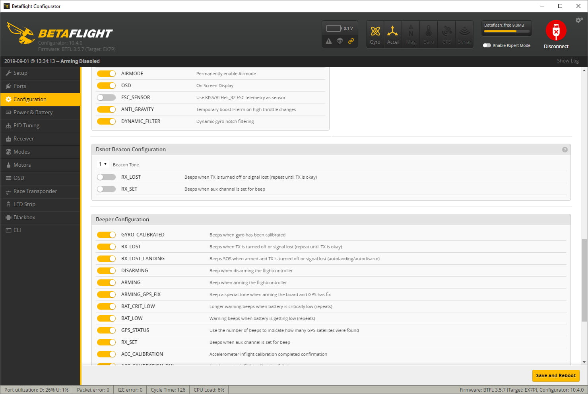

It seemed to me that on the cinewhoop front, there have been a lot of advancements lately, in particular, models such as the [GEPRC CinePro][1] that carry a [Caddx Tarsier 4K camera][2] with 2 separate sensors, definitely catch the eye and excite me. In this review and setup guide we're gonna have a look at the advanced version of this drone.

Whether you are a cinewhoop veteran, or just considering getting into cinewhooping, I think you will find this post useful. Let's get to it!

### Table of contents

- [📦 Unboxing](#unboxing)
- [📝 Specifications](#specs)
- [⚙ Setup](#setup)
- [🚁 Flying](#flying)
- [📑 Conclusion](#conclusion)

### 📦 Unboxing

When I think of the [GEPRC CinePro 4K][1] cinewhoop unboxing experience, I think of two things: **minimalistic and high quality gear**.

Once you open the box, you are immediately presented the quad, which looks like a piece of art, but more on that in a sec.

The quad is wrapped in this protective film.

You get a card with a VTX frequency table ...

... some stickers, a couple of velcro straps, antenna tubes and an extra set of spare props. Those props are [Dalprop Cyclone Q2035C][3], quad blade high quality propellers. The props that the quad comes with already installed are also high quality - [Emax Avan 2 inch][4]. Both sets offer for very different flight experience, as we'll see a bit later.

### 📝 Specifications

### ⚙ Setup

- Installing the battery straps
- Installing an SD card (push props down a bit)

Betaflight screenshots
CLI Dump link

### ⚙ How to record with Caddx Tarsier 4K camera

#### To record:

#### To change the settings:

- Long press WiFi button for 8 seconds until you see blinking green light shortly

Easy steps bullet point list. Quick start guide

### 🚁 Flying

- Batteries
- Test flights with different props
  1 x EMAX AVAN 2inch PROP(SET)
  1 x DalProp Q2035 4-blade(SET)

  Notes on the flight experience with different props.

Footage with 4k 30 fps and 2,7k 60 fps

### 📑 Conclusion

The easiest entry to quality cinewhooping.

[0]: Linkslist
[1]: https://bit.ly/geprc-cinepro-4k
[2]: https://bit.ly/caddx-tarsier-4k
[3]: https://bit.ly/dalprop-cyclone-q2035c
[4]: https://bit.ly/emax-avan-2
