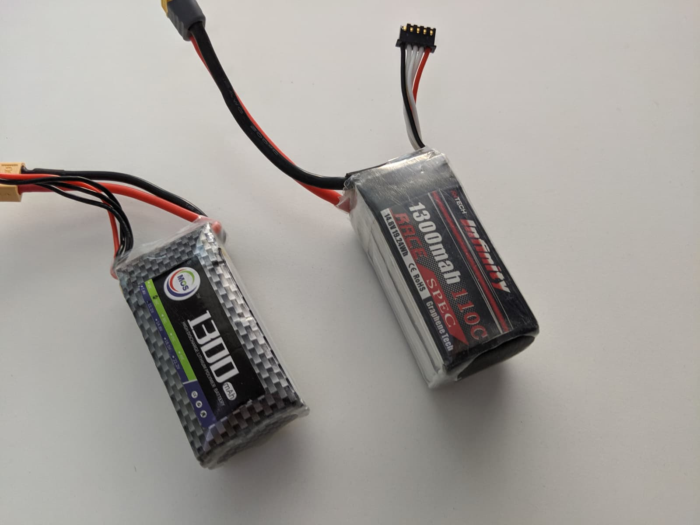
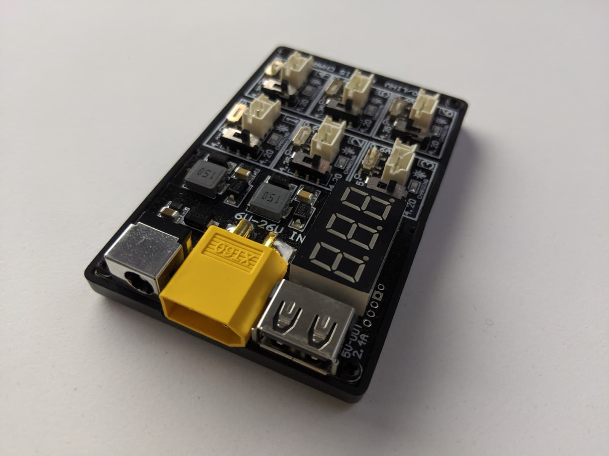
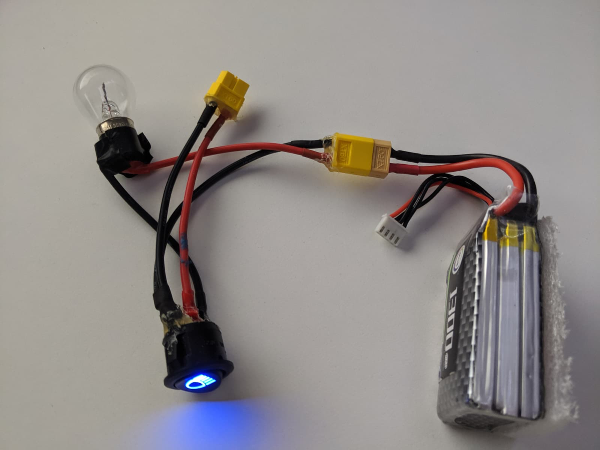
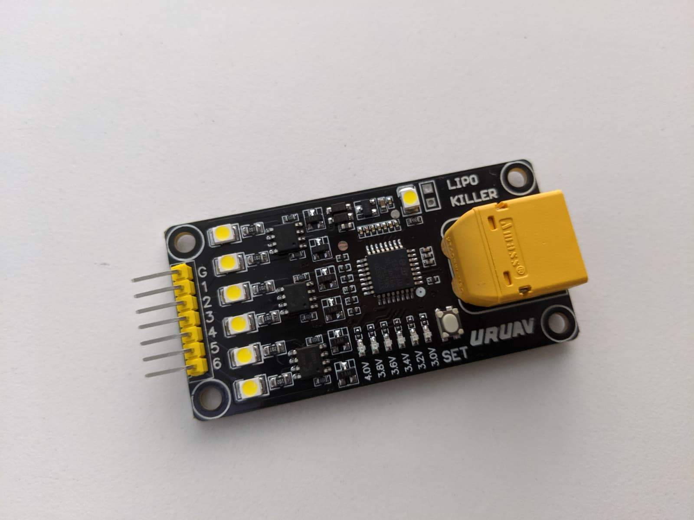
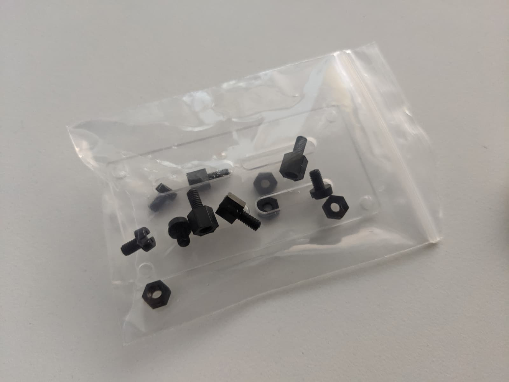
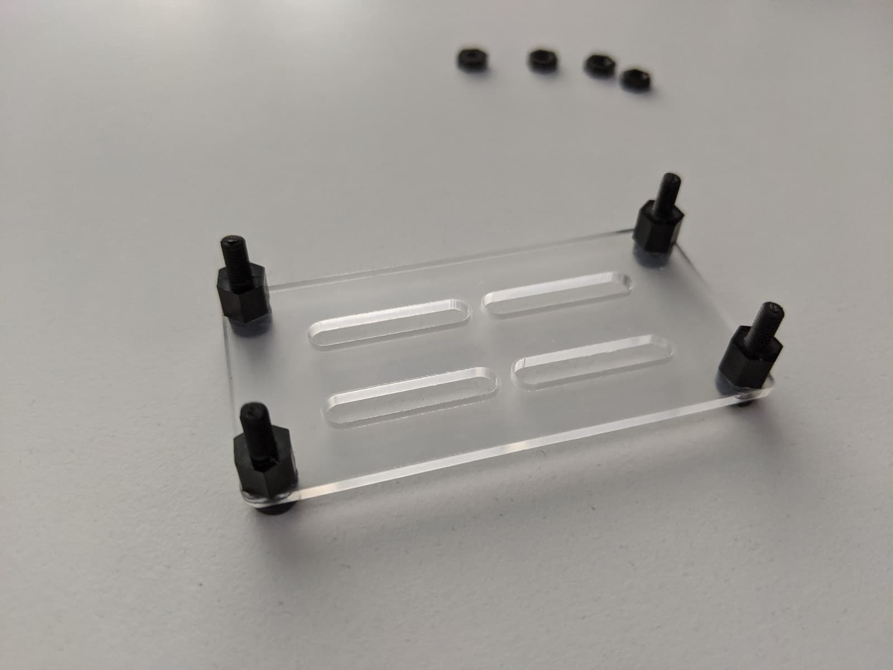
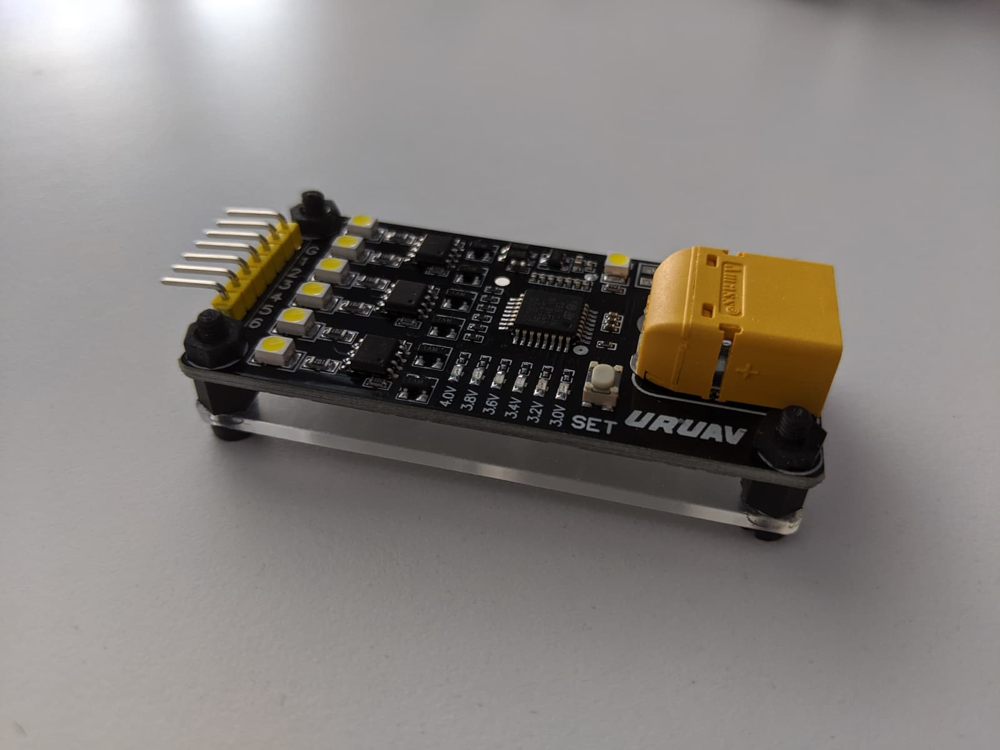
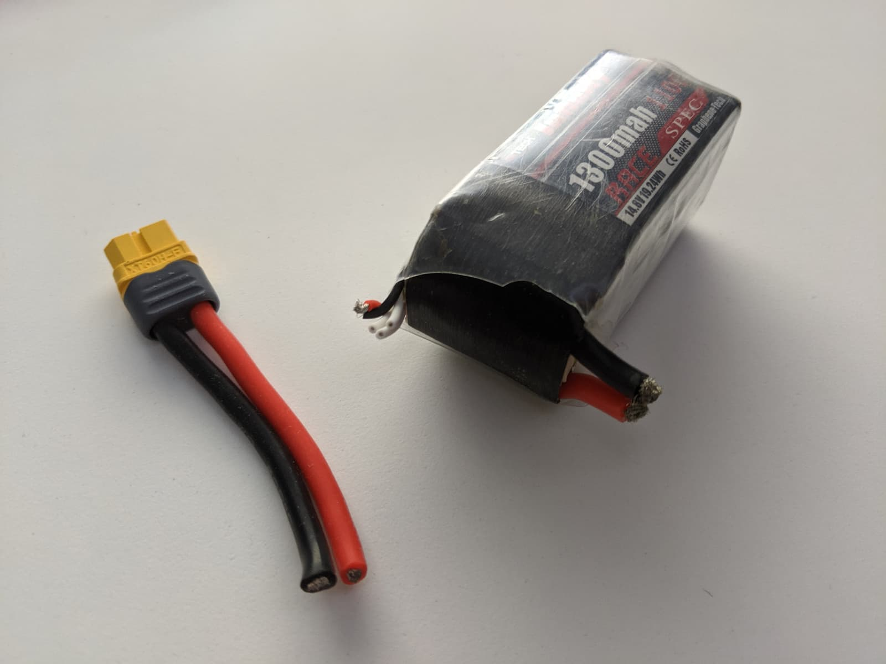

If you are into FPV, chances are sooner or later you will have to dispose of some old, unsafe or just no longer working lipo battery. **And that's a dangerous task if not carried out correctly!** So I'd like to start this post with a very important disclaimer:

> **If you don't know what you're doing or about to do, STOP! This is not a guide or a DIY tutorial! This post is about sharing my experience with you, with the hope of helping people not to burn down their houses. Lipos are serious business, they DO EXPLODE and they DO SET THINGS ON FIRE. Proceed at your own risk! I take no responsibility for anything that might happen to you if you decide to continue on. Be smart and be careful.**

So back to our story. Sooner or later you will get a dead cell in a pack or a cell with significant voltage difference than the rest of the cells at which point it could be a bit of a risk to try and charge the pack.

Again, I'm not gonna get into how to fix such issues. I have read about people even successfully reviving cells, bringing packs back up to voltage, but this is what I think:

> **If a pack starts to be faulty, deal with it. It's not worth the risk of burning down your house or worse just to use a pack a couple more times.**

There are a lot of weird and wildly unsafe ways of disposing of a lipo and I'm not even going to mention them here. You can find out about them easily with some google-fu.

**One of the ways to dispose of a lipo that I consider safest** is to deplete all their energy slowly to kill the cells. There are many ways to do so, but here's what's worked for me - using led lights of some sort. It takes a long time but it's fairly safe based on my experience. That being said, I still only do it when I'm in the room keeping an eye on the battery; I wouldn't leave it unattended and don't recommmend that.

**If you have one of those 1S whoop battery charging board, you could plug in the lipo to kill in the XT60 port, and use the USB 5V output port to power anything running off of 5V**. For instance, I have an LED strip in my room that I can power using this method and while this does take a while because the LED strip is so energy efficient, it works nevertheless.

**You could also use a 12W or 21W bulb, for example like the one you might have on your [smoke stopper][2]**. A nice little bonus in my smoke stopper is that even after the main bulb goes off I can see that there is still some energy in the battery because the switch LED stays powered on. This on its own takes ages to drain any remaining energy, but if you are at this point that nothing else powers on anymore, that's probably good enough for the next step.

And while those methods have worked nicely for me, I decided to grab one of these [URUAV lipo killers][1] and do things in a similar and even easier manner.

I used it to finish off a couple of battery packs I needed to get rid of. This thing goes for about $6-$7 and is nicely build and easy to use. You can discharge your batteries via the XT60 on board or by plugging in you battery's balance plug in the pins. Just make sure you plug in correctly if you use the pins.

I've also noticed you can set the desired discharge to voltage, although I have yet to use that option, because I mainly use [my charger to set my batteries to storage voltage][3], but if you have nothing else to help you discharge your batteries to storage voltage, I would assume this tiny board could help a bit, albeit probably very slow.

Here's what you get when you order one of these [lipo killer][1] boards. An acryllic stand and standoffs as well as some nuts.

You put it together like this.

And there it is, voila! This is nice because it protects at least a bit from accidental shorts by touching together the XT60 terminals underneath the board.

Which brings us to the last step in the disposal process: **shorting and recycling**.

> **DO NOT PROCEED IF YOU ARE UNSURE WHETHER YOU HAVE COMPLETELY SPENT THE BATTERY'S ENERGY**

Also highly advised if possible to do that outside. I do that in the field just in case. In my case, I had done a good job and saw no sparks when shorting the XT60 leads and a few small sparks when shorting the balance leads.

Cut the wires one at a time, as if you try just both ground and voltage at the same time in the same snip, you might short them already right then and there. Either way, touch the leads carefully to finally short and kill the battery completely.

You can then save the balance plug, XT60 plug and all the leads in case you need them for something. Check your local hobby shop for recycling the lipos, or if there isn't one, some electronics stores might accept you recycling your lipos there.

[0]: Linkslist
[1]: https://bit.ly/lipo-killer
[2]: /fpv/make-a-smoke-stopper/
[3]: https://bit.ly/imax-b6-lipo-charger
