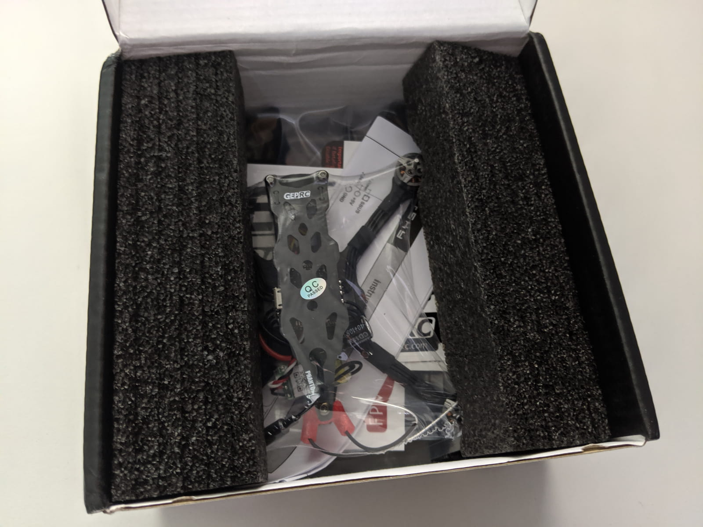

I was super excited to try out a couple of 'toothpick' class drones. If already at this point you are like: 'toothpick, what?!', check out [KebabFPV's YouTube channel][2] for more context. The `TL;DR` is small, lightweight, micro drones that zip around really fast and sport bi-blade propellers (mostly).

The [Geprc Phantom][1] is really one of the best toothpick class micro drones that came out this year and I feel very fortunate and happy to have decided to try out exactly this one.

Let's see exactly why!

### Table of contents

- [📦 Unboxing](#unboxing)
- [📝 Specifications](#specs)
- [⚙ Setup](#setup)
- [🚁 Flying](#flying)
- [🔝 Upgrades](#upgrades)
- [📑 Conclusion](#conclusion)

### 📦 Unboxing

The quad arrives in a little cardboard box like other GEPRC products. Not as fancy as a hard shell case, but it gets the job done just right.

Inside, everything, included the drone is packaged or wrapped in plastic bags.

Here are all the box contents laid out on the desk. We get some stickers and the vtx channel table card, as well as the FrSky XM+ receiver instructions (in my case; you can order the quad with a variety of receivers).

We also get a couple of battery velcro straps, antena tubes and tips, a hex driver, rubber battery pad, soft foam arm landing legs.

And these stock props.

You get a total of 8 props (4 sets).

And finally here is the [GEPRC Phantom][1] unwrapped.

### 📝 Specifications

The motors are CR1103 8000KV motors, the quad is claimed to be rated for 2S - 3S or 2S - 4S (I saw both entries on the product page, but fear not, I tested it on 4S for you so you don't have to, more on that later). An XT30 connector is used for power delivery.

The frame is stiff, unibody and resembles a stretched X frame.

GEPRC have installed a capacitor, which if not a nice touch, is starting to be a requirement with most micros nowadays. The frsky xm+ receiver antennas are routed out the back through a small 3d printed part, which actually works great. The vtx antenna in a similar fashion is routed throught a hole in the top frame.

The FPV camera is Caddx EOS2 - very light weight and does what it does pretty well. The VTX goes up to 200mW, the stack is a 16 x 16 with an F411 flight controller, and 12A rated ESCs.

Here is how the XM+ receiver was zip tied to the available space in the back of the quad.

### ⚙ Setup

To get up and running, this is what we need to do:

- **🔗 Bind the receiver to the radio**

Same procedure as always for any XM+ receiver: press and hold the bind button on the receiver while plugging in the battery. Set the radio in bind mode. End bind mode on the radio and powercycle the quad. At this point the LED should be solid green and a stable link should be established.

- **📡 Configure RSSI, channel mapping and modes in Betaflight**

TODO:

- **⛓ Install: antenna tubes, landing legs, battery rubber pad, velcro strap and props**

All those things are quite straight forward but should not be underestimated, as the last thing you want when flying your brand new quad is to chop off the receiver antennas. And speaking of chopping off, be carful when cutting the antenna tubes as you don't want to clip the antenna itself too.

Then just put on the antenna tube tip. And do the same of the other receiver antenna.

Because we're gonna be mounting the battery on top, we can install some landing legs, from soft sticky foam. Cut short pieces and stick them under all 4 arms.

Finally, install the rubber battery pad which helps a lot with grip and holding the battery in place. In addition, run a velcro strap around the top plate of the frame.

TODO: Add 2 images of AUW with and without a battery
All in all this adds up to a total all up weight of: TODO: (without a battery) and of TODO: (with a Betafpv 2S 350mah battery).

Let's go fly this quad around!

### 🚁 Flying

And fly it I did! I really like testing drones extensively and getting some proper stick time before I dive in to review them. And in this case, I've been able to fly this thing for about a month give or take.

--- first immediate impressions

very silent!
very efficient, draw little amps
smooth flying and easy handling

---

- flying it over concrete and smacking it into the ground a bunch of times, always at high speed. Smacking it into trees.

- different batteries and sample flights(flying on 2s 350, 3s 300, 4s 520)

...

### 🔝 Upgrades

- new better hq props more stiff
- the avan rush 2.5 props
  ...

### 📑 Conclusion

...

[0]: Linkslist
[1]: https://bit.ly/geprc-phantom
[2]: https://www.youtube.com/user/eatkabab
