I was super excited to try out a couple of 'toothpick' class drones. If already at this point you are like: 'toothpick, what?!', check out [KebabFPV's YouTube channel][2] for more context. The **TL;DR** is small, lightweight, micro drones that zip around fast and sport bi-blade propellers (mostly).

The [Geprc Phantom][1] is one of the best toothpick class micro drones that came out this year and I feel very fortunate and happy to have decided to try out exactly this one.

Let's see exactly why!

### Table of contents

- [📦 Unboxing](#unboxing)
- [üìù Specifications](#specs)
- [‚öô Setup](#setup)
- [üöÅ Flying](#flying)
- [üîù Upgrades](#upgrades)
- [üìë Conclusion](#conclusion)

If you prefer watching, check out the full video review on my YouTube channel:

  <iframe width="560" height="315" src="https://www.youtube.com/embed/EpG4Ba4xpy4?rel=0" frameBorder="0" allowFullScreen title="GEPRC Phantom toothpick"></iframe>

### 📦 Unboxing

The quad arrives in a little cardboard box like other GEPRC products. Not as fancy as a hardshell case, but it gets the job done just right.

Inside, everything included the drone is packaged or wrapped in plastic bags.

Here are all the box contents laid out on the desk. We get some stickers and the vtx channel table card, as well as the FrSky XM+ receiver instructions (in my case; you can order the quad with a variety of receivers).

We also get a couple of battery velcro straps, antenna tubes, and tips, a hex driver, rubber battery pad, soft foam arm landing legs.

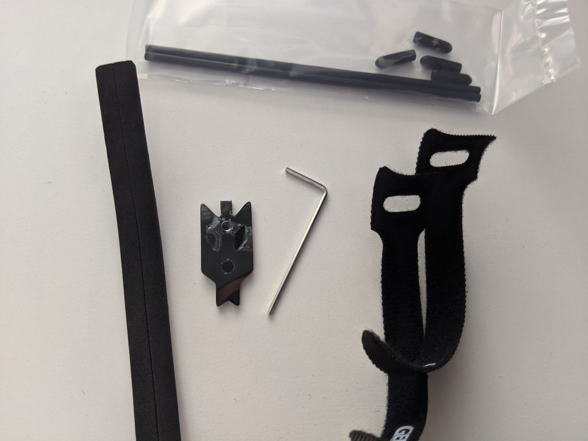

And these stock props.

You get a total of 8 props (4 sets).

And finally here is the [GEPRC Phantom][1] unwrapped.

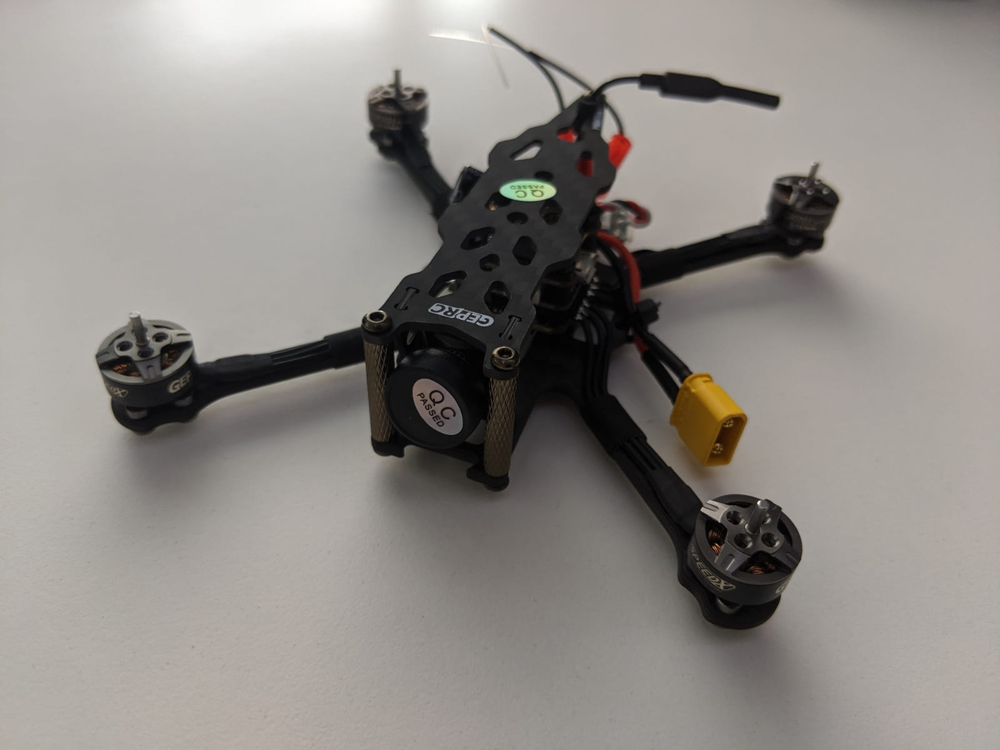

### üìù Specifications

The motors are CR1103 8000KV motors, the quad is claimed to be rated for 2S - 3S or 2S - 4S (I saw both entries on the product page, but fear not, I tested it on 4S for you so you don't have to, more on that later). An XT30 connector is used for power delivery.

The frame is stiff, unibody and resembles a stretched X frame.

GEPRC has installed a capacitor, which if not a nice touch, is starting to be a requirement with most micros nowadays. The frsky xm+ receiver antennas are routed out the back through a small 3d printed part, which works great. The vtx antenna in a similar fashion is routed through a hole in the top frame.

The FPV camera is Caddx EOS2 - very lightweight and does what it does pretty well. The VTX goes up to 200mW, the stack is a 16 x 16 with an F411 flight controller, and 12A rated ESCs.

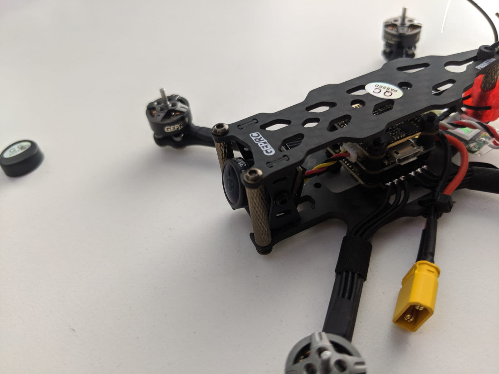

Here is how the XM+ receiver was zip-tied to the available space in the back of the quad.

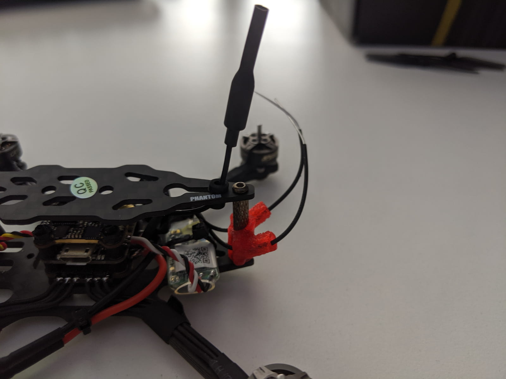

### ‚öô Setup

To get up and running, this is what we need to do:

**üîó Bind the receiver to the radio**

Same procedure as always for any XM+ receiver: press and hold the bind button on the receiver while plugging in the battery. Set the radio in bind mode. End bind mode on the radio and power cycle the quad. At this point, the LED should be solid green and a stable link should be established.

**üì° Configure RSSI, channel mapping and modes in Betaflight**

First, add 2-3 switch inputs via the `Mixer` screen on your radio (I'm using a [Taranis X-Lite][10], but this process is identical for most Taranis radios).

Next, whenever we are configuring a quad in Betaflight, remember to always **take off the props**. Even on those little drones. It's a good habit to get into.

Here are the most important things to check in Betaflight when setting up a new quad.

In the configuration tab check if the quad is in 'props in' or 'props out' mode. It's more common to be in 'props in'. As you can see in the picture below, that's how the GEPRC Phantom is setup out of the box.

You should be running DSHOT600 and make sure `MOTOR_STOP` is off.

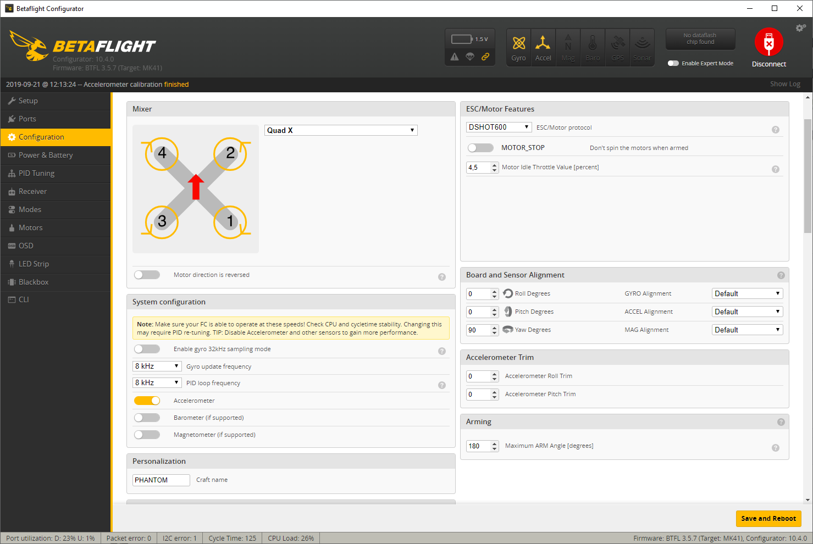

Next, if you are using the FrSky XM+ receiver, make sure `RSSI_ADC` is off and the receiver is set to SBUS.

The rest of the configuration on this tab is not super critical, except for making sure `AIRMODE` is on so that your motors can keep spinning even when you pull the throttle all the way down in a flip, for example.

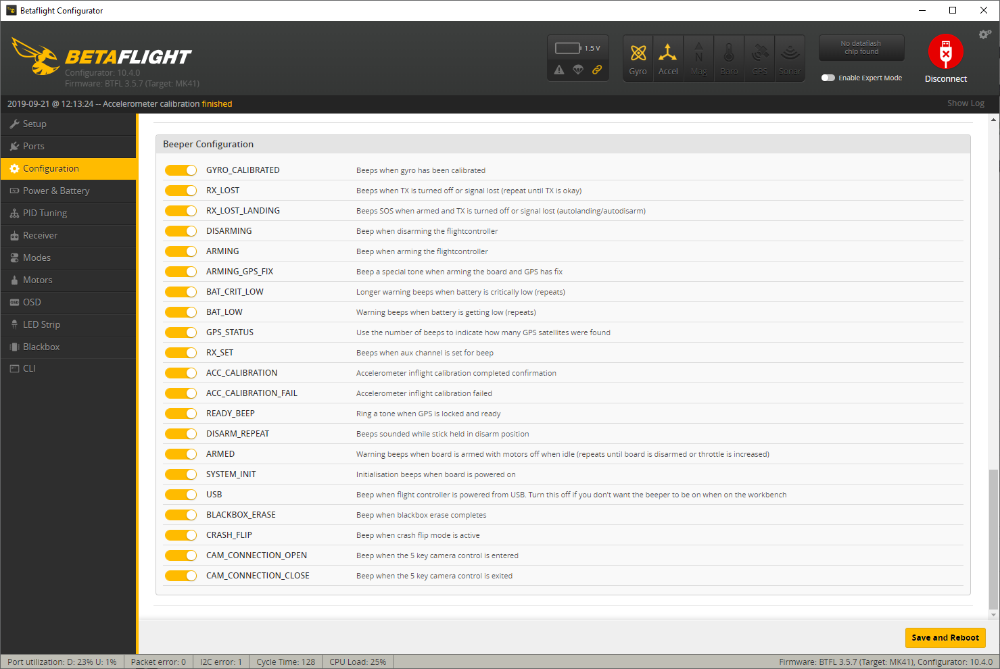

In the `Receiver` tab you wanna set the `Channel Map` to match your transmitter's settings. In my case, I had to change the **AETR1234** to **TAER1234**. That makes sure that your radio communicates to the quad on the right channels and it won't flip out when you arm it.

Next, set `RSSI Channel` to **AUX12** which will give us signal strength telemetry.

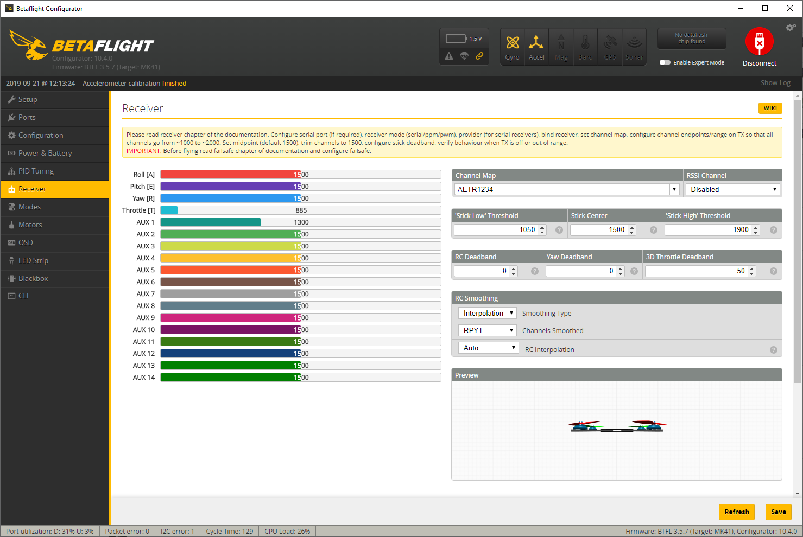

In the `Modes` tab, it is finally time to set up our quad for taking off by designating an arming switch. For example, if you have assigned in your radio's mixer setting a switch to Channel5, that's what AUX1 is here in the modes tab. If you also added a switch to Channel6, this is represented here by AUX2 in the dropdown.

You wanna watch the small yellow pin and make sure it is within a range you define with the sliders. If you plug in your quad (props off!) you can test how your switches work in real-time, as they will move the yellow pin when you activate a switch.

So make sure you have a working arming switch and you are good to go. You can also set up different modes, beeper, and turtle mode if you want to. I just fly acro so, I make sure that Angle or Horizon modes are not activated.

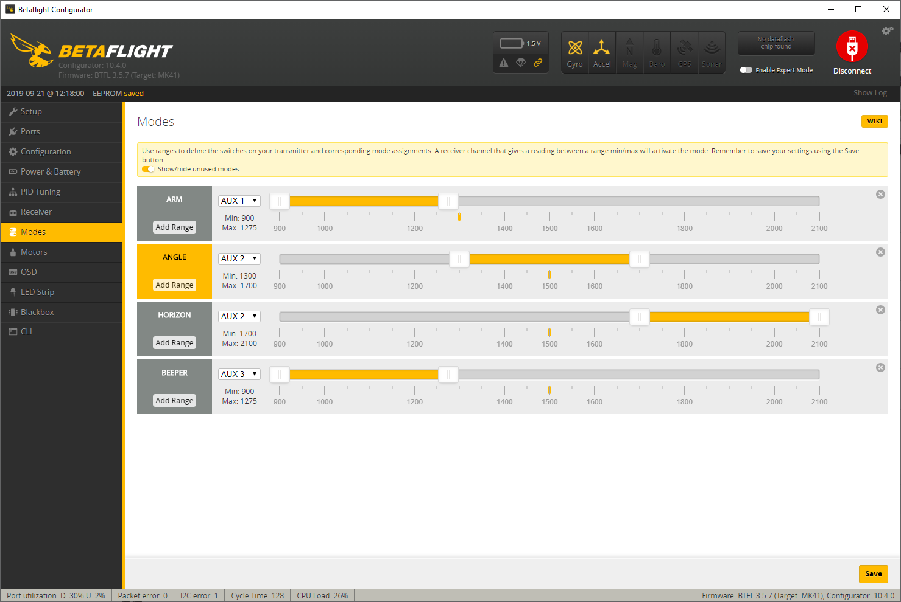

In the `OSD` tab I only had to turn on **Rssi value** to be displayed.

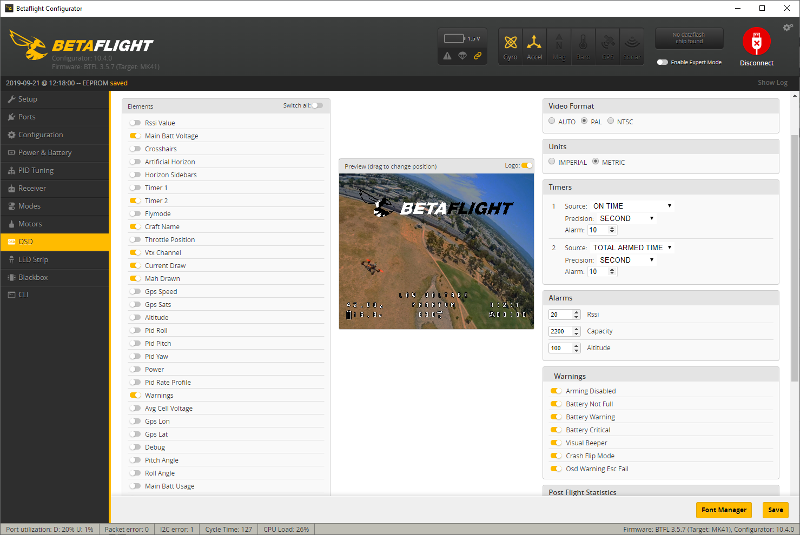

Finally, here's the rest of the configuration and a [link to a CLI dump of the GEPRC Phantom's settings](BTFL_cli_PHANTOM_20191013_161718.txt).

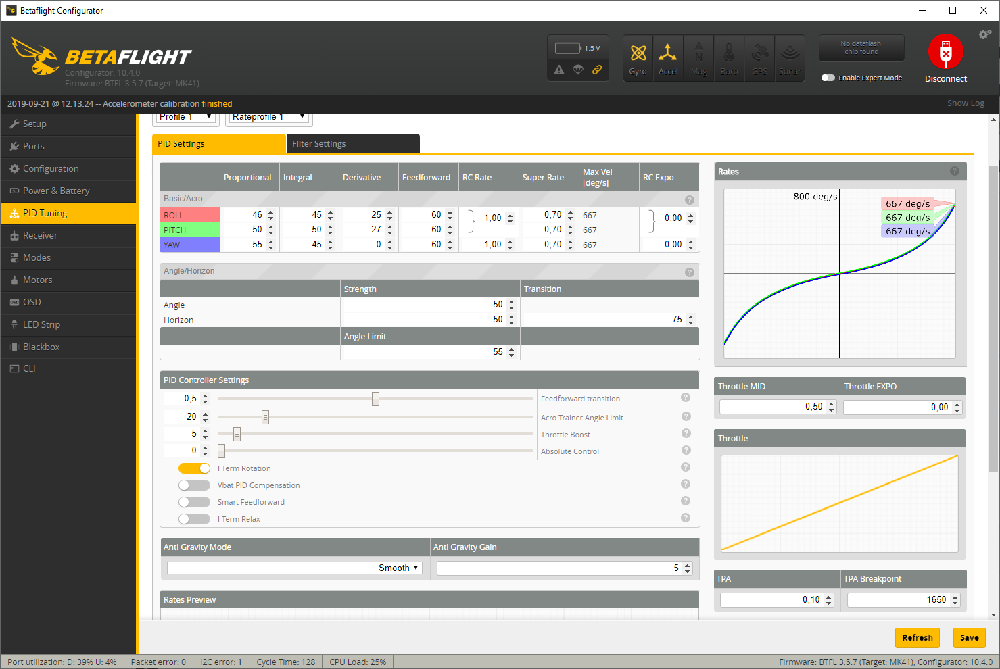

**‚õì Install: antenna tubes, landing legs, battery rubber pad, velcro strap, and props**

All those things are quite straight forward but should not be underestimated, as the last thing you want when flying your brand new quad is to chop off the receiver antennas. And speaking of chopping off, be careful when cutting the antenna tubes as you don't want to clip the antenna itself too.

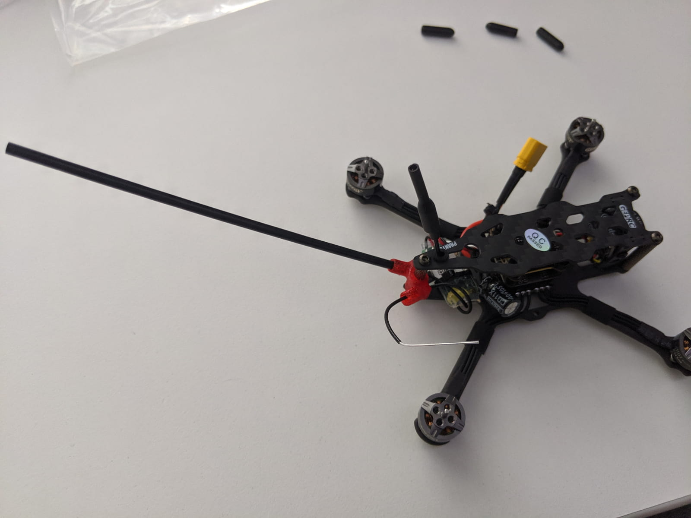

Then just put on the antenna tube tip. And do the same as the other receiver antenna.

Because we're gonna be mounting the battery on top, we can install some landing legs, from soft sticky foam. Cut short pieces and stick them under all 4 arms.

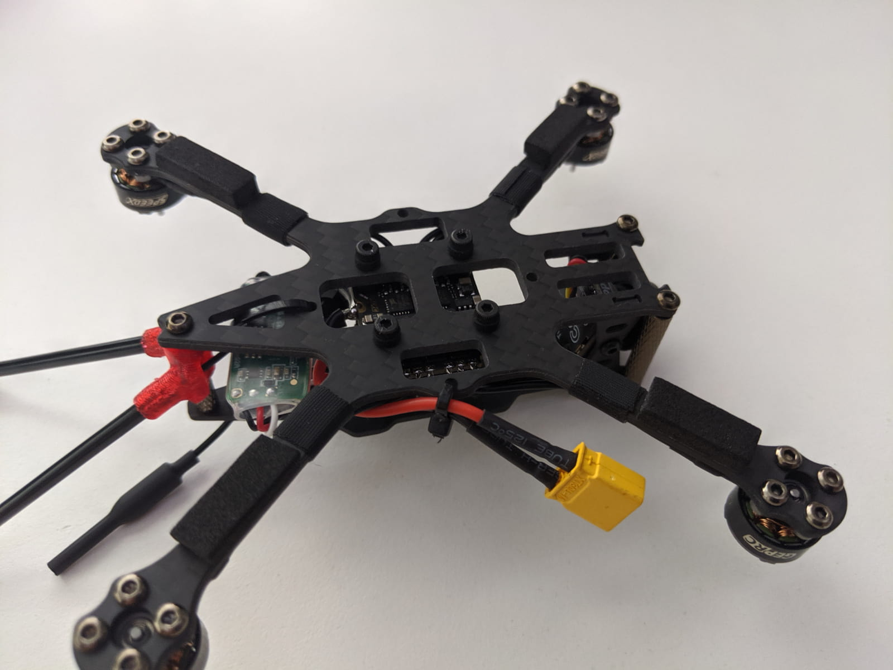

Finally, install the rubber battery pad which helps a lot with grip and holding the battery in place. Also, run a velcro strap around the top plate of the frame.

All in all, this adds up to a total all-up weight of **63 grams** without a battery (probably a couple of grams lighter with the bi-blade props).

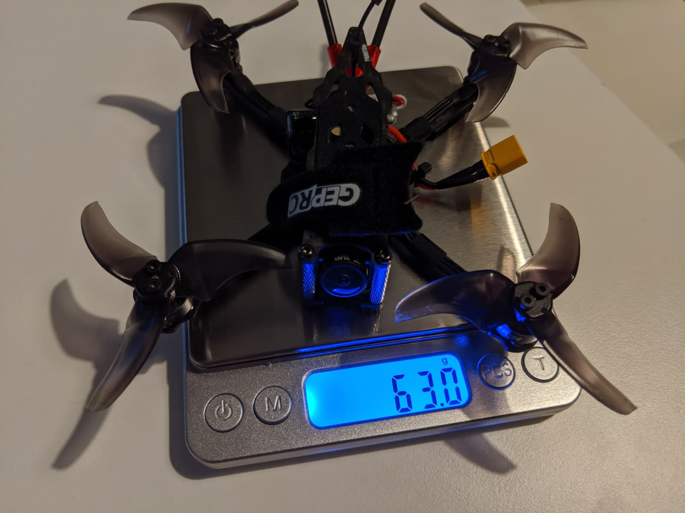

And **83.9** grams with a Betafpv 2S 350mah battery.

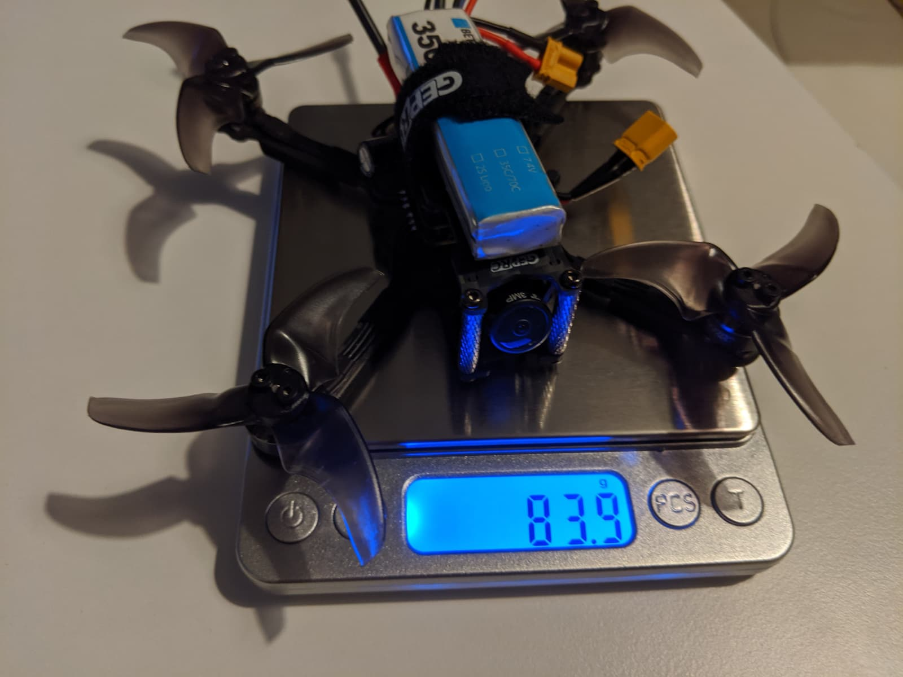

Let's go fly this quad around!

### üöÅ Flying

And fly it I did üòç! I like testing drones extensively and getting some proper stick time before I dive in to review them. And in this case, I've been able to fly this thing for about a month give or take.

When it comes to flying the [GEPRC Phantom][1] quickly became one of my favorite drones to fly.

And while I'm somewhat new to the whole toothpick class drone action, I have a fair bit of understanding about it and how it should work. **, In general, you want your models to be very lightweight**. I'm oversimplifying it, and there are a lot of factors and combos you could try, tweak and try different props, motors, AUW (all-up weight).

That's why I wanted to and managed to carry out many tests flying with different batteries and props. And there's, even more, to do in the future.

So I have flown it on a 3s 300 mah battery, 2s 350 mah battery and I even tried flying it on a 4S 520 mah battery, but that last one didn't work out so well. I also tried 2 different times of props.

#### 🔋🔋🔋 3S 3️⃣0️⃣0️⃣ mah

Here is the 3S 300 mah battery maiden flight.

  <iframe width="560" height="315" src="https://www.youtube.com/embed/aCDpAAAzQAM?list=PLt8_2AobQjAccJ4BKqNcfsUU6sl37TH45&index=0&rel=0" frameBorder="0" allowFullScreen title="GEPRC Phantom maiden flight on 300mah 3S"></iframe>

Immediate impressions from the maiden:

- So quiet! I could barely hear the props just 30 meters (32 yards) away!
- Very efficient, draw little amps (~ 2-4)
- Smooth flying and easy handling
- The tune is locked in!
- I could get into this!
- Where is the barrier between this and a 5-inch quad?
- Flight time's a bit short on this battery we need to test other types

And I have so many thoughts I want to share with you, this little fella made me think and think hard.

It handles nice in corners, although me coming from tri-blade higher pitch props, I do expect a bit more grip in turns. I love the Avon flow 5 props on mini quads, but they also draw significantly more amps at the higher end of the throttle. This is easy to get used to in just a few minutes. Now, in terms of speed the [GEPRC Phantom][1] toothpick is plenty fast and legit flies like a 5 inch quad for the better part.

**It is genuinely fun to fly!**

And I've had it for a little over a month now and I've ripped a ton of batteries through it even though the weather was mostly bad and rainy and cold with little opportunities to fly. **What I've also noticed was that I started going for dedicated runs with micro drones out.**

I always used to go out flying with my 5-inch quads. But I found myself going with just the micros and still having a ton of fun. If anything it makes things even easier, because charging the batteries is much faster, discharging them after coming home if you have leftover unflown ones is also faster, finding a spot to fly (depending on where you live this may be a big one for you or not a concern at all). I have a few spots around here where I really wouldn't fly a 5-inch quad but are perfect for a toothpick.

**The only thing I would like to improve on this quad is the flight time!** It's not the lousiest (around a little under 3 minutes depending on how much you push it), but not the best on my 3S 300mah and 2S 350mah batteries. I love flying the [GEPRC Phantom][1] so much, that if I could only nail the flight time with some sort of props and battery combo that fits those motors, I would be very, very happy! And this is what lead me to want to do a lot of different tests. The target was to get a flight time of between 3:30 - 4:00 mins.

#### 🔋🔋 2S 3️⃣5️⃣0️⃣ mah

Well, you could technically get a flight time of 4 minutes even on a Betafpv 2S 350mah battery with some preservation phases between pushing it and if you run the battery down waaaay low as I did üò¨. It was fun though! I also found my favorite spot to fly the Phantom.

Flying the [GEPRC Phantom][1] on a 2S 350mah battery, stock bi blade props.

  <iframe width="560" height="315" src="https://www.youtube.com/embed/HjSIa3_1We4?list=PLt8_2AobQjAccJ4BKqNcfsUU6sl37TH45&index=9&rel=0" frameBorder="0" allowFullScreen title="GEPRC Phantom 4 min flight on 2S 350mah"></iframe>

**In between of battery testing I also did some prop testing and that was mainly for 2 reasons: improving handling in turns and oscillations from the stock props after the slightest impact.**

#### 🌀🌀 HQ 2.5 inch bi-blade props

The stock props fly well, but even the smallest bump causes them to oscillate on subsequent flights. Maybe the plastic is too flimsy, I don't know. It's also funny but it doesn't seem to impact the flight characteristics, but the noise is annoying and especially so given how quiet this quad is otherwise. I was also told recently that the [HQ 2.5 inch bi-blade prop][3] (which looks very similar if not the same as the stock props) is stiffer and does not have the same issues. We will have to wait and see on that one. Those are in the mail and I will update as soon as possible.

#### 🌀🌀🌀🌀 Avon 2 inch quad-blade props

This one was for science and out of curiosity and the conclusion is: **lol, don't do this**. It made no sense, made the quad fly like garbage, drew a lot more amps and didn't feel nice at all. This type of prop is better left to cinewhoops.

  <iframe width="560" height="315" src="https://www.youtube.com/embed/Ipc7UiDNyIA?list=PLt8_2AobQjAccJ4BKqNcfsUU6sl37TH45&index=14&rel=0" frameBorder="0" allowFullScreen title="GEPRC Phantom with quad blade avon 2 inch props"></iframe>

#### 🌀🌀🌀 Avon Rush 2.5 inch tri-blade props

This one, though, was a winner for me! The [Avon Rush 2.5 inch tri-blade props][4] improve the handling in turns and once again give me this "point and go" feeling when flying the [GEPRC Phantom][1]. At the same time, these props did not take away from the speed or ruin the flight characteristics in any way and **even the amp draw (where I thought the biggest trade-off would be) was increased insignificantly**. Jackpot!

  <iframe width="560" height="315" src="https://www.youtube.com/embed/f5icIS4Mr98?list=PLt8_2AobQjAccJ4BKqNcfsUU6sl37TH45&index=15&rel=0" frameBorder="0" allowFullScreen title="GEPRC Phantom with tri blade avon rush 2.5 inch props"></iframe>

#### 🔋🔋🔋🔋 4S 5️⃣2️⃣0️⃣ mah

The 4S flight didn't work out so well. Partially because of the battery velcro strap (used stock, although too short). I guess it in a turn the strap snapped off and the battery fell on one side and pulled the quad down as it's quite heavy. Check it out towards the end of the video. This happened a few times, and I think I lost a motor due to it.

  <iframe width="560" height="315" src="https://www.youtube.com/embed/5ai_mL7htww?list=PLt8_2AobQjAccJ4BKqNcfsUU6sl37TH45&index=18&rel=0" frameBorder="0" allowFullScreen title="GEPRC Phantom trying out a 4S 520mah battery"></iframe>

I'm still carrying out the investigation and will update here with more info as soon as I know more. On Banggood's product page and GEPRC's site, I saw somewhat contradicting information regarding how the quad is rated. I saw the information for both `2S-3S` and `2S-4S`. At this time, **I don't think I burned a motor due to flying on a 4S battery**, rather when the battery fell to the side, maybe the quad went crazy trying to overcompensate with that particular motor? Is that a thing?

My fault, I don't blame the parts and when testing all sorts of crazy things, failures are bound to happen, but in the end, I'm still happy to do and share that test with you so maybe many others can learn from it, without losing a motor üòÖ

My main motivation for the flight was to increase the flight time. Of course, going up in battery size adds weight and this is your toothpick's nemesis.

Flight characteristics:

- The quad was noticeably heavier (not in a good way either)
- It wasn't going any faster compared to flying on smaller 2S and 3S batteries
- Flight time did not in fact increase

This battery was a stretch and I kind of knew that going in. Probably my next test will be on a 2S 450 or a 3S 400? That must be the perfect spot for the [GEPRC Phantom][1].

### üîù Upgrades

In terms of upgrades, I would recommend changing the stock props to similar but stiffer like the [HQ 2.5-inch bi-blade prop][3]. Or alternatively, you could try to find something else that works well for you, as I mentioned I like the [Avon Rush 2.5 inch tri-blade props][4] because of the control authority.

The other thing I would consider upgrading (if it works out) is the camera. This is not because the FPV camera is bad, not at all, it works perfectly, but I am curious if I could get some HD footage from this quad if I upgrade to a [RunCam Split 3 Nano][5] camera.

A full range receiver (‚úÖ), a flight time of ~ 4 minutes on average, even better handling without sacrificing speed (‚úÖ) and HD video recordings while flying this quad would make me beyond happy. I don't think I want anything else if I could get those and I will be working on getting there during the winter, so stay tuned.

### üìë Conclusion

There are currently maybe about 4-5 awesome value for money toothpick class drones out there and the [GEPRC Phantom][1] is definitely among them. It's a great value for what you get, and I hope I managed to convince you **how much fun it is to fly**! This is **my most thorough and the longest flying section of a blog post I've ever written**. I just flew it so much, very quickly and wanted to try out so many things.

The tune and the flight characteristics are great, having a full range receiver is a blast! I loved flying my [Mobula7 HD][6] for the better part of 2019, it's come to show me how powerful micro drones have gotten. In my opinion, the Mobula7 HD flies awesome. **The GEPRC Phantom flies even better! And so much faster**. It just makes you wanna pretend to be a racer and zip around at top speeds around the park. The good news here is that it is very quiet and unless you are very reckless, you should do no one any harm or cause disturbance or annoyance.

Also if staying under the 250 grams limit is important to you, this is a great option to do so, and still fly almost as if you are flying a 5-inch quad. I should also mention that unwillingly but admittedly I gave the Phantom quite the test flying it over concrete all the time and smacking it into the ground a bunch of times, always at high speed. No issues whatsoever, no lost screws, no issues with the frame.

Having a **full range receiver on it is a big difference** if you compare to other micro drones with an SPI based built-in receiver. No more of that "have to stay within less than 100 meters from myself or I'm gonna get a failsafe".

Flying a toothpick like the [GEPRC Phantom][1] has been somewhat of a mind shift too. I want to go explore more and new fpv spots. There is less hassle in getting ready for flying or coming back home from flying. My goal is not to bash on flying 5-inch quads, though. I still love flying those, but it has been very interesting to me that flying micros like that is doable with the same level of satisfaction. **I went out on a dedicated micro drone flight session many times and it was a lot of fun!** Just my 2 cents, your experience may vary depending on what you prefer.

I will be testing even further with that quad during the winter (or maybe even build my dream toothpick), but I think that if I add an HD camera to the [GEPRC Phantom][1] and use a slightly bigger battery that would be my dream quad. We'll have to wait and see, so sign up for the [newsletter][7] or [YouTube channel][8] and stay tuned.

I will also have an upcoming review on the Emax Tinyhawk Freestyle very soon and we will see how those 2 compare to each other. There are some interesting trade-offs and depending on what you want either can easily be the better option for you.

But in the end **I can easily recommend the [GEPRC Phantom][1] because I can easily say that if you buy this one, you're gonna have a ton of fun and enjoy yourself.**

Happy toothpick flying!

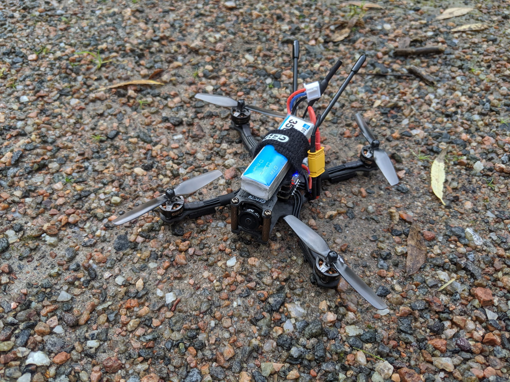

P.S.: Here's the [complete playlist of more than 18 (and counting) raw flight footage videos of the Phantom][9] on my second channel:

[0]: Linkslist
[1]: https://bit.ly/geprc-phantom
[2]: https://www.youtube.com/user/eatkabab
[3]: https://bit.ly/hqprop-25
[4]: https://bit.ly/avon-rush-25
[5]: https://bit.ly/runcam-split-3-nano
[6]: https://bit.ly/mobula7-hd
[7]: /newsletter
[8]: https://www.youtube.com/channel/UCCh3SK2EktDdOQkEOTDmSCg
[9]: https://www.youtube.com/watch?v=aCDpAAAzQAM&list=PLt8_2AobQjAccJ4BKqNcfsUU6sl37TH45
[10]: /fpv/set-up-taranis-x-lite-update-opentx/
