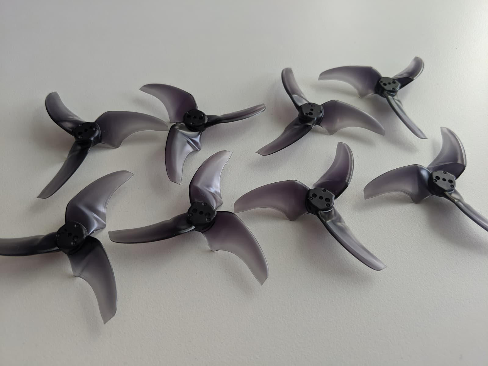
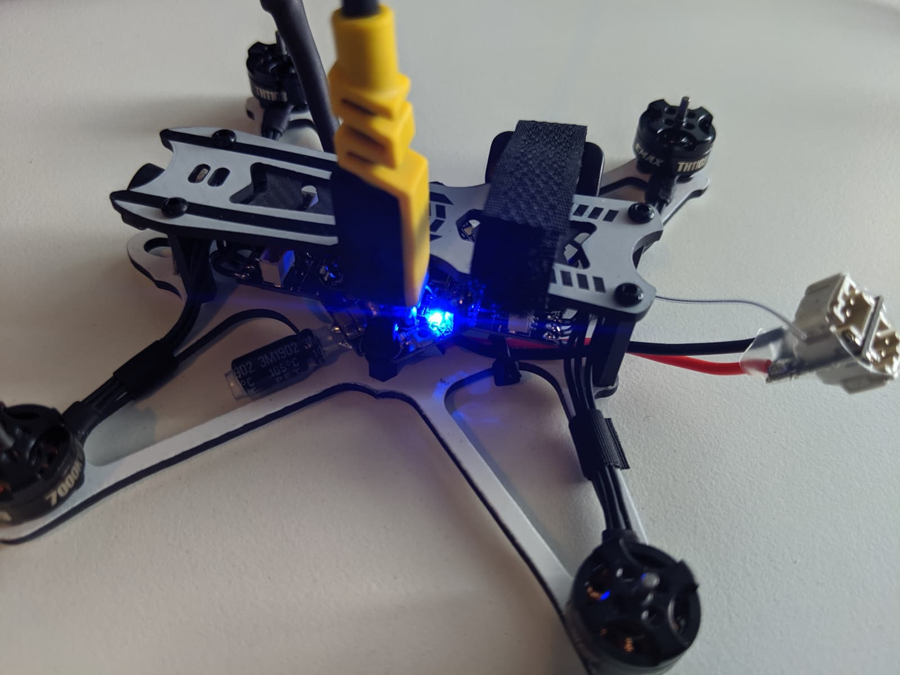
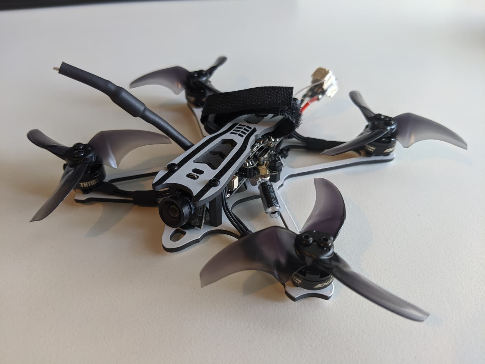

Binding Procedure
Binding is the process of uniquely associating a receiver to a transmitter module. A
transmitter module can be bound to multiple receivers (not to be used
simultaneously). A receiver can only be bound to one transmitter module.
1.Hold the bind button for 2 seconds while the flight controller is already on. When
the Blue LED is on, it means the receiver is in BIND MODE
2.Turn on the transmitter, make sure it is set to D8 mode, and then set it into bind
mode. When the BLUE LED on the flight controller starts flashing, it means bind
successful.
3.Power cycle the flight controller and take your radio out of bind mode.

manual - https://emax-usa.com/download/Tinyhawk_Freestyle_BNF_Instruction_Manual_v1.2.pdf

camera angle not adjustable

1s 2s, 450mah, 300mah...

xt 60 mod,

AVAN Rush 2.5 Inch Prop - BLACK

[0]: Linkslist
[1]: TODO:
