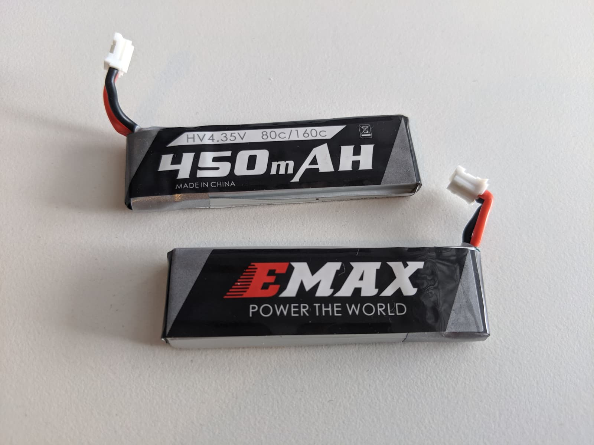
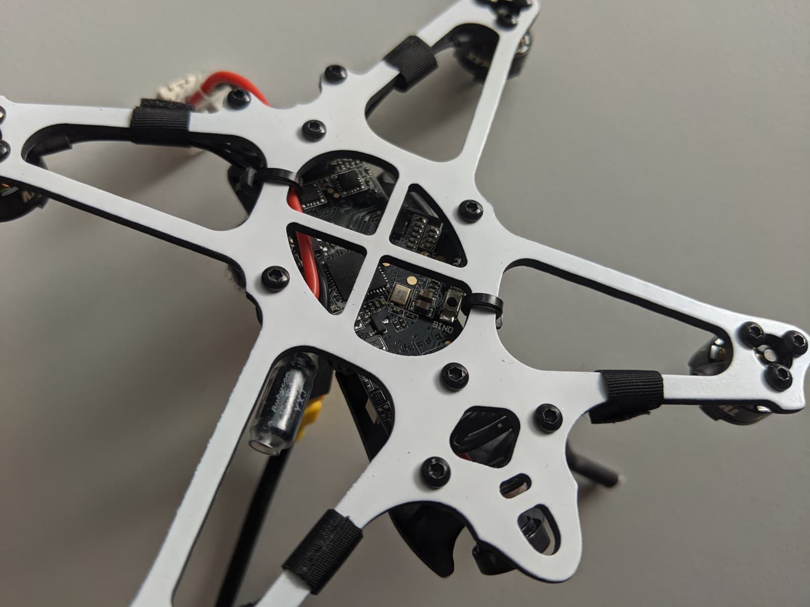
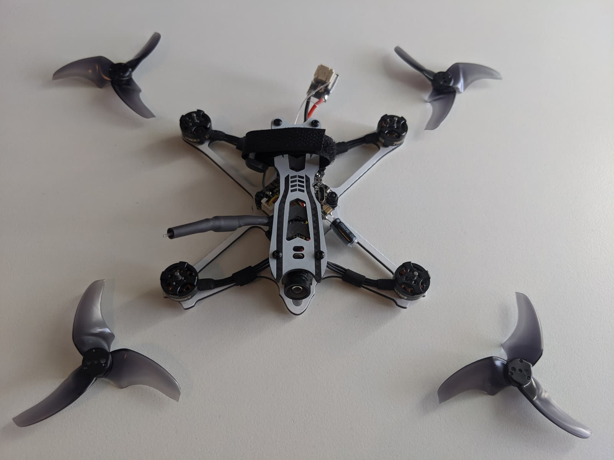
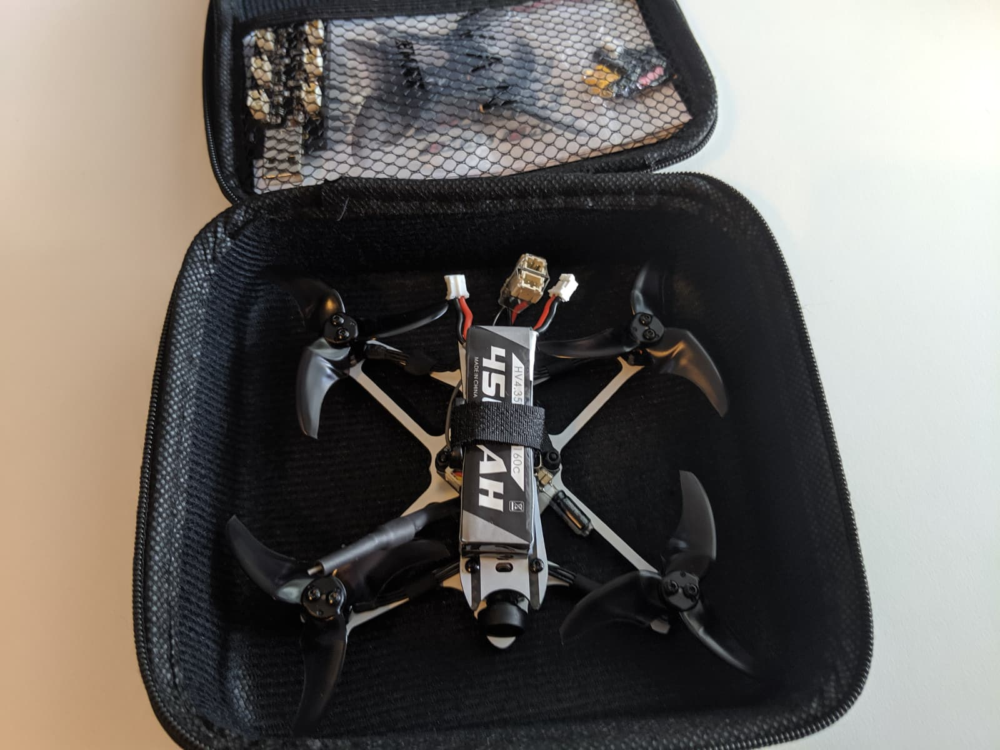

Micro drones are quickly becoming one of my favorite class of drones in 2019 and the [Emax Tinyhawk Freestyle][1] is one of the reasons why. Flying this thing makes me really wonder how is it possible something that small to fly that much like a 5" quad and to be so fast and enjoyable.

I was fortunate enough to be able to compare the [Emax Tinyhawk Freestyle][1] to the [GEPRC Phantom][2], which is also one of the best toothpick class drones that came out in the middle of 2019. And it's funny that although both of those quadcopters are really, really amazing they are also quite different in terms of what they offer.

So stay tuned if you are in the market for one of those. Let's take a deeper look and compare them. I think this is going to be the right article for you.

### Table of contents

- [📦 Unboxing](#unboxing)
- [📝 Specifications](#specs)
- [⚙ Setup](#setup)
- [🚁 Flying](#flying)
- [🔝 Upgrades](#upgrades)
- [📑 Conclusion](#conclusion)

### 📦 Unboxing

Emax Tinyhawk Freestyle comes in a nice hard shell case, great for packing in the quad and carrying it around.

This is everything you get inside the case.

You get 2 450mah 1S batteries with a PH2.0 connector, an USB charger board for up to 6 such batteries, some spare screws and stand offs, a manual and of course stickers.

Among the spare parts we find an XT30 connector, in case you want to change the PH2.0 connector the quad comes with. We also have this PH2.0 "jumper" that is used to terminate one of the battery connectors so you could fly the quad on 1S.

You get 2 full sets (8 props) of the [Avon Rush 2.5"][3] props.

And of course the quad itself.

### 📝 Specifications

### ⚙ Setup

NOTES:

Binding Procedure
Binding is the process of uniquely associating a receiver to a transmitter module. A
transmitter module can be bound to multiple receivers (not to be used
simultaneously). A receiver can only be bound to one transmitter module.
1.Hold the bind button for 2 seconds while the flight controller is already on. When
the Blue LED is on, it means the receiver is in BIND MODE
2.Turn on the transmitter, make sure it is set to D8 mode, and then set it into bind
mode. When the BLUE LED on the flight controller starts flashing, it means bind
successful.
3.Power cycle the flight controller and take your radio out of bind mode.

manual - https://emax-usa.com/download/Tinyhawk_Freestyle_BNF_Instruction_Manual_v1.2.pdf

camera angle not adjustable

1s 2s, 450mah, 300mah...

xt 60 mod,

AVAN Rush 2.5 Inch Prop - BLACK

NOTES ☝

FLYING 👇

### 🚁 Flying

The Emacs Dining Hall free style flies absolutely spectacular. It's one of the quads that flies so well that I had absolutely no desire to do it further than what I got initially from flying it on those one as four hundred fifty million power batteries. Either by using one or two in series.

Immediately during the maiden flight right after I took off I noticed how much power this thing has and how locked on the tune really is. Really? Great job by Emacs there. A huge deal there to do with how the Emacs tiny hawk, freestyle handles, of course are the A-1.

Rush 2.5 inch props. Try blade props. Those give you really precise handling. Wow at the same time, they don't really seem to consume a ton of amps. The freestyle is so lightweight. That. You really won't be we won't be able to believe how fast it goes from the moment you take off as soon as you punch that struggle.

Another thing to note is that the camera is four by three camera and if you're using by default, you're goggles in 16 by nine mode, you have to do some adjustment the good news is that you do get used to it after a while it gives this slight fish islands effect.

But it's. Not as bad as you may initially think you do get used to it. The max tiny hawk, freestyle flew, so well on these 1s450 million power batteries that I have. That I actually had little to no desire to even test another batteries, it's really that great it flies amazing.

You just completely lose yourself and enjoy yourself flying around that what seems to you like real really fast speeds. And you get flight times of easily four to five minutes depending on how you fly. No voltage side whatsoever really really enjoyable. I'm also happy to report that. I did try flying the quad on just the one as 450 million power battery.

And the biggest surprise to me was that it flies almost identity to how you would fly it on two of the one as four hundred million fifth four hundred fifty million power batteries. Really really almost identical. Now since then my preferred combo is to just fly it on two of those batteries.

Both connected to the battery lead connector. And that's one of the major upsides of the freestyle tiny fog because it allows me to reuse a lot of these batteries that are actually had like no other plot to use the monitor at this point. And they are good batteries. 450 milliamp hour also seems to be like a good way to power ratio for those type of little micros.

And really hit the switch but with the freestyle.

In terms of flight characteristics, and maybe a little bit curious to try out some. Live props on the. On the style and see how that changes the flight characteristics, although I also got admit that have almost zero desire to really we can tune. To much on it just because it really is that enjoyable to fly.

Another big benefit of the image time of freestyle is that how different your flying sessions look? Starting already from charging your batteries before you leave it's a whole lot easier to just charge those one SPH2. Port batteries, you just plug them in a small charger charging up real quick and you get out to the film you do your flying you come back.

That's it.

FLYING 👆

### 🔝 Upgrades

CONCLUSION 👇

### 📑 Conclusion

In conclusion then the inactinic of freestyle, what for you.

2019 has been a great year for for a lot of these microns a lot of these toothpicks classrooms there are a lot of really viable and amazing options out there. I feel like the best thing about those ones is that you can pick one that is directly tailored to your situation.

And if I compare the gap RC Phantom with the Emacs tiny hope free style one of the things that immediately becomes obvious is that even though both of these quads fly really really awesome. It also a little bit different. And of course there is always room to improve and upgrade them as well.

But from what you get in the box already the max tiny, hopefully style seems to be best suited to someone who has a lot of those 1s. 450 million power batteries with a pH 2 connector. The quad really flies amazing with those you will get really lengthy flight times of like four to five minutes.

And the flight experience is super enjoyable. So. This this really is a big deal when one may be of the biggest deal to me with this one because it does allow me to use all these batteries.

I I assume that the blood would not fly as nice on those batteries. But was really pleasant to surprise the it actually flies amazing.

Some of the downsides here are the lack of a full range receiver, so you don't get a full range receiver what I think the board supports installing one, so if you would like to upgrade to one. Could do so. That's not great expense and by adding just a little bit to extra weight.

One.

The camera is fairly decent and very very lightweight, so I understand why they've picked it up. But you could consider upgrading to some sort of an HD camp if recording is even the HD video is important to you however, what would be the impact on flight characteristics so that added up weight remains to be seen.

It's one of the tests I would like to do in the future.

But regardless if you're just getting into the floppy or you have in flying. Drones for a while now. The next 24 really is a. Is synonymous with the word fun. It's. Got a locked on tune and it's really amazing to just enjoy and fly around. And much like most of the micro plants, you could just go fly it in parks.

It's relatively quiet. It's not gonna bother anyone. You shouldn't feel like a minister society. You're flying one of those little guys.

Just really really enjoy yourself. Happy flying.

CONCLUSION 👆

[0]: Linkslist
[1]: https://bit.ly/tinyhawk-freestyle
[2]: https://bit.ly/geprc-phantom
[3]: https://bit.ly/avon-rush-25
