Micro drones are quickly becoming one of my favorite class of drones in 2019 and the [Emax Tinyhawk Freestyle][1] is one of the reasons why. Flying this thing makes me really wonder how is it possible something that small to fly that much like a 5" quad and to be so fast and enjoyable.

I was fortunate enough to be able to compare the [Emax Tinyhawk Freestyle][1] to the [GEPRC Phantom][2], which is also one of the best toothpick class drones that came out in the middle of 2019. And it's funny that although both of those quadcopters are really, really amazing they are also quite different in terms of what they offer.

So stay tuned if you are in the market for one of those. Let's take a deeper look and compare them. I think this is going to be the right article for you.

### Table of contents

- [📦 Unboxing](#unboxing)
- [📝 Specifications](#specs)
- [⚙ Setup](#setup)
- [🚁 Flying](#flying)
- [🔝 Upgrades](#upgrades)
- [📑 Conclusion](#conclusion)

### 📦 Unboxing

Emax Tinyhawk Freestyle comes in a nice hard shell case, great for packing in the quad and carrying it around.

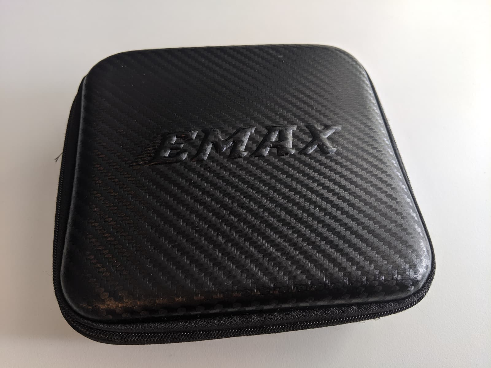

This is everything you get inside the case.

You get 2 450mah 1S batteries with a PH2.0 connector, an USB charger board for up to 6 such batteries, some spare screws and stand offs, a manual and of course stickers.

Among the spare parts we find an XT30 connector, in case you want to change the PH2.0 connector the quad comes with. We also have this PH2.0 "jumper" that is used to terminate one of the battery connectors so you could fly the quad on 1S.

You get 2 full sets (8 props) of the [Avon Rush 2.5"][3] props.

And of course the quad itself.

### 📝 Specifications

The all in one board and the camera used in the Tinyhawk Freestyle are the tried and tested ones from the Emax Tinyhawk S (F4 (MATEKF411RX Firmware), with a 5A rated 4 in 1 ESC). The frame is a **carbon fiber unibody frame supporting a top mounted battery**. The micro USB port on the all in one board is conveniently exposed and easy to access for Betaflight configuration.

A capacitor is installed to the battery terminals on the board. The built-in SPI based receiver's antenna is guided out the back and is not likely to get chopped off by the props.

Speaking of batteries, this drone allows for top mounting of the batteries. The battery connector is Emax's interesting solution to allow plugging in 2 PH2.0 connectors (or just one if you use the jumper for the other slot).

The motors are the Emax branded TH1103 7000KV, spinning up Avon Rush 2.5" props.

CMOS camera, with no possibility to _easily_ adjust the angle (although I haven't needed to do that in my tests). 25mW VTX and a VTX antenna coming up and away from the side, out of the props' reach.

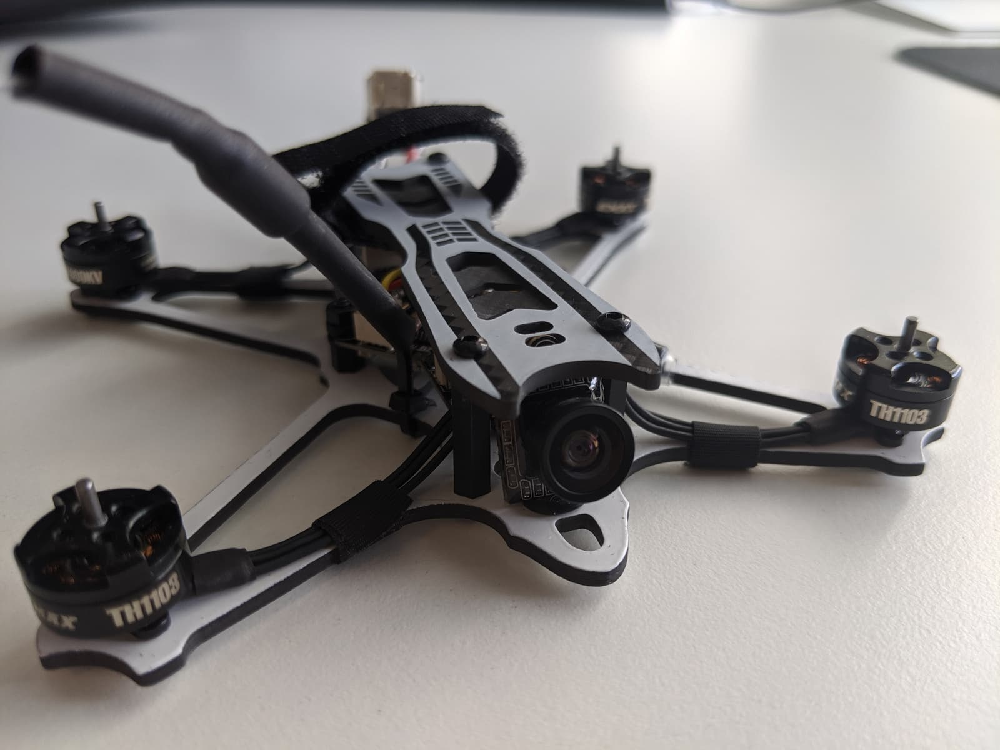

The quad comes in at **46.1** grams dry weight...

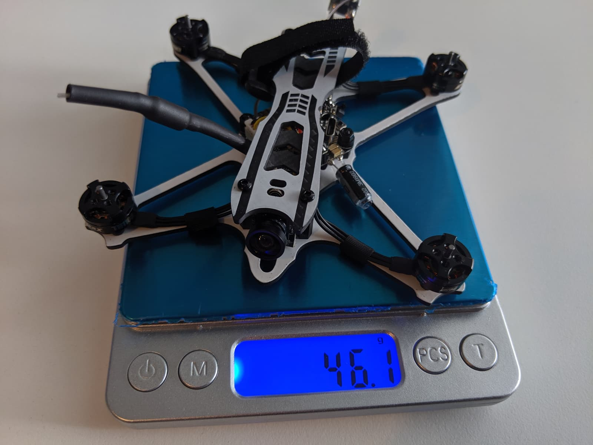

and with a couple of the 450mah batteries you get in the package...

the all up weight is 71.4 grams + another 4 x 1.3 = 5.2 grams for the props. Which brings us to a total of **76.6** grams.

Be careful with the provided charging board, not a biggie, but the battery slot plastic fell off when I disconnected a battery from it for the first time. You can just put it back in.

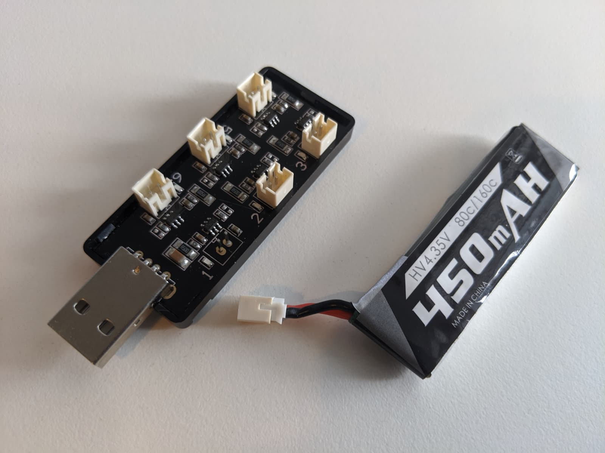

Or use one of these boards, which are a bit better (but not miles better really). And at least allow charging on the go via an XT60 source plug.

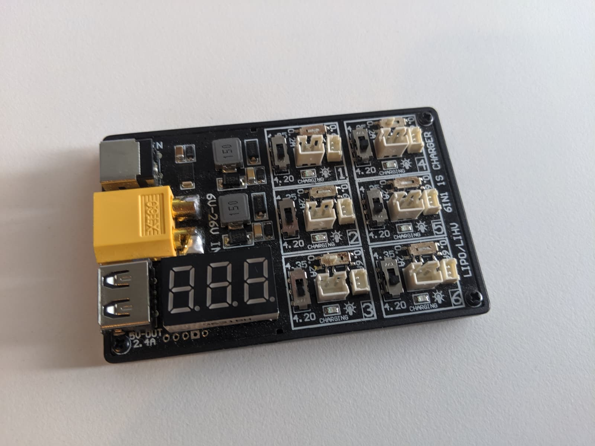

The overall build quality is pretty high with a lot of minor details handled very professionally and neatly. As always, reluctantly I've smacked it around quite a bit while flying over concrete, and there has been no issues with any component so far.

### ⚙ Setup

To get ready for flying, we need to:

**🔗 Bind the receiver to a radio**

You can **access the bind button fairly easily underneath the quad** and depress it with a hex head screwdriver for example. If you do use a screwdriver or anything else that conducts electricity, make sure you press the button only and you don't touch other components to prevent shorting the board.

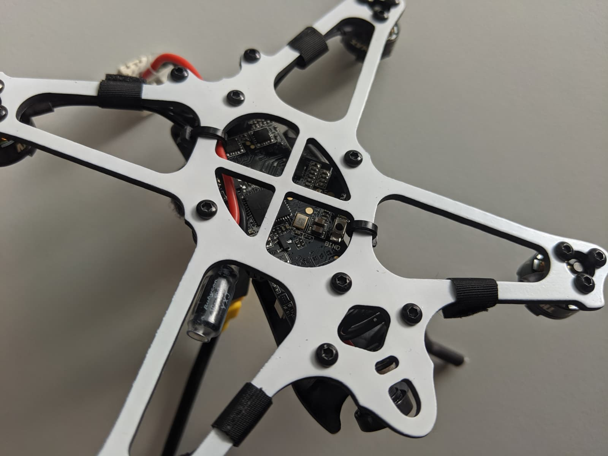

> _Binding is the process of uniquely associating a receiver to a transmitter module. A transmitter module can be bound to multiple receivers (not to be used simultaneously). A receiver can only be bound to one transmitter module._

1. Hold the bind button for 2 seconds while the flight controller is already on. When
   the Blue LED is on, it means the receiver is in BIND MODE
2. Turn on the transmitter, make sure it is set to D8 mode, and then set it into bind
   mode. When the BLUE LED on the flight controller starts flashing, it means bind
   successful.

   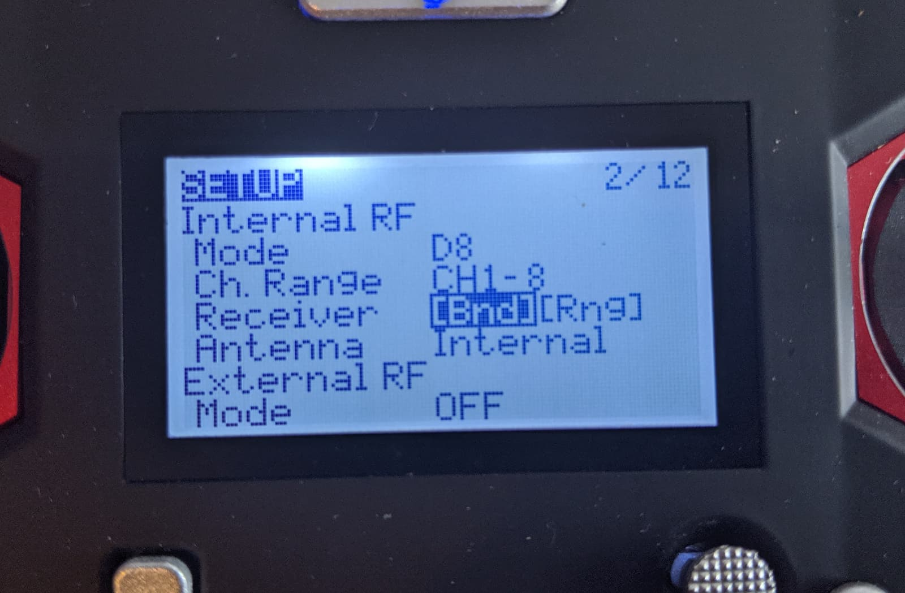

3. Power cycle the flight controller and take your radio out of bind mode.

**That's it, the receiver should now be bound**.

While we are here, we can assign a few switches in the `MIXER` tab. We need those for the Betaflight configuration in a bit. I've assigned switches to CH5, CH6, CH7. At the very least you need 1 switch for arming, so if you don't care for different flight modes, buzzer, turtle mode or anything else, it's ok to have only 1 switch assigned.

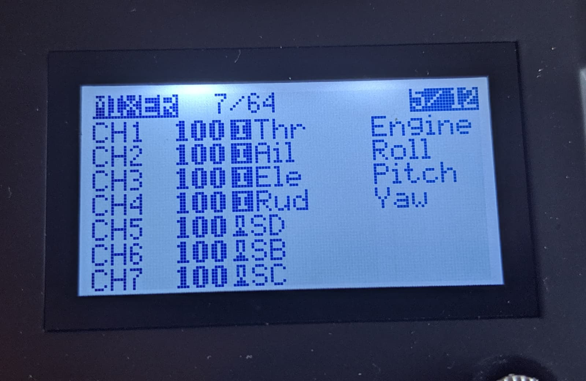

If you'd like to (recommended but not required), you can fine tune the stick end points via the `OUTPUTS` screeen on your radio. I've written previously on [how to do this step by step][6].

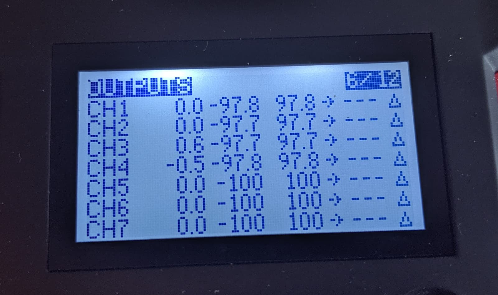

Next stop Betaflight.

**👀 Check the Betaflight configuration**

If you followed along, you should not have your props installed yet, but if you do, **REMOVE THEM**. It's always a good idea to do that, as the quad might flip out and cut you up or break your things. Not worth it, just take them off 😀. You can access the micro USB port on the left hand side of the flight controller board.

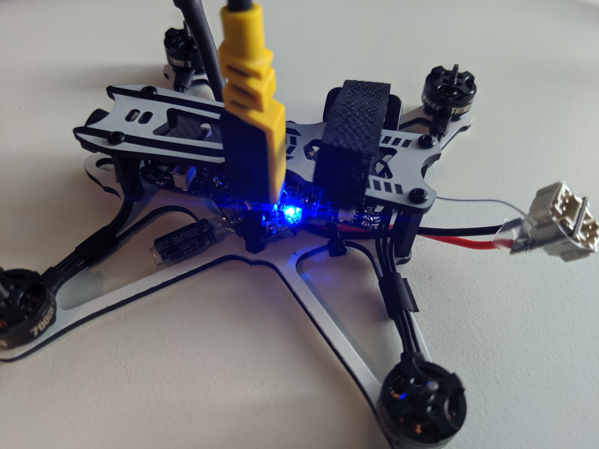

You can calibrate the accelerometer in the Setup tab if you have the Tinyhawk Freestyle on a leveled surface.

Not much to do on the ports tab, this is the default config.

In the Configuration tab, we see the [Tinyhawk Freestyle][1] comes in the default props in mode, so let's keep that in mind when installing the props later. `MOTOR_STOP` is off, which is good.

Next, verify that the receiver mode is set to `SPI RX support` and then `FRSKY_D` if you have opted in for an FrSky based built in SPI receiver, like I did. Also make sure `AIRMODE` is switched on, so that whenever you do flips or rolls and you cut the throttle to 0 during the maneuver, the quad won't completely shut down the motors.

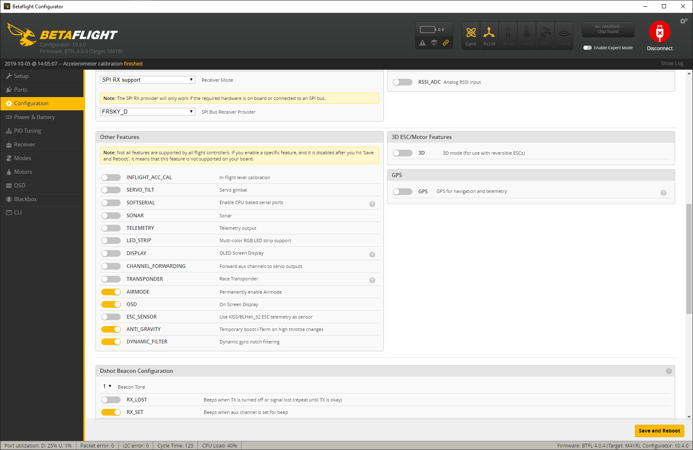

And here is the last page of the configuration tab default settings.

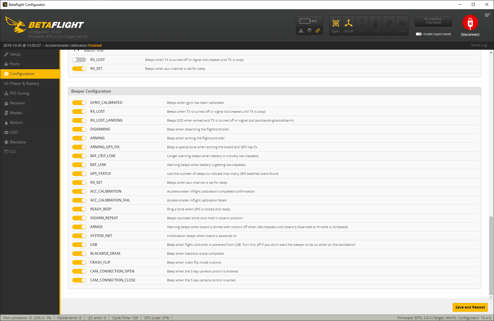

Emax Tinyhawk Freestyle Betaflight Power & Battery tab default settings.

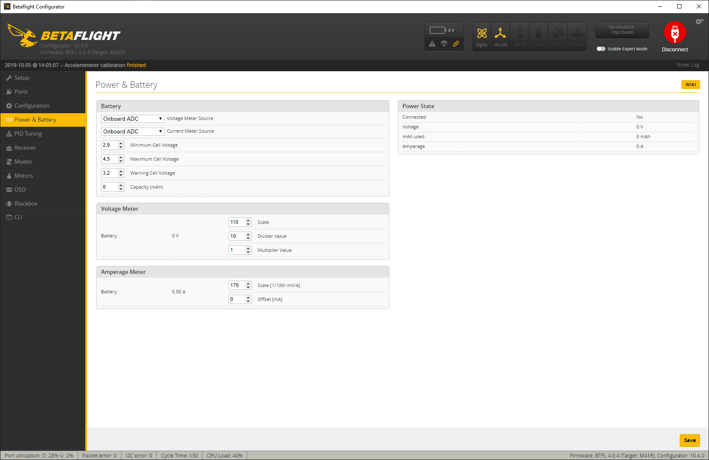

Emax Tinyhawk Freestyle Betaflight PID Tuning tab default settings. I didn't change any settings here, in order to test the configuration out of the box.

Emax Tinyhawk Freestyle Betaflight Receiver tab default settings. Pay attention to the `CHANNEL MAP` and make sure it matches the setup on your radio. The default `TAER1234` matched perfectly the default config on my Taranis X-Lite, so I had to make no changes here.

Here you can test and make sure that the sticks on your radio correspond to the correct channel. If you plug in a battery while the props are off, you should get real time feedback in the Betaflight interface, whenever you deflect a stick or flip a switch.

In the modes tab we can assign and change the functionality of switches. Most importantly make sure you have an arm switch. This is usually set to AUX1, which maps to channel 5 on your radio. You can also assign flight modes, buzzer, turtle mode on another switch.

Default configuration:
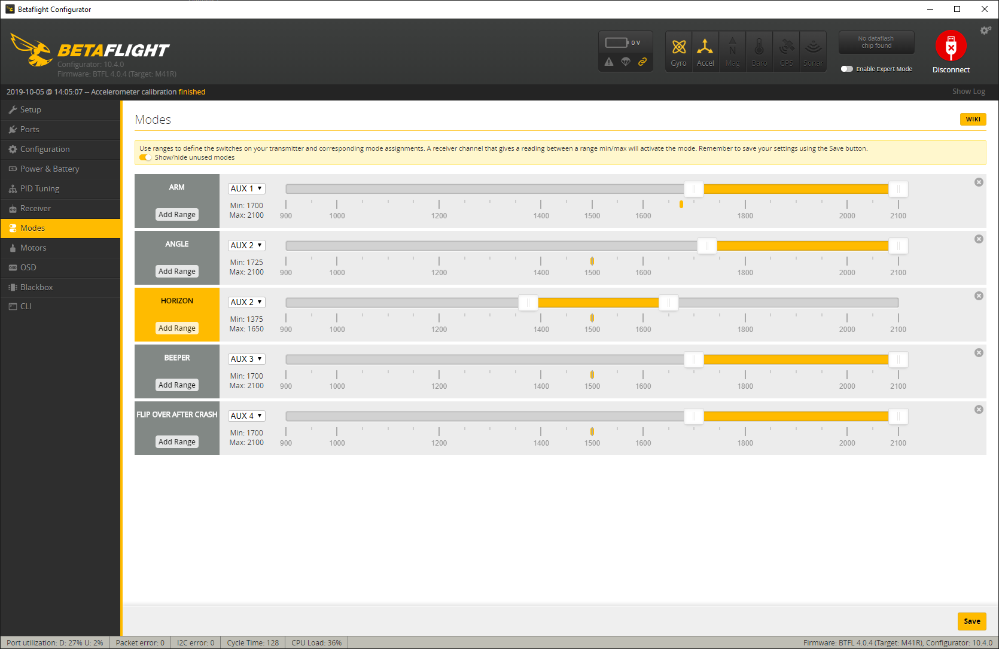

Here you can also test your switches in real time if you power on the quad (props off). A mode is activated when the yellow notch falls within the yellow range indicator for it.

I fly predominantly only in acro mode, and just a bit when testing and evaluating new quads in horizon mode.

My configuration:

In the OSD tab you can adjust the position of elements to your liking.

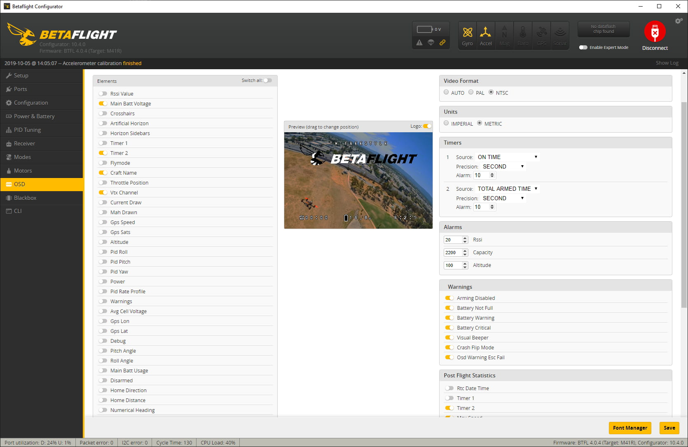

**🌀Install the propellers**

Now that we are done setting up the drone, we can install the props and head outside for a maiden flight. Because the [Emax Tinyhawk Freestyle][1] is setup in 'props in' mode, we want to put on the propellers like it's shown in the picture below.

Push down the prop on the motor shaft firmly, but carefully as not to bend it. Secure each prop in place with 2 small screws and a hexhead screwdriver.

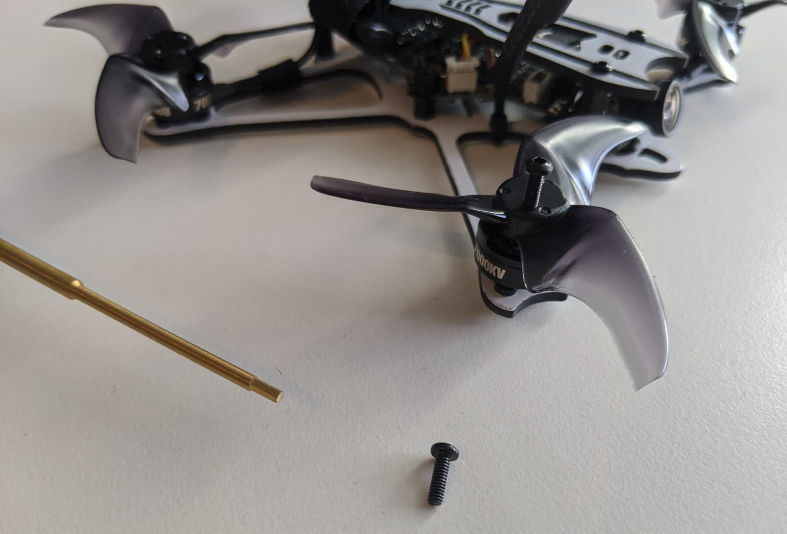

Looking good and ready to take to the skies!

A little tip when putting on the batteries is to **have them on top of each other with the power lead of each battery on the opposite side**. It's not a biggie, but it does make it easier when plugging in the battery connector.

Make sure the leads are firm and stay in the center, away from the props. There should be no issues, unless the batteries you use have very long leads. I haven't had any issues with my GNBs.

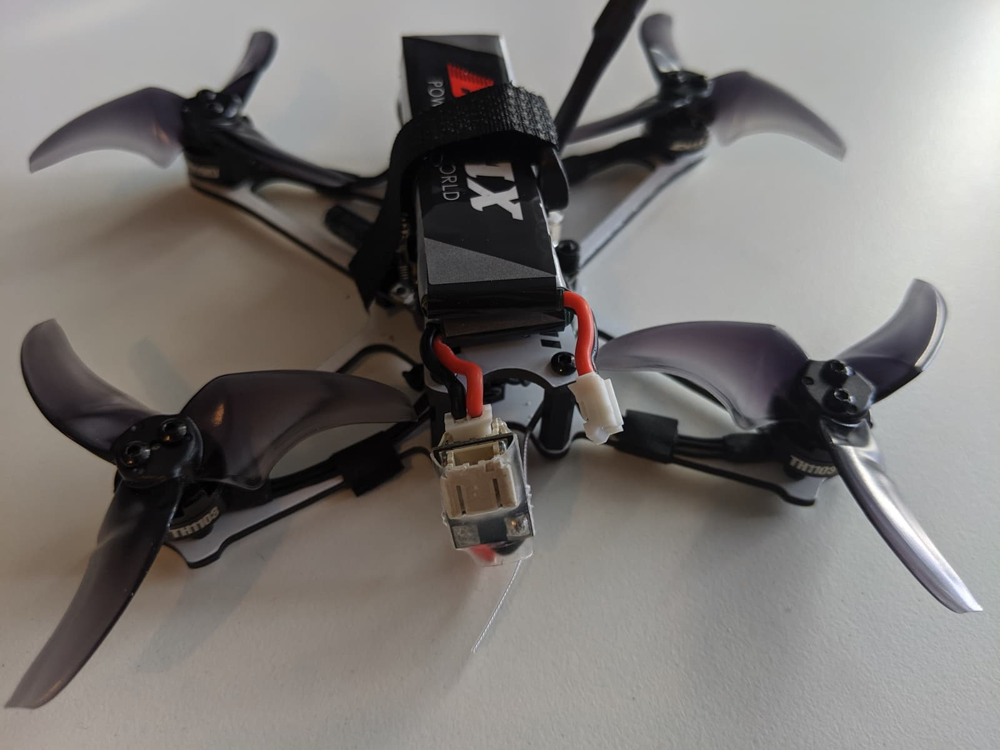

Finally, another little tip is to remove the foam from the carry case and observe that the quad fits nicely in there with the props on. Phew 😅.

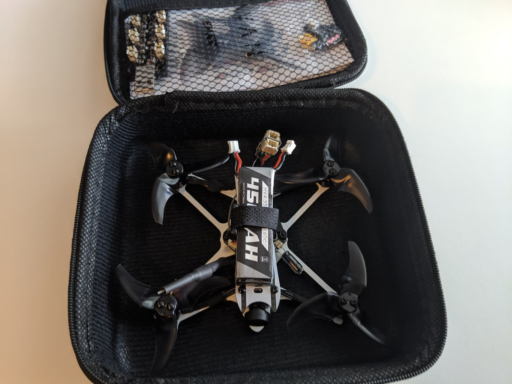

In case I missed something and you lost your paper manual, you can also [refer to its online version][7].

### 🚁 Flying

The [Emax Tinyhawk Freestyle][1] flies absolutely spectacular. It's one of the quads that flies so well that I had absolutely no desire to do with it anything further in terms of tuning. I just want to fly it all the time. Here's the TL;DR recap if you don't feel like reading my detailed impressions of the quad.

_What does it do well?_
**Flight chracteristic, handling, flight times, battery reusability, easy to setup and to fly.**

_What could be better?_
**Range.**

#### Maiden flight, stock 2 x 1S 450mah batteries.

  <iframe width="560" height="315" src="https://www.youtube.com/embed/uaqb8IDhddY?list=PLt8_2AobQjAdaL2fUZM8zd6xzNZdMt0nz&index=0&rel=0" frameBorder="0" allowFullScreen title="Emax Tinyhawk Freestyle maiden flight"></iframe>

Immediately during the maiden flight right after I took off **I noticed how much power this thing has and how locked in the tune really is**. Great job by Emax there. A big part of how the [Emax Tinyhawk Freestyle][1] handles is thanks to the amazing [Avon Rush 2.5 inch tri-blade props][3]. Those give you really precise handling in turns. At the same time, they don't really seem to consume a ton of amps. The Tinyhawk Freestyle is so lightweight and zips around so fast that you really won't be able to believe how fast it goes from the moment you take off as soon as you punch that throttle.

A thing to note is that the camera is a 4x3 camera and depending on what goggles you have, if you're using them in 16x9 mode, it might take a bit to adjust to the fish eye effect. The good news is that you do get used to it after a while.

**The [Emax Tinyhawk Freestyle][1] flew so well on these 1s 450mah batteries that come with it that I legit had no desire to even test other batteries**. It flew great, handled easily and the thrust to weight ratio on it was spot on, at least in my opinion.

You just completely lose yourself and enjoy flying around at what seems to you like really high speeds. You get flight times of 4-5 minutes easily even if you keep the throttle at more than 40% the whole flight. Crazy! I don't think I've ever had a quad that efficient, while still feeling powerful and zippy. In fact, it's interesting that you get almost the same flight times whether you fly it 1S or 2S. And the performance is also hard to differentiate. It feels almost a bit weird but that's how it is. I do fly it mostly on 2S though in anyway.

#### Here is the flight footage of the Emax Tinyhawk Freestyle on 1S stock 450mah battery.

  <iframe width="560" height="315" src="https://www.youtube.com/embed/uaqb8IDhddY?list=PLt8_2AobQjAdaL2fUZM8zd6xzNZdMt0nz&index=1&rel=0" frameBorder="0" allowFullScreen title="Emax Tinyhawk Freestyle on 1S"></iframe>

The battery choice is perhaps one of the biggest upsides of this drone set. Because Emax have opted in to use 2 PH2.0 connectors, it allows you to reuse your batteries, in case you have any of those lying around.

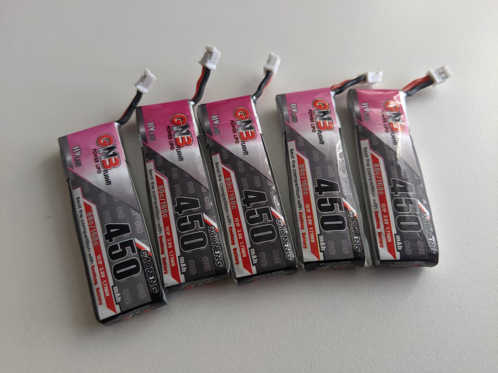

**For a lot of people, including me, that's gonna be a big deal**! Those are always easy to charge, they have great capacity to weight ratio for these little quads. And if you have none of those lying around, you could replace the PH2.0 connectors with the provided XT30 connector, in case you have more of this type of batteries.

For lolz and science I even flew it on these Eachine 300mah 1S lipos and **it still flew over 4 minutes with little to no voltage sags**.

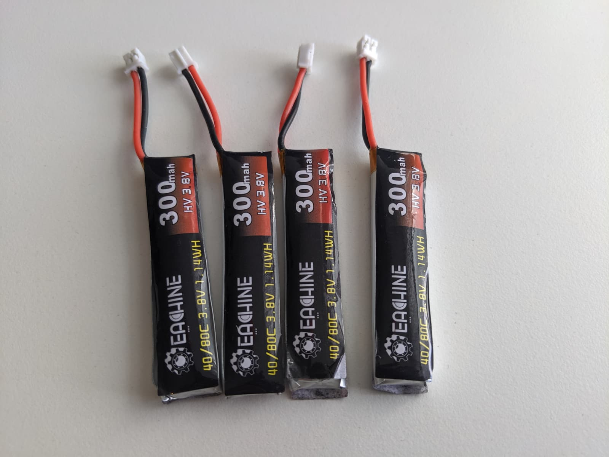

Pretty decent! This is just to say that if you have some of those batteries lying around you can reuse them with the [Emax Tinyhawk Freestyle][1]. But if you are buying, I still recommend getting the [GNB 450mah 1S batteries][4].

  <iframe width="560" height="315" src="https://www.youtube.com/embed/uaqb8IDhddY?list=PLt8_2AobQjAdaL2fUZM8zd6xzNZdMt0nz&index=2&rel=0" frameBorder="0" allowFullScreen title="Emax Tinyhawk Freestyle on 2 x 1S 300mah eachine battery"></iframe>

In terms of flight characteristics I'm a bit curious to try out some bi-blade props on the [Tinyhawk Freestyle][1], although I also got to admit that it is completely unnecessary, as the stock build, tune and props already provide an amazing and very enjoyable flight experience.

And here I have to also mention how easy is to go out flying with this toothpick. Put a bunch of battries to charge, leave the house in less than 30 minutes, fly anywhere as it's easier to find a spot for such little drone, without bugging people. Very, very easy.

And this is how I enjoy flying this drone nowadays - just throttle up and never let go, pretending I'm a racer 😅. I honestly completely forget this is a micro drone when I'm flying it.

  <iframe width="560" height="315" src="https://www.youtube.com/embed/uaqb8IDhddY?list=PLt8_2AobQjAdaL2fUZM8zd6xzNZdMt0nz&index=14&rel=0" frameBorder="0" allowFullScreen title="Emax Tinyhawk Freestyle zipping around before the rain"></iframe>

### 🔝 Upgrades

I don't have a lot to mention in terms of potential upgrades. Most of my ideas are for testing different props. But honestly it's not necessary.

One thing I might consider doing and could suggest you do as well, if it is easy to pull off (and I don't think it would be very hard), is to **add a full range receiver**. It should hopefully not ruin the flight characteristics with a few added grams, but will add a lot of enjoyment in terms of flexibility and how far you can fly. I have to admit I gotta be pretty mindful with this one flying around and not going too far away. Not a bit issues, but good to be aware of it.

I would not add an HD split type camera to this one, as this will surely ruin the flight characteristics, as the [Emax Tinyhawk Freestyle][1] is indeed super lightweight and every little bit on top will be felt and will change things a lot.

You swap out the battery connector for an XT30 connector, if you have more batteries with that connector. In my case, I'm thrilled the Emax Tinyhawk Freestyle allows me to reuse my 1S 450mah GNB batteries, which are pretty high quality and the quad flies superb on them, so I'll be leaving the battery connector as is.

### 📑 Conclusion

2019 has been a great year for these micros. There are a lot of amazing and great value toothpick class drones out there. I feel like the best thing about them is that you can pick one that is directly tailored to your situation.

And if we compare the [GEPRC Phantom][5] with the [Emax Tinyhawk Freestyle][1] one of the things that immediately becomes obvious is that even though both of these quads fly awesome, they are also so different and would fit different scenarious, or different pilots.

From what you get in the box with the Emax Tinyhawk Freestyle it seems to be best suited to someone who has a lot of those 1S 450mah batteries with a PH2.0 connector. The quad flies amazing with those, you will get pretty lengthy flight times of like four to five minutes. This is a big deal because it would allow you to reuse your existing batteries.

The flight experience is super enjoyable and because the quad is quite easy to handle I would say that it's suitable for people newer to the hobby. Maybe like practiced beginners.

Some of the drawbacks worth mentioning here are the lack of a full range receiver. I think the board supports installing one, but don't quote me on that and definitely do some research first if this is important for you. I would also assume that the added weight should not be too much and would not ruin the awesome flight characteristics.

The camera is fairly decent and very very lightweight, so I understand why they've picked it up. I'm scepticle to believe you could make this one work with a split type camera, but I guess it's probably not impossible. Maybe a RunCam Split 3 Nano could work? We'll have to wait and see I might do that mod in the future.

But regardless if you're just getting into the hobby or you have been flying drones for a while now, the Emax Tinyhawk is synonymous with the word fun. It's got a locked in tune and is pure pleasure to rip around anywhere. Like, really, anywhere. It's relatively quiet and is not gonna bother anyone if you decide to fly it in a park or a more populated area.

Either way, have fun and happy flying!

[0]: Linkslist
[1]: https://bit.ly/tinyhawk-freestyle
[2]: https://bit.ly/geprc-phantom
[3]: https://bit.ly/avon-rush-25
[4]: https://bit.ly/micro-drone-batteries
[5]: /fpv/geprc-phantom-review-and-setup/
[6]: /fpv/emax-hawk-5-unboxing-review-and-setup/#binding
[7]: https://emax-usa.com/download/Tinyhawk_Freestyle_BNF_Instruction_Manual_v1.2.pdf
