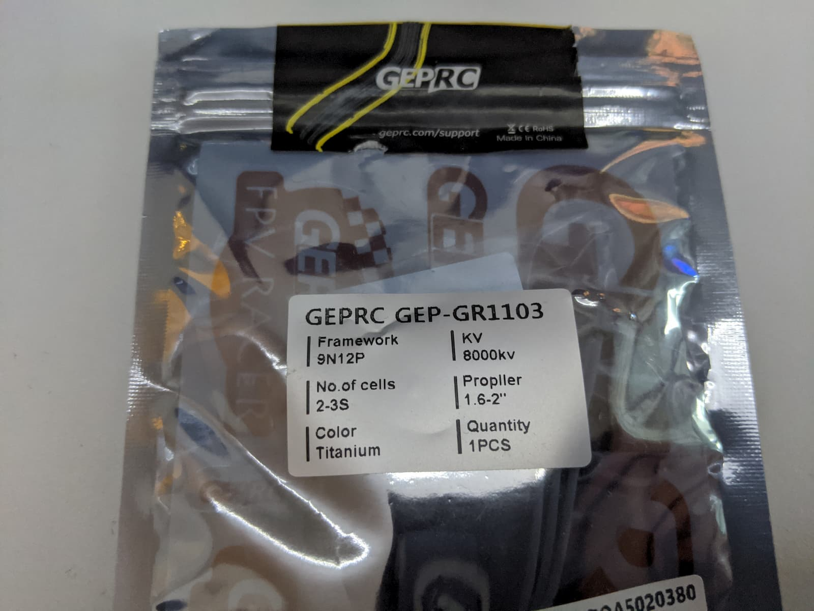
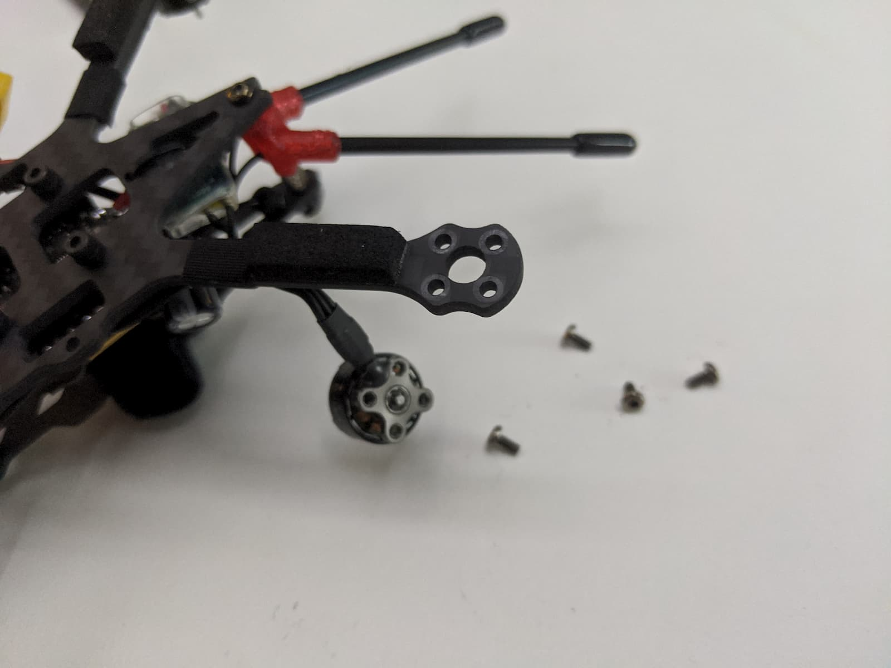
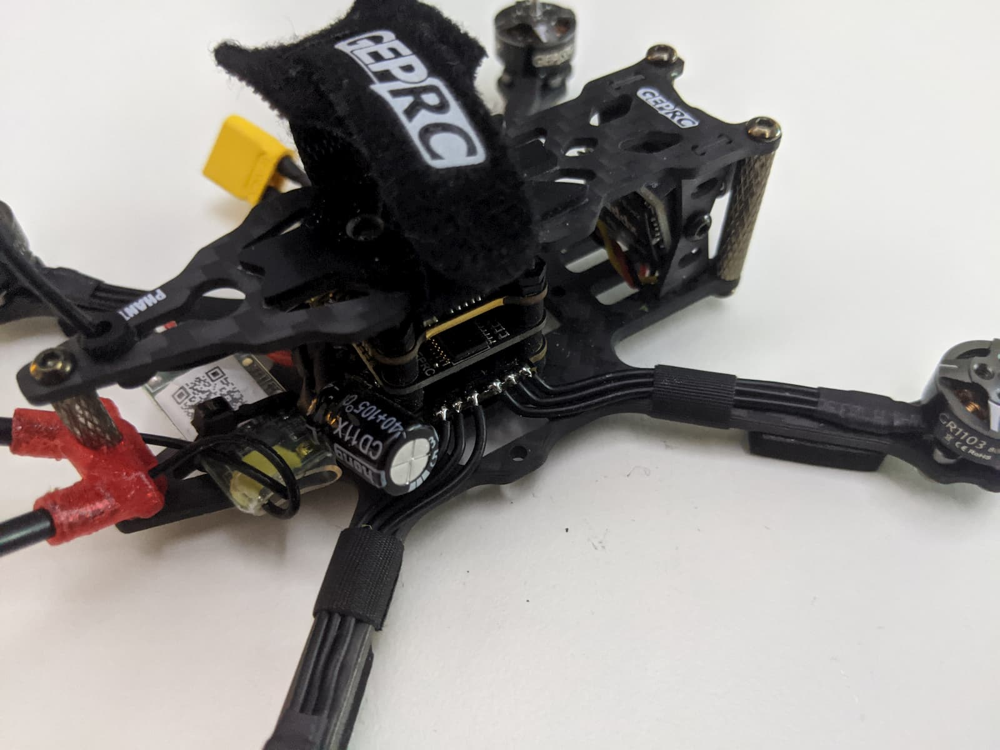
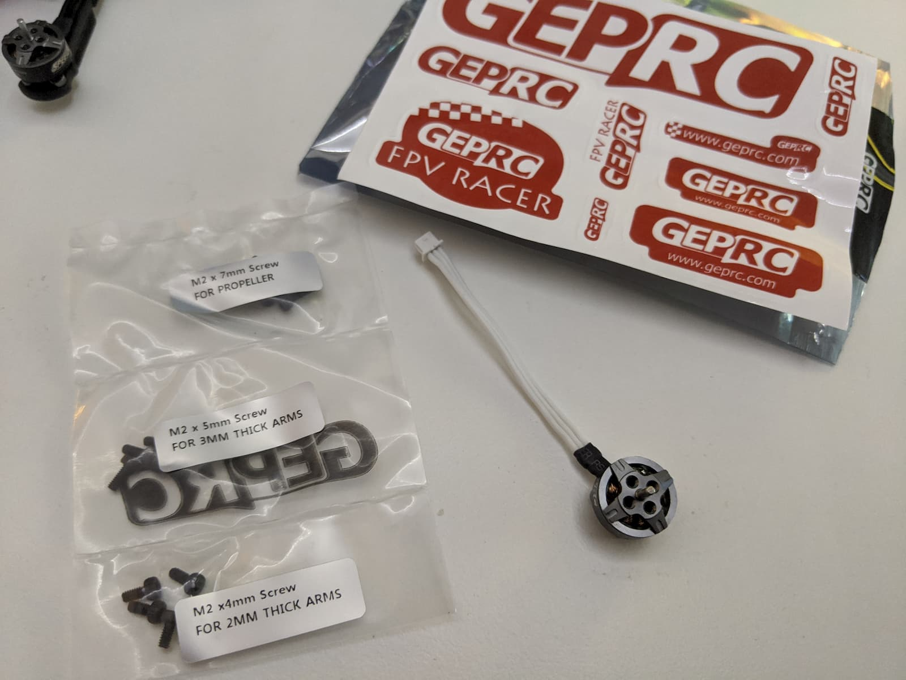

  <iframe width="560" height="315" src="https://www.youtube.com/embed/aCDpAAAzQAM?rel=0&list=PLt8_2AobQjAccJ4BKqNcfsUU6sl37TH45&index=15" frameBorder="0" allowFullScreen title="Georgi FPV GEPRC Phantom footage"></iframe>

[0]: Linkslist
[1]: https://bit.ly/geprc-phantom
[2]: https://bit.ly/geprc-phantom-motor
