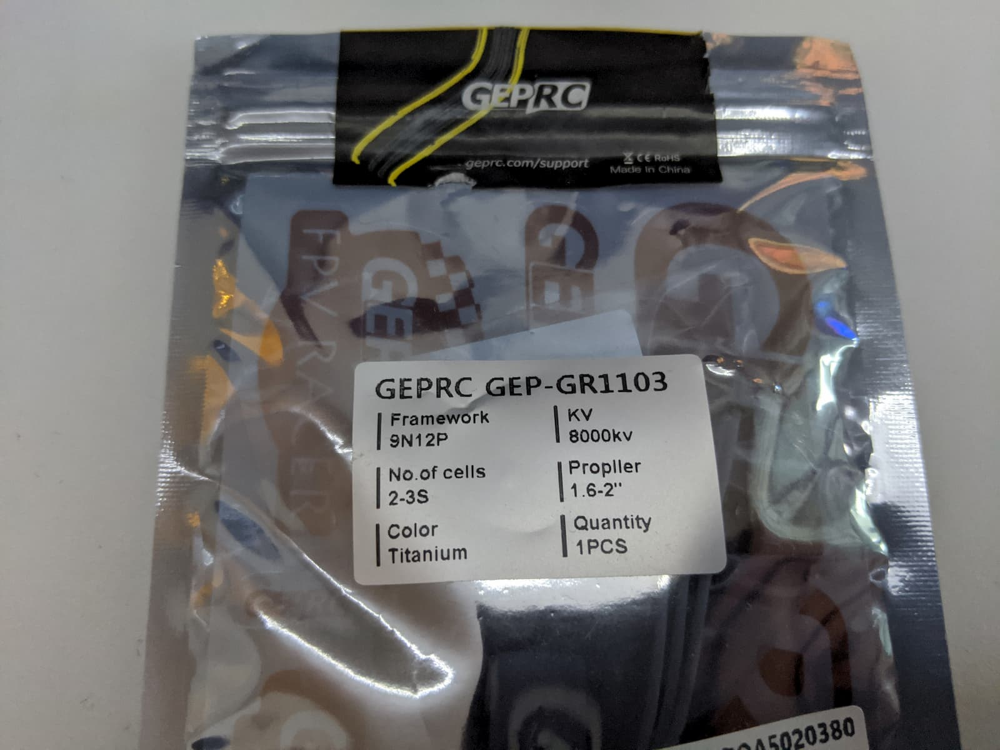
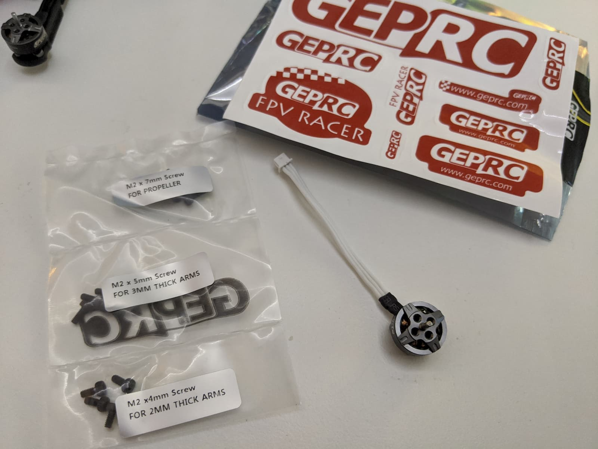
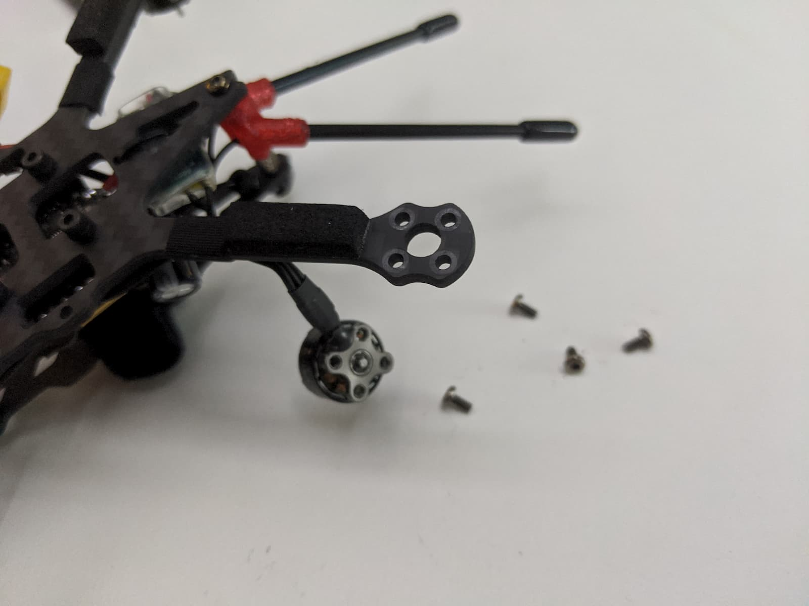
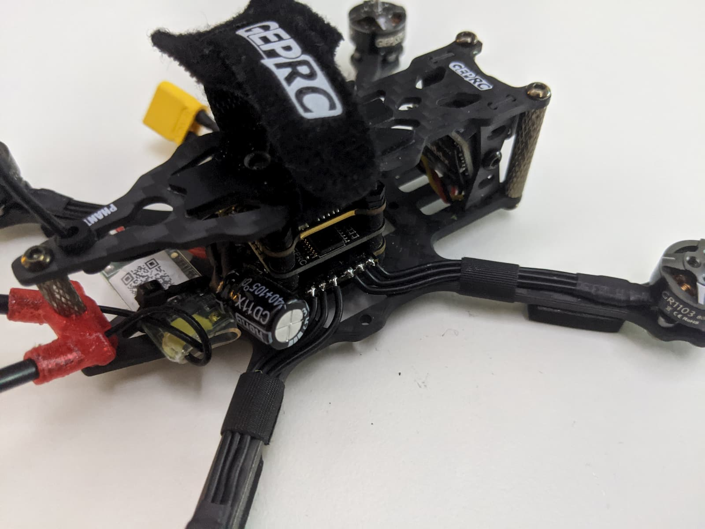
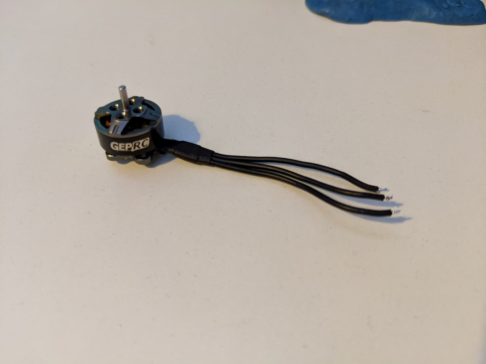
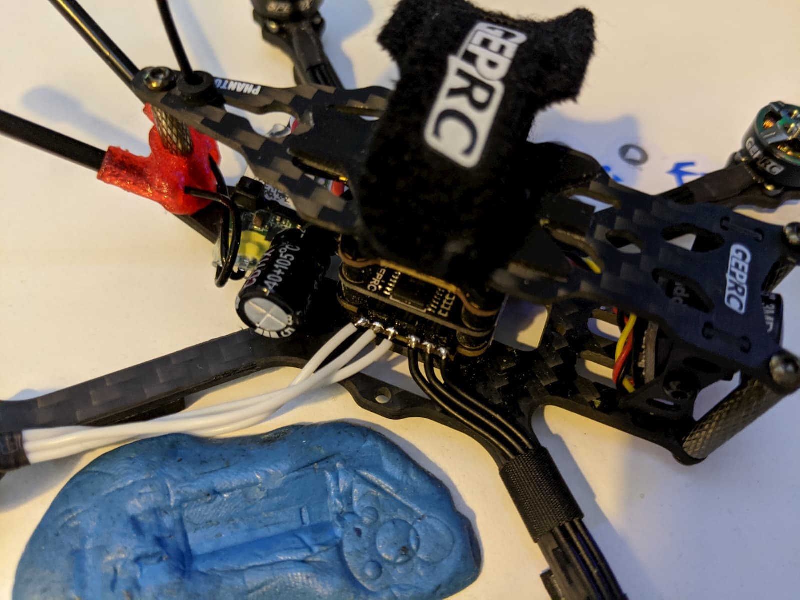
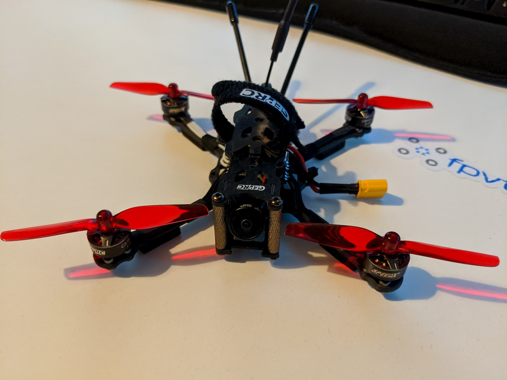

Replacing a motor on your quad is for the most part fairly straight forward. But in this guide, I'd like to also go over debugging a motor and ESC and figuring out the faulty component, as well as verification and configuration after the replacement.

If you prefer watching, check out the [video version of this post on the FPVtips YouTube channel][7].

Let's get to it!

### 🧪 Debugging a drone motor

We need to figure out the issue and the faulty component. Most times when we end up here we would have a motor that wouldn't spin at all or would twitch but not spin up properly as the other motors.

In today's example, we're going to be investigating this issue I had with the [GEPRC Phantom][1].

  <iframe width="560" height="315" src="https://www.youtube.com/embed/9FO9vbivfQw?rel=0" frameBorder="0" allowFullScreen title="GEPRC Phantom motor issues demo" referrerpolicy="strict-origin-when-cross-origin"></iframe>

I had a strong reason to believe that I burned the motor, after [my battery fell off during a 4S battery test][4].

The first question you should always ask yourself, if unsure, is:

**Is it an issue with the ESC (electronic speed controller) or with the motor?**

ESC issues are not much harder to be figured out or fixed, but with the growth in popularity of 4 in 1 ESC boards, it has become more cumbersome and slightly pricier as if even 1 ESC dies you still have to change the whole board. In the case of these micro drones, you have to toss the entire working flight controller board and resolder everything on a new board. Pity, but that's how it is and that's the price we pay to reduce weight and for the comfort of having a single board to deal with instead of 4 separate ESC boards.

So it would be so much more favorable to be dealing with just a bad / broken motor. How do we validate that? You can inspect the motor for signs of damage. Brown parts, missing or loose magnets, or if the motor wires are still properly connected to it (I had an [issue with a snapped wire on my Mobula7 HD][5]).

In this case, I could observe no obvious damage to the motor. The next best and easiest thing to validate you have motor issues is to try and swap out the motor with another one. If you haven't yet, **make sure you take the props off**!

So let's swap the faulty motor with another one that we know works. If the faulty motor does spin up on another slot, that's not very good, as it could indicate issues with the ESC. If, however, the motor still doesn't spin up properly, we are in luck, and this could be further indicated by a successfully spinning motor on the slot where our faulty motor used to be.

This is great and is a very simple and easy way to isolate the issue down to the motor. At this point, we can be 99% certain there's some issue with our motor.

### 🔄 Replacing a motor

In some cases, if you have the skills, time and desire you can just proceed and repair your motor. In other cases, it might make more sense to just [order a new one][2] and replace the faulty one. I opted in for the latter and when I finally got my motor I was able to proceed with the replacement.

**When ordering a motor, pay attention to the KV value, stator size and also the motor shaft size.** Alternatively, you could also swap all 4 motors, as this would be a good time to do so if say you were planning a motor upgrade. Just make sure that whatever you pick makes sense with the quad's ESC, AUW (all-up-weight) and your prop choice. You don't want to get 4 new motors just to burn the ESCs and have to then replace those as well, do you?

When working with micros, in some cases the motors will come with a plug and if your flight controller / esc board has the same plug, you just plug those in and that's all. In other cases, you might have to do some light soldering.

In my case, the spare motor did come with a plug, but as the motors are directly soldered to the board on the [GEPRC Phantom][1], I had to remove the connector from the motor and prep the wires for soldering by stripping the silicone insulation a bit and pre tinning them with a bit of solder.

Let's take off the bad motor. Unscrew the mounting motor screws.

And then desolder the old motor wires from the ESC.

To finally remove the offending motor.

It should be a quick job as the wires and pads are very small and they don't require a ton of heat. Go quickly in and out with the soldering iron, without spending too much time on the board.

Finally solder up the new motor wires in place, carefully observing not to bridge any of the pads. Then screw the motor onto the arm so we can proceed to test it.

### ✅ Testing and configuring the new motor

Before we go out flying, here are a few things to consider:

**1. Does the new motor actually work?**

> Dead on arrival motors are not unheard of and although a rare occurrence, can happen!

**2. Is the motor direction correct?**

> It's always good to double-check this. If the direction is not correct, you can change it by desoldering 2 of the motor wires and swapping the pads where you solder them back. Or, even better, **change the direction in software with [BLHeli Configurator][6]**.

**3. Do we need to calibrate the ESCs?**

> Probably not. If you are running DSHOT the answer is **definitely not**. No need for calibration. But if you believe that a little calibration never killed nobody, you can use the `Motors` tab in Betaflight to do that. Follow the step outlined in [this article about changing ESCs and motors][3].

Generally speaking, that's really all there is to it. The process is overall straight forward with only a couple of gotchas here and there. Make sure to put on your props correctly and go rip some packs outside!

I hope it works out well for you and happy flying!

  <iframe width="560" height="315" src="https://www.youtube.com/embed/sDu8JbPATlc?rel=0" frameBorder="0" allowFullScreen title="Georgi FPV GEPRC Phantom back in action after a motor swap - HQ 65mm props" referrerpolicy="strict-origin-when-cross-origin"></iframe>

  <iframe width="560" height="315" src="https://www.youtube.com/embed/b34dhDPSXLk?rel=0" frameBorder="0" allowFullScreen title="Georgi FPV GEPRC Phantom back in action after a motor swap - Avan Rush 2.5 inch props" referrerpolicy="strict-origin-when-cross-origin"></iframe>

[0]: Linkslist
[1]: https://bit.ly/geprc-phantom
[2]: https://bit.ly/geprc-phantom-motor
[3]: /fpv/replace-wizard-esc-and-motor/
[4]: https://www.youtube.com/watch?v=5ai_mL7htww&t=111
[5]: /fpv/how-to-change-mobula7-hd-motor/
[6]: https://github.com/blheli-configurator/blheli-configurator/releases
[7]: https://www.youtube.com/watch?v=MYFAHx4gWeE
