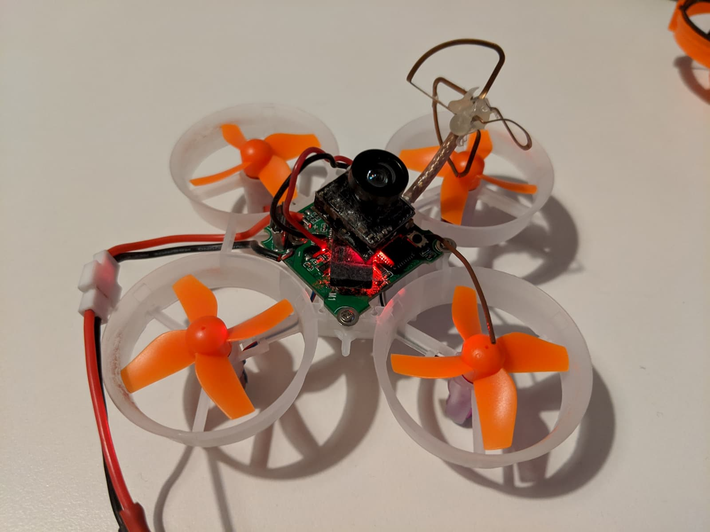
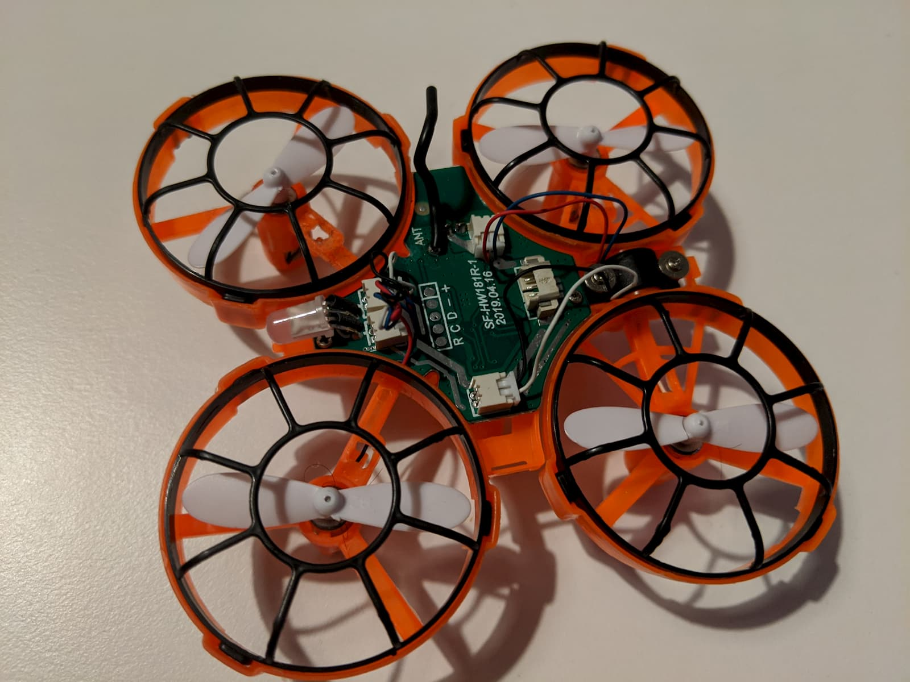
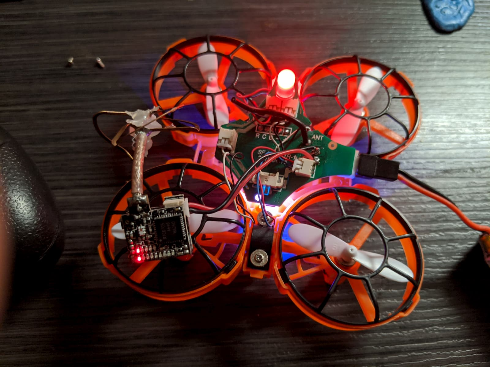
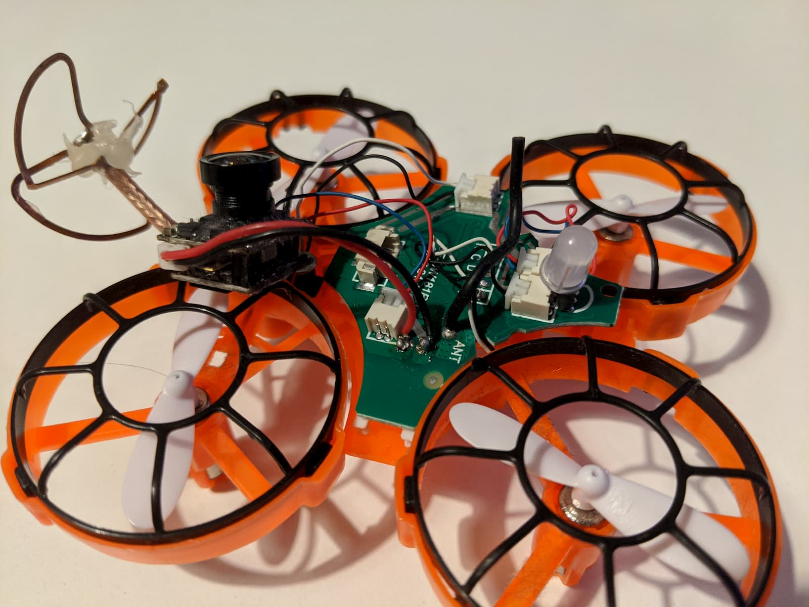
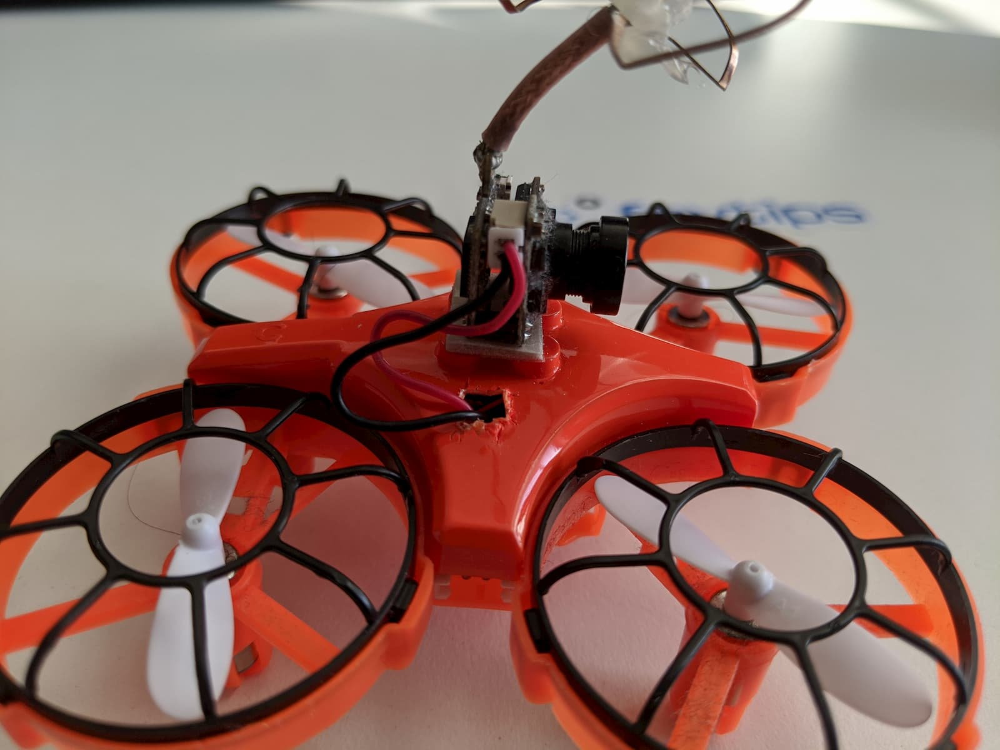
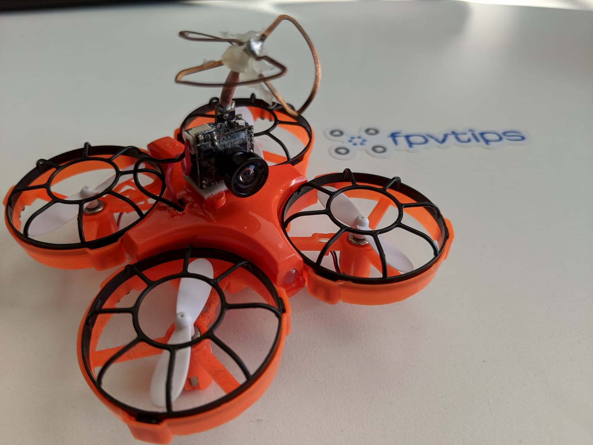
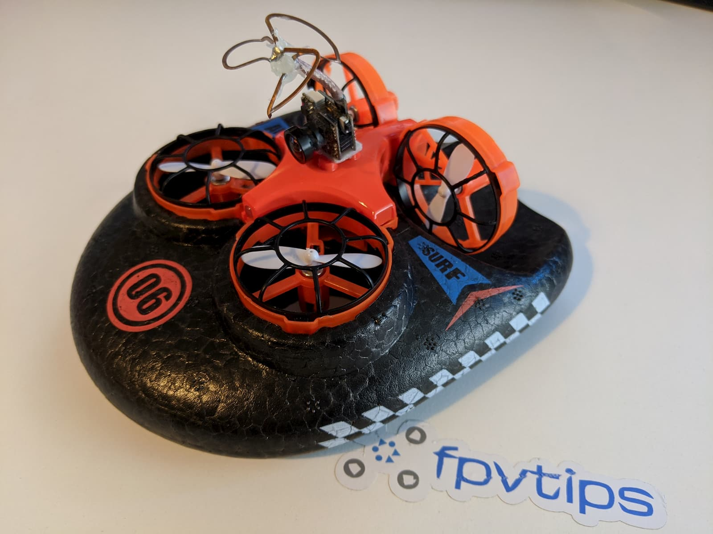

I love FPV! And so far I've only really done drone FPV. I am looking forward to trying out a few other ways of exploring the world with FPV wings, hovercraft, and even a submarine.

Some of those you could just pick up online for a few bucks, some are not at all available and will need to be full-blown projects, if at all possible.

Today we're going to check a toy grade item, namely the [Eachine E016F Hovercraft and Drone][1].

As I mentioned I mainly focus on hobby-grade FPV drones and don't normally deal with toys, but I did purchase this hovercraft and was pleasantly surprised and I think it's worth sharing my experience for several reasons.

First and foremost - winters in Finland are long and brutal and there is little chance for flying, but there's plenty of chance for building projects. One project on my list was to try to make an FPV RC Snow glider / Hovercraft. I already have my hands on this [GEPRC hovercraft foam frame][2], and this project is coming very soon to the blog and the [YouTube channel][3], so stay tuned (and subscribe 📺).

But while figuring out how to put together my own craft, and while waiting for the snow to come (it's been record high temperatures in Finland and we still don't have any snow?!), I bought one of these ready to zip around, cheap hovercraft to see what they are all about.

### Table of contents

- [📦 Unboxing](#unboxing)
- [⚙ Setup](#setup)
- [🚁 Zipping around](#zipping)
- [🔝 FPV upgrade](#fpv-upgrade)
- [📑 Conclusion](#conclusion)

If you prefer watching, check out the full video review on my YouTube channel:

  <iframe width="560" height="315" src="https://www.youtube.com/embed/W4f8TyaOjBw?rel=0" frameBorder="0" allowFullScreen title="Eachine E016F hvoercraft full review"></iframe>

### 📦 Unboxing

Let's have a look at what you get in the box.

Eachine E016F unboxed.

You get a couple of those 1S 350mah Eachine batteries (the other one comes mounted on the drone already).

You also get some tools and spare parts. A screw, 4 spare props, prop remover tool, mini screwdriver, USB battery charger, a manual, radio controller and the craft itself.

A nice and very helpful touch is that the transmitter comes with this cardboard overlay with all the button functions, which makes it very easy to get started but also to have a quick reference whenever you forget which button did what.

The transmitter takes 2 AA batteries on the back.

And finally here is the [Eachine E016F][1] itself. It has 4 lego studs on top, in case you wanted to mount a lego figure.

The back motors are up-right at a 90-degree angle to the front motors.

This is how the craft looks from underneath. The small hole in the middle is where you can find the screw that holds the drone-mounted to the frame.

And here is a top-down shot.

### ⚙ Setup

To get started place 2 AA batteries in the transmitter. You will have to undo the screw on the battery bay.

Next, undo the screw on the bottom of the hovercraft frame to release the drone and access the battery.

Charge the battery via a USB port and the provided charger. When the LED goes off, your battery is full. Install in on the drone and the drone to the hovercraft frame.

### 🚁 Zipping around

#### How to arm the quad?

Turn on the transmitter. Plugin the drone battery.

Move the left (throttle) stick all the way up. Then move it all the way down. The drone will arm. From this point on if you start moving the throttle stick up your drone will fly.

Let's talk modes. So this craft has 3 modes for moving around. **Ground, water and air**. You can tell which mode you're in by the color of the LED on the front of the quad.

**Red** - drone flight mode

**Green** - ground hovercraft mode

**Blue** - water hovercraft mode

#### How to change modes?

To go between the different modes, press the left trim button under the throttle (left) stick. This will go between the different modes as denoted by the change in color of the front LED.

If you're gonna fly in drone mode, make sure you have removed the hovercraft frame, snap back the motors, such that all motors lie on the same plane, make sure the front LED is red and you're good to go.

For the other two modes, make sure you have mounted the drone in the hovercraft frame and secured it down with the screw. Then make sure you are in **green** mode for ground hovercraft or **blue** for water hovercraft.

#### Flying experience

So how did the [Eachine E016F][1] fly? Not bad for a toy. Am I impressed? Not really. Is it better than flying FPV drones? Not really. Can you mod it for FPV? Possibly. But the extra weight is only going to make the flight characteristics even worse.

But here's what's good about it. It's a good craft for bringing people into the hobby and making them familiar with drones. It's also much less intimidating in terms of both setup and controlling around.

I had a ton of fun flying this with my son. He's too young to fly anything else, but this, with my supervision (and my hands at the controls at the same time), was something we could do together, have fun and stay safe. And even though this is a cheap toy that flies suboptimal, it was awesome to see it pique his interest.

#### Hovercraft experience

I really do enjoy the hovercraft experience. It's also a fun thing to do together with my son, and I can absolutely let him control the craft on his own in this mode. He's having a ton of fun driving it around. The craft is surprisingly controllable, and I can't wait to take it outside in the snow once the snow finally arrives.

### 🔝 FPV upgrade

So, how to add FPV to the [Eachine E016F][1]? One of the easiest ways to do that is to add a [camera + vtx all-in-one][4] unit. You could grab one from an old tiny whoop you have lying around, or grab this [Eachine TX02][4]. It's lightweight, will do what you need it to do and pretty cheap too.

The only thing you should make sure, whatever camera and vtx all in one unit you choose, is that it **works with input power between: 3.3-5V**. That's important because I didn't manage to find a 5V step up on the hovercraft's board, which means we will be operating off of a lower battery voltage. So a camera that needs 5V or higher input is out of the question, or you would need to do some additional setup, which is beyond the point of this easy mod.

For my mod, I'll be using this very old all-in-one camera and vtx from an [Eachine E010S][5] I bought a couple of years ago.

The unit only requires power to run, so we just need to solder it's ground (black) wire to ground on the hovercraft board and the red wire to 3.3V on the hovercraft.

Initially I tried the pads right behind the front led, but that did not work (R C D - +).

Then I decided I'll just add the wires to the battery terminal pads. The battery connector is under the board, but its connector is soldered with a through hole pins and those come up on top of the board (right hand side of the board, next to a motor connector).

After checking with a multimeter, I found out which side was ground and then soldered ground to ground and voltage to voltage. If you look at the picture below, the upper pin is ground, the lower is voltage.

I had to cut out a hole in the top cover in order for the camera wires to come through.

This probably compromises some of the craft's water resistance (which I have no clue how good is anyway). But if you want to go back at least as close as possible to its previous state use a bit of hot glue to seal the hole, after you setup the camera in place.

To attach the camera, I just used 3m double sided sticky tape.

That's all there is to it. Here's some sample footage, it was actually surprisingly even more fun to glide this around, than I anticipated.

  <iframe width="560" height="315" src="https://www.youtube.com/embed/OvrQs372rbA?rel=0" frameBorder="0" allowFullScreen title="Eachine E016F FPV mod"></iframe>

### 📑 Conclusion

I think the [Eachine E016F][1] is a pretty nice little toy to bring in people around you into the hobby. It's great for little and big kids, it's really cheap, and it performs fine. It's not one of those toys you will try out and toss in the garbage cause they don't move around at all or are too hard to control.

Controlling it in hovercraft mode, especially on a hardwood floor is pretty good. It even goes on some carpets, which is appreciated. But at the same time, this is still just a toy and so long as you don't expect miracles out of it, you'll have a good time.

[0]: Linkslist
[1]: https://bit.ly/eachine-e016f
[2]: https://bit.ly/geprc-hovercraft-frame
[3]: https://www.youtube.com/channel/UCCh3SK2EktDdOQkEOTDmSCg
[4]: https://bit.ly/eachine-vtx-camera-aio
[5]: https://bit.ly/eachine-e010s
