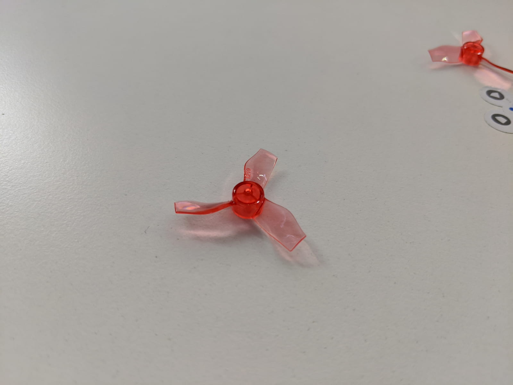
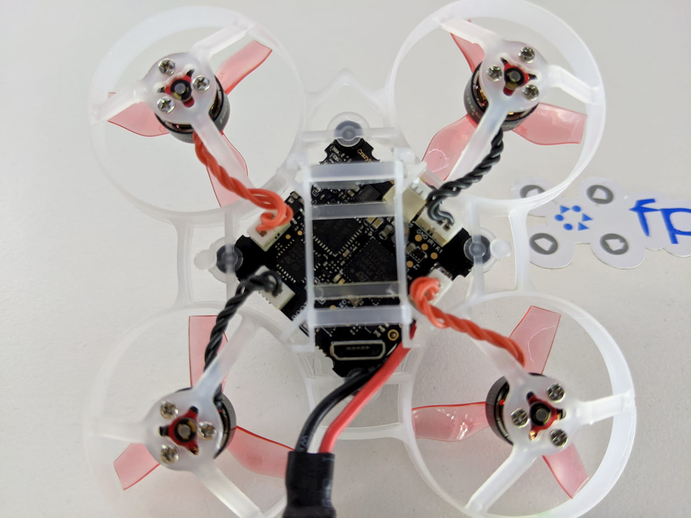

It's a truly great time for our FPV racing and freestyle drones hobby. For one, we get to enjoy a pretty rapid rate of tech improvement. Even though I've been into FPV drones for about a little under 3 years, it never seizes to amaze me how much thing have changed.

The [Mobula 6][1] is the living embodiment of these rapid changes.

...

To me the Mobula 6 is a technological marvel of sorts. I'll explain.

### Table of contents

- [📦 Unboxing](#unboxing)
- [📝 Specifications](#specs)
- [⚙ Setup](#setup)
- [🚁 Flying](#flying)
- [🔝 Upgrades](#upgrades)
- [📑 Conclusion](#conclusion)

### 📦 Unboxing

### 📝 Specifications

### ⚙ Setup

TODO: Extract the Betaflight config dump before proceeding

**🔗 Bind the receiver to a radio**

**👀 Check the Betaflight configuration**

### 🚁 Flying

- create a table with flying times comparisons:
- paste a pic of the table
- paste screenshots of video endings with stats

without ESC flashing: 300mah stock | 300 mah eachine | 450 GNB / 450 emax

with ESC flashing: 300mah stock | 300 mah eachine | 450 GNB / 450 emax

#### Maiden flight, stock 300mah battery

#### Eachine 300mah battery

Mention the labeled vs real C rating, add pictures

#### GNB 450mah battery for science?

How to mount with a rubber band.

#### Outdoors

some jello in no to low wind conditions.

- Flight time comparison stab vs acro mode
- Flight time comparison with different batteries
- Flight time comparison with 48kHz mod

### 🔝 Upgrades

- 48 kHz mod! Flight time comparison
- Props?

### 📑 Conclusion

- Props and batteries, chargers to featured gear

[0]: Linkslist
[1]: https://bit.ly/mobula-6
[4]: https://bit.ly/micro-drone-batteries
[8]: https://bit.ly/1s-board
