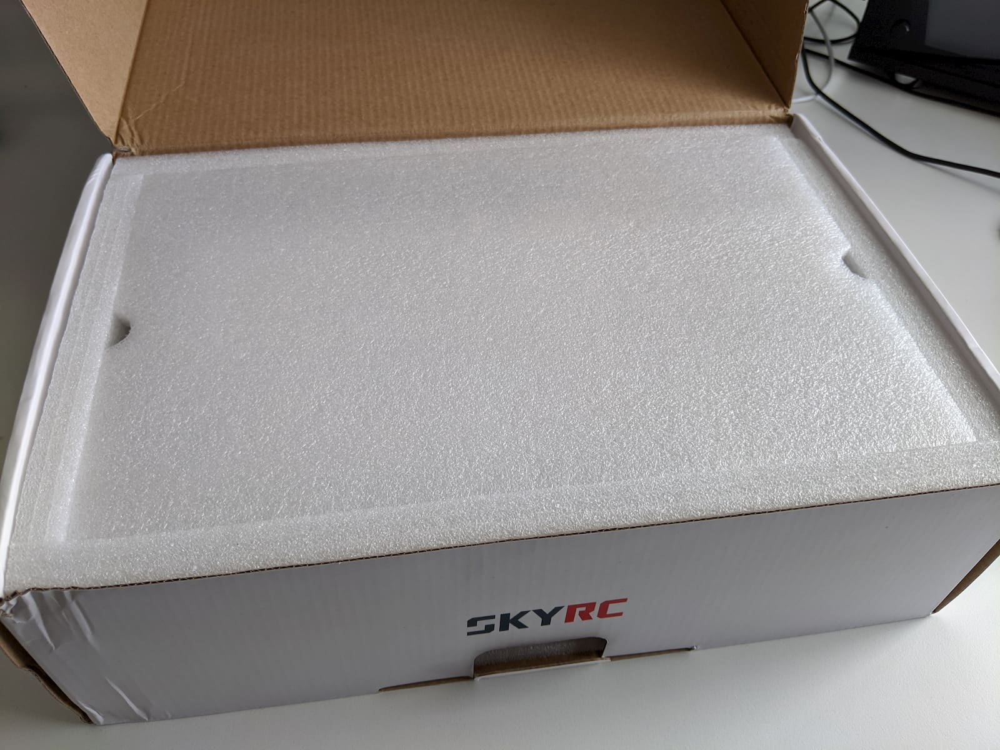
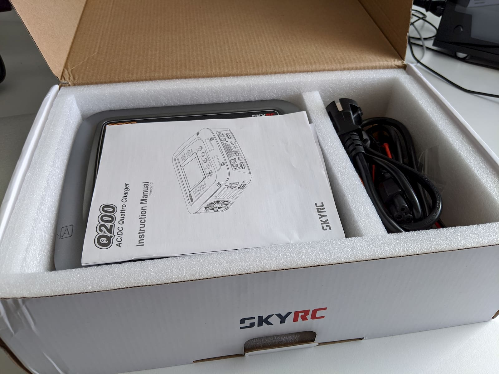

I don't always want to start off an article with such a strong statement as "one of the best..." but at the same time I also try to review and feature the products I found out to be useful, high quality and good value.

And today we're going to have a look at the [SkyRC Q200][1] quattro balance charger as one such product.

There are other products out there, that are certainly cheaper, especially if you have your own power supply or if you charge with a parallel charging board. That's a fact that needs to be acknoledged and I'm not saying the SkyRC Q200 is the right charger for everyone. But for me it is. For 2 main reasons:

1. I don't have a separate power supply and much more would prefer a plug and play unit that I can just start using.
2. I don't do parallel charging with external boards. I know if you are careful and know what you're doing it is a safe method of charging many batteries at once. I personally do not want to do it and have no need to do it. I fly different quads with different battery sizes, and have been doing somewhat fine with just a couple of very small chargers for about 3 years now.

The [SkyRC Q200][1] has 4 completely separate from one another charging slots and I love this. I can charge 4 different batteries at the same time. This, plus still using my 2 old chargers is a combination I don't think I'll be outgrowing any time soon.

If you like parallel charging and know what you're doing - enjoy. I'm not trying to convince anyone against it. It's not wildly dangerous, I'm not trying to portrait it like it is. But I know of many people who don't want to do it (including myself) and this is why I'm making this review and sharing my experience and my charging setup.

### Table of contents

- [📦 Unboxing](#unboxing)
- [📝 Specifications](#specs)
- [⚙ Setup](#setup)
- [🔋 Batteries](#batteries)
- [⚡ Charging](#charging)
- [📑 Conclusion](#conclusion)

<!-- If you prefer watching, check out the full video review on my YouTube channel: -->

<!-- 

  <iframe width="560" height="315" src="https://www.youtube.com/embed/TODO:?rel=0" frameBorder="0" allowFullScreen title="TODO:"></iframe>

 -->

### 📦 Unboxing

For something that costs around \$170 the unboxing experience is pretty good.

The box comes padded with this thick foam to protect the unit from all sides.

Removing the top plate reveals two compartments: one for the charger and one for its accessories. The charger came wrapped in a plastic protective film too, which I have already removed on the picture below.

So, here is the SkyRC Q200 in all it's glory. Looks and feels like a high quality product. Not too big, around 19x 17cm.

Here is everything you get inside the box: the charger itself, a nice thick and detailed manual, an outlet plug (in my case EU style), 2 custom banana plug to wire cables for soldering to your own connector type, 4 banana plug to XT60 connectors, 4 balance wires and adaptors supporting 2S to 6S batteries (perfect for out drone lipos).

If anything, I'm surprised how minimalistic the package contents is. Definitely a good thing and you get only what you really need. Here's a closer look of the wires we'll use to charge our lipo batteries.

### 📝 Specs and Features

In terms of specs and features, the two arguably most important things about this charger are the fact that it can charge up to 4 batteries at the same time (with different amount of cells or different chemistry) and completely independantly. And it can do so with its own internal power supply - no extra power supply needed.

It has a nice colorful screen with a fairly intuitive UI and you can operate the unit with the 5 labeled buttons right under the screen.

The `A`, `B`, `C`, `D` labels point to where the 4 charging slots are located. At 19cm x 17cm (~ 7.5" x 6.5") it's not the most compact charger. It's also not the bulkiest given it contains the power supply as well as a couple of cooling fans on the sides of the unit.

It can charge a variaty of different battery chemistries (LiPo, LiHV, LiFe, LiIon, NiMH, NiCd, PB), including our drone favorite LiPo. And it can do that at up to 200W total power fed via an AC input.

For OTG (On The Go) applications, the unit can also accept power via an XT60 DC port on the back (11-18V). There's also a power on/off switch on the back panel above the AC plug slot.

In the middle of the front panel there is a 5V USB charging port and a PC link micro USB port for connecting to a computer.

Each of the 4 charging slots (channels) has 4 ports. The banana plug positive (red) and negative (black) lead ports, the balance lead port (white) and a temperature sensor port.

The firmware is upgradeable, there is PC control software, **as well as a smart phone app** that allows you to connect to the charger via Bluetooth to control it and monitor its state.

Additionally, you can scan QR codes via the app to quickly read and apply charging profiles. So in a way it's very easy to quickly get started and get your packs charged so you can go fly. At the same time, the charger supports some more advanced use cases and scenarios, should you ever need them. Cool stuff.

### ⚙ Setup

TODO: some UI pictures
TODO:

#### 🈸 Get the mobile app

TODO: screenshots from the screencast

TODO:

#### 💻 Connect to computer

TODO: Get desktop app - connect to computer

### 🔋 Batteries

Before we continue with the charger review and guide on charging, I'd like to take a small tangent and discuss batteries quickly.
TODO:

### ⚡ Charging

TODO: Detailed with menu shots

#### 1S - small section in upgrades, as first seen by AndyRC

#### 2S

#### 3S

#### 4S

#### 6S - get from EMOFPV 1-2 bats

#### Other interesting functions

#### Storage charging

#### Advanced use cases

TODO:

- On the go, car battery
- Printing and adding QR codes to your batteries if you have many different ones
- Voltage calibration (benefits, taking care of batteries)

### 📑 Conclusion

TODO:

- post in banggood

Happy flying!

[0]: Linkslist
[1]: https://bit.ly/skyrc-q200
