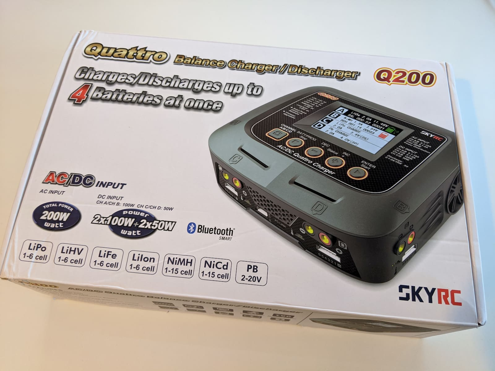
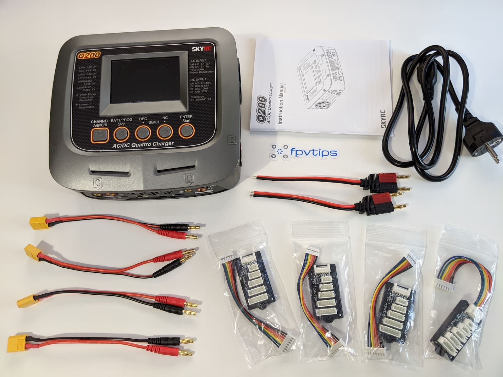
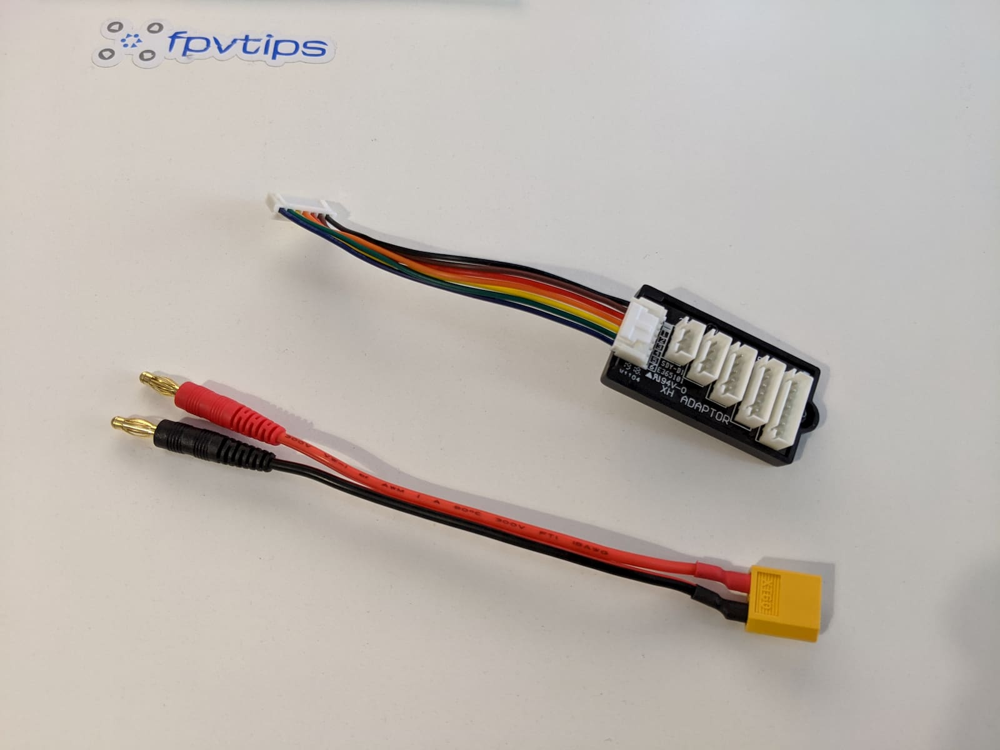
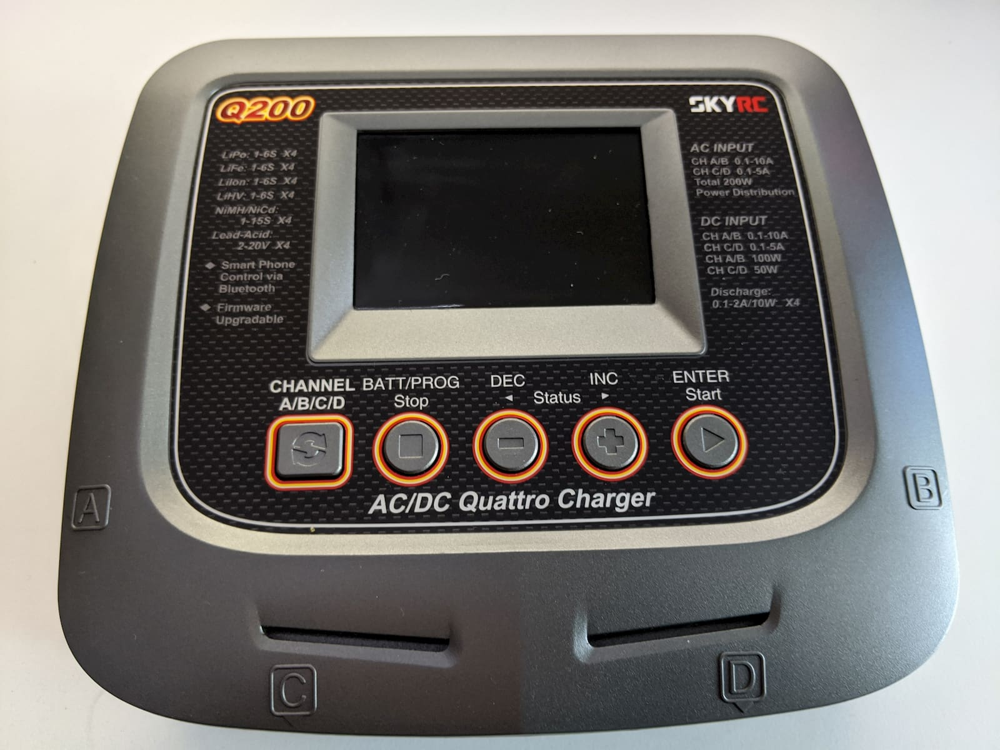
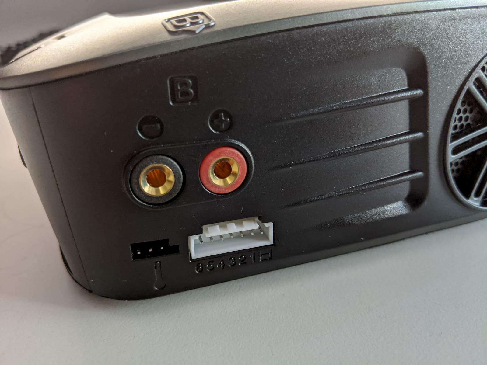
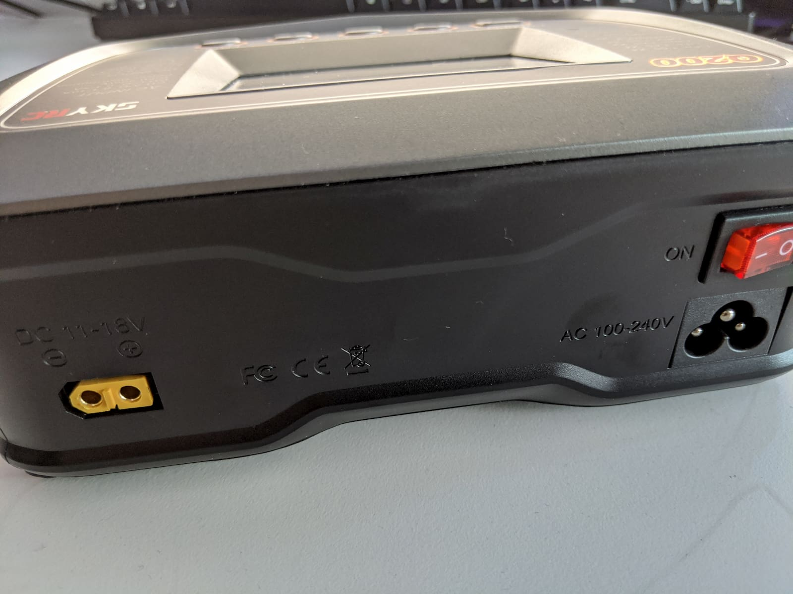

I don't always want to start off an article with such a strong statement as "one of the best..." but at the same time I also try to review mostly useful, high quality and good value items on the blog.

TODO: INTRO

### Table of contents

- [📦 Unboxing](#unboxing)
- [📝 Specifications](#specs)
- [⚙ Setup](#setup)
- [🚁 Flying](#flying)
- [🔝 Upgrades](#upgrades)
- [📑 Conclusion](#conclusion)

If you prefer watching, check out the full video review on my YouTube channel:

  <iframe width="560" height="315" src="https://www.youtube.com/embed/TODO:?rel=0" frameBorder="0" allowFullScreen title="TODO:"></iframe>

### 📦 Unboxing

TODO:

### 📠Specifications

TODO:

### ⚙ Setup

TODO:

#### 🈸 Get the app

TODO: screenshots from the screencast

TODO:

### 🔋 Charging

TODO: Detailed with menu shots

#### 1S - small section in upgrades, as first seen by AndyRC

#### 2S

#### 3S

#### 4S

#### 6S - get from EMOFPV 1-2 bats

### 📑 Conclusion

TODO:

- post in banggood

Happy flying!

[0]: Linkslist
[1]: https://bit.ly/skyrc-q200
