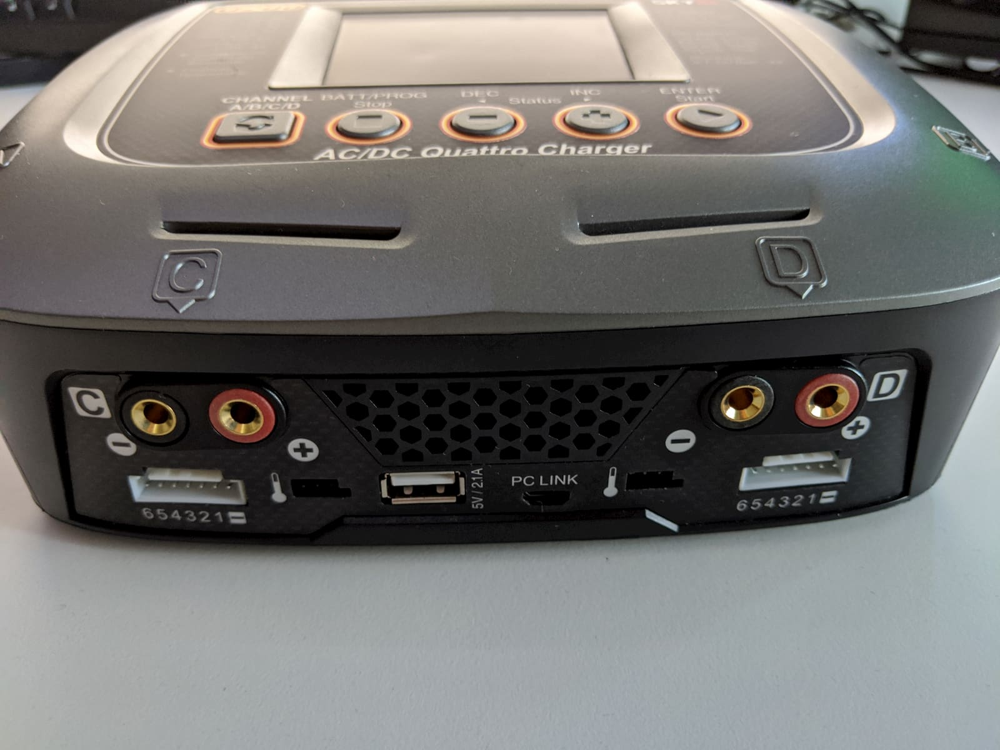
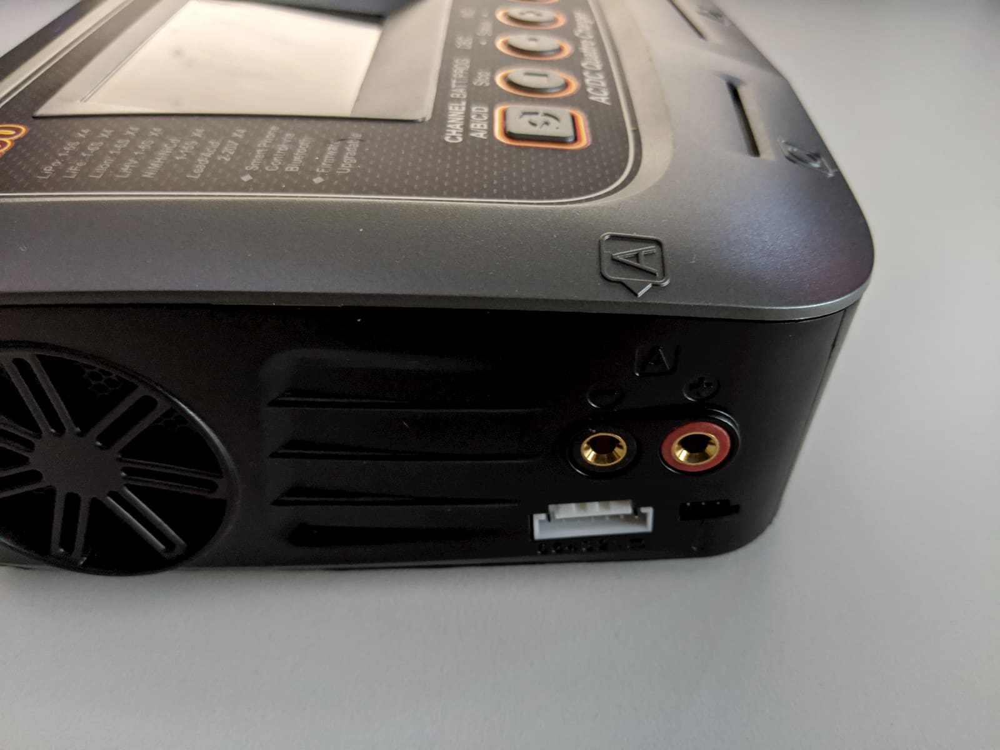

I don't always want to start off an article with such a strong statement as "one of the best..." but at the same time I also try to review and feature the products I found out to be useful, high quality and good value.

And today we're going to have a look at the [SkyRC Q200][1] quattro balance charger as one such product.

There are other products out there, that are certainly cheaper, especially if you have your own power supply or if you charge with a parallel charging board. That's a fact that needs to be acknoledged and I'm not saying the SkyRC Q200 is the right charger for everyone. But for me it is. For 2 main reasons:

1. I don't have a separate power supply and much more would prefer a plug and play unit that you can just start using.
2. I don't do parallel charging with external boards. I know if you are careful and know what you're doing it is a safe method of charging many batteries at once. I personally do not want to do it and have no need to do it. I fly different quads with different battery sizes, and have been doing somewhat fine with just a couple of very small chargers for about 3 years now.

The [SkyRC Q200][1] has 4 completely separate from one another charging slots and I love this. I can charge 4 different batteries at the same time. This, plus still using my 2 old chargers is a combination I don't think I'll be outgrowing any time soon.

If you like parallel charging and know what you're doing - enjoy. I'm not trying to convince anyone against it. It's not wildly dangerous, I'm not trying to portrait it like it is. But I know of many people who don't want to do it (including myself) and this is why I'm making this review and sharing my experience with this charging setup.

### Table of contents

- [📦 Unboxing](#unboxing)
- [📝 Specifications](#specs)
- [⚙ Setup](#setup)
- [🔋 Batteries](#batteries)
- [⚡ Charging](#charging)
- [📑 Conclusion](#conclusion)

<!-- If you prefer watching, check out the full video review on my YouTube channel: -->

<!-- 

  <iframe width="560" height="315" src="https://www.youtube.com/embed/TODO:?rel=0" frameBorder="0" allowFullScreen title="TODO:"></iframe>

 -->

### 📦 Unboxing

For something that costs around \$170 the unboxing experience is pretty good.

The box comes padded with this thick foam to protect the unit from all sides.

Removing the top plate reveals two compartments: one for the charger and one for its accessories. The charger came wrapped in a plastic protective film too, which I have already removed on the picture below.

So, here is the SkyRC Q200 in all it's glory. Looks and feels like a high quality product. Not too big, around TODO: size

Here is everything you get inside the box: the charger itself, a nice thick and detailed manual, an outlet plug (in my case EU style), 2 custom banana plug to wire cables for soldering to your own connector type, 4 banana plug to XT60, 4 balance wires and adaptors supporting 2S to 6S batteries (perfect for out drone lipos).

If anything, I'm surprised how minimalistic the package contents is. Definitely a good thing and you get only what you really need. Here's a closer look of the wires we'll use to charge our lipo batteries.

### 📝 Specs and Features

TODO: List specs
List features (Bluetooth app etc.)

### ⚙ Setup

TODO:

#### 🈸 Get the mobile app

TODO: screenshots from the screencast

TODO:

#### 💻 Connect to computer

TODO: Get desktop app - connect to computer

### 🔋 Batteries

Before we continue with the charger review and guide on charging, I'd like to take a small tangent and discuss batteries quickly.
TODO:

### ⚡ Charging

TODO: Detailed with menu shots

#### 1S - small section in upgrades, as first seen by AndyRC

#### 2S

#### 3S

#### 4S

#### 6S - get from EMOFPV 1-2 bats

#### Other interesting functions

#### Storage charging

### 📑 Conclusion

TODO:

- post in banggood

Happy flying!

[0]: Linkslist
[1]: https://bit.ly/skyrc-q200
