I don't always want to start an article with such a strong statement as "one of the best..." but at the same time, I also try to review and feature the products I found out to be useful, high quality and good value.

And today we're going to have a look at the [SkyRC Q200][1] Quattro balance charger as one such product.

There are other products out there, that are certainly cheaper, especially if you have your own power supply or if you charge with a parallel charging board. That's a fact that needs to be acknowledged and I'm not saying the SkyRC Q200 is the right charger for everyone. But for me it is. For 2 main reasons:

1. I don't have a separate power supply and much more would prefer a plug and play unit that I can just start using.
2. I don't do parallel charging with external boards. I know if you are careful and know what you're doing it is a safe method of charging many batteries at once. I do not want to do it and do not need to do it. I fly different quads with different battery sizes and have been doing somewhat fine with just a couple of very small chargers for about 3 years now.

The [SkyRC Q200][1] has 4 completely separate from one another charging slots and I love this. I can charge 4 different batteries at the same time. This, plus still using my 2 old chargers is a combination I don't think I'll be outgrowing any time soon.

If you like parallel charging and know what you're doing - enjoy. I'm not trying to convince anyone against it. It's not wildly dangerous, I'm not trying to portrait it like it is. But I know of many people who don't want to do it (including myself) and this is why I'm making this review and sharing my experience and my charging setup.

### Table of contents

- [📦 Unboxing](#unboxing)
- [📝 Specifications](#specs)
- [⚙ Setup](#setup)
- [⚡ Charging](#charging)
- [🔝 Upgrades](#upgrades)
- [📑 Conclusion](#conclusion)

If you prefer watching, check out the full video review on my YouTube channel:

  <iframe width="560" height="315" src="https://www.youtube.com/embed/eF-MMkDzZUc?rel=0" frameBorder="0" allowFullScreen title="SkyRC Q200 Quattro charger unboxing, review, software and setup"></iframe>

### 📦 Unboxing

For something that costs around \$170, the unboxing experience is pretty good.

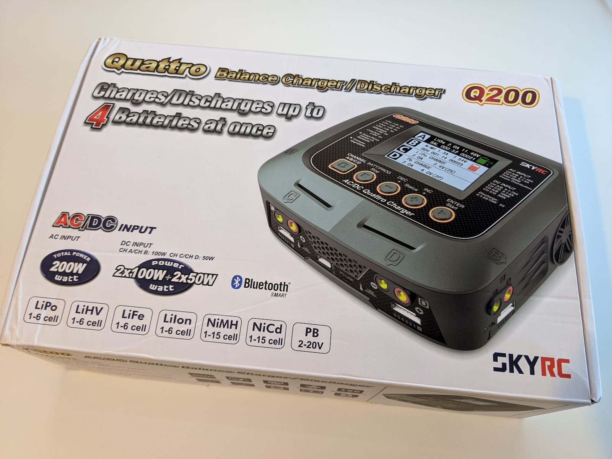

The box comes padded with this thick foam to protect the unit from all sides.

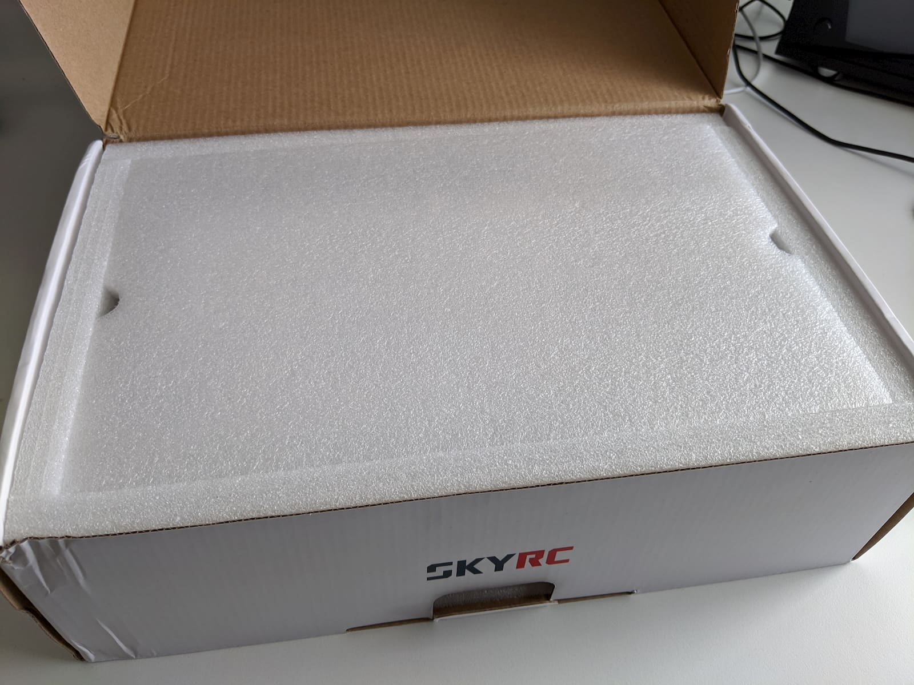

Removing the top plate reveals two compartments: one for the charger and one for its accessories. The charger came wrapped in a plastic protective film too, which I have already removed on the picture below.

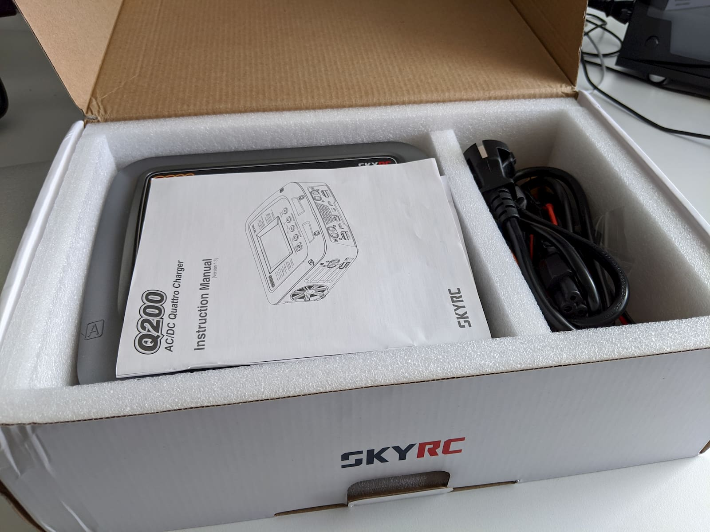

So, here is the SkyRC Q200 in all it's glory. It looks and feels like a high-quality product. Not too big, around 19x 17cm.

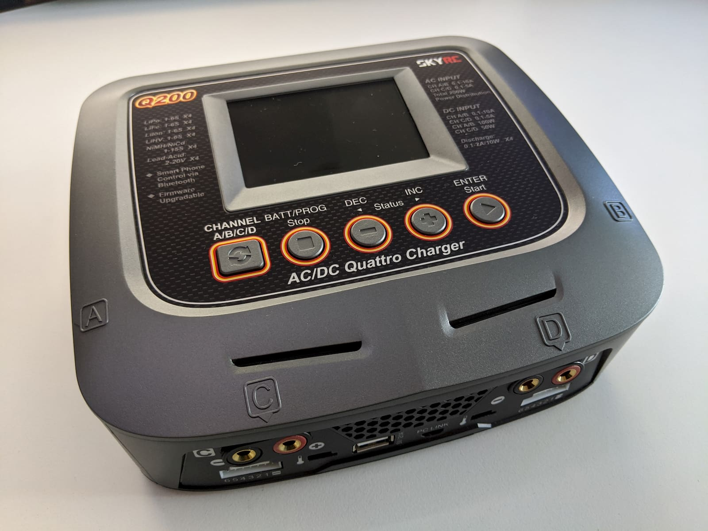

Here is everything you get inside the box: the charger itself, a nice thick and detailed manual, an outlet plug (in my case EU style), 2 custom banana plug to wire cables for soldering to your own connector type, 4 banana plug to XT60 connectors, 4 balance wires and adaptors supporting 2S to 6S batteries (perfect for our drone lipos).

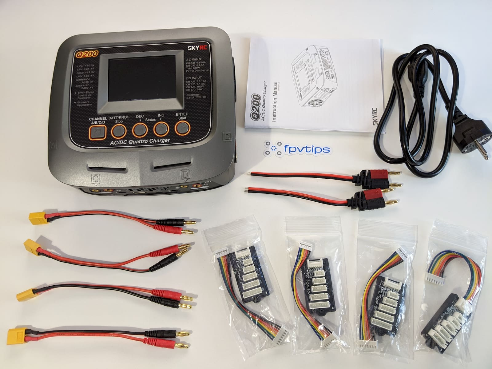

If anything, I'm surprised how minimalistic the package contents are. Definitely a good thing and you get only what you really need. Here's a closer look at the wires we'll use to charge our lipo batteries.

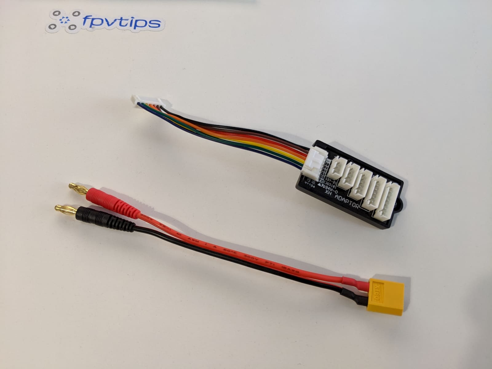

### 📝 Specs and Features

In terms of specs and features, the two arguably most important things about this charger are the fact that it can charge up to 4 batteries at the same time (with different amounts of cells or different chemistry) and completely independently. And it can do so with its own internal power supply - no extra power supply needed.

It has a nice color screen with a fairly intuitive UI and you can operate the unit with the 5 labeled buttons right under the screen.

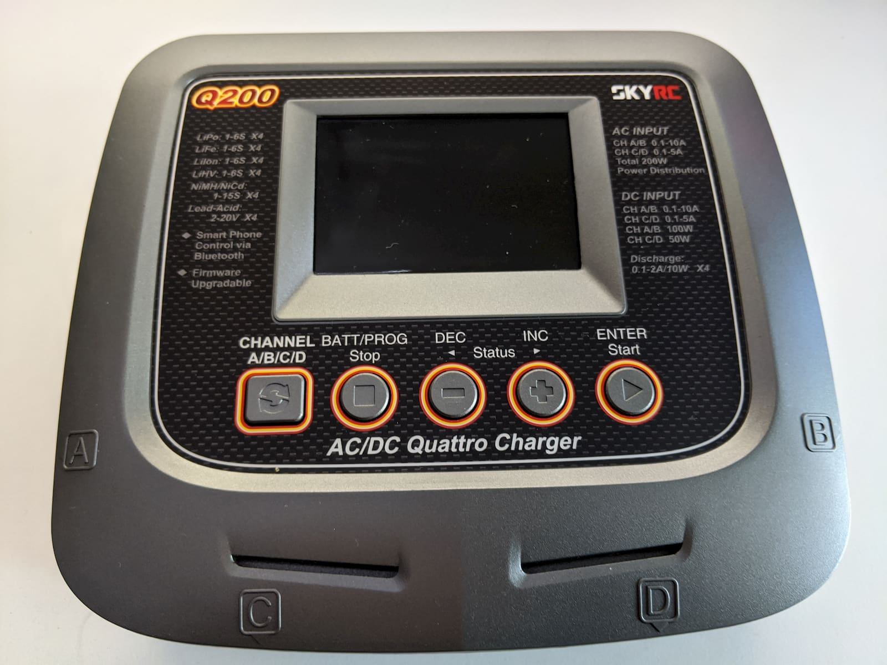

The `A`, `B`, `C`, `D` labels point to where the 4 charging slots are located. At 19cm x 17cm (~ 7.5" x 6.5") it's not the most compact charger. It's also not the bulkiest given it contains the power supply as well as a couple of cooling fans on the sides of the unit.

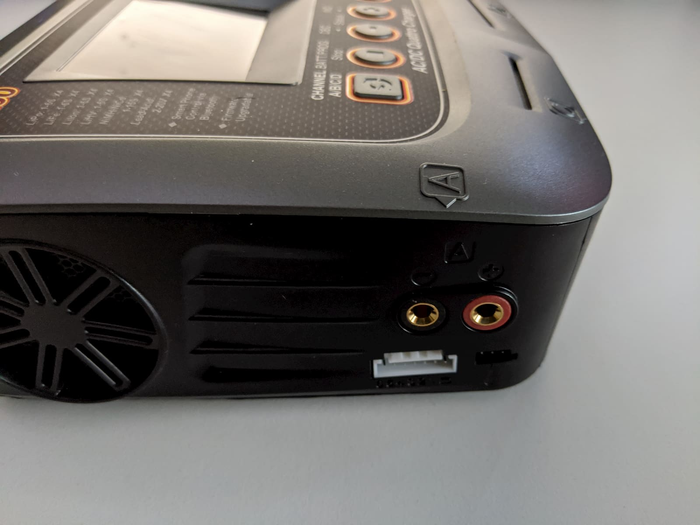

It can charge a variety of different battery chemistries (LiPo, LiHV, LiFe, LiIon, NiMH, NiCd, PB), including our drone favorite LiPo. And it can do that at up to 200W total power fed via an AC input.

For OTG (On The Go) applications, the unit can also accept power via an XT60 DC port on the back (11-18V). There's also a power on/off switch on the back panel above the AC plug slot.

In the middle of the front panel, there is a 5V USB charging port and a PC link micro USB port for connecting to a computer.

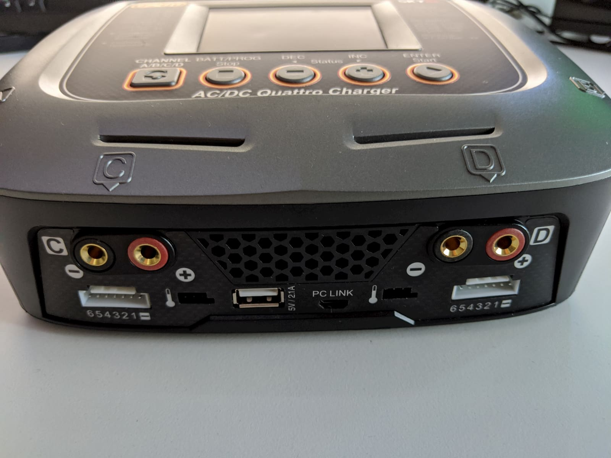

Each of the 4 charging slots (channels) has 4 ports. The banana plug positive (red) and negative (black) lead ports, the balance lead port (white) and a temperature sensor port.

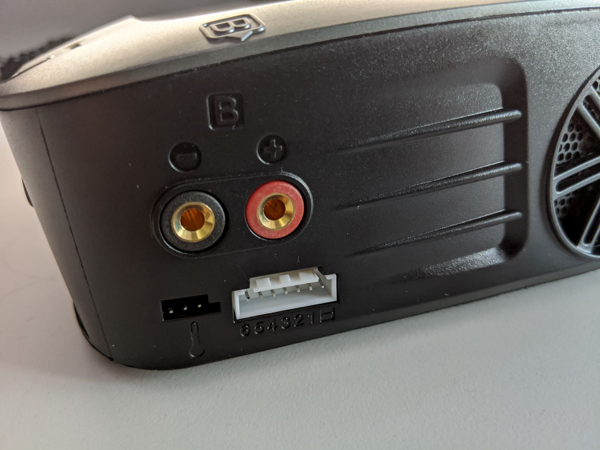

The firmware is upgradeable, there is PC control software, **as well as a smartphone app** that allows you to connect to the charger via Bluetooth to control it and monitor its state.

Additionally, you can scan QR codes via the app to quickly read and apply charging profiles. So in a way, it's very easy to quickly get started and get your packs charged so you can go fly. At the same time, the charger supports some more advanced use cases and scenarios, should you ever need them. Cool stuff.

### ⚙ Setup

There's not much to the setup of the [SkyRC Q200][1] charger. You only need to plug it into the wall and turn it on via the switch on the back.

You don't _need_ the smartphone app or the PC app to operate the charger. But they are there should you need them, and there I say the UI on both is pretty nice, useful and organized. Very good job, SkyRC!

#### 🈸 Get the SkyCharger smartphone app (optional)

The quickest way to get the mobile app is to scan the QR code from the manual. Or visit [the SkyRC smartphone app download page][2] and then go to the app store of your choice. I'm using a Google Pixel 3, so I visited the Google Play store.

Install the app, select the Bluetooth device (charger must be on for this to work) and set an access password when prompted.

Now you can use the app to control or set up the charging process, as well as to monitor the state of the batteries and the charger.

#### 💻 Connect to a computer via the Charger Master app (optional)

[Download][3] and install the SkyRC Charger Master app. Connect the charger to the PC via a micro USB cable. Run the app and the charger will get recognized.

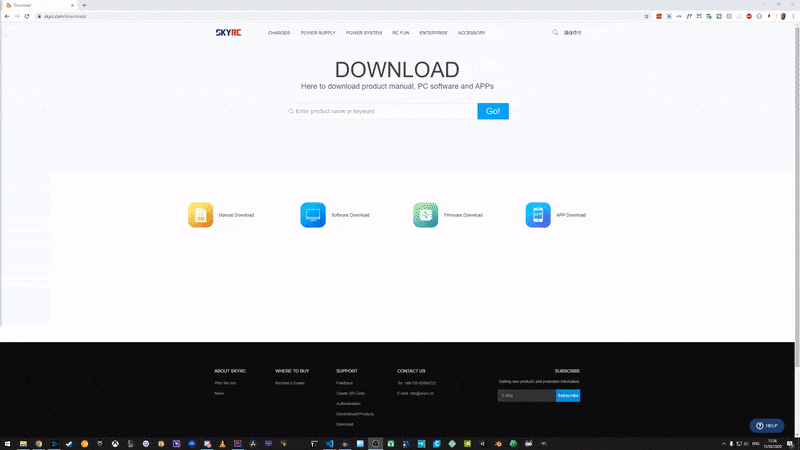

You can then use the app to set the different channels, change settings and monitor the overall progress.

Let me know if you are interested to learn more about the SkyCharger or Charger Master apps and I can make a dedicated post where we can go into more details on how to use them. The apps have a pretty good interface and provide similar functionality.

In the meantime, let's take a look at charging batteries using the SkyRC Q200's user interface, which is more than enough for most use cases and faster to get started with.

### ⚡ Charging

**If I take 2 things seriously about FPV drones, that's 5-inch props and lipo batteries. I suggest you do too if you want to stay safe.**

Dealing with lipo batteries can be dangerous, so always pay attention, be careful, don't do dumb stuff and never leave your batteries charging unattended.

Additionally, the author is in no way responsible for any damage you may cause.

The charger comes with a [pretty detailed manual][4], you should refer to it before doing anything with the charger.

With all of those disclaimers out of the way, I'd like to mention a few words about operating the charger. I was very pleasantly surprised with the whole user experience, to be honest.

One of the challenges with such a product where you have so many different options and configuration settings is how to communicate those effectively to the user without making them go through thousands of screens and steps just to get started.

**SkyRC has absolutely nailed it!**

I was expecting some sort of a navigation hell and a hard to remember steps, instead, I got a product that's very easy to use and gets you up and charging with a few button presses. As a frontend software engineer, I appreciate this!

When you first boot up the [SkyRC Q200][1] you are presented this "main menu" screen which shows at a glance the state of all 4 charging channels.

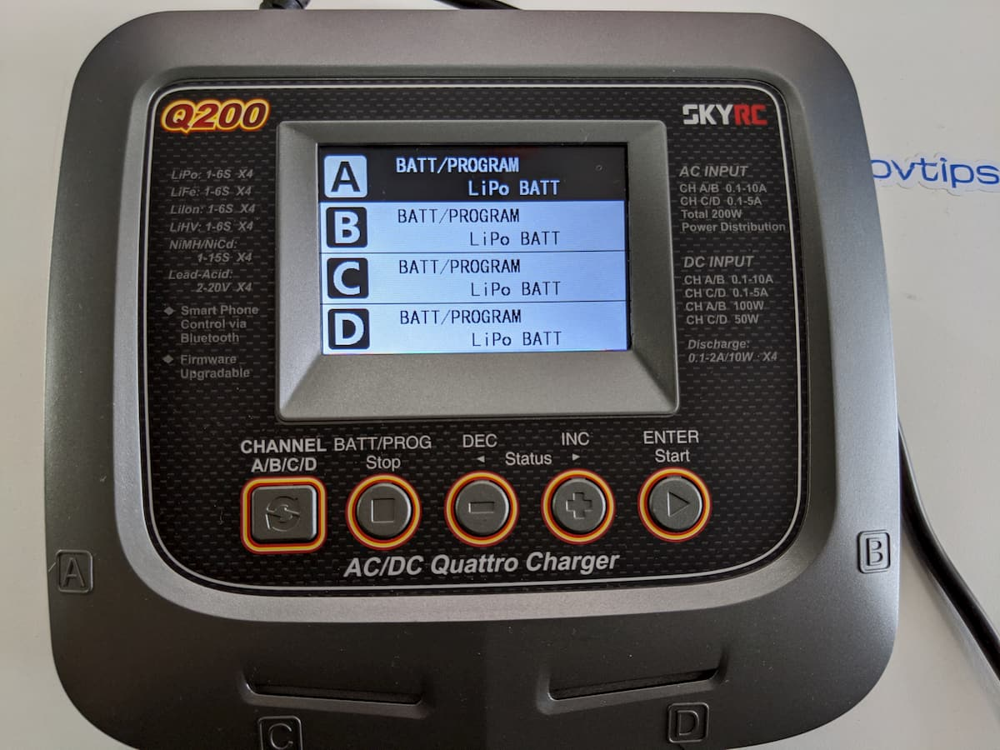

Pressing the left-most button cycles through the channels and the currently selected one is highlighted with a black background.

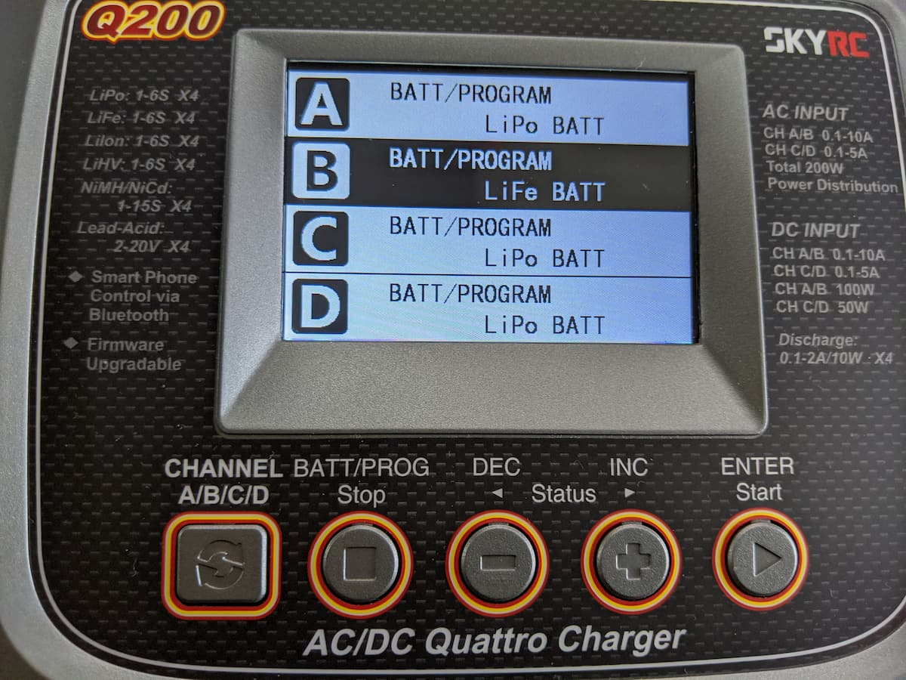

Pressing the ➕ and ➖ buttons cycles through the battery chemistry options at first. Then pressing the ▶ (enter) button takes you to the operation mode.

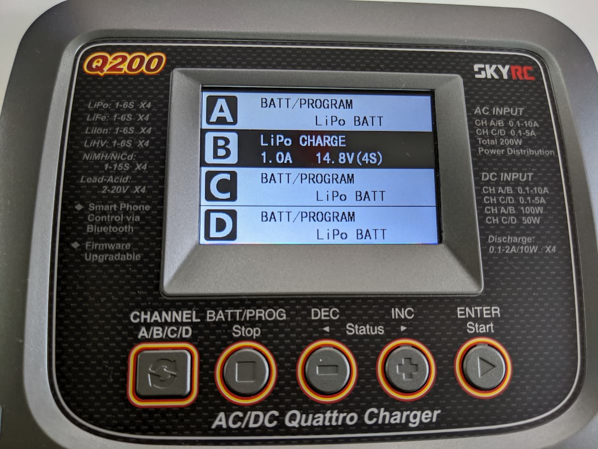

You can select from `Balance charging`, `Charging`, `Storage charging`, and more. 99% of the times you would probably need to either `Balance charge` your batteries, or to put them in `Storage charge`.

> _Putting your batteries in storage charge (3.8v - 3.9v) is very recommended when storing them over extended periods, ranging from just a few days to over the winter season. Doing that will preserve their longevity and characteristics._

Once you have selected the operating mode, pressing Enter allows you to go into the cell count number (2S - 6S). Always make sure to get this right depending on what battery you are charging.

Finally, you can also set the charge current. Be careful when setting too high current. I mostly charge at 1A and rarely at up to 2A. I never go past that; I'd rather wait a bit longer and stay as safe as possible.

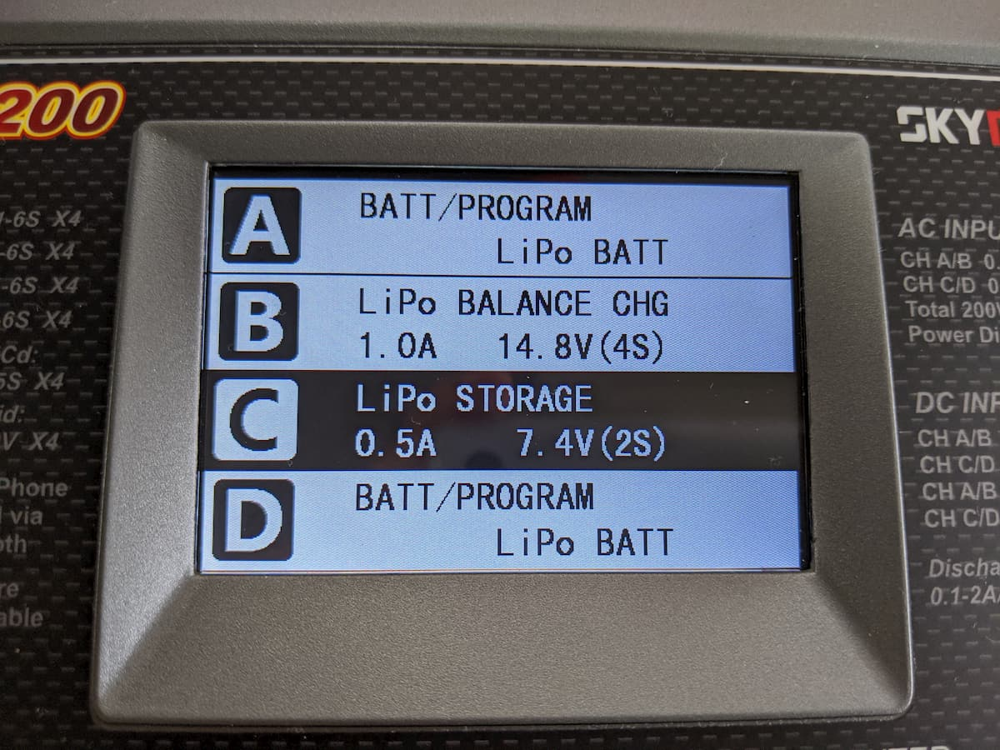

**Be careful and follow the instructions in the manual when doing the battery connections.** But in a nutshell, the battery's balance lead goes to the balance board adaptor, depending on its sell count. The XT60/XT30 battery connector goes to the XT60/XT30 lead on the charger.

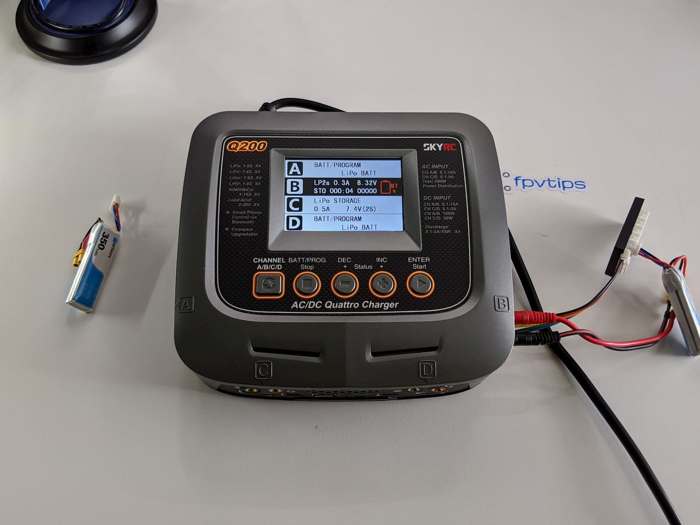

When ready with all settings press and hold the Enter button for 3s to start charging. It's going to verify the In this example I'm storage charging a small 2S 350mAh whoop battery. But the process is identical for any battery.

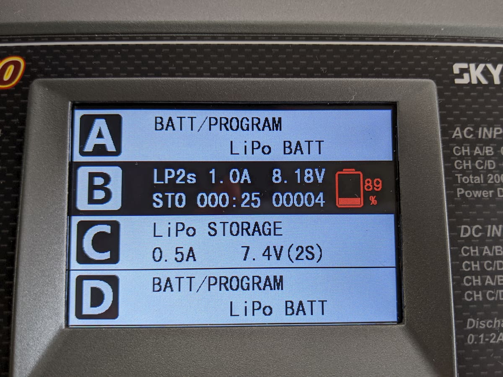

That's all there is to it! Remember, always keep an eye on your batteries while charging. You can also monitor the progress via Bluetooth with the smartphone app but this should not be a substitute for actual in-person supervision.

You can also save particular settings as profiles to QR codes. What that allows you to do is to then print those QR codes, cut them out and attach one to each battery with its charging settings. That way come charging time you can just scan the code and go. I haven't yet looked into that myself, as I don't find it that hard to just punch in my charge settings anyway.

There are many more advanced things you can do with the charger, such as voltage calibration and on the go charging.

### 🔝 Upgrades

If you are charging any 2S - 6S battery with an XT60 connector (most 5-inch drone batteries) you are set - the provided cables are enough to charge up to 4 of those batteries at the same time.

However, if you also need to charge **2S, 3S or 4S batteries with an XT30 connector**, I recommend you grab some of these [banana plug to XT30 connector cables][5] or make your own if you have the necessary connectors, wire and feel like soldering.

I also very recently learned about a [XT30 to PH2.0 cable][6] that could help you **storage charge your 1S PH2.0 whoop batteries**. I found out about this thanks to a [video by AndyRC][7] which I recommend you see.

**I also recommend you subscribe to his channel if you haven't already, and while you're there, subscribe to [my YouTube channel too - FPVtips][8]**.

### 📑 Conclusion

So the final verdict. I fell in love more with that product than I initially thought I would. Let's be honest here, chargers, most times I wouldn't say are particularly exciting. But here's the thing - **a good charger can save your house from burning down, can take good care of your batteries, save you time and make the overall charging process pain free**. So while chargers usually lurk in the background, they do a lot of the work involved so we can fly our drones.

The main thing for me with the [SkyRC Q200][1] was the **ease of use and the nice UI**. It's not often that you see not 1 but 3 nice user interfaces: on the charger's screen, on the smartphone app and even the desktop software. I was genuinely very surprised.

Overall I would say the charger feels like a high-quality product, delivers a great experience and comes in at "only" \$170. I'm not rich, but here's why I say "only". A fairly decent ISDT charger will set you back around $60-$80. Then you have to add a decent power supply to that, so say at least another $30 - $50 more. And that's to charge 1 battery at a time. Add another $20 - $30 to that for a parallel charging board. We're looking at $110 - $160 already.

If that's your setup and you're happy with it, great! Nothing wrong with that. But if you don't want to deal with parallel charging, the [SkyRC Q200][1] is one way how.

Happy flying!

P.S.: I've linked below the charger, some recommended batteries, and the XT30 cables.

[0]: Linkslist
[1]: https://bit.ly/skyrc-q200
[2]: https://www.skyrc.com/qrcode/?key=skyrc_q200
[3]: https://www.skyrc.com/help/download/charger/Q200/ChargeMaster_Q200.rar
[4]: https://www.skyrc.com/files/60?open=1
[5]: https://bit.ly/xt30-to-banana-plug
[6]: https://bit.ly/xt30-to-ph2
[7]: https://www.youtube.com/watch?v=9ezGB7S_BDM
[8]: https://www.youtube.com/@FPVtips
