I've finally decided to take the plunge into digital FPV drones with the [DJI Digital FPV system][2]. I've been very interested for a while now and lucky to finally be able to get into it. For my first digital FPV experience, I've chosen to go with an already assembled quad, instead of building my own from scratch.

The main reason for that is because I'd like to focus on the experience itself and evaluate that for what it is, rather than evaluate a new custom build.

When doing so, going with a drone as tried and tested as the [Holybro Kopis 2 HDV][1] that excels in performance is a very safe bet.

I don't want to discourage you from building one from scratch, however, in fact, I always encourage you to try and build your own, but especially if it's your first one, I **highly** recommend grabbing a prebuilt drone that you can learn to fly on and enjoy, as well as learn to repair when you crash it.

If you decide to follow along and grab the same quad as I did, do note that the Holybro Kopis 2 HDV can be purchased with and without the DJI air unit. Because I grabbed a DJI bundle with the goggles, controller and air unit already, I opted in to grab the Holybro Kopis without the air unit.

If you are in the same boat as me, I'll include instructions on how to completely set up your quad if you need to add the DJI air unit on your own.

### Table of contents

- [📦 Unboxing](#unboxing)
- [📝 Specifications](#specs)
- [🐝 Betaflight setup](#betaflight-setup)
- [🥽 DJI digital FPV system setup](#dji-setup)
- [🚁 Flying](#flying)
- [🔝 Upgrades](#upgrades)
- [📑 Conclusion](#conclusion)

If you prefer watching, check out the full video playlist on the FPVtips YouTube channel:

  <iframe width="560" height="315" src="https://www.youtube.com/embed/rX5OUWnx0kA?list=PLLsZew4NRcddaEaRPXDAeGo6YlTXgCjHO&rel=0" frameBorder="0" allowFullScreen title="Getting started with DJI digital FPV part 1"></iframe>

### 📦 Unboxing

Coming in at about \$250 without the air unit, the [Holybro Kopis 2 HDV][1] is not one of the cheapest quads out there but it does offer an unboxing experience to match the price.

Once you get past the Holybro box, you discover what looks and feels like a very high-quality carry case.

Inside the case, the Kopis 2 is sitting nice and snug, in the middle of the case, strapped in securely with a velcro strap.

The upper part of the carry case has a zippable container that hosts the following items:

2 sets of different props, a small bag with prop nuts, a few spare screws, zip ties, double-sided sticky tape, a parts list sheet, and a DJI air unit connection cable for the flight controller.

At a glance, it might look like you were given 2 sets of the same prop, but those are 2 different sets with a different pitch.

The less aggressive pitch and thinner **T5143S** (on the left) and the higher pitch **T5147** on the right.

The carry case strap is a nice inclusion, and if you were wondering the same, the quad does fit inside the case with the props on, so this is not useless at all.

The quad looks legit like a piece of art and feels very high quality, so let's take a closer look at the components it comes with.

### 📝 Specifications

So we're still missing a camera, VTX and a receiver (in this case the DJI digital FPV air unit), and I will update this post when the rest of the components of the build arrive, so stay tuned. But in the meantime let's take a look at what we do have.

The frame is a **stretched X** from what I think is very high-quality carbon fiber with 4 separate arms, which makes replacing a broken arm easy.

The top plate of the frame has "grill" openings which I can only assume will help better cool the DJI air unit.

The quad is intended to have the battery mounted under it, as it is indicated by the thick rubber battery pad underneath the quad that would help with gripping and holding in place the battery, as well as cushion it away from the screws on the bottom plate to prevent piercing it in a crash. There's also a nice Holybro battery velcro strap, which looks a bit short to me, but I'd be surprised if it's not long enough to hold a 6S battery.

The motor wires are neatly and snuggly wrapped with a tape that feels like a cloth-like material, should hold up much better than some plastic tape. The motors themselves are the **T-Motor F60 Pro III**, in my case the **KV1750** as I'm going for a 6S setup. I haven't yet tried these motors personally but I know they are a trustworthy brand and high-quality motors. I expect them to perform accordingly.

In the back, we have an XT60 connector, as usual, the battery leads length is fine, not too short to not be able to reach top or bottom and not too long to sacrifice that extra bit of performance. There's also a capacitor attached to the power terminals to smooth out some potential plugging in battery voltage spikes. **There is also a barely visible buzzer attached to the back right arm, close to the body of the frame.** Those have certainly become somewhat rarer, but are still nice to see a dedicated one on a 5-inch drone, as they are usually much louder than the sound of the motors beeping.

The soldering job on the motor wires coming to the **Tekko32 40A rated 4 in 1 ESC** is pristine. The Tekko32 is a tried and trusted high-quality ESC board, so no surprises there.

The ESC is connected to the flight controller via a plug on the front side of the board. The flight controller itself is the **Kakute F7 HDV** version. It has an SD card slot for collecting Black Box data, a barometer, a 32-bit processor and a **GH port, where you can plug in the DJI air unit** for both video signal transmission, as well as radio controller transmission link.

> Which also makes this build a completely solderless assembly, if this is important to you.

The flight controller can be configured in Betaflight via a micro USB port on the side. It would have been nice if the port was USB type C to conform with the DJI air unit so that you wouldn't need 2 different cables, but that's a minor thing and I'm sure it is going to be improved in the future.

Finally, a TPU mount for the DJI air unit antennas is added to the sides of the frame. There is a camera TPU mount in the front, and a TPU holder for the DJI air unit itself on the back standoffs, as well as 2 small strips of double-sided sticky tape under the top frame plate.

I can't wait to get the DJI digital FPV system and continue this build. If you land here in the meantime, stay tuned or better yet, [subscribe to FPVtips on YouTube][3] for updates.

### 🐝 Betaflight setup

While waiting for the DJI Digital FPV system, I decided to take a look at the Betaflight configuration.

The [Holybro Kopis 2 HDV][1] comes with Betaflight version 4.1.2 which is quite up to date (at the time of this writing the latest release is version 4.1.5).

1.  **Ports tab**

ESC telemetry is setup on UART7 and serial RX on UART6.

2.  **Configuration tab**

The motor direction is **Props in**, which is the more common configuration and what I personally prefer. Good to know when putting on the props. I also like seeing **MOTOR_STOP** off. **Accelerometer** is enabled which could be handy for angle (stability) mode if that's important to you.

In this next bit, we don't care much how the receiver is set up as we'll be using the air unit for that, but I do like making sure that **Airmode** is on. Because we have an on-board dedicated buzzer, I also like that **RX_LOST** and **RX_SET** are off since we won't be using the motors for those sounds.

3.  **Receiver tab**

I would normally change the **Channel Map** here from AETR1234 to TAER1234 as that's what my Taranis X-Lite is configured to, but in this case, we don't care and we'll leave it to the default for now.

4.  **Modes tab**

Not a lot to see on the modes tab either, it seems there is only an arming switch on Channel 5 (AUX1) and horizon mode on Channel 6 (AUX2). By default, we will be in Acro mode, so that's all good.

I might come back here and add Turtle mode and the Buzzer on some channel.

5.  **OSD tab**

Not much to say about the OSD tab for now either. I know the DJI goggles support some amount of Betaflight OSD, but we will need to come back to this later and see what we can add.

I like seeing my signal link strength and battery stats.

If you made it this far, thanks for going through this with me. Do note, this is a living document and I will be updating this article as soon as possible. I'm still hoping to get the goggles during April and worst-case scenario in May. Shipping times can be a bit flaky at the moment.

Stay safe out there and happy flying for now.

**UPDATE (May 9, 2020): 🎉 It is finally here!** It surely took a while, at this point almost 2 months since I ordered the [DJI Digital FPV system][2], but it is what it is and at least I'm happy now that it is here. I will be updating this article in the coming days, so keep checking back! Thanks for your patience, I know I'm really looking forward to setting up the system and flying HD!

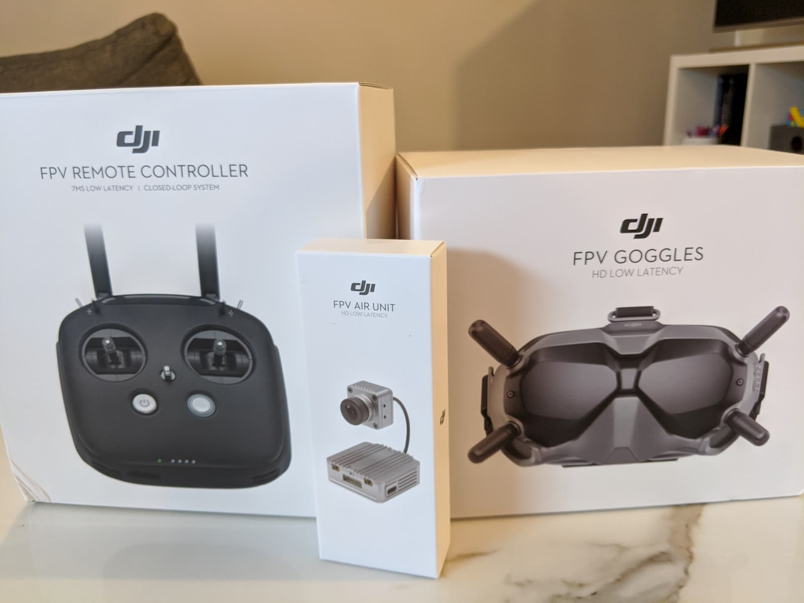

### 🎦 Setting up the DJI digital FPV system with the Holybro Kopis2 HDV

If you go for this exact drone + DJI digital FPV set up you actually have very little to do. It may seem like a lot of steps, but all of them are very easy and a matter of minutes to accomplish.

**The only thing that takes time in this whole setup process is charging your DJI radio controller. I suggest you do this first, as it will take a few hours.**

<!-- TODO: add links when DJI article is ready -->

You can also check out the more thorough review and setup guide with a deep dive into the DJI digital FPV system. Here I'll keep it straight to the point and as short as possible in the context of the Holybro Kopis2 HDV quad.

To proceed you should have the [following gear][2] available:

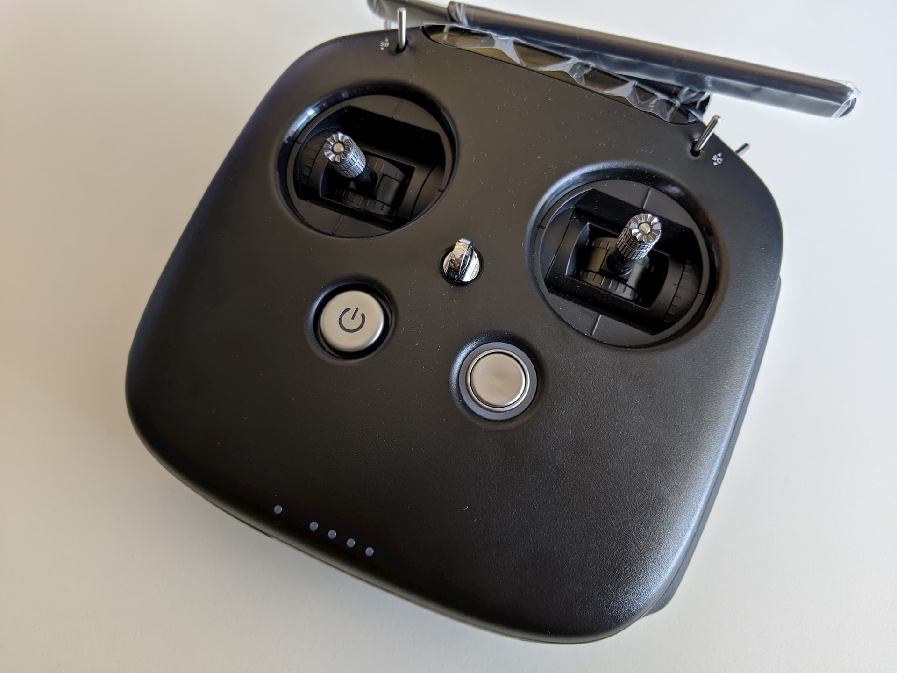
**DJI digital FPV controller**

**DJI air unit**

**DJI digital FPV goggles**

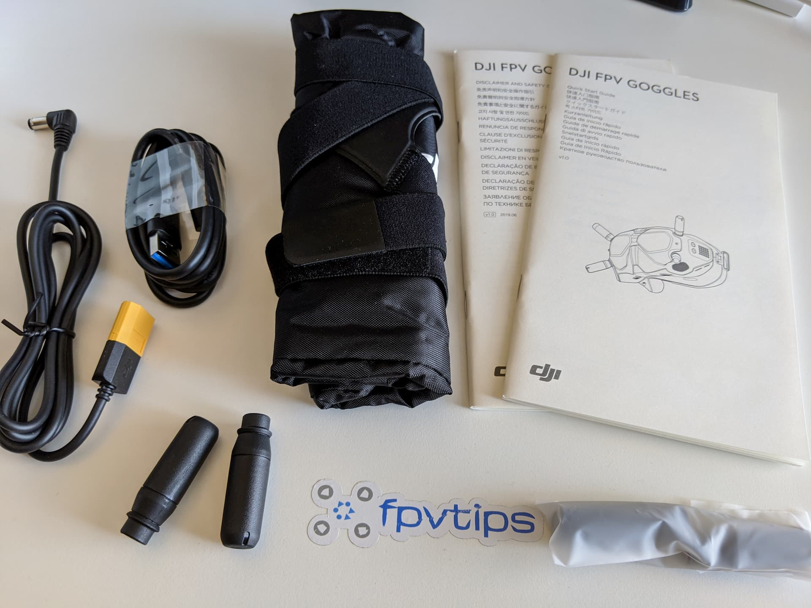
**DJI digital FPV goggle accessories**

You will also need to have a couple of batteries to provide power to the goggles and to the air unit.

**4S LiPo batteries**

**The DJI digital FPV goggles accept voltage from 7.4-17.6 V, so a 2S to 4S battery will do. Don't go above that though!**

You are provided an XT60 to DC barrel jack cable to allow you to use one of your drone [4S battery packs][4]. Alternatively, you could grab a Fatshark battery case for a couple of 18650 batteries. I'm going for now the way of the drone battery, which allows me to keep it in my pocket and reduces the overall weight when you have the goggles on.

You will also need 1 more battery and that could also be [4S][4] to [6S][5] as we will plug this one into the quad (if your Holybro Kopis is also the 6S version). Don't plug in 6S batteries to equipment rated for 4S.

Let's get started!

1. **Charge the DJI controller and batteries for the DJI goggles and air unit**

> This is important, because we're going to be upgrading the firmware and you don't wanna be doing that on anything but a fully charged battery ideally. To charge the DJI radio, just plug it in via the provided USB type C cable and wait a few hours. It will take some time, so be patient.

> 

> Charge a 4S LiPo for the goggles and another 4S or a 6S battery for the drone, depending on which version of the quad you bought.

2. **Install goggle antennas, headstrap, air unit antennas**

> Installing the headstrap is not a requirement for the setup, but you might as well do it now, since you will need it anyway eventually.

> 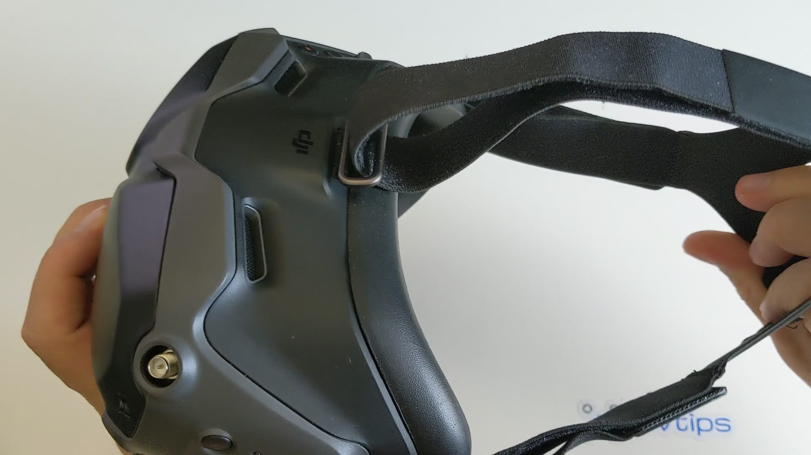

> However, installing the antennas is very important. **Never deal with video transmitters without having installed their antennas, as this is an easy way of frying them in some cases.** Quite possibly the goggles may be totally fine even without antennas, since they just receive the transmitted video signal, but why take chances. To install the antennas simply screw them in in all 4 slots.

> 

> For the air unit antennas it's **absolutely mandatory that you install them** as the chance of frying the unit if powered on without antennas is much higher!

> 

> I also plugged in the air unit cable that should connect to your flight controller. You should have one cable that came with your air unit (on the left in the picture below) and a similar cable that came with your Holybro Kopis2 HDV (on the right).

> 

> I used the Holybro provided cable as this setup is solderless since the cable is designed and intended to fit and connect perfectly the DJI air unit to the flight controller on the Holybro Kopis2. There is a port for that in the back of the flight controller.

> 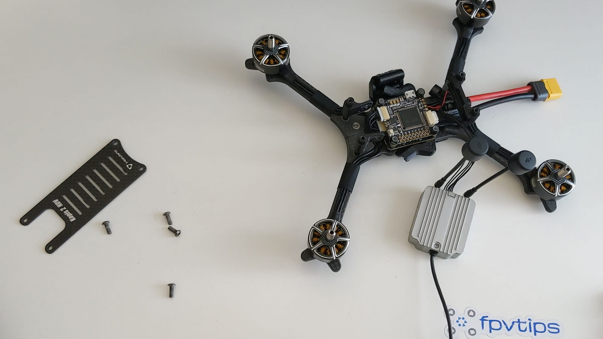

> I do recommend you power on the quad with a LiPo (**NO PROPS**) before you connect the air unit. That was you can test it for any potential issues and in the case that something smokes, you at least won't smoke your DJI air unit along with it.

3. **Download and install the DJI software**

> There's no flying before we activate the DJI products. Go to DJI's site and download the [DJI Assistant 2][6] software for your operating system.

4. **Activate products and update firmware**

> You will need to activate and update the firmware on all 3 products separately. However, this is much more straightforward than it may sound.

> By now your DJI remote controller should have charged, so you can **connect it to your computer and power it on by short pressing and then press and holding the power button**. Start up the DJI Assistant app, create and account or login and you should see the DJI FPV Remote Controller in Connected Devices.

> 

> Click the device to start the activation process.

> 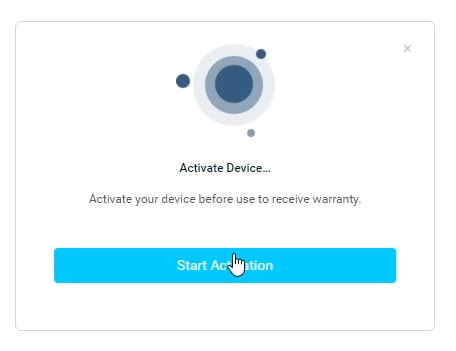

> Click through a few end user agreements and your device should get successfully activated.

> 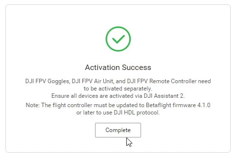

> Next, you will probably get the firmware update prompt. Confirm you want to install the latest version to start off the update. This is **highly recommended as DJI has released a few quite important improvements that you definitely want to have**.

> 

> The firmware update is going to go through 3 steps. Downloading...

> 

> ... transmitting ...

> 

> ... and updating.

> 

In my case the entire process took about 5:30 minutes.

> 

Unplug the radio from the computer and power it off by double press and holding the power button.

The next step is to do the same thing for the goggles. Plug in the DJI FPV goggles to the computer. Then power them on via a 2S-4S battery and the provided XT60 to DC barrel jack cable.

Once you do that, **you should see them in the list of connected devices in the DJI Assistant 2 app**.

The activation and the update process are exactly the same as what we did with the remote controller. Activate the goggles and complete the firmware update.
Then unplug from the computer and power them off.

Finally, do the same for the DJI air unit. The only thing to watch out for is that the air unit **WILL GET VERY HOT**. That's normal, but try to keep this part as short as you can, don't fiddle around with anything else. Plug in the air unit to the computer via it's USB type C port, power on your quad via its XT60 connector and a LiPo (**NO PROPS**), go straight into the DJI Assistant 2 app, click the newly discovered connected device, activate it and update the firmware.

After the update has completed successfully, unplug from the computer, unplug the LiPo battery and let the air unit cool off a bit.

As far as I know the air unit shouldn't fry too easily if kept longer, but again, why risk it. This is also not to say that you should stress to be super quick about it, go at a normal pace, but don't, I don't know, leave it plugged in and go grab a coffee or something. Get the job done and turn it off.

Believe it or not, we are almost done!

5. **Bind DJI goggles to air unit and bind DJI remote controller to air unit**

The order here is important if you are going to use both the DJI goggles and the DJI radio with the air unit. **Always bind the DJI goggles first.**

> **Optional side tip**: If this is your first time with HD FPV, and you want to save your WOW moment for when you get to the field, then keep the camera protector plastic cap on. That way the video is still going to look somewhat bad-ish through the goggles while you're setting things up. I'm happy to have done this by chance and in my opinion it was worth it 😅

To bind or link (as DJI calls it) the goggles with their antennas installed, power on the goggles. Then power on the air unit by providing power to the quad. The LED on the air unit should be green. Press the bind button next to the LED and above the SD card slot (you will need something thin to access the button, like tweezers). The LED should go red to indicate we are in linking mode.

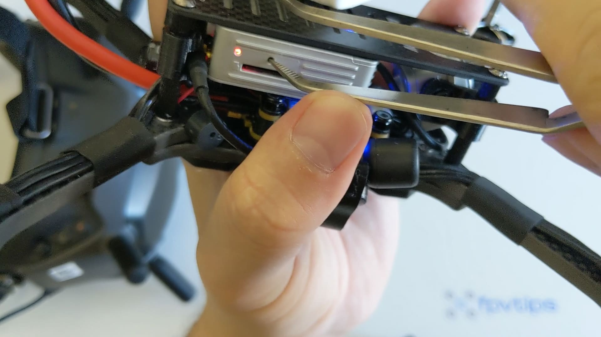

Then press the bind button on the goggles (it's right next to the power jack). You should hear a few tones and the air unit's LED will go green to indicate successful link.

With the goggles linked, it's time to link the radio transmitter. Press the bind/link button on the DJI air unit to put it in linking mode. Power on the remote controller.
Press at the same time and hold shortly these 3 buttons on the radio: `record button` on the top left, `C button` right next to the power button and the `dial` switch at the top right.

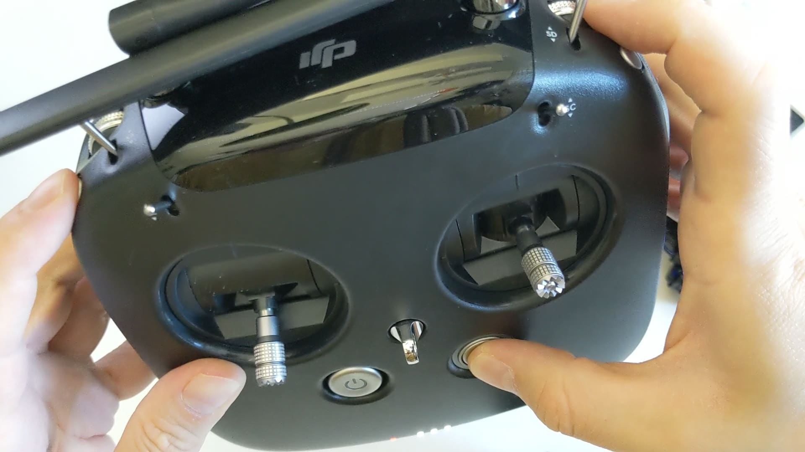

If successful, you should hear a few tunes being played to indicate the radio was linked to the air unit. If you don't have props on you can try to arm the drone with the `SA` switch. If you have any issues make sure the throttle stick is all the way down, otherwise it won't let you arm.

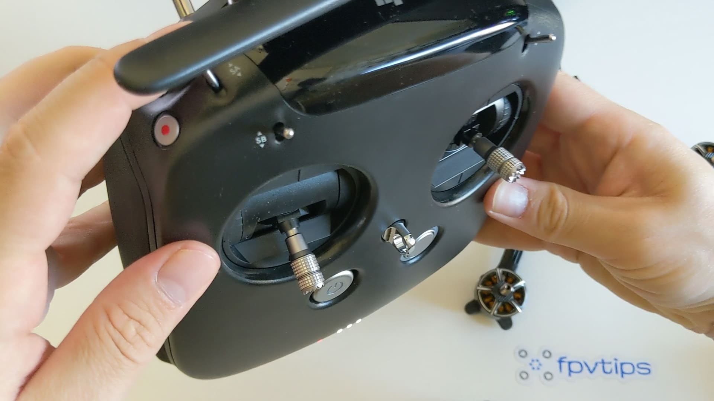

It may be a good idea to connect the flight controller to Betaflight, go to the receiver tab and make sure that the inputs on your sticks match what you see displayed as channel values. If you go for it, make sure you don't spend too much time with the air unit on.

You can also change the switches and configure flight modes, but for now I won't bother with that as I would like to evaluate the stock configuration. By default you can change flight modes with the `SD` switch. If left untouched it leaves the quad in the default acro mode, which is ideal.

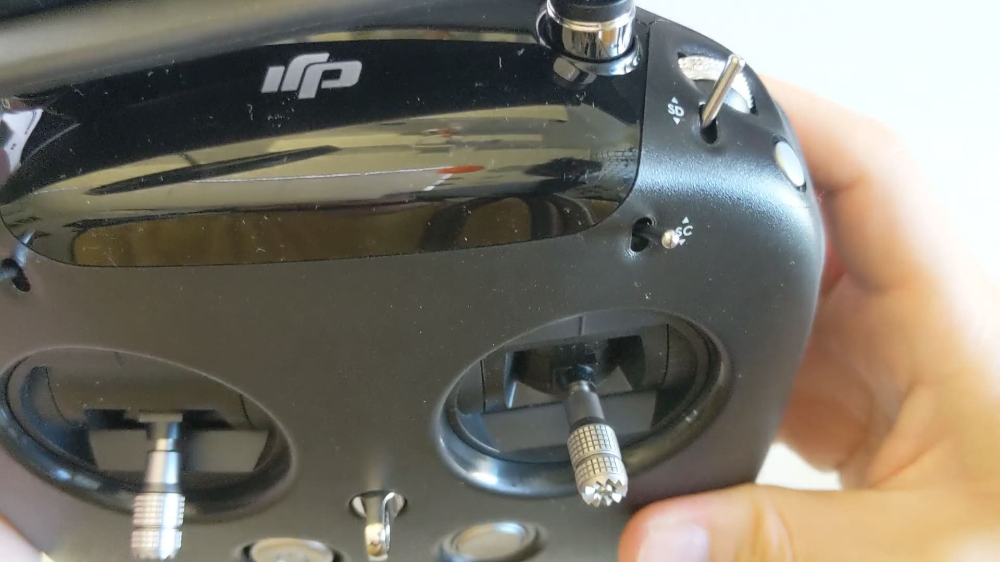

6. **Flight preparation**

Put in SD cards in the DJI digital FPV goggles and in the air unit. It needs to be a recent card of decent quality, so some older cards may not work. Mine are some [32GB "high speed" cheepos][7] but haven't betrayed me so far in a couple of years. You can and you should format the cards from within the goggle's interface to avoid any disappointment with missing footage.

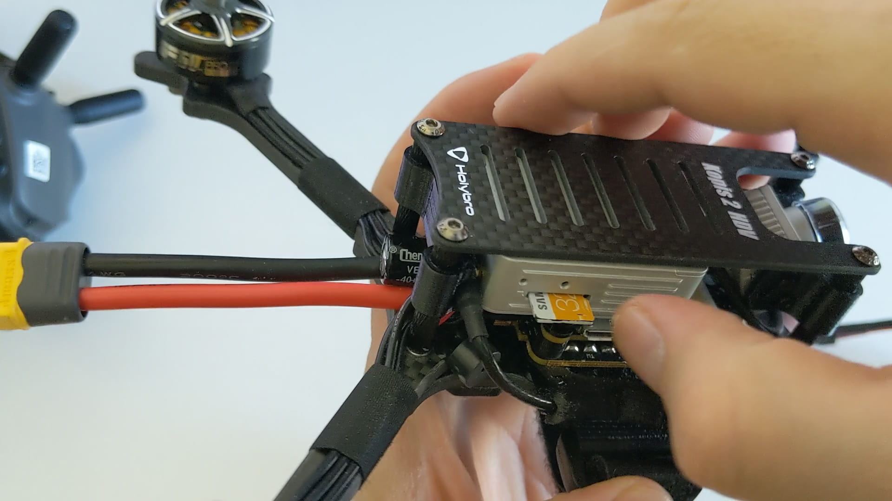

To display the OSD menu, press in the joystick on the top right hand side of the goggles. Then navigate to `Settings -> Format SD Card` and format both cards. You can go back to upper levels of the menu with the button right next to the joystick.

**Besides formatting both SD cards, I recommend you do 3 changes that I didn't do before my maiden flight.**

`Settings -> Camera` and set the aspect ratio to 16:9. By default it's set to 4:3. I find 16:9 more immersive in terms of flight experience and the end footage is ready to be used without any post processing. In 4:3 the screen feels a bit far away in the goggles and gives me a "cinema" experience. Don't hate it, but don't love it. Then you would need to post produce the footage, but while in 4:3 you will get the full height of the camera sensor, you will loose resolution when you adjust the footage to 16:9 before uploading to YouTube.

`Settings -> Preferences` and set to **high quality** (instead of low latency). The latency difference is negligible between the 2 modes, and the quality improvement could me slightly more useful.

`Settings -> Device -> Max Power` and set to a higher value. I'm in the EU and by default the DJI goggles come configured to 25mW and locked in to that value, but there are ways to fix this. The higher the power output, the better picture and the further away you can fly. If you are legally allowed to do so you can allow higher output power by doing the following. Create a file called `naco.txt` on the air unit's SD card, open it with Notepad and write the number `1` in it as its only content. Add the SD card to the air unit. Once powered on and the file read, the air unit and goggles will change their settings and you will have access to more channels and more power output options. Once changed, it's ok to get rid of the `naco.txt` file, it's not required to keep it on the SD card at all times.

Last thing to do before we actually go out flying is to put on the props. To do that correctly you need to know what's the direction of your motors. You can arm the quad without props and touch lightly the motor on the sides with finger or with a piece of paper to identify the rotation direction.

You want them to rotate in the direction that is shown in Betaflight on the Configuration tab. In this case it's the so called "Props In" mode, because the props should move in towards the quad.

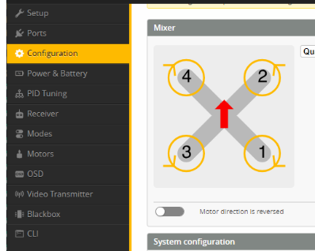

So if you put the quad in front of you facing up and away, as in the diagram, your front left motor is motor 4, front right is motor 2, back right is motor 1 and back left is motor 3.

**The trick to putting on props correctly is once you know the direction (and have confirmed it), put the props on such that the pitch (slant) on the prop goes from low to high in the direction of the rotation of the motor.**

It may sound like a lot and a bit convoluted, but I promise you once you've done it a few times it will make sense and you will probably never put props on in the wrong direction ever again.

Also take note that you only need to know how to put on 1 prop with the correct pitch direction. If you put on prop 2 correctly, then prop 3 should be the exact same type and direction and props 1 and 4 should be same to each other, but different to 2 and 3.

With those rules in mind, you can put on props all day!

Here is how my setup ended up looking. Make sure you tighten the prop nuts all the way down nice and snug.

That's really all of it! Let's go for a flight!

### 🚁 Flying

Anytime flying a new quad I highly recommend starting with a line of sight test hover before you get into full on FPV mode.

I am so happy that I did this, because I actually discovered an issue during my test hover and I fixed it quickly, where had I not, it could have resulted in some broken props at best or other broken parts at worse, and to be honest would have simply been a huge downer and disappointment, given how much I was looking forward to flying HD FPV for the first time.

So what happened? Well, I setup everything for the test hover, I armed the quad and heard a weird grinding and rattling noise. Luckily I didn't punch it into the skies, I just took off very slowly, so after hearing the weird sound I reduced the throttle and landed right back down. On closer inspection, turns out I didn't completely tighten the prop nuts and there was a bunch of wiggle room between the prop nut and the base of the motor. Super rookie mistake, and I could have sworn I tightened them properly.
Either way, a quick job with the prop nut tool and all of them were properly in place nice and tight.

**Moral of the story is**: don't skip the line of sight test hover, no matter how advanced of a user you think you are.

This time the hover test worked fine and it was finally time for the first HD FPV experience.

If up to this point you have followed along, make sure you remove the plastic camera protector. Footage will be recorded to the SD cards by default as soon as you plug in a battery and will be saved when you unplug, so no need to do anything manually if you hadn't changed the default settings.

#### Maiden: CNHL 4S 1300mAh battery, 25mW air unit power output

**DISCLAIMER:**
Do not judge the [Holybro Kopis2 HDV][1]'s flight performance from the maiden flight! It's a 6S quad and I did the maiden on 4S batteries, while waiting for my 6S batteries to arrive, because I was very excited to try out the DJI digital FPV system.

With that out of the way, the quad still flew superbly. As expected from this type of a motor and battery combo, the quad was very timid and super easy to handle, but of course naturally it lacked some performance which was due to the 4S batteries used.

  <iframe width="560" height="315" src="https://www.youtube.com/embed/qn7gfNfE5c4?rel=0" frameBorder="0" allowFullScreen title="Maiden with the DJI digital FPV system on Holybro Kopis2 HDV 4S #1 (2020 #60)"></iframe>

I did 2 flights on 4S, and each time I got over 6 minutes of flight time. Admittedly I wasn't in a rush to push it around like crazy or anything, just cruising around taking in the view and enjoying! It was a really fun experience to be honest. I could start seeing some pixelization from the poor connection as I went towards the far end of the field and with the antennas completely hidden from sight while on 25mW. I attribute this effect to the power output. I am curious to see how it would be with higher power output, even without fixing the antennas position.

  <iframe width="560" height="315" src="https://www.youtube.com/embed/GXepohD4z7o?rel=0" frameBorder="0" allowFullScreen title="Maiden with the DJI digital FPV system on Holybro Kopis2 HDV 4S #2 (2020 #61)"></iframe>

#### Flight #2: CNHL MiniStar 6S 1000mAh battery, 25mW air unit power output

TODO: video and notes

### 🔝 Upgrades

**Improve the DJI air unit antenna positioning**. Many people have claimed and shared that the antenna positioning on the Holybro Kopis2 HDV is suboptimal. It's not the end of the world, but arguably you could get better performance in you find a way to bring the antennas up and away from the carbon frame. This may be extra significant to do if you are locked in to only flying on 25mW power output. I will update this info when I have a more concrete solution to this.

**Consider increasing the camera tilt**. I bumped my way up high (almost 45 deg, might reduce that slightly), gets rid of a lot of the "props in view" issue and a bit nicer to fly.

_More upgrade ideas coming later on, after I have flown the quad and the system more..._

### 📑 Conclusion

It's a bit early for me to deliver the final conclusion, as I like testing products extensively and over time. I will make sure to come back here and update.

In the meantime, here are a few words on my initial thoughts. Holybro Kopis2 HDV - love it! Very locked in tune, goes where you tell it, easy to handle, has plenty of speed and performance, is somewhat lightweight if you don't carry an extra camera like a GoPro, if the DJI air unit's footage is enough for you (for me it is).

Setting it up has been super easy! No soldering required, so that will tick a box off for a lot of people. It's a very high-quality product that is not cheap (coming in at around \$250 without the air unit), but I dare say not way too expensive either, given the top of the line components. Only time will tell how it will hold up, but it seems like a very enjoyable drone to fly so far. I'm hoping to be ripping it around all summer and beyound into next year!

As far as the DJI digital FPV system goes, I am impressed. I was mindblown, although perhaps admitedly much less so than many other YouTubers' first time trying the DJI system. At this point, even only by watching other people, I had too many expectations to get completely surprised, **and still, the moment when I flew around scraggle and small trees so much closer than ever before is something that changes things**.

You can just make out so much more detail in all cases. Is the DJI digital FPV system the answer to everything? No. Not yet. I love flying my micros and not planning on stopping any time soon. Analog still covers a lot of different flight scenarios just fine and I see no reason or have no desire to drop analog FPV at this point. Time will tell how this situation will evolve.

Happy flying!

[0]: Linkslist
[1]: https://bit.ly/holybro-kopis-2-hdv
[2]: https://bit.ly/dji-digital-fpv
[3]: https://www.youtube.com/channel/UCCh3SK2EktDdOQkEOTDmSCg
[4]: https://bit.ly/cnhl-1300
[5]: https://bit.ly/gnb-6s-1050
[6]: https://www.dji.com/fi/fpv/info#downloads
[7]: https://bit.ly/sd-card-32
