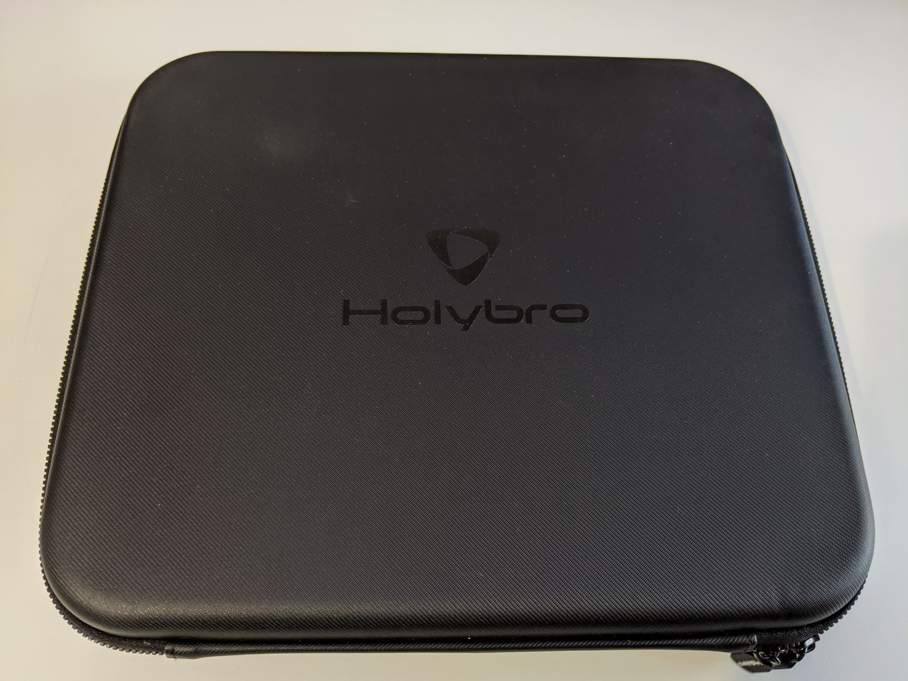

I've finally decided to make the plunge into digital FPV drones with the [DJI Digital FPV system][2]. I've been very interested for a while now and lucky to finally be able to get into it. For my first digital FPV experience I've chosen to go with an already assembled quad, instead of buiding my own from scratch.

The main reason for that is because I'd really like to focus on the experience itself and evaluate that for what it is, rather than evaluate a new custom build.

When doing so, going with a drone as tried and tested as the [Holybro Kopis 2 HDV][1] that excels in performance is a very safe bet.

I don't want to discourage you from building one from scratch, however, in fact, I always encourage you to try and build your own, but especially if it's your first one, I **highly** recommend grabbing a prebuilt drone that you can learn to fly on and enjoy, as well as learn to repair when you crash it.

If you decide to follow along and grab the same quad as I did, do note that the Holybro Kopis 2 HDV can be purchased with and without the DJI air unit. Because I grabbed a DJI bundle with the goggles, controller and air unit already, I opted in to grab the Holybro Kopis without the air unit.

If you are in the same boat as me, I'll include instructions on how to completely setup your quad if you need to add the DJI air unit on your own.

### Table of contents

- [📦 Unboxing](#unboxing)
- [📝 Specifications](#specs)
- [⚙ Setup](#setup)
- [🚁 Flying](#flying)
- [🔝 Upgrades](#upgrades)
- [📑 Conclusion](#conclusion)

<!-- If you prefer watching, check out the full video review on my YouTube channel: -->

<!-- 

  <iframe width="560" height="315" src="https://www.youtube.com/embed/TODO:?rel=0" frameBorder="0" allowFullScreen title="TODO:"></iframe>

 -->

### 📦 Unboxing

Coming in at about \$250 without the air unit, the [Holybro Kopis 2 HDV][1] is not one of the cheapest quads out there but it does offer an unboxing experience to match the price.

Once you get past the Holybro box, you discover what looks and feels like a very high quality carry case.

Inside the case the Kopis 2 is sitting nice and snug, in the middle of the case, strapped in securely with a velcro strap.

The upper part of the carry case has a zippable container that hosts the following items:

2 sets of different props, a small bag with prop nuts, a few spare screws, zip ties, double sided sticky tape, a parts list sheet, and a DJI air unit connection cable for the flight controller.

At a glance it might look like you were given 2 sets of the same prop, but those are actually 2 different sets with different pitch.

The less aggressive pitch and thinner **T5143S** (on the left) and the higher pitch **T5147** on the right.

The carry case strap is a nice inclusion, and if you were wondering the same, the quad does fit inside the case with the props on, so this is not useless at all.

The quad looks legit like a piece of art and feels very high quality, so let's take a closer look at the components it comes with.

### 📝 Specifications

So we're still missing a camera, VTX and a receiver (in this case the DJI digital FPV air unit), and I will update this post when the rest of the components of the build arrive, so stay tuned. But in the mean time let's take a look at what we do have.

The frame is a **stretched X** from what I think is very high quality carbon fiber with 4 separate arms, which makes replacing a broken arm easy.

The top plate of the frame has "grill" openings which I can only assume will help better cool the DJI air unit.

The quad is intended to have the battery mounted under it, as it is indicated by the thick rubber battery pad underneath the quad that would help with gripping and holding in place the battery, as well as cushion it away from the screws on the bottom plate to prevent piercing it in a crash. There's also a nice Holybro battery velctro strap, which looks a bit short to me, but I'd be surprised if it's not long enought to hold a 6S battery.

The motor wires are neatly and snuggly wrapped with a tape that feels like a cloth like material, should hold up much better than some plastic tape. The motors themselves are the **T-Motor F60 Pro III**, in my case the **KV1750** as I'm going for a 6S setup. I haven't yet tried these motors personally but I know they are a trustworthy brand and a high quality motors. I expect them to perform accordingly.

In the back, we have an XT60 connector as usual, the battery leads length is fine, not too short to not be able to reach top or bottom and not too long to sacrifice that extra bit of performance. There's also a capacitor attached to the power terminals to smooth out some potential pluging in battery voltage spikes. **There is also a barely visible buzzer attached to the back right arm, close to the body of the frame.** Those have certainly become somewhat more rare, but are still nice to see a dedicated one on a 5 inch drone, as they are usually much more loud than the sound of the motors beeping.

The soldering job on the motor wires coming to the **Tekko32 40A rated 4 in 1 ESC** is pristine. The Tekko32 is a tried and trusted high quality ESC board, so no surprises there.

The ESC is connected to the flight controller via a plug on the front side of the board. The flight controller itself is the **Kakute F7 HDV** version. It has an SD card slot for collecting Black Box data, barometer, 32-bit processor and a **GH port, where you can plug in the DJI air unit** for both video signal transmition, as well as radio controller transmittion link.

> Which also makes this build a completely solderless assembly, if this is important to you.

The flight controller can be configured in Betaflight via a micro USB port on the side. It would have been nice, if the port was USB type C to conform with the DJI air unit, so that you wouldn't need 2 different cables, but that's a minor thing and I'm sure is going to be a future improvement.

Finally, a TPU mount for the DJI air unit antennas is added to the sides of the frame. There is a camera TPU mount in the front, and a TPU holder for the DJI air unit itself on the back stand offs, as well as 2 small stripes of double sided sticky tape under the top frame plate.

I can't wait to get the DJI digital FPV system and continue this build. If you land here in the meantime, stay tuned or better yet, [subscribe to FPVtips on YouTube][3] for updates.

### ⚙ Setup

While waiting for the DJI Digital FPV system, I decided to take a look at the Betaflight configuration.

#### 👀 Check the Betaflight configuration

The [Holybro Kopis 2 HDV][1] comes with Betaflight version 4.1.2 which is quite up to date (at the time of this writing the latest release is version 4.1.5).

1.  **Ports tab**

ESC telemetry is setup on UART7, and serial RX on UART6.

2.  **Configuration tab**

The motor direction is **Props in**, which is the more common configuration and what I personally prefer. Good to know when putting on the props. I also like seeing **MOTOR_STOP** off. **Accelerometer** is enabled which could be handy for angle (stability) mode, if that's important to you.

In this next bit we don't really care much how the receiver is setup as we'll be using the air unit for that, but I do like making sure that **Airmode** is on. Because we have an on-board dedicated buzzer, I also like that **RX_LOST** and **RX_SET** are off, since we won't be using the motors for those sounds.

3.  **Receiver tab**

I would normally change the **Channel Map** here from AETR1234 to TAER1234 as that's what my Taranis X-Lite is configure to, but in this case we don't care and we'll leave it to the default for now.

4.  **Modes tab**

Not a lot to see on the modes tab either, it seems there is only an arming switch on Channel 5 (AUX1) and horizon mode on Channel 6 (AUX2). By default we will be in Acro mode, so that's all good.

I might come back here and add Turtle mode and the Buzzer on some channel.

5.  **OSD tab**

Not much to say about the OSD tab for now either. I know the DJI goggles support some amount of Betaflight OSD, but we will need to come back to this later and see what we can add.

I like seeing my signal link strength and battery stats.

If you made it this far, thanks for going through this with me. Do note, this is a living document and I will be updating this article as soon as possible. I'm still hoping to get the goggles during April and worst case scenario in May. Shipping times can be a bit flaky at the moment.

Stay safe out there and happy flying for now.

### 🚁 Flying

_Coming soon_

<!-- TODO:

  <iframe width="560" height="315" src="https://www.youtube.com/embed/TODO:?rel=0" frameBorder="0" allowFullScreen title="TODO:"></iframe>

 -->

### 🔝 Upgrades

_Coming soon_

<!-- TODO: -->

### 📑 Conclusion

_Coming soon_

<!-- TODO: -->

Happy flying!

[0]: Linkslist
[1]: https://bit.ly/holybro-kopis-2-hdv
[2]: https://bit.ly/dji-digital-fpv
[3]: https://www.youtube.com/channel/UCCh3SK2EktDdOQkEOTDmSCg
