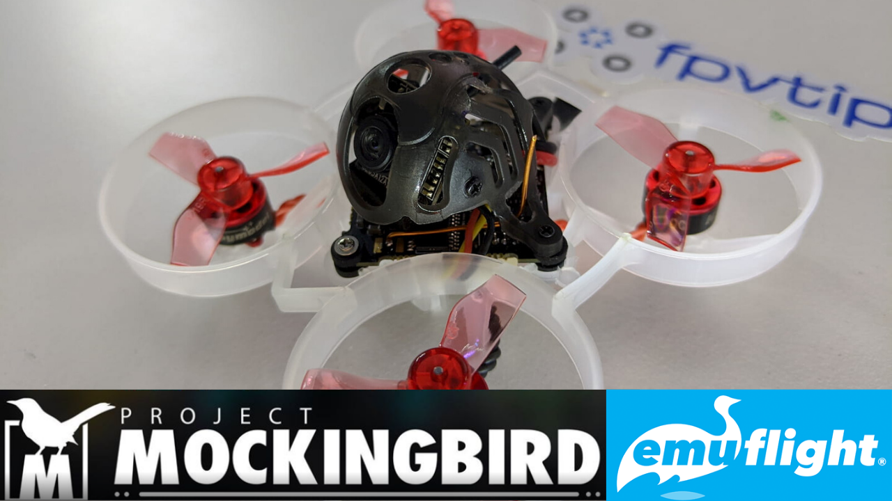

In 2020 most of our quads fly on [Betaflight][3]. That's a fact. However there are some other options out there (EmuFlight, Cleanflight, Butterflight to name a few).

But if you have already made up your mind, in this short guide, I want to show you how to flash [EmuFlight][4] on your Mobula6 (but you could do that to many other quads too), and how to setup the [Project Mockingbird][6] config.

In this example I'm gonna be using my [Mobula6][1] (Bonus points if you already followed the [JESC firmware guide in my original review post][2]).

### Table of contents

- [❔ What is EmuFlight?](#what-is-emuflight)
- [❔ What is Project Mockingbird?](#what-is-project-mockingbird)
- [📝 Specifications](#specs)
- [⚙ Setup](#setup)
- [🚁 Flying](#flying)
- [🔝 Upgrades](#upgrades)
- [💾 Flash 48 kHz ESC firmware](#flash)
- [📑 Conclusion](#conclusion)

<!-- If you prefer watching, check out the full video review on my YouTube channel:

  <iframe width="560" height="315" src="https://www.youtube.com/embed/INYdY-2tP9E?rel=0" frameBorder="0" allowFullScreen title="Happymodel Mobula6 - review, binding, complete setup, JESC 48 kHz MOD | BEST WHOOP WINTER 2020"></iframe>

 -->

### ❔ What is EmuFlight?

[EmuFlight][4] is a Betaflight fork, that implements some more opinionated features and some people claim that it really improves how their quads fly out of the box on stock config. I hear that even more regarding small micro drones.

I'm not gonna try to convince you to move your entire fleet to EmuFlight (and I'm definitely not going to do that myself) but I figured it might be interesting to try out and experiment with, and the Mobula6 is in many ways the perfect candidate to do that.

If you want to learn more about EmuFlight I recommend watching [Joshua Bardwell's interview with Kevin Plaizier][5].

### ❔ What is Project Mockingbird?

As far as Project Mockingbird goes, it claims to deliver the best angle mode config for your brushed whoops. Project Mockingbird can be setup with Betaflight as well (EmuFlight is not a requirement), it's basically a bunch of configuration to make your whoops fly even more awesome.

Project Mockingbird is strictly a whoop / micro drone project. You can join the community in their [Facebook group][7].

### 🔽 Download Emuflight and config files

Grab Emuflight and install it from here ...

Get this hex and this diff file ...

[EmuFlight_0.2.0_CRAZYBEEF4FR.hex](EmuFlight_0.2.0_CRAZYBEEF4FR.hex)
[EMUF_215_PMB-FF-BASE-DIFF-ALL-PUBLIC-01-09-20](EMUF_215_PMB-FF-BASE-DIFF-ALL-PUBLIC-01-09-20.txt)

### 💾 Flash Emuflight

- Flash it
- Potential issues and ImpulseRC driver fixer
- Flashing successfully and realising that is the wrong hex, don't do it

### 📋 Paste or load the diff

### ⚙ Validate and adjust the settings

- Props in vs Props out
- SPI receiver settings to \_D
- Modes - add channels
- Receiver - TAER from w/e it was
- OSD elements if you want any

### 🚁 Flying

#### Indoor flights

Initial immediate impression - yaw axis is super sensitive and responsive, at the same time, pitch axis seems too slow.
Need to get in more flights. There's something nice about the tune. The flight time does not seem to suffer, need more tests.

#### Outdoor flights

Self host the hex and txt with diff

### 📝 Conclusion

Take it for what it is and have fun with it. This might not be for everyone and I'm not sure it's a matter of if this is really the one true set up.
I've been hearing of many people getting very decent results with Betaflight 4.1 which allows filtering. At the same time, I really can't complain how the quad flew on 3.5.7 either. I was pretty happy with it. I really mostly did this upgrade out of curiosity, to learn something new, to share it with you folks and to see if it was really as good as some people claimed it to be.

If you feel like trying it out, go for it, if not, enjoy your Mobula as it is. On the other hand, you can always flash back to Betaflight and paste in the stock config.

Whatever you choose, have fun and happy flying!

[0]: Linkslist
[1]: https://bit.ly/mobula-6
[2]: /fpv/mobula6-48khz-jesc-complete-setup-review/
[3]: https://github.com/betaflight/betaflight
[4]: https://github.com/emuflight/EmuFlight
[5]: https://www.youtube.com/watch?v=WP2pbe1-TjY
[6]: https://projectmockingbird.squarespace.com/
[7]: https://www.facebook.com/groups/1702300099835884/
