In 2020 most of our quads fly on [Betaflight][3]. That's a fact. However, there are some other options out there (EmuFlight, Cleanflight, Butterflight to name a few).

But if you have already made up your mind, in this short guide, I want to show you how to flash [EmuFlight][4] on your Mobula6 (but you could do that to many other quads too), and how to set up the [Project Mockingbird][6] config.

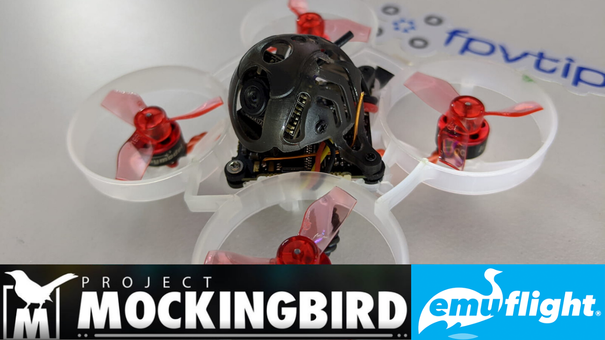

In this example, I'm gonna be using my [Mobula6][1] (Bonus points if you already followed the [JESC firmware guide in my original review post][2]).

### Table of contents

- [❔ What is EmuFlight?](#what-is-emuflight)
- [❔ What is Project Mockingbird?](#what-is-project-mockingbird)
- [🔽 Download EmuFlight](#download)
- [💽 Backup](#backup)
- [💾 Flash the flight controller firmware](#flash)
- [📋 Load the Project Mockingbird config](#project-mockingbird)
- [✅ Validate the configuration](#validate-configuration)
- [🔗 Binding](#binding)
- [🚁 Flying](#flying)
- [📝 Conclusion](#conclusion)

<!-- Coming soon: -->
<!-- If you prefer watching, check out the full video review on my YouTube channel:

  <iframe width="560" height="315" src="https://www.youtube.com/embed/INYdY-2tP9E?rel=0" frameBorder="0" allowFullScreen title="Happymodel Mobula6 - review, binding, complete setup, JESC 48 kHz MOD | BEST WHOOP WINTER 2020"></iframe>

 -->

### ❔ What is EmuFlight?

[EmuFlight][4] is a Betaflight fork, that implements some more opinionated features and some people claim that it improves how their quads fly out of the box on stock config. I hear that even more regarding small micro drones.

I'm not gonna try to convince you to move your entire fleet to EmuFlight (and I'm definitely not going to do that myself) but I figured it might be interesting to try out and experiment with, and the Mobula6 is in many ways the perfect candidate to do that.

If you want to learn more about EmuFlight I recommend watching [Joshua Bardwell's interview with Kevin Plaizier][5].

### ❔ What is Project Mockingbird?

As far as Project Mockingbird goes, it claims to deliver the best angle mode config for your brushed whoops. Project Mockingbird can be set up with Betaflight as well (EmuFlight is not a requirement), it's basically a bunch of configuration to make your whoops fly even more awesome.

Project Mockingbird is strictly a whoop / micro drone project. You can join the community in their [Facebook group][7].

### 🔽 Download EmuFlight and config files

You can download the EmuFlight Configurator from their [GitHub releases page][8]. At the time of writing this, I used the configurator version `0.2.12-RC2`.

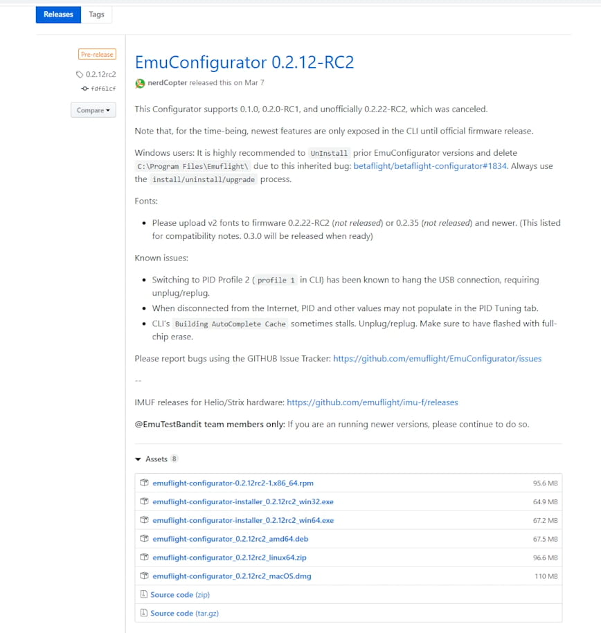

You will also need this [EmuFlight_0.2.0_CRAZYBEEF4FR.hex](EmuFlight_0.2.0_CRAZYBEEF4FR.hex) file and if you want the Project Mockingbird settings, this file as well [EMUF_215_PMB-FF-BASE-DIFF-ALL-PUBLIC-01-09-20](EMUF_215_PMB-FF-BASE-DIFF-ALL-PUBLIC-01-09-20.txt).

After downloading the EmuFlight Configurator for your operating system you have to install it.

### 💽 Back up

Before we begin, it's always a good idea to have a back up of your working config. That way if you want to go back for whatever reason, you can do so easily.

To restore your config and firmware you need to take note of 2 pieces of information:

- The firmware target
- The complete config dump

I'd do that in the Betaflight Configurator (as the Mobula6 originally has the Betaflight firmware), but chances are you can probably do the backup from the EmuFlight configurator as well.

Type `version` in the CLI tab in Betaflight. Make a note of what the flight controller target is, so you can flash it back.

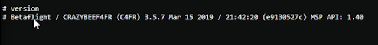

Then type `dump` and save the full config result to a file. Note, that when you ran the dump command if you scroll back to the top the first line informs on the firmware target as well. You now have a way of restoring your config.

### 💾 Flash the EmuFlight flight controller firmware

Run the configurator and plug in your flight controller via the micro USB port to your PC.

Click the `Update Firmware` button at the top right.

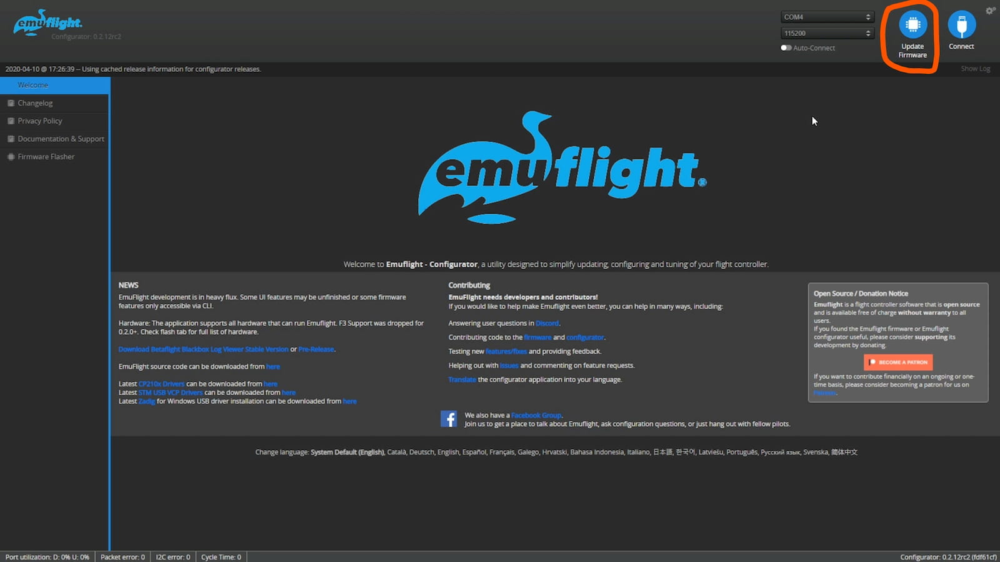

Select the correct target `CRAZYBEEF4FR` (that's the flight controller of my Mobula6 - it's a Crazybee F4 lite, the **FR** bit stands for the FrSky receiver version, yours could be different if you are not on the FrSky version, so make sure to double-check).

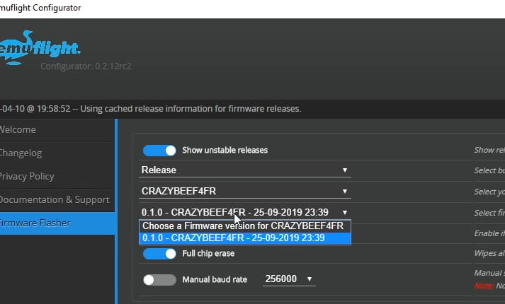

This might change in the future, but as of right now (April 2020), **the version we need is `0.2.0` and it is not yet in the list, so we will have to load it manually**. Hence, why we downloaded it a couple of minutes ago (if you didn't yet, [grab it here][9]).

Next, click the **Load Firmware [Local]** button and select the hex file with the flight controller firmware we downloaded (EmuFlight_0.2.0_CRAZYBEEF4FR.hex).

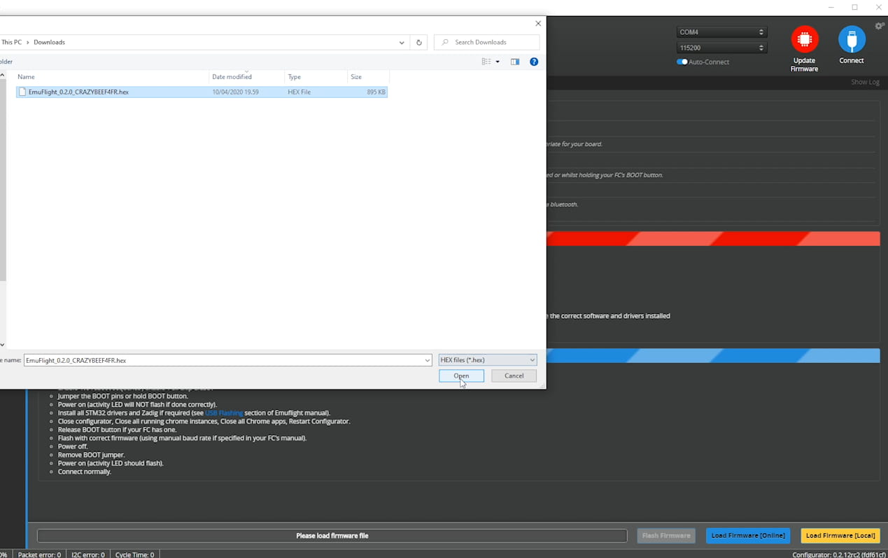

I usually select **Full chip erase** when flashing fresh firmware. Click `Flash Firmware`.

One of two things will happen now. If you're lucky, flashing will start immediately and you can monitor the progress in the progress bar at the bottom of the screen.

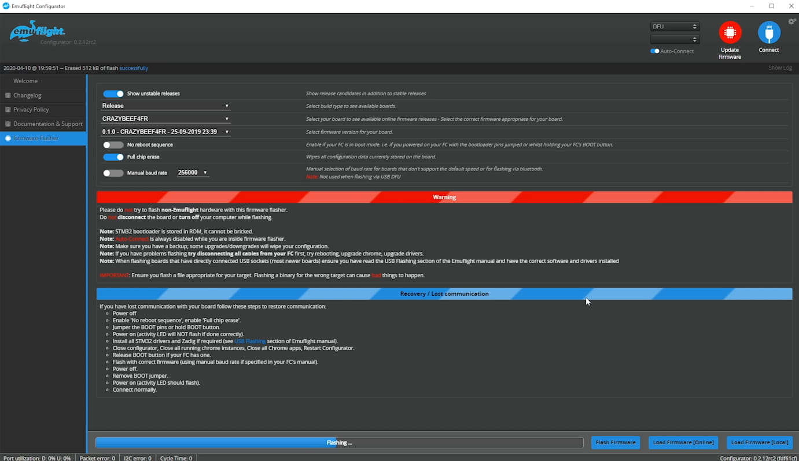

If it seems like nothing happened, take a look at the upper right corner and you should be able to observe this message:

**Failed to open serial port**

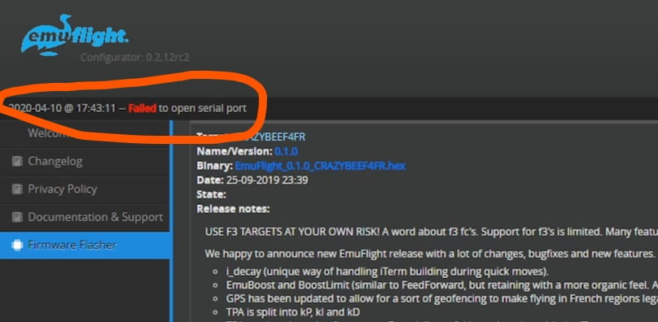

If that's the case, you need to do an additional step - download and run the [ImpulseRC driver fixer][10]

This is going to take less than a minute and is going to set up the DFU drivers for you.

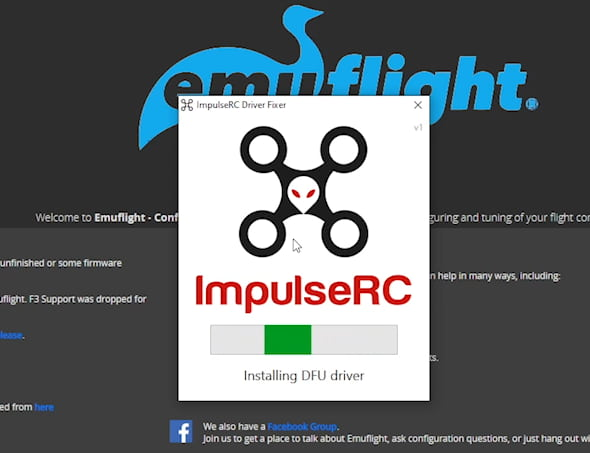

Attempt to start the flashing process again and it should now run smoothly. If you have any other issues, feel free to drop me an email or leave a comment below.

### 📋 Paste or load the Project Mockingbird diff

If you don't care for the Project Mockingbird settings, you can skip this step.

In EmuFlight, go to the CLI tab and click the `Load from file` button. Select the [file you downloaded earlier with the Project Mockingbird settings](EMUF_215_PMB-FF-BASE-DIFF-ALL-PUBLIC-01-09-20.txt).

That's mostly all there is to it.

### ✅ Validate and adjust the configuration

It's is highly recommended we double check and validate the configuration before we go out flying.

These are arguably the most important things you want to double-check before flying:

- **Props in vs Props out**

> I had to toggle `Motor direction is reversed` because my Mobula6 is setup in props out mode. If you are following along on a Mobula6 and your setup was similar, make sure to get this one or your quad will flip out when you try to arm.

> 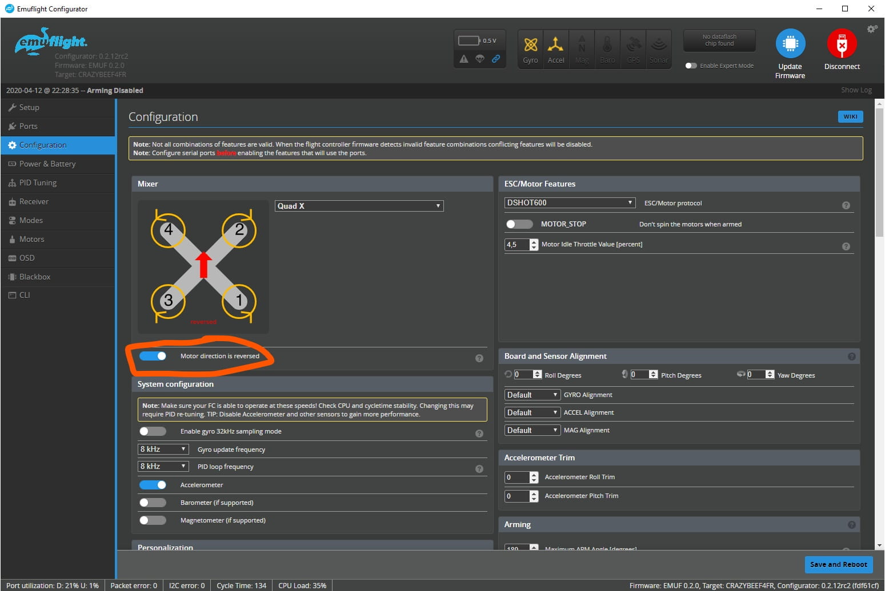

- **SPI Bus Receiver Provider**

> Scroll down and check the SPI RX settings. In my case, I had to set it to `FRSKY_D` since I'm running my Mobula6 on D8 on my Taranis X-Lite.

> 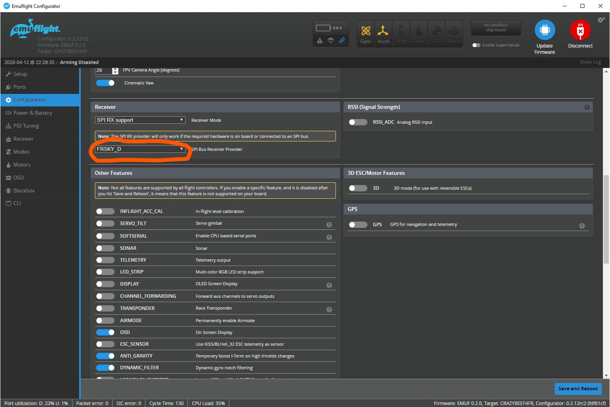

- **Channel map on the Receiver tab**

> Another adjustment required here, I'm flying most of my quads in `TAER1234`, so I had to change the value here to match my transmitter's setup.

> 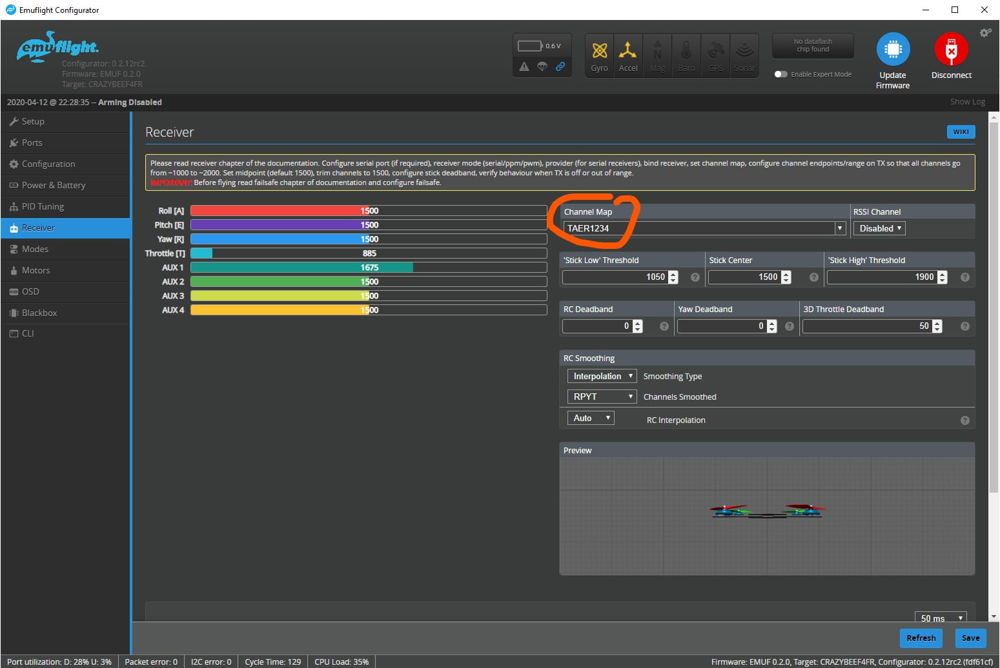

- **Modes tab**

> Check and setup some modes. The default config was acceptable in my case - ARM on AUX 1 (Channel 5), then on Channel 6 (AUX 2) it starts in acro by default, goes through horizon for the middle of the 3 position switch and angle mode at the end of the range. I was curious to go fly it so I didn't bother doing any changes here.

> 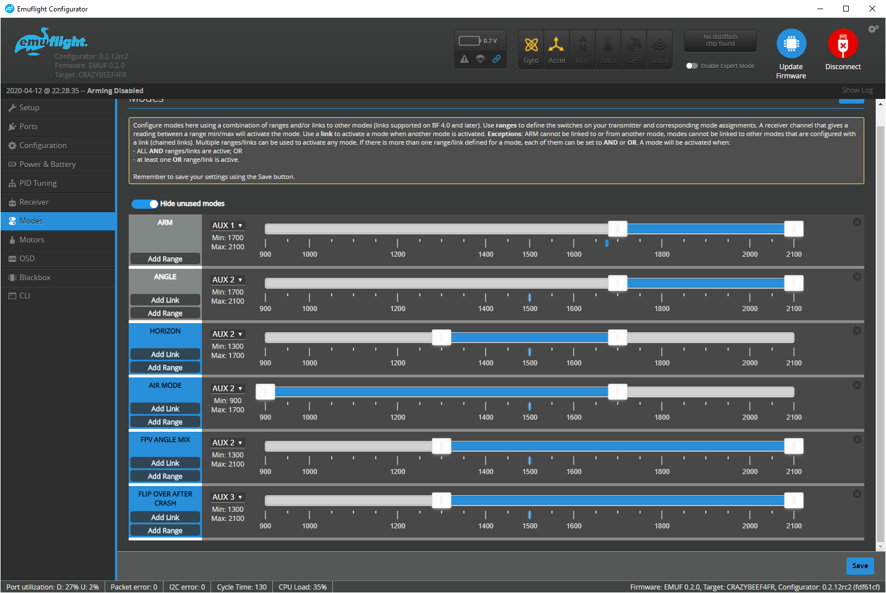

Those are the main most essential things you **MUST** go through. Other than that, feel free to tinker and play with the settings as much as you like.

### 🔗 Binding

If we assume you had previously flown this quad already on the stock config, chances are you don't have to add any switches in the `MIXER` screen of the radio. But if you don't have any assigned, make sure to assign a 2 position switch to Channel 5 for arming and a 3 position switch to Channel 6 for changing flight modes.

Finally, the last thing - you most probably will have to bind the drone again to the radio (I had to at least in my case). Follow the standard procedure. For me it went like this:

Put the radio in bind mode, plug in a battery in the Mobula6, press the bind button (tiny, next to back left motor, if you look at it from the top down with the camera pointing forward away from you), LED blinks, exit transmitter binding mode, unplug drone battery, plug drone battery back in, notice solid green LED on the receiver.

### 🚁 Flying

**Initial immediate impression:** Yaw axis is super sensitive and responsive, at the same time, the pitch axis seems too slow. This seems to be on purpose, will have to see if I get used to it, but I'm not sure I want to. I like my rolls :) Need to get in more flights. There's something nice about the tune. The flight time does not seem to suffer, need more tests.

Here's some footage of my first few packs after I flashed the firmware (this is probably battery 2 or 3).

  <iframe width="560" height="315" src="https://www.youtube.com/embed/PwX5syewmpc?rel=0" frameBorder="0" allowFullScreen title="Mockula6: First flight with EmuFlight and Project Mockingbird on the Mobula6 (2020 #42)"></iframe>

#### Indoor flights (angle mode)

**After a bunch of packs:**
I'm not sure how this is going to come out, but I love and hate the tune at the same time. On one hand I really dislike that the yaw axis controls 90% of my turns. I'm more used to that being a combination of yaw and roll. On the other hand it kind of ... works well indoor.

I'll definitely fly a bunch more packs, but I'm kind of torn for now. Not the biggest fan of it, but I don't completely hate it either.

I might try flashing Betaflight 4.1 to see how this compares to 3.5.7 and to EmuFlight 0.2.0.

  <iframe width="560" height="315" src="https://www.youtube.com/embed/cg4yQ6in68w?rel=0" frameBorder="0" allowFullScreen title="Getting used to EmuFlight and Project Mockingbird on the Mobula6"></iframe>

#### Outdoor flights

As far as outdoor flight go, I caught a windy day with strong winds but luckily coming in gusts, so there were quiet moments in between.

The quad behaves, I flew both acro and angle mode, cause I was curious to see how it handles, but noticed nothing out of the ordinary. It still flew nicely, in acro, almost the same as before flashing EmuFlight. When you fly in acro mode the yaw axis is not as strong and it goes back to the more familiar flying experience.

No perceivable changes to flight times either.

  <iframe width="560" height="315" src="https://www.youtube.com/embed/NJGhFeT4RXA?rel=0" frameBorder="0" allowFullScreen title="Mockula6: First outdoor acro flight with EmuFlight and Project Mockingbird on the Mobula6 (2020 #43)"></iframe>

### 📝 Conclusion

Take it for what it is and have fun with it. This might not be for everyone and I'm not sure it's a matter of if this is really _the one true set up_.
I've been hearing many people reporting very decent results with Betaflight 4.1 which allows filtering. At the same time, I really can't complain about how the quad flew on 3.5.7 either. I was pretty happy with it. I mostly did this upgrade out of curiosity, to learn something new, to share it with you folks and to see if it was as good as some people claimed it to be.

If you feel like trying it out, go for it, if not, enjoy your Mobula as it is. On the other hand, you can always flash back to Betaflight and paste in the stock config. Let me know how it works out for you, [come drop a comment on the FPVtips YouTube channel][11].

Whatever you choose, have fun and happy flying!

[0]: Linkslist
[1]: https://bit.ly/mobula-6
[2]: /fpv/mobula6-48khz-jesc-complete-setup-review/
[3]: https://github.com/betaflight/betaflight
[4]: https://github.com/emuflight/EmuFlight
[5]: https://www.youtube.com/watch?v=WP2pbe1-TjY
[6]: https://projectmockingbird.squarespace.com/
[7]: https://www.facebook.com/groups/1702300099835884/
[8]: https://github.com/emuflight/EmuConfigurator/releases/tag/0.2.12rc2
[9]: https://github.com/emuflight/EmuFlight/releases/download/0.2.0-RC1/EmuFlight_0.2.0_CRAZYBEEF4FR.hex
[10]: https://impulserc.com/pages/downloads
[11]: https://www.youtube.com/watch?v=INYdY-2tP9E
