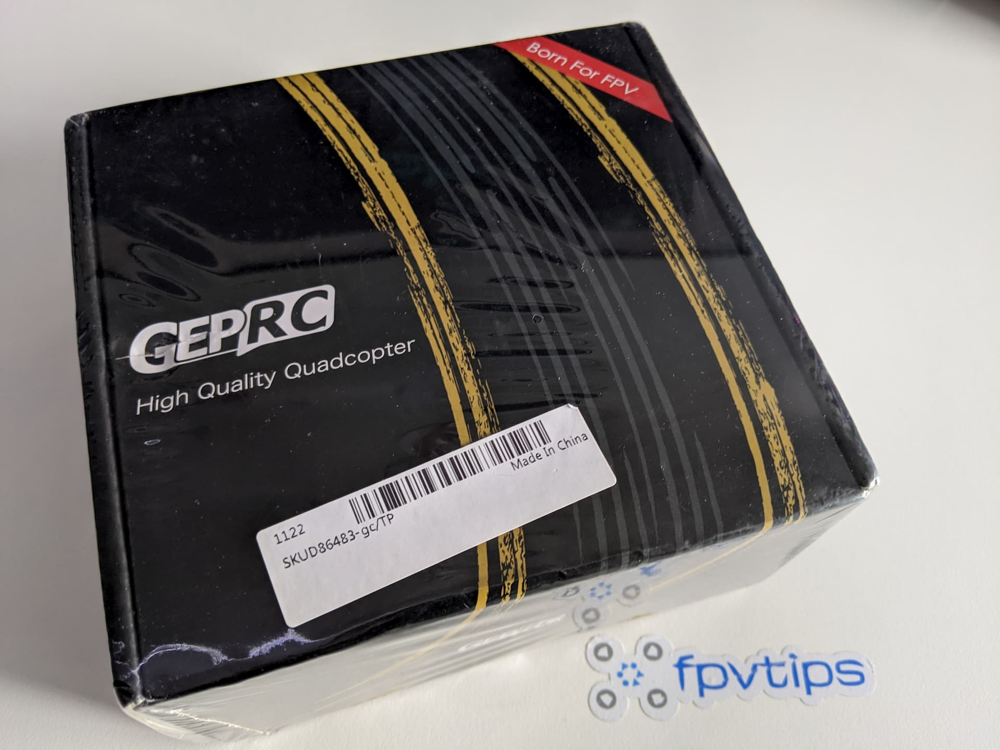
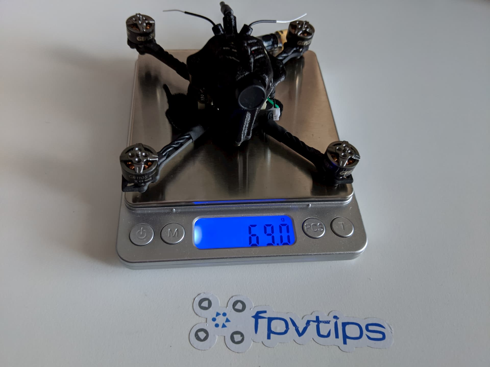
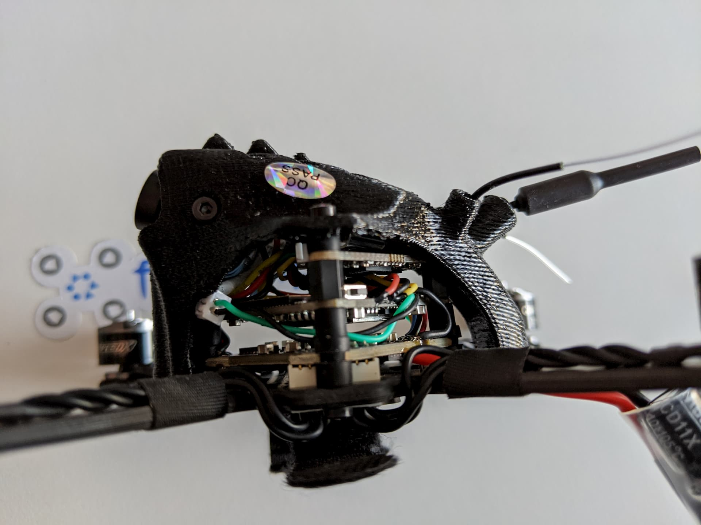

TODO: INTRO

### Table of contents

- [📦 Unboxing](#unboxing)
- [📝 Specifications](#specs)
- [⚙ Setup](#setup)
- [🚁 Flying](#flying)
- [🔝 Upgrades](#upgrades)
- [📑 Conclusion](#conclusion)

<!-- If you prefer watching, check out the full video review on my YouTube channel:

  <iframe width="560" height="315" src="https://www.youtube.com/embed/TODO:?rel=0" frameBorder="0" allowFullScreen title="TODO:"></iframe>

 -->

### 📦 Unboxing

TODO:

### 📝 Specifications

TODO:

### ⚙ Setup

TODO:

As with most other quads, to get started we need to **bind a radio controller to the drone's receiver** and take a **look at the Betaflight configuration**.

#### 🔗 Bind the receiver to a radio

TODO:

#### 👀 Check the Betaflight configuration

TODO:

1.  **Configuration tab**

    > Props in or Props out mode - important to know how to put on your props. `MOTOR_STOP` off. `Accelerometer` on for angle (stability) mode. `SPI RX support` and `FRSKY_D` for D8 mode.

    > 

    > `Airmode` is on. `RX_LOST` and `RX_SET` are on in case you want to use the motors to beep for a lost model alarm since we don't have an onboard buzzer.

    > 

    > ✅ All good here, the defaults match what I expected so no changes needed.

2.  **Receiver tab**

    > Here I'm making sure the `Channel Map` is **TAER1234**. That's what my radio is set to and a match here makes sure the quad won't flip out when I start flying. ✅ All good.

    > 

3.  **Modes tab**

    > Arming is set to `AUX1` which is whichever switch you set to `Channel5` earlier in the Mixer screen on your radio. That's fine. Then I notice AUX2 (Channel6 switch) is set by default to start-up in angle mode, and any other position will set the quad to acro. That's fine too. And I have turtle mode (Flip over after crash) on the third switch. ✅ Perfect, no changes needed.

    > 

4.  **OSD tab**

    > In the OSD tab I care to see if `RSSI value` is displayed, I also like to see current draw, throttle value and flight time elapsed. ✅ All good, no changes needed.

    > 

Let's go fly!

### 🚁 Flying

TODO:

  <iframe width="560" height="315" src="https://www.youtube.com/embed/TODO:?rel=0" frameBorder="0" allowFullScreen title="TODO:"></iframe>

### 🔝 Upgrades

TODO:

### 📑 Conclusion

TODO:
the video bit rate for 1080p 60fps (default) is ~ 30-31 Mbit

test camera how quick it reacts to light chagnes
write about configuring the camera with the joystick

prop wash or jello in the 1080p dvr (on the big open field)

Happy flying!

[0]: Linkslist
[1]: https://bit.ly/geprc-skip3-hd
