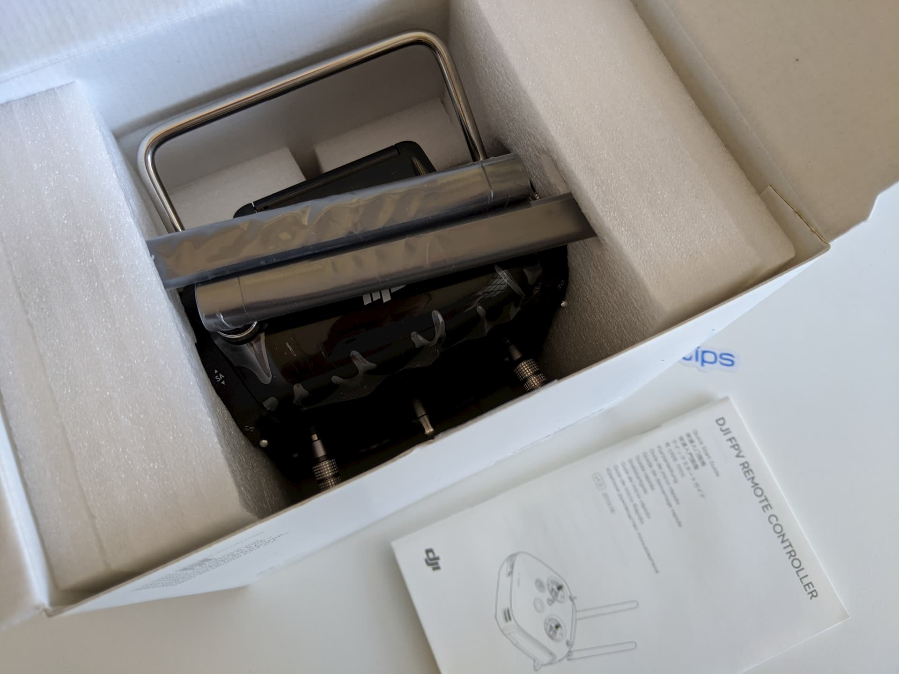

TODO:

### Table of contents

- [📦 Unboxing](#unboxing)
- [📝 Specifications](#specs)
- [🥽 DJI digital FPV system setup](#dji-setup)
- [🚁 Flying](#flying)
- [🔝 Upgrades](#upgrades)
- [📑 Conclusion](#conclusion)

<!-- If you prefer watching, check out the full video on the [FPVtips][3] YouTube channel:

  <iframe width="560" height="315" src="https://www.youtube.com/embed/rX5OUWnx0kA?list=PLLsZew4NRcddaEaRPXDAeGo6YlTXgCjHO&rel=0" frameBorder="0" allowFullScreen title="Getting started with DJI digital FPV part 1"></iframe>

 -->

### 📦 Unboxing

TODO:

### 📝 Specifications

TODO:

### 🎦 Setting up the DJI digital FPV system with the Holybro Kopis2 HDV

If you go for this exact drone + DJI digital FPV set up you actually have very little to do. It may seem like a lot of steps, but all of them are very easy and a matter of minutes to accomplish.

**The only thing that takes time in this whole setup process is charging your DJI radio controller. I suggest you do this first, as it will take a few hours.**

<!-- TODO: add links when DJI article is ready -->

You can also check out the more thorough review and setup guide with a deep dive into the DJI digital FPV system. Here I'll keep it straight to the point and as short as possible in the context of the Holybro Kopis2 HDV quad.

To proceed you should have the [following gear][2] available:

**DJI digital FPV controller**

**DJI air unit**

**DJI digital FPV goggles**

**DJI digital FPV goggle accessories**

You will also need to have a couple of batteries to provide power to the goggles and to the air unit.

**4S LiPo batteries**

**The DJI digital FPV goggles accept voltage from 7.4-17.6 V, so a 2S to 4S battery will do. Don't go above that though!**

You are provided an XT60 to DC barrel jack cable to allow you to use one of your drone [4S battery packs][4]. Alternatively, you could grab a Fatshark battery case for a couple of 18650 batteries. I'm going, for now, the way of the drone battery, which allows me to keep it in my pocket and reduces the overall weight when you have the goggles on.

You will also need 1 more battery and that could also be [4S][4] to [6S][5] as we will plug this one into the quad (if your Holybro Kopis is also the 6S version). Don't plug in 6S batteries to equipment rated for 4S.

Let's get started!

1. **Charge the DJI controller and batteries for the DJI goggles and air unit**

> This is important because we're going to be upgrading the firmware and you don't wanna be doing that on anything but a fully charged battery ideally. To charge the DJI radio, just plug it in via the provided USB type C cable and wait a few hours. It will take some time, so be patient.

> 

> Charge a 4S LiPo for the goggles and another 4S or a 6S battery for the drone, depending on which version of the quad you bought.

2. **Install goggle antennas, head strap, air unit antennas**

> Installing the head strap is not a requirement for the setup, but you might as well do it now since you will need it anyway eventually.

> 

> However, installing the antennas is very important. **Never deal with video transmitters without having installed their antennas, as this is an easy way of frying them in some cases.** Quite possibly the goggles may be totally fine even without antennas, since they just receive the transmitted video signal, but why take chances. To install the antennas simply screw them in in all 4 slots.

> 

> For the air unit antennas it's **absolutely mandatory that you install them** as the chance of frying the unit if powered on without antennas is much higher!

> 

> I also plugged in the air unit cable that should connect to your flight controller. You should have one cable that came with your air unit (on the left in the picture below) and a similar cable that came with your Holybro Kopis2 HDV (on the right).

> 

> I used the Holybro provided cable as this setup is solderless since the cable is designed and intended to fit and connect perfectly the DJI air unit to the flight controller on the Holybro Kopis2. There is a port for that in the back of the flight controller.

> 

> I do recommend you power on the quad with a LiPo (**NO PROPS**) before you connect the air unit. That was you can test it for any potential issues and in the case that something smokes, you at least won't smoke your DJI air unit along with it.

3. **Download and install the DJI software**

> There's no flying before we activate the DJI products. Go to DJI's site and download the [DJI Assistant 2][6] software for your operating system.

4. **Activate products and update firmware**

> You will need to activate and update the firmware on all 3 products separately. However, this is much more straightforward than it may sound.

> By now your DJI remote controller should have charged, so you can **connect it to your computer and power it on by short pressing and then press and hold the power button**. Startup the DJI Assistant app, create an account, or login and you should see the DJI FPV Remote Controller in Connected Devices.

> 

> Click the device to start the activation process.

> 

> Click through a few end-user agreements and your device should get successfully activated.

> 

> Next, you will probably get the firmware update prompt. Confirm you want to install the latest version to start off the update. This is **highly recommended as DJI has released a few quite important improvements that you definitely want to have**.

> 

> The firmware update is going to go through 3 steps. Downloading...

> 

> ... transmitting ...

> 

> ... and updating.

> 

In my case the entire process took about 5:30 minutes.

> 

Unplug the radio from the computer and power it off by double press and hold the power button.

The next step is to do the same thing for the goggles. Plugin the DJI FPV goggles to the computer. Then power them on via a 2S-4S battery and the provided XT60 to DC barrel jack cable.

Once you do that, **you should see them in the list of connected devices in the DJI Assistant 2 app**.

The activation and the update process are exactly the same as what we did with the remote controller. Activate the goggles and complete the firmware update.
Then unplug from the computer and power them off.

Finally, do the same for the DJI air unit. The only thing to watch out for is that the air unit **WILL GET VERY HOT**. That's normal, but try to keep this part as short as you can, don't fiddle around with anything else. Plugin the air unit to the computer via its USB Type C port, power on your quad via its XT60 connector, and a LiPo (**NO PROPS**), go straight into the DJI Assistant 2 app, click the newly discovered connected device, activate it and update the firmware.

After the update has completed successfully, unplug from the computer, unplug the LiPo battery and let the air unit cool off a bit.

As far as I know the air unit shouldn't fry too easily if kept longer, but again, why risk it. This is also not to say that you should stress to be super quick about it, go at a normal pace, but don't, I don't know, leave it plugged in and go grab a coffee or something. Get the job done and turn it off.

Believe it or not, we are almost done!

5. **Bind DJI goggles to air unit and bind DJI remote controller to air unit**

The order here is important if you are going to use both the DJI goggles and the DJI radio with the air unit. **Always bind the DJI goggles first.**

> **Optional side tip**: If this is your first time with HD FPV, and you want to save your WOW moment for when you get to the field, then keep the camera protector plastic cap on. That way the video is still going to look somewhat bad-ish through the goggles while you're setting things up. I'm happy to have done this by chance and in my opinion, it was worth it 😅

To bind or link (as DJI calls it) the goggles with their antennas installed, power on the goggles. Then power on the air unit by providing power to the quad. The LED on the air unit should be green. Press the bind button next to the LED and above the SD card slot (you will need something thin to access the button, like tweezers). The LED should go red to indicate we are in linking mode.

Then press the bind button on the goggles (it's right next to the power jack). You should hear a few tones and the air unit's LED will go green to indicate a successful link.

With the goggles linked, it's time to link the radio transmitter. Press the bind/link button on the DJI air unit to put it in linking mode. Power on the remote controller.
Press at the same time and hold shortly these 3 buttons on the radio: `record button` on the top left, `C button` right next to the power button, and the `dial` switch at the top right.

If successful, you should hear a few tunes being played to indicate the radio was linked to the air unit. If you don't have props on you can try to arm the drone with the `SA` switch. If you have any issues make sure the throttle stick is all the way down, otherwise, it won't let you arm.

It may be a good idea to connect the flight controller to Betaflight, go to the receiver tab, and make sure that the inputs on your sticks match what you see displayed as channel values. If you go for it, make sure you don't spend too much time with the air unit on.

You can also change the switches and configure flight modes, but for now I won't bother with that as I would like to evaluate the stock configuration. By default you can change flight modes with the `SD` switch. If left untouched it leaves the quad in the default acro mode, which is ideal.

6. **Flight preparation**

Put in SD cards in the DJI digital FPV goggles and in the air unit. It needs to be a recent card of decent quality, so some older cards may not work. Mine are some [32GB "high speed" cheepos][7] but haven't betrayed me so far in a couple of years. You can and you should format the cards from within the goggle's interface to avoid any disappointment with missing footage.

To display the OSD menu, press in the joystick on the top right-hand side of the goggles. Then navigate to `Settings -> Format SD Card` and format both cards. You can go back to the upper levels of the menu with the button right next to the joystick.

**Besides formatting both SD cards, I recommend you do 3 changes that I didn't do before my maiden flight.**

`Settings -> Camera` and set the aspect ratio to 16:9. By default it's set to 4:3. I find 16:9 more immersive in terms of flight experience and the end footage is ready to be used without any post-processing. At 4:3 the screen feels a bit far away in the goggles and gives me a "cinema" experience. Don't hate it, but don't love it. Then you would need to post-produce the footage, but while in 4:3 you will get the full height of the camera sensor, you will lose resolution when you adjust the footage to 16:9 before uploading to YouTube.

`Settings -> Preferences` and set to **high quality** (instead of low latency). The latency difference is negligible between the 2 modes, and the quality improvement could be slightly more useful.

`Settings -> Device -> Max Power` and set to a higher value. I'm in the EU and by default the DJI goggles come configured to 25mW and locked into that value, but there are ways to fix this. The higher the power output, the better picture, and the further away you can fly. If you are legally allowed to do so you can allow higher output power by doing the following. Create a file called `naco.txt` on the air unit's SD card, open it with Notepad, and write the number `1` in it as its only content. Add the SD card to the air unit. Once powered on and the file read, the air unit and goggles will change their settings and you will have access to more channels and more power output options. Once changed, it's ok to get rid of the `naco.txt` file, it's not required to keep it on the SD card at all times.

The last thing to do before we actually go out flying is to put on the props. To do that correctly you need to know what's the direction of your motors. You can arm the quad without props and touch lightly the motor on the sides with a finger or with a piece of paper to identify the rotation direction.

You want them to rotate in the direction that is shown in Betaflight on the Configuration tab. In this case it's the so-called "Props In" mode, because the props should move in towards the quad.

So if you put the quad in front of you facing up and away, as in the diagram, your front left motor is motor 4, front right is motor 2, back right is motor 1 and back left is motor 3.

**The trick to putting on props correctly is once you know the direction (and have confirmed it), put the props on such that the pitch (slant) on the prop goes from low to high in the direction of the rotation of the motor.**

It may sound like a lot and a bit convoluted, but I promise you once you've done it a few times it will make sense and you will probably never put props on in the wrong direction ever again.

Also take note that you only need to know how to put on 1 prop with the correct pitch direction. If you put on prop 2 correctly, then prop 3 should be the exact same type and direction and props 1 and 4 should be the same to each other, but different to 2 and 3.

With those rules in mind, you can put on props all day!

Here is how my setup ended up looking. Make sure you tighten the prop nuts all the way down nice and snug.

That's really all of it! Let's go for a flight!

### 🚁 Flying

Anytime flying a new quad I highly recommend starting with a line of sight test hover before you get into full-on FPV mode.

I am so happy that I did this because I actually discovered an issue during my test hover and I fixed it quickly, where had I not, it could have resulted in some broken props at best or other broken parts at worse, and to be honest would have simply been a huge downer and disappointment, given how much I was looking forward to flying HD FPV for the first time.

So what happened? Well, I set up everything for the test hover, I armed the quad and heard a weird grinding and rattling noise. Luckily I didn't punch it into the skies, I just took off very slowly, so after hearing the weird sound I reduced the throttle and landed right back down. On closer inspection, it turns out I didn't completely tighten the prop nuts and there was a bunch of wiggle room between the prop nut and the base of the motor. Super rookie mistake, and I could have sworn I tightened them properly.
Either way, a quick job with the prop nut tool and all of them were properly in place nice and tight.

**Moral of the story is**: don't skip the line of sight test hover, no matter how advanced of a user you think you are.

This time the hover test worked fine and it was finally time for the first HD FPV experience.

If up to this point you have followed along, make sure you remove the plastic camera protector. Footage will be recorded to the SD cards by default as soon as you plug in a battery and will be saved when you unplug, so no need to do anything manually if you hadn't changed the default settings.

#### Maiden flight: CNHL 4S 1300mAh battery, 25mW air unit power output, T-5143S prop (lower pitch), 4:3 aspect ratio

**DISCLAIMER:**
Do not judge the [Holybro Kopis2 HDV][1]'s flight performance from the maiden flight! It's a 6S quad and I did the maiden on 4S batteries while waiting for my 6S batteries to arrive because I was very excited to try out the DJI digital FPV system.

With that out of the way, the quad still flew superbly. As expected from this type of a motor and battery combo, the quad was very timid and super easy to handle, but of course naturally it lacked some performance which was due to the 4S batteries used.

  <iframe width="560" height="315" src="https://www.youtube.com/embed/qn7gfNfE5c4?rel=0" frameBorder="0" allowFullScreen title="Maiden with the DJI digital FPV system on Holybro Kopis2 HDV 4S #1 (2020 #60)"></iframe>

I did 2 flights on 4S, and each time I got over 6 minutes of flight time. Admittedly I wasn't in a rush to push it around like crazy or anything, just cruising around taking in the view and enjoying! It was a really fun experience, to be honest. I could start seeing some pixelization from the poor connection as I went towards the far end of the field and with the antennas completely hidden from sight while on 25mW. I attribute this effect to the power output. I am curious to see how it would be with higher power output, even without fixing the antennas position.

  <iframe width="560" height="315" src="https://www.youtube.com/embed/GXepohD4z7o?rel=0" frameBorder="0" allowFullScreen title="Maiden with the DJI digital FPV system on Holybro Kopis2 HDV 4S #2 (2020 #61)"></iframe>

#### Flight #2: CNHL MiniStar 6S 1000mAh battery, 25mW air unit power output, T-5143S prop (lower pitch), 16:9 aspect ratio

In the second set of flights I flew the Holybro Kopis2 on 6S batteries and you can tell the quad performed better, as expected. I was punching the throttle more frequently but still mostly cruising around, enjoying the experience of the DJI digital FPV system, discovering things, and getting used to the new controller. The other thing I changed at this point was the camera aspect ratio, so now I fly in 16:9 which I'm much more used to and comfortable with.

  <iframe width="560" height="315" src="https://www.youtube.com/embed/KFx2K9bluWs?rel=0" frameBorder="0" allowFullScreen title="DJI digital FPV goggles DVR at 25mW on Holybro Kopis2 HDV 6S 1000mAh Before the Storm #1 (2020 #62)"></iframe>

We are still evaluating the flight experience at just 25mW output power on the DJI air unit and the lower pitch props that come with the Holybro Kopis2 HDV (T-5143S). I caught a pretty dramatic looking pre-storm day, where half the sky was clear and light blue and the other half dark gray and navy blue. While I flew there were some pretty strong gusts of wind, so take note of that, but in general the flight conditions were not very bad.

  <iframe width="560" height="315" src="https://www.youtube.com/embed/eNpZxwqrXj0?rel=0" frameBorder="0" allowFullScreen title="DJI digital FPV air unit recording on Holybro Kopis2 HDV 6S 1000mAh Before the Storm #2 (2020 #63)"></iframe>

Flight times were still pretty decent at over 4:00 - 4:30 minutes. The cool thing about 6S batteries is that there's no voltage sag even towards the end of the battery. Overall the power feels more consistent throughout the entire flight.

#### Flight #3: CNHL MiniStar 6S 1000mAh battery, 700mW air unit power output, T-5147 prop (higher pitch), 16:9 aspect ratio

In the third set of flight tests I changed the power output of the DJI ait unit to 700mW. **Immediately all artifacts and pixelization we had while flying on 25mW were now gone.** With that drastic improvement in quality the flight experience was even more enjoyable and in the next couple of videos I dared going farther away than I have ever been before, when flying my huge open field tests.

I ended up mostly cruising and taking in the view during the first of the flights and got a flight time of about 6 minutes again.

  <iframe width="560" height="315" src="https://www.youtube.com/embed/uMNMWGw_2Bw?rel=0" frameBorder="0" allowFullScreen title="DJI digital FPV air unit and goggles DVR at 700mW - Holybro Kopis2 HDV 6S 1000mAh #1 (2020 #64)"></iframe>

I also lowered the camera angle to about 35 or so degrees. I should report that I've been getting cut off footage on the air unit. The recording on the goggles is always there and in full. It could be an SD card issue (I have now tested with 2 different SD cards, but will also test with a high-quality brand new one). It could also be that I'm unplugging the quad too soon and I lose a few seconds of footage. However in some of the flights the footage is gone after about a minute of flying.

  <iframe width="560" height="315" src="https://www.youtube.com/embed/iHIOLsfNS1A?rel=0" frameBorder="0" allowFullScreen title="DJI digital FPV air unit and goggles DVR at 700mW - Holybro Kopis2 HDV 6S 1000mAh #2 (2020 #65)"></iframe>

### 🔝 Upgrades

TODO:

### 📑 Conclusion

- recorded video missing on air unit; try with better and brand new SD card
- Didn't expect to like the controller as much as I do. Don't get me wrong, still a bit clunky for what I do and need, but sticks are smooth, it flies nicely, it's actually nice to use

TODO:

[0]: Linkslist
[1]: https://bit.ly/holybro-kopis-2-hdv
[2]: https://bit.ly/dji-digital-fpv
[3]: https://www.youtube.com/channel/UCCh3SK2EktDdOQkEOTDmSCg
[4]: https://bit.ly/cnhl-1300
[5]: https://bit.ly/gnb-6s-1050
[6]: https://www.dji.com/fi/fpv/info#downloads
[7]: https://bit.ly/sd-card-32
