TODO: intro

### Table of contents

- [📦 Unboxing](#unboxing)
- [⚙️ Setup](#setup)
- [🚁 Flying](#flying)
- [📑 Conclusion](#conclusion)

### 📦 Unboxing

TODO: unboxing

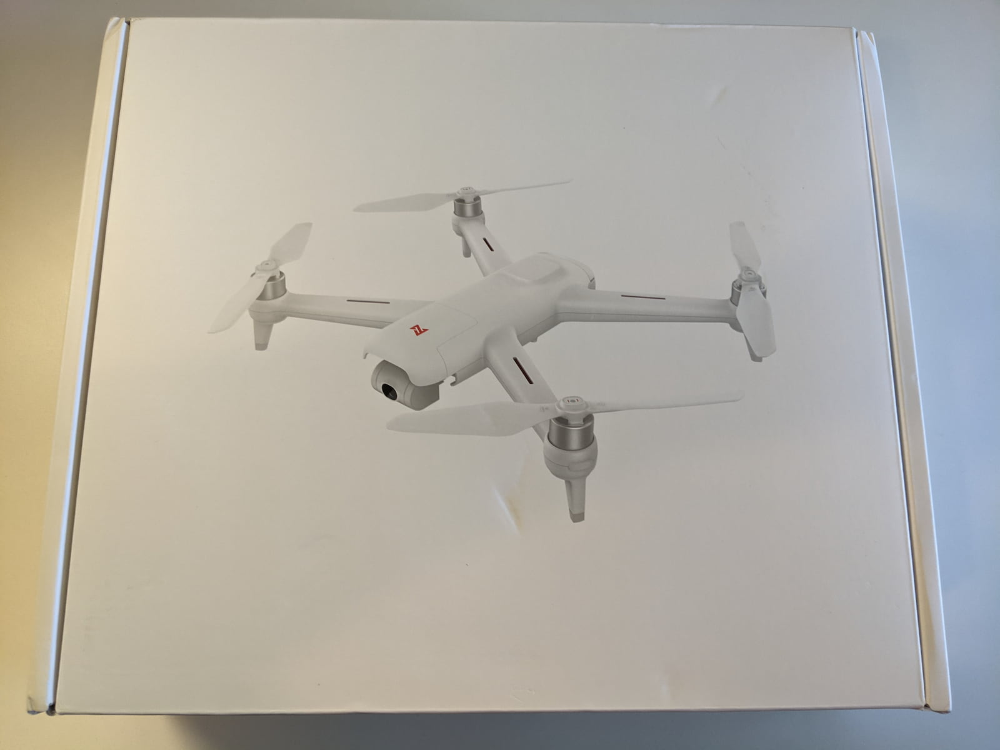
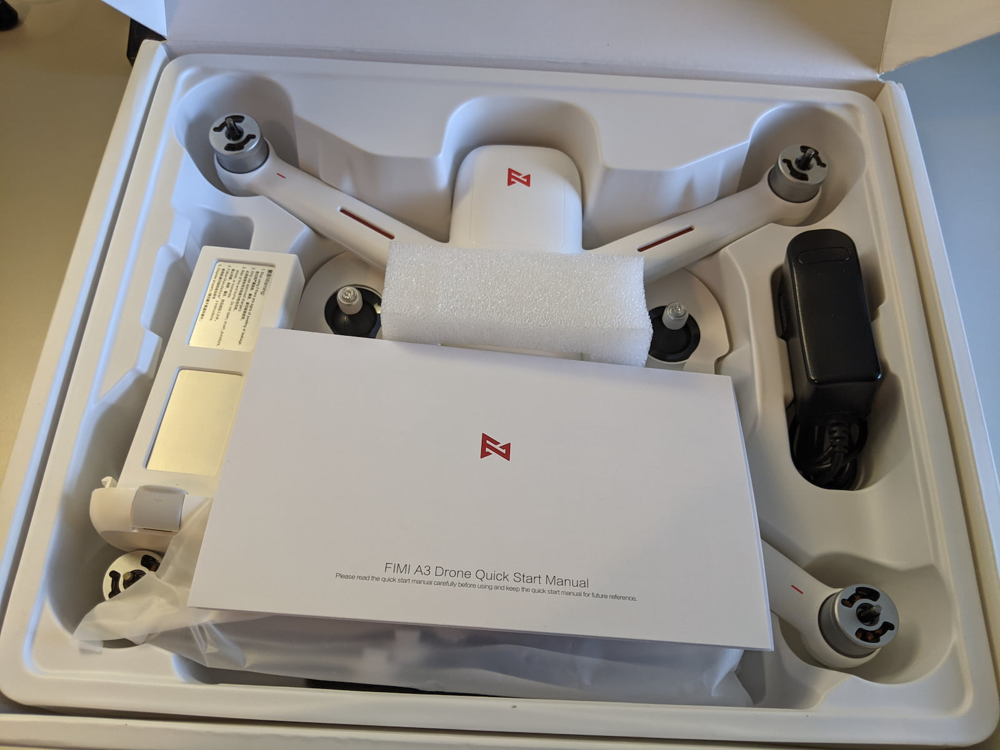
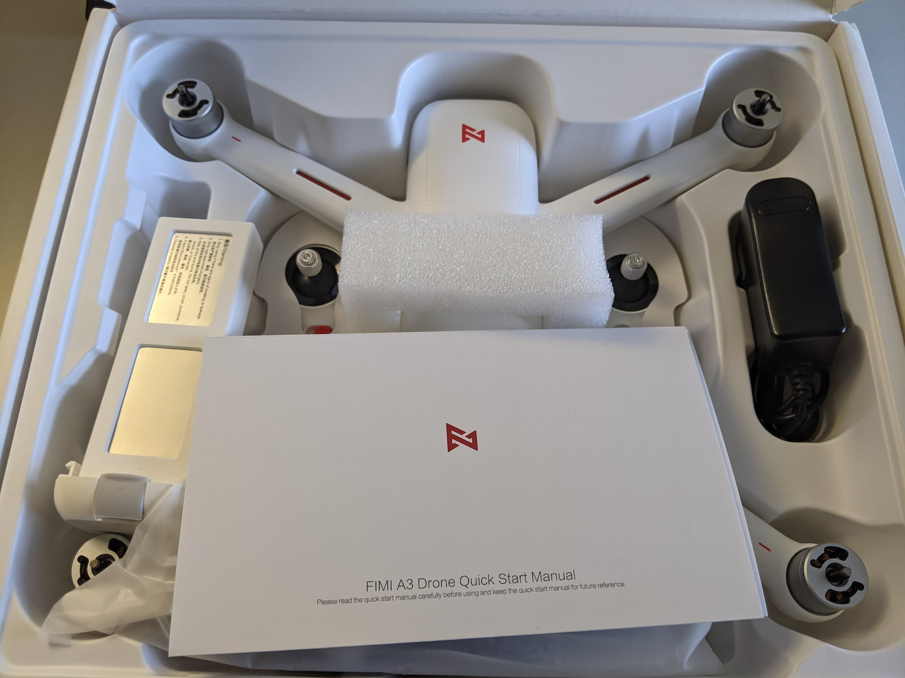
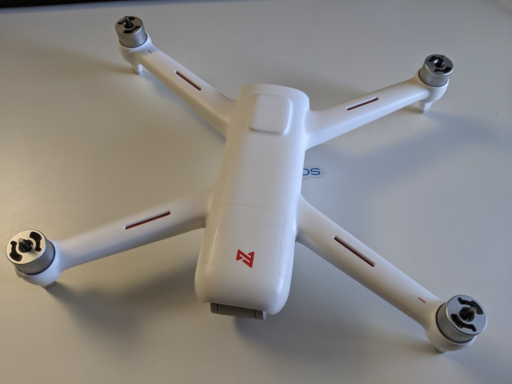
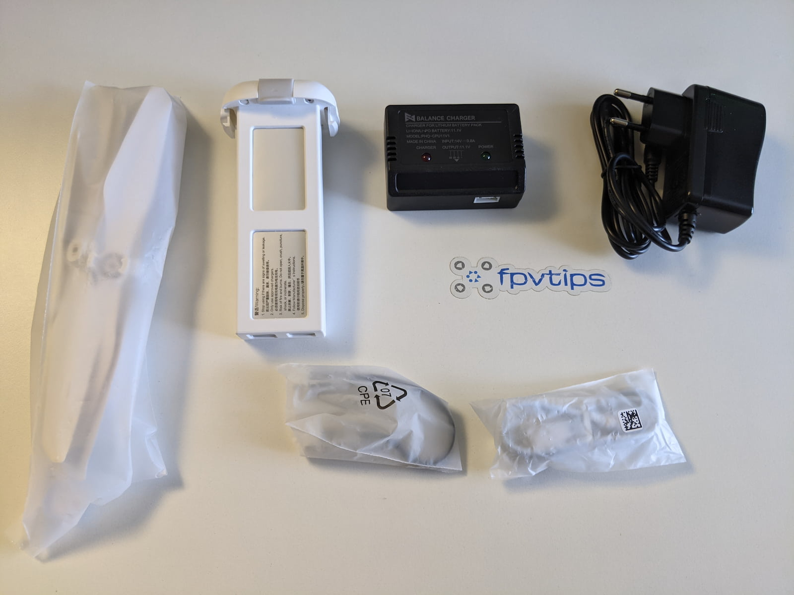
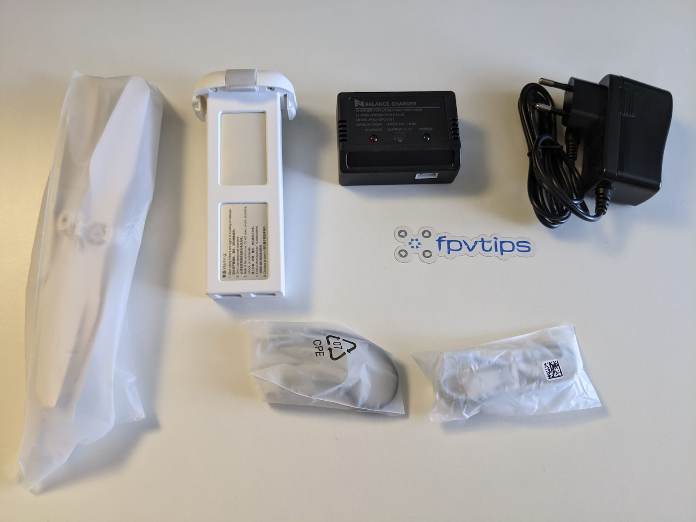
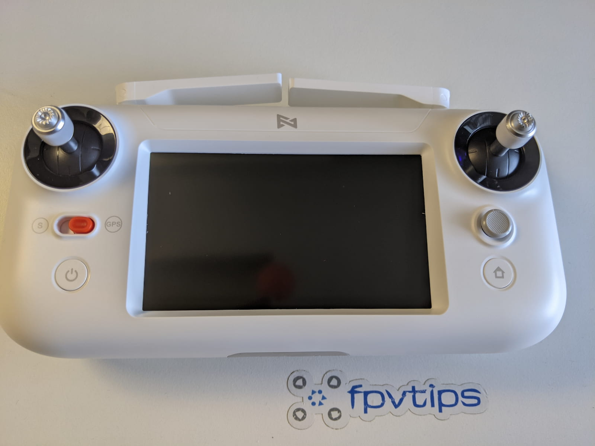
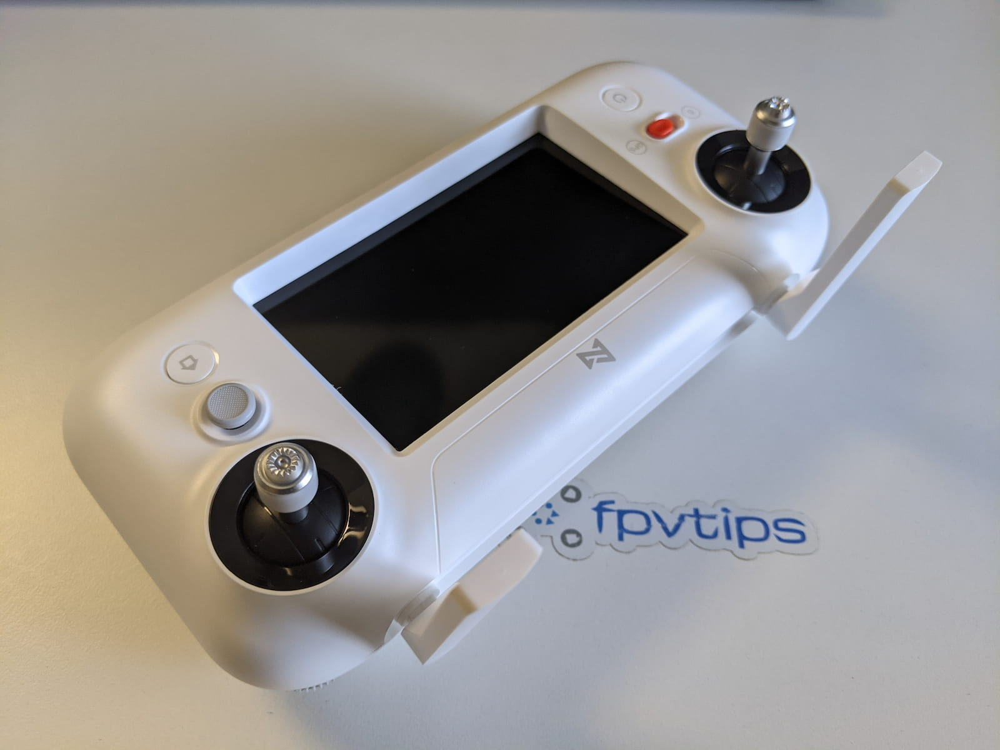
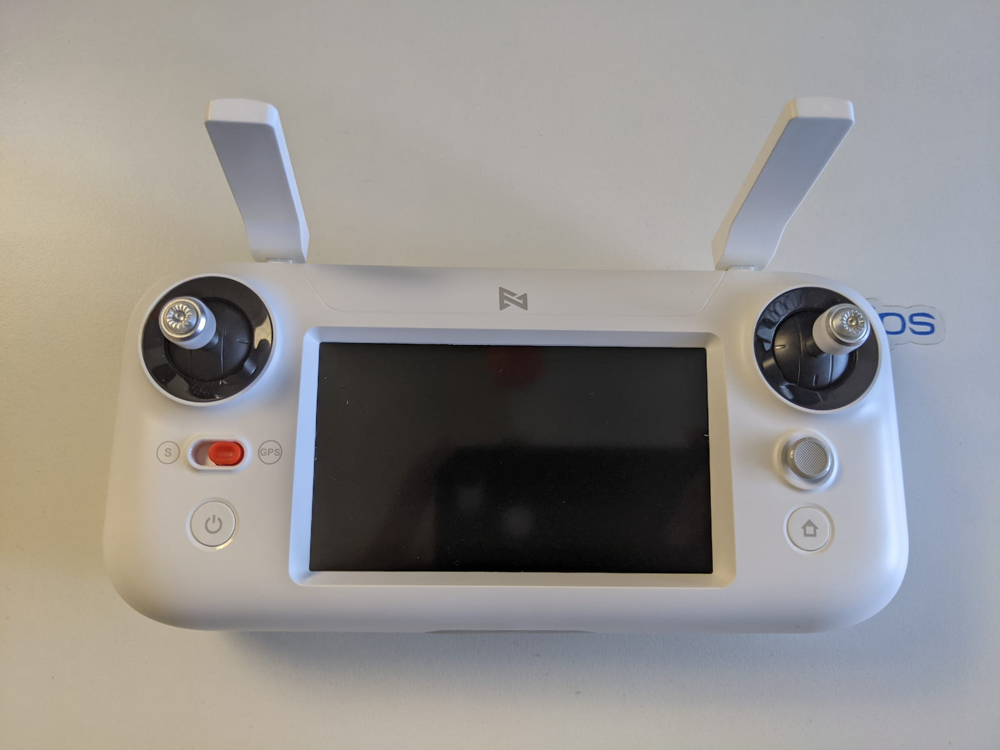
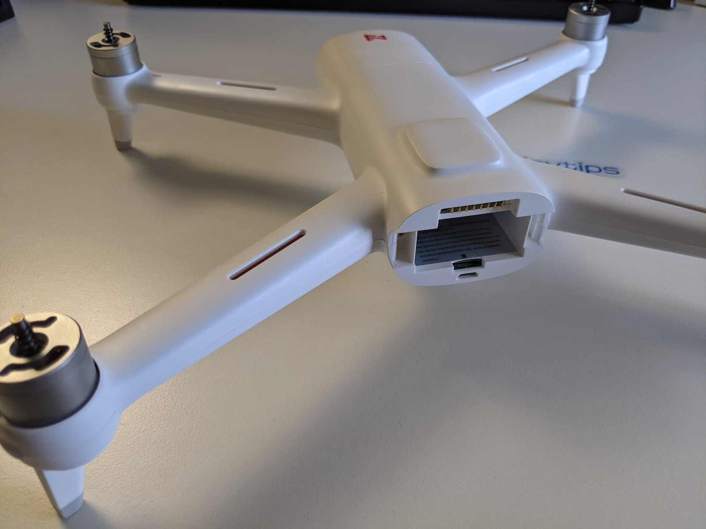
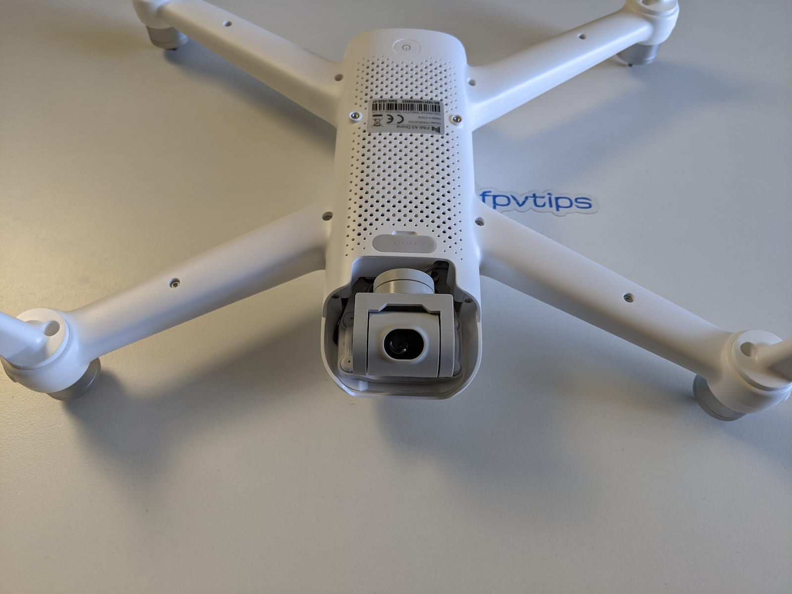

### ⚙️ Setting up the FIMI A3

TODO: setup

### 🚁 Flying

TODO: flying

<!-- 

  <iframe width="560" height="315" src="https://www.youtube.com/embed/GXepohD4z7o?rel=0" frameBorder="0" allowFullScreen title="Maiden with the DJI digital FPV system on Holybro Kopis2 HDV 4S #2 (2020 #61)"></iframe>

 -->

### 📑 Conclusion

TODO: conclusion

Happy flying!

[0]: Linkslist
[1]: https://bit.ly/fimi-a3-drone
