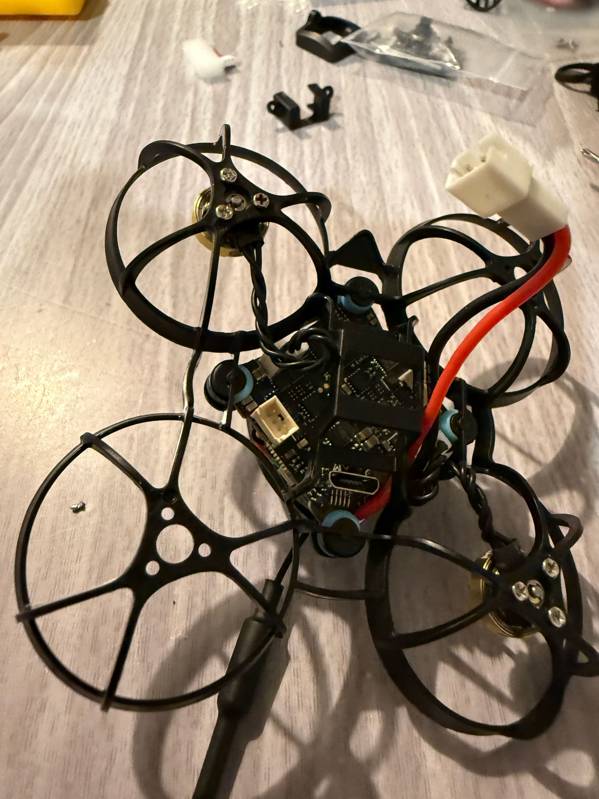
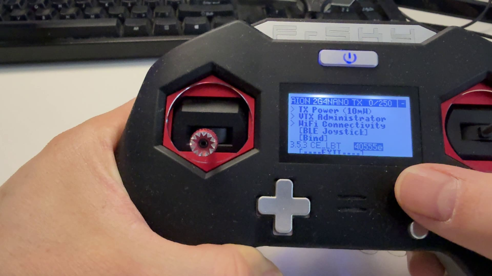

After being a few years away from the hobby I'm making a low-key comeback and wanted to check out what's the process nowadays when making a tiny micro drone to zip around at home during the winter and outside too. Historically, when I was last dealing with the FPV hobby, I was pretty impressed with where micro drones and toothpicks were headed, so when I got reached out to by a company called Mepsking, I was pretty interested to check out their micro drone kits, so let's get to it.

### Table of contents

- [📦 Unboxing](#unboxing)
- [📝 Specifications](#specs)
- [🛠️ Build](#build)
- [⚙ Setup](#setup)
- [🚁 Flying](#flying)

### 📦 Unboxing

I received this <a href="https://www.mepsking.shop/65mm-whoop-quadcopter-kits.html?inviterId=1869316794740477954&utm_source=affiliate&utm_medium=affiliate" target="_blank" rel="noopener noreferrer">micro drone kit</a> from Mepsking. The package arrived in a small box with all the parts wrapped in protective bubble wrap and in their own boxes.

And here is everything I got inside the box:

<a href="https://www.mepsking.shop/f411-7a-fpv-aio.html?inviterId=1869316794740477954&utm_source=affiliate&utm_medium=affiliate" target="_blank" rel="noopener noreferrer">The MEPS SZ F411 1S 7A AIO Flight Controller Analog for Micro Drones 25.5x25.5</a>

Four of these <a href="https://www.mepsking.shop/fpv-sz0802-brushless-motor-tinywhoop.html?inviterId=1869316794740477954&utm_source=affiliate&utm_medium=affiliate" target="_blank" rel="noopener noreferrer">MEPS SZ0802 19000KV micro motors</a>:

The micro drone canopy:

<a href="https://www.mepsking.shop/betafpv-meteor65-air-brushless-whoop-frame.html?inviterId=1869316794740477954&utm_source=affiliate&utm_medium=affiliate" target="_blank" rel="noopener noreferrer">The BetaFPV Meteor 65 frame</a>:

Four of these <a href="https://www.mepsking.shop/sz1218-fpv-drone-propeller.html?inviterId=1869316794740477954&utm_source=affiliate&utm_medium=affiliate" target="_blank" rel="noopener noreferrer">MEPS SZ1218 tinywhoop propellers</a>:

And last but not least the <a href="https://www.mepsking.shop/caddx-ant-nano-camera.html?inviterId=1869316794740477954&utm_source=affiliate&utm_medium=affiliate" target="_blank" rel="noopener noreferrer">Caddx Ant camera</a>:

### 📝 Specifications

For an in-depth specs rundown, check the links to the product pages, but here's very briefly some of the most important information.

- <a href="https://www.mepsking.shop/f411-7a-fpv-aio.html?inviterId=1869316794740477954&utm_source=affiliate&utm_medium=affiliate" target="_blank" rel="noopener noreferrer">The MEPS SZ F411 1S 7A AIO Flight Controller Analog for Micro Drones 25.5x25.5</a>

> - It has a built in SPI ELRS receiver and analog VTX
> - OSD menu
> - Solder free motor plugs
> - 2 UARTs

- <a href="https://www.mepsking.shop/caddx-ant-nano-camera.html?inviterId=1869316794740477954&utm_source=affiliate&utm_medium=affiliate" target="_blank" rel="noopener noreferrer">Caddx Ant 1200TVL Camera WDR Ultra Light Snail Nano FPV Camera</a>

> - 165 degree FOV
> - OSD menu
> - 2g weight

- <a href="https://www.mepsking.shop/fpv-sz0802-brushless-motor-tinywhoop.html?inviterId=1869316794740477954&utm_source=affiliate&utm_medium=affiliate" target="_blank" rel="noopener noreferrer">MEPS SZ0802 Micro FPV Motor for 65-75mm Tinywhoop Drone 19000KV</a>

> - Stainless steel solid shaft
> - Rated for 1S lipo
> - Max power: 14.1W
> - Weight about 1.8g - 2g
> - Plugs for easy installation

- <a href="https://www.mepsking.shop/betafpv-meteor65-air-brushless-whoop-frame.html?inviterId=1869316794740477954&utm_source=affiliate&utm_medium=affiliate" target="_blank" rel="noopener noreferrer">BETAFPV Meteor65 Air 65mm Brushless Whoop Frame</a>

> - Weight about 2.67g
> - Motor Mounting: 3-M1.4-6.6mm
> - Flight Control Installation Hole: 26×26mm
> - Battery Slot Size: 11.6×6.0mm

- <a href="https://www.mepsking.shop/sz1218-fpv-drone-propeller.html?inviterId=1869316794740477954&utm_source=affiliate&utm_medium=affiliate" target="_blank" rel="noopener noreferrer">MEPS SZ1218 Tinywhoop Propeller for FPV Micro Drones Lightweight</a>

> - Size: 1.2 inch
> - Pitch: 1.8 inch
> - Blade: 3

### 🛠️ Build

With these components, the build is very straightforward, and you could go almost completely without soldering anything. In my case, I still had to do a tiny bit of soldering - the camera cables to the AIO flight controller. It's not the end of the world, but I would have appreciated it if they went the extra mile to also pre-solder plugs, truly making this a solderless build.

I would also suggest perhaps you first solder the camera to the FC before assembling anything, that way you will avoid any potential issues with melting the frame's prop guards a bit if not careful.

Another thing to consider at this point in time, while you're doing some soldering is if you wanna swap out the already provided and soldered battery cable for the other one that comes with the kit, which is with the better performing betafpv connector type. This will be dictated by the batteries you have.

Below you can see how I've assembled the flight controller into the frame using the soft-mount rubber grommets and some screws. **Pay attention to the orientation of the frame and the flight controller**. Both have an explicit "forward" side. So make sure those match. On the frame that's depicted by the forward-pointing triangle, and on the FC, there's also a marking for the forward direction.

And here's how things look from the bottom.

Identify the `G`, `5V`, and `CAM` solder pads where we're gonna solder the camera.

The camera all soldered up. Excuse my sloppy work on this picture, you can do much better than this.

Next, we make quick work of plugging in the antenna in its corresponding slot.

And with the camera inside the canopy, we are ready to preview how the build would look. But first, let's plug in the 4 motors.

Place the motors in the designated slots, secure them with the provided screws, and plug in the motor cable into the corresponding motor plug on the flight controller. Very straightforward!

That's all 4 motors done.

There was a bit of a surprise to me, as I'm not sure if it was an issue just with my canopy or not, but my canopy didn't really have side holes where screws would go in and correctly hold the camera inside, also allowing you to adjust the tilt and therefor the camera angle. Hence, I had to find a way to support the camera in other less firm ways. I used a bit of foam for the time being. I've seen online the same canopy actually having the correct holes on the side, so maybe just an issue on my side.

And a closer look...

Here was another tiny issue I had which was with the provided props, I couldn't for the life of me, press those props all the way down on the motor posts, as they are supposed to go. Luckily, I had another set of props from a Mobula6HD from a few years ago that fit just perfectly and went in nice and snug down the motor post and flush with the top of the motor.

### ⚙ Setup

The bare minimum of setup required to get up and flying is:

- Setup a binding phrase (Betaflight & ExpressLRS)
- Configure motor rotation direction (Betaflight)
- Verify receiver channels are correct (Betaflight)
- Setup arm and flight mode switches (Betaflight)

#### 🔗 Setup ELRS binding phrase

This is a two-part process the first time around, like in my case, and then easier every other time, by only needing to add your ELRS binding phrase to a new drone. However, this time, we need to also set it up on the TX module we'll use.

First, we'll take a look at the [ExpressLRS Configurator][8]. Download the version for your operating system, and connect your module, I'm using the <a href="https://www.mepsking.shop/jumper-aion-2-4ghz-nano-els-tx-module.html?inviterId=1869316794740477954&utm_source=affiliate&utm_medium=affiliate" target="_blank" rel="noopener noreferrer">Jumper AION ELRS 2.4G TX NANO Module</a>. I chose that one as it's a pretty good one and fits my Taranis Xlite NANO module bay. Check carefully what module bay you need for your radio if you're buying an external module, although most radios nowadays come with some internal Express LRS modules.

So in the ExpressLRS Configurator, you wanna select the correct device category (Jumper 2.4GHz in this case), correct device (Jumper AION Nano 2.4GHz TX), and choose your regulatory domain setting, I'm going with LBT as that's the standard in Europe. **And the most important part - type in your binding phrase**. This is what we'll use to actually bind to different receivers. That phrase has to match in the configuration of the TX module and then in the config of any receiver on any drone you wanna bind to it. When ready, hit the "Flash" button.

Here's what my config looks like:

And when the flashing is all done you should see this:

We can unplug the transmitter module and next we need to plug in the radio itself to update the LUA script. Note that you can download it straight from the post-flash view in ExpressLRS Configurator.
This is a fairly straightforward process, all you gotta do is copy over the `elrsV3` file to the `SCRIPTS\TOOLS` location on the SD card you use in your radio.

#### 🐝 Check the Betaflight configuration

Now in Betaflight with the radio on and the quad plugged in, on the receiver tab we'll notice we have a connection, and the binding works just fine, provided you entered the binding phrase in the receiver tab.

This flight controller comes with a default `Channel Map` of `AETR1234` and if that doesn't match your transmitter configuration, you need to change it accordingly. Historically, I've always used `TAER1234`, I think it used to be some Taranis default config back in the day, but in the end it really doesn't matter, as long as the sticks control the channels correctly. You can test that by moving the radio sticks and observing which channel gets updated. For example, if you fly Mode2 with throttle on the left stick, you want to see that moving the left stick up makes the Throttle channel go above the midpoint, so past 1500 values and pulling it down, makes it go under that. Left stick left and right movement should control `Yaw`, right stick up and down is for `Pitch`, and right stick left and right is for `Roll`. Here are my updated settings:

For bonus points in the `OUTPUTS` view of your radio, you can fine-tune the trimmings so you don't get any weird values at any of the stick range. For example, when the stick is right in the middle, you don't wanna see a 1502, you wanna see exactly 1500. And when it's at its top range, you wanna see 2000, not a 1998 or smth else. Those ranges and trimmings can be adjusted in the `OUTPUTS` view.

Jumping over to the `Modes` tab in Betaflight, here are the modes I setup:

AUX1 is Channel 5 on my radio and AUX2 is Channel 6. Those channels being switches on my radio that I prefer to use for arming the quad and for changing between acro, horizon, angle flight modes.

`Motors` tab. This is one of the most important things to get right. **BEFORE YOU START REMOVE THE PROPS!**. We do NOT want to be spinning up motors with props on, ever. Accidents happen and it ain't nice. First, decide if you're gonna run in `props in` or `props out` setup. There's not any difference in terms of flight characteristics, but you need to decide, as that will dictate what setting is chosen at the top left and whether the "Motor direction is reversed" is turned on or off. But once you decide that, you now know in what direction each motor should be spinning. And note that diagonal motors match direction. For example motors 1 and 4 spin in the same direction and then 2 and 3 also.

Betaflight has a nice feature for motor direction, use it to adjust the spin directions correctly. Might take a bit of a play around with it, but eventually it will work.

A couple more radio setup items before we are completely ready to fly!
Turn on the radio, note the ExpressLRS module works correctly.

In the radio create a new model. This model, unlike previous cases where you had to have a separate model for each drone, now you can only have 1 model for all your ELRS drones. In the setup view change Internal RF to OFF and External RF to CRSF.

If you go to the `Tools` view and scroll down you can now see the `ExpressLRS` script:

And running that gives you all the config options for ELRS. Most notably, here you can adjust the output power if you're flying further away for example. Another nice functionality from here is the `BLE Joystick` which enables you to connect to a PC and use the radio as a controller in sims, like for example the Liftoff simulator on Steam.

We are officially done! Let's go fly!

### 🚁 Flying

All in all, I'm pretty happy with how the little fellow flew, even if in my test flights as you will see was a tiny bit windy on a pretty cold winter day, albeit at least sunny. I'm sure the battery performance tanked a tiny bit as it wasn't warmer than 5-6 degrees Celsius. Check out the test flights, and you can excuse the vibrations from the not-so-perfectly mounted cam. But if we talk flight characteristics, it did pretty well with these motors and props combo and you can see me turn up the speed in the later flights, that's why I'll actually list the test flights below in reverse order - from the 4th to the 1st, just because I got quickly a lot more confident and got used to the craft towards the end and I think that best showcases its capabilities.

 <iframe width="560" height="315" src="https://www.youtube.com/embed/j_qc6SrCIWc?rel=0" frameBorder="0" allowFullScreen title="Mepsking 65mm micro drone kit flight 4"></iframe>

 <iframe width="560" height="315" src="https://www.youtube.com/embed/wy36bztLvYw?rel=0" frameBorder="0" allowFullScreen title="Mepsking 65mm micro drone kit flight 3"></iframe>

 <iframe width="560" height="315" src="https://www.youtube.com/embed/vrNqKOxAoMY?rel=0" frameBorder="0" allowFullScreen title="Mepsking 65mm micro drone kit flight 2"></iframe>

 <iframe width="560" height="315" src="https://www.youtube.com/embed/Xig9gUToFfc?rel=0" frameBorder="0" allowFullScreen title="Mepsking 65mm micro drone kit flight 1"></iframe>

Happy flying!

[0]: Linkslist
[7]: https://www.youtube.com/@FPVtips
[8]: https://github.com/ExpressLRS/ExpressLRS-Configurator/releases
