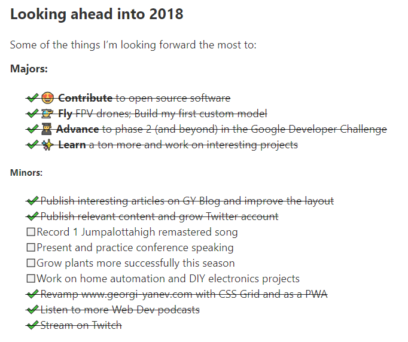
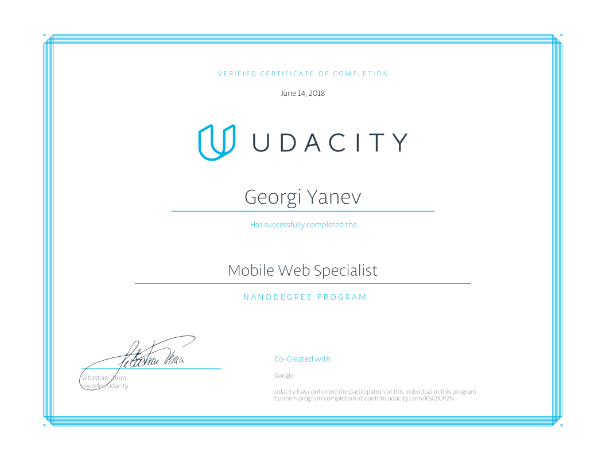
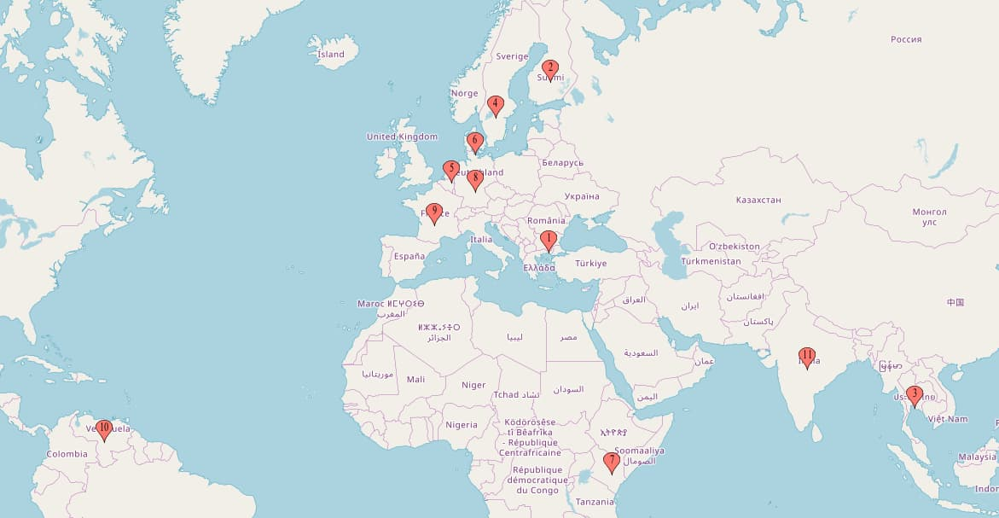
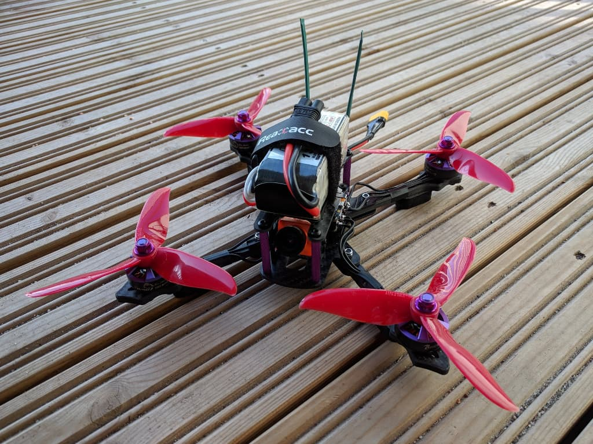
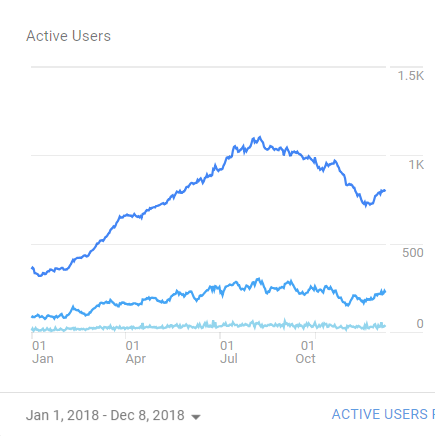
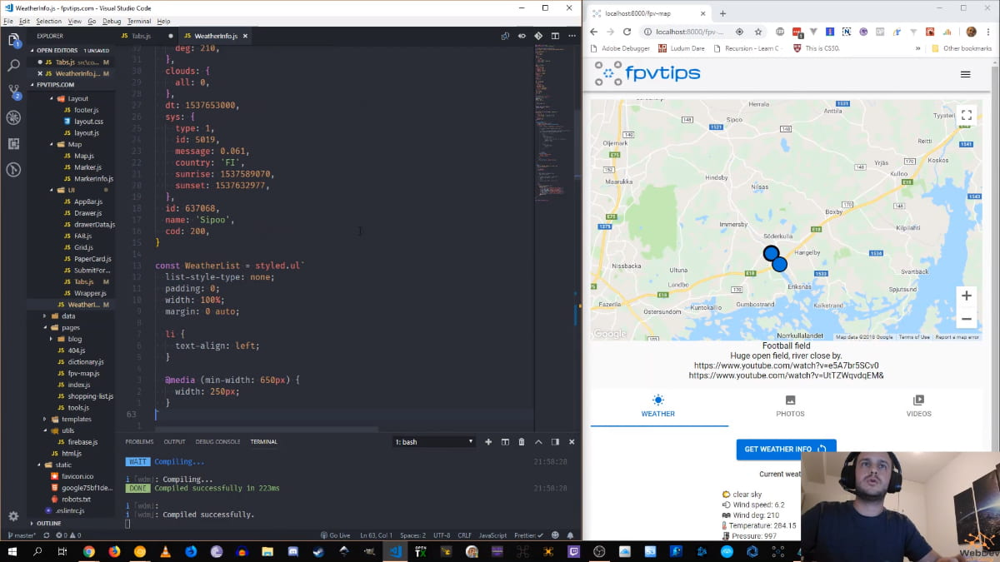

It's that time of the year again, and what a year it has been! Strap yourselves in, this is gonna be a long one!

I really enjoy these [reflection posts][1]. They shed a lot of light on what happened in the past 12 months. If anything, I think we should all reflect even more frequently, because it helps you build clarity and see how you have improved against yourself from the previous year. And this is important. While there's nothing particularly wrong with looking up to other people in your industry, it might not be the best guiding point to compare against those same people.

> **Always compare yourself, against your past self!**

So these are some of the items I set as goals for myself last year, and this is their progress:

I am happy to report that I achieved most of my goals, dropped a few as a result of a conscious decision and might move a few into the future.

So, in general, 2018 has been a great year! I am very happy with the outcome in so many ways, with plenty of learning opportunities, a lot of fun and family time!

### 🌤️ General

**In 2018 the weather in Finland had been amazing!!!** Ranging all the way from early May thru October, it has been mostly very warm and nice, with plenty of daylight and sunshine. Pure awesome! And the reason why this is so special, is because it is a bit rare, most summers tend to be rainy and on the colder side. 2018 weather 11/10.

We also [had our first vacation][2] since Anton was born and went on to visit my family in Cyprus in September. Perfect time to be there, as temperatures in Finland started to drop, but in Cyprus it was stil in the 30s (C) during the day. We had a great time!

Now let's rewind and back up a little bit.

### 🎓 Completing the Google Developer Challenge: Udacity Mobile Web Specialist Nano degree

So in the early 2018, the most notable things for me were the absolutely spectacular launch of the Space X Falcon Heavy rocket that took its [Starman][23] payload into orbit past Mars, and my participation in the Google Scholarship Challenge for a Mobile Web Specialist Nanodegree with Udacity. What a mountful! The Space X launch was a memory for life for me, just [watching the two side boosters land simultaneously side by side][3] rendered me speechless. And I'm happy to report that after a lot of hard work I made it to the end and [completed and graduated][4] from the Udacity Mobile Web Specialist nanodegree. I learnt a lot and practiced **delivering top quality web experiences using advanced web technologies and performance strategies. And loved it!**

During the whole nano degree there was plenty of getting your hands dirty with anything from writing your own [service workers][5] and using IndexDB, to optimizing images, to how you think of what the minimum required assets for your app are (critical rendering path), accessibility, measuring and monitoring performance and so much more. Man, **I thrive on this stuff**, which is why I'm so happy to have participated in the program and completed it 💜. The final project implementation is also open source and available at: [https://github.com/jumpalottahigh/mws-restaurant-stage-1][6]

### 🌍 Truly International

A thing definitely worth mentioning is that I had the opportunity and pleasure to be working on a project with a truly international team. **15 people from 11 different countries**. And what a ride that was! I am very grateful, I learnt a lot and I tried to contribute back and share knowledge myself!
I learnt a lot about how scrum and agile processes work as well as sprints and software releases to name a few.

We had people from: **Bulgaria, Finland, Sweden, Danmark, Netherlands, Germany, France, Venezuela, India, Kenya, Thailand**.

### 🚁 Building a drone and flying FPV

In the beginning of 2018 I wanted to build my own drone (I love [flying FPV racing drones][7]) and in the end of the winter season I started doing so. That **took MUCH longer than I expected**, and even though I was not in a hurry and started sourcing the parts in February, I did not complete the build until May. It also did not go without issues and I learnt a lot from the project. Definitely have no regrets! The whole build process is also [documented in this blog post][8]. And this is what the finished build looks like:

During 2018 is when this blog started receiving more visitors for its FPV drones articles. Over the past year it has gone from **~ 300 to ~ 1.1k monthly active users**.

I am very pleased with the result as this was one of the goals I set for myself last year. It is amazing that my articles help people with their builds, upgrades and other FPV related issues. **Awesome! Glad to help!**

Another goal I had set for myself last year that I'm happy to have achieved was to do a lot more flying of FPV drones in 2018 and I am happy to report that I landed this goal.

  <iframe width="560" height="315" src="https://www.youtube.com/embed/hgxJ_WPceZU?rel=0" frameBorder="0" allowFullScreen title="flying a wizard x220 on a sunny day in september"></iframe>

Moreover, I started [uploading HD footage][9] on YouTube. And while the previous link contains a list of videos with music, most of the
other flights were [uploaded raw, with no edits][10]. A thing I'd like to improve upon for next year, though, is my down time due to broken drones. Even with 2 quads I still had about 1-2 months of total downtime due to not having a drone to fly. Lesson learnt.

### 👨‍💻️ Double down on React and Vanilla JS

I love JavaScript but mostly in its vanilla form and in React projects. In 2018 I wanted to improve drastically my skills with a modern framework and **I decided to finally double down on [React][11]**. I had been too indecisive about this for too long, and man, does it feel great when you have finally made the decision and cleared that out of the way!

> **One of the main reasons for this decision was [Gatsby][12]!**

This blog and so many of my other projects are React projects using Gatsby. Gatsby is an awesome static site generator, built for speed and performance, has plenty of plugins, big community and a great developer experience. In short, it is a joy to built things with and the outcome is always incredible.

This mental model change has also helped me to start going to meetups and I went to 3 in 2018 (although I wish I went to more). I went to [HelsinkiJS][13] in January and in December and once to [React Helsinki][14] in August. It was a great experience and I'm looking forward to giving a talk at one of those events next year!

### 📦 Shipping, branding and streaming

I spent a decent amount of time branding and shipping products and collaborating on projects. There is actually so much to learn from a product launch, trying to reach an audience on different platforms and social media. Not my main passion (web dev is 💜), but good to know if you want to launch products.

My worth a mention plug here is for a **project I launched on my 33rd birthday** in November:

> **[fpvtips.com][15]** - a project that aims to help FPV pilots share their flying spots with the rest of the community and ultimately help people fly together.

https://twitter.com/jumpalottahigh/status/1059492682840576000

While I am not abandoning this blog in any form or way, I definitely feel like I'm deep enough into the hobby and I can share so much more, however I also wanted to create a modern platform that helps people get into the hobby, learn more and share experiences. I am **hyped to have worked hard on fpvtips and shipped the core functionality within about 2 months of development** and can't wait to add more information and get more people on the platform during this winter season as well as in 2019!

I also worked on a number of other small and big projects and collabs. Here are some worthy mentions:

- Helped with the initial build and setup of [playeverland.com][16]
- Built and setup [baehrbg.com][17]

And a couple of smaller projects I built for fun while streaming:

- [youtube-screenshot.netlify.com][18]
- [streamer-screen.netlify.com][19]

And speaking of streaming, a couple of months ago I [started streaming web development on Twitch][20].

I don't have a lot of active followers yet and as such I am **mostly talking to myself** during the streams (for now), but I am getting the hang of it, I am learning a lot about the setup, OBS, streaming management in general and how to talk in an educational, descriptive manner about what I'm doing. I had wanted to try streaming for a while now, and I am happy I finally gave it a shot. It's fun to do it, it helps me massively with concentration on only one task at a time, reduces procrastination and I am genuinely curious to see where this goes.

## Looking ahead into 2019

One thing I'd like to try for the 2019 goal list is to add quantifiable items to make it easier to measure the progress. Those are gonna be minimum values and anything extra achieved is very welcomed but not required.

### ⬜ Major goals:

- **📈 Grow fpvtips.com** to over 1k monthly active users
- **🚀 Launch 2 new products**
- **🎥 Produce** educational content for YouTube / Egghead.io (1 tutorial / series)
- **📝 Write a book** during [#NaNoWriMo][22] in November 2019
- **💬 Speak** at HelsinkiJS / ReactHelsinki
- **📡 Stream consistently** on Twitch / YouTube (once a week)
- **🛫 Go to [Plovdiv, Bulgaria][24]**
- **🚁 Fly even more FPV** with close to no downtime

#### ◻️ Minor goals:

- Go to 5 meetups (HelsinkiJS and ReactHelsinki combined)
- Participate in a micro or mini quad FPV race
- Learn more about testing JavaScript (Cypress and other tools)
- Mentorship: give or receive
- Trip to Lapland in the winter

There are also plenty of space things I'm excited about, coming in 2019. I am excited about the upcoming tests leading to an actual flight of the Space X Crew Dragon space craft! To add to that, in 2019 we should see a few more Falcon Heavy launches and let's hope that [Mr.Steven][21] finally catches a fairing from space 🎣. On top of that, InSight just arrived on Mars, OSIRIS-REx arrived at Bennu and New Horizons is about to arrive at an object in the Kuiper Belt in January 2019.

#### 🏁 Wrapping it up

If you actually read through all of this, kudos to you! I hope you are as inspired to complete your goals in 2019 as I am. Let's come back here in a year and recap. Good luck and enjoy!

#### Here's to a great 2019! 🍾🎉

[0]: Linkslist
[1]: /learning/recap-of-2017-and-goals-for-2018/
[2]: https://www.instagram.com/p/BnoWjBWhAEF/
[3]: https://twitter.com/jumpalottahigh/status/961116348825862144
[4]: https://confirm.udacity.com/KSG5UP2N
[5]: https://developer.mozilla.org/en-US/docs/Web/API/Service_Worker_API
[6]: https://github.com/jumpalottahigh/mws-restaurant-stage-1
[7]: https://www.instagram.com/p/BqUPyt7l1al/
[8]: /fpv/build-a-quad/
[9]: https://www.youtube.com/watch?v=aASDUpVy3zM&list=PLxuusHIzi2UoSYK9fHSvJF_fUiVeo35ka
[10]: https://www.youtube.com/watch?v=398BDc5mvuA&list=PLxuusHIzi2UoB9ZQtiS0k4DnouIQtWCat
[11]: https://reactjs.org
[12]: https://www.gatsbyjs.org
[13]: https://twitter.com/helsinkijs
[14]: https://twitter.com/reacthelsinki
[15]: https://www.fpvtips.com
[16]: https://playeverland.com
[17]: https://www.baehrbg.com
[18]: https://youtube-screenshot.netlify.com
[19]: https://streamer-screen.netlify.com
[20]: https://www.twitch.tv/jumpalottahigh
[21]: https://twitter.com/FairingCatcher
[22]: https://nanowrimo.org/
[23]: https://www.whereisroadster.com/
[24]: https://plovdiv2019.eu/en
