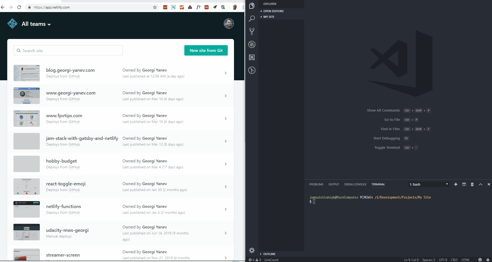

This post is based on a talk I gave at [Frontend Finland 2019][1] and at [HelsinkiJS March 2019][35] called: **"JAMstack with Gatsby and Netlify"**.


## 🕳 Intro and why

I'd like to share some thoughts about the [JAMstack][2]. And in particular - the JAMstack with [Gatsby][3] and [Netlify][4]. I work as a [web developer][5] at F-Secure and I am convinced that performance on the web matters. [The web just had its 30th birthday][6] and it's our job to build performing and high-quality experiences.


Oh yeah, and I love flying FPV drones.

So, let's get to it.

## 🥞 What is the JAMstack?


> _Credit: jamstack.org_

The `JAM` acronym stands for `J` avascript, `A` PIs, `M` arkup.

It's a term coined by [Mathias Biilmann][7] from Netlify and has been making rounds for the past few years. Let's destructure the acronym.

#### `const { J } = JAM`

> "Any dynamic programming during the request/response cycle is handled by JavaScript, running entirely on the client. This could be any frontend framework, library, or even vanilla JavaScript."

> _jamstack.org_

I think the key takeaways here are **running entirely on the client** and **any framework, library or VanillaJS**. Cool, so pretty loose definition, which is great.

#### `const { A } = JAM`

> "All server-side processes or database actions are abstracted into reusable APIs, accessed over HTTPS with JavaScript. These can be custom-built or leverage third-party services."

> _jamstack.org_

I'd like to bring your attention here to the **reusable APIs over HTTPS with JavaScript** and **custom-built or third-party services**. Good definition, nothing groundbreaking, pretty simple.

#### `const { M } = JAM`

> "Templated markup should be prebuilt at deploy time, usually using a site generator for content sites, or a build tool for web apps."

> _jamstack.org_

The markup part talks about **prebuilt markup at deploy time**. Some tooling required, ok cool.

Here are [several example jamstack sites featured on jamstack.org/examples][8]:


Again the interesting thing to note is that you could opt-in for any framework or library and still ship a JAMstack site. It's interesting to also note the fact that many of the examples use headless CMS's to pull in content.

Here's the part I personally like the most about the JAMstack.


#### 📈 Better Performance

The biggest performance benefit with the JAMstack approach comes from the fact that we are serving prebuilt HTML from the CDN edge.

#### 🔐 Higher Security

Less server side processes = less attack surface.

#### 💵 Cheaper and Easier Scaling

As a rule of thumb scaling is easy and efficient for static files and that's what we are ultimately deploying.

#### 😍 Better Developer Experience

With a JAMstack approach, there are fewer things to maintain and it's usually faster to deploy, so developers are happy.

#### Disclaimer

While here I aim to focus more on the benefits of the JAMstack, it is worth noting that the JAMstack approach is not a silver bullet and it is not the answer to all problems. In engineering, it is a good idea to consider the trade-offs and choose the right approach for your project.

> **Engineering is all about making the right trade-offs based on your requirements**

Just a month ago [Jason Miller][9] and [Addy Osmani][10] from the Google Chrome team put together an [article on when to use SSR and a comparison on many different rendering strategies][11].

https://twitter.com/_developit/status/1093223382223605762

The article makes for an interesting read and in particular, this table is worth spending some time on.


> _Credit: https://developers.google.com/web/updates/2019/02/rendering-on-the-web_

Finally, another resource worth checking out is the JAMstack video on the Google Chrome Developers YouTube channel by [Surma][12] and [Jake Archibald][13].

<div style="text-align: center">
  <iframe width="560" height="315" src="https://www.youtube.com/embed/QXsWaA3HTHA?rel=0" frameBorder="0" allowFullScreen title="JAMstack with Surma and Jake Archibald from the Google Chrome team" referrerpolicy="strict-origin-when-cross-origin"></iframe>
</div>

<div style="margin-top: 3rem; margin-bottom: 1rem;">
  
</div>

The next sections on different [Netlify][4] features might come across as a bit fanboyish, and that's ok because it is. I've had a great experience using Netlify's services for about a year and a half and for the better part everything has been outstanding.

#### 😍 Dev Experience

If you are active on Twitter and following any Frontend or Full stack people chances are you might have heard people praise Netlify for what it is, and rightfully so. In fact, I do so myself frequently. It's because they are awesome, the product is great, and the developer experience score is over 9000.

#### 💵 Free tier

You can get started with the free tier in a matter of seconds and you will probably not outgrow it any time soon.

#### 📦 Application Delivery Network (ADN)

CDN for apps. Netlify comes with a powerful CDN for applications and static sites with plenty of edge nodes.

#### 🔁 Continuous Deployment

If your project has a repository in GitHub, GitLab or Bitbucket, it's a matter of a few clicks to link that repository to Netlify. This enables you to publish on merges or pushes to the `master` branch of your repository, for example. Very easy to set up with no hassle, very powerful feature.

#### 📑 SSL Certificates

Netlify provides a free of charge SSL certificate for your project by utilizing the open source Let's Encrypt project. This is important because in 2019 SSL and https are not only highly recommended they are almost a requirement. That provides better security for your users, is required for HTTP/2 and some new TLDs (like `.dev`) and is good for SEO. The best part about it - Netlify automatically renews the certificates for you, so you don't have to do anything!

#### 📝 Custom Domains

Here the developer experience comes first again, as it is just SO easy to set up a custom domain for your site. With a few clicks, you are good to go. The flow is very smooth. You can also rename the default subdomain where Netlify hosts your project by default, and redirect that to your custom domain. Very cool.

#### 🚀 Auto previews for PRs

When you open a pull request against the master branch of your repository, Netlify will automatically build a preview of that pull request. That's super awesome! Again, no configuration required, apart from having a project linked to a GitHub repository. That's pretty neat to be always able to check quickly how the changes from a PR look before you have merged it.

#### ƒ Netlify Functions

AWS lambdas simplified. This is really nice to have in case you ever need to do a bit more with Node.js. You don't have to use it if you don't want to, but the feature is there which is neat.

#### 🆔 Netlify Identity

Provides authentication. A way to manage sign-ups, logins. Could be cool for things like the Netlify CMS or creating some sort of gated content like dashboards, personal account pages and more.

#### 📅 Netlify Forms

Get data from a form right into the Netlify app by only adding a `netlify` attribute to a form. This could be very cool and quite useful you if don't want to go over setting up something more complicated and you need to ship something now, or you are prototyping.

#### 🙌 Deploy a site by dragging and dropping



The above is a 30-second deploy demo that gets your site on the internet at a netlify.com subdomain (that you can rename or set up your own custom domain) and an SSL certificate. It's bonkers 🤯.

#### 👍 Deploy from a repository

But as I mentioned the true power of Netlify comes from connecting it straight to a repository, when you can reap the benefits of auto deploys, deploy previews and other nice things.

<div style="display: flex; margin-top: 3rem; margin-bottom: 1rem;">
  
</div>

[Gatsby][3] is many times introduced as a React based static site generator (which it is) but it also doesn't do it justice, because maybe some people miss the fact that Gatsby also rehydrates into a full-fledged React app during runtime.

#### 🔥 Blazing fast

One of the most important points is that Gatsby is engineered for performance from the ground up. A default project setup with Gatsby starts off with Lighthouse scores of 100 across Performance, Accessibility, Best Practices, and SEO and can be configured in seconds to deploy as a [Progressive Web App][15] (PWA).

#### 🛠 Tooling

Gatsby comes with all the modern tools configured and setup for you. You get [Webpack][16], [Babel][17], [ESLint][18], [Prettier][19], [GraphQL][20] and so much more.

#### 📀 Your data from any source

Gatsby creates GraphQL types of data from any source so that you can query it in a similar way across your app. The data can be sourced from headless CMS's, third-party APIs, local file system and more. Some headless CMS options worth mentioning and trying out are: [Contentful][21], [Sanity][22], [DatoCMS][23].

#### 📦 Deploy Anywhere

Because Gatsby compiles your project into static files (HTML, CSS, JS, JSON) you can deploy the output anywhere you could deploy static assets. For example: [Netlify][4], [AWS S3][24], [Now][25], [GitHub Pages][26] and more.

#### 🅿W🅰

You can create a PWA in seconds by running:

```sh
$ npx gatsby new my-pwa
```

and then enabling the `gatsby-plugin-offline` in `gatsby-config.js` by uncommenting it.

#### 👩‍💻 DX

The developer experience is pretty solid. There many helpful warning and error messages with actionable information available right in your terminal should any issues arise while you are developing.

Because Gatsby uses Webpack under the hood, you get Hot Module Replacement (HMR) and previewing changes while developing is nearly instant as soon as you save the file.

Except for booting up your project on `localhost:8000`, Gatsby also gives you a GraphiQL instance at `localhost:8000/___graphql` where you can live query your data and prototype GraphQL queries, as well as just explore the shape of your data. Very useful!

#### 🔄 Rich ecosystem

There are plenty of resources to get you started. More than 700 plugins and plenty of starters that are just an `npx gatsby new [GITHUB REPO URL]` away.

#### 💜 Amazing community

The community around Gatsby is comprised of many people passionate about the future of the project, willing to help each other out. There are a LOT of articles out there on complete stacks, solving a particular problem, or just using a specific data source. That makes it easy to find an example when you need one.

There is a [Discord][27] channel, [Spectrum][28] community and following [Gatsby on Twitter][29] is probably a good idea, as the main account tweets and retweets many useful resources.

In fact, some people might be so passionate, as to have claimed that a Gatsby project can get a Lighthouse performance score of 70+ while running at CDN edge on a _TOASTER_.

https://twitter.com/jumpalottahigh/status/1083999310168162304

Here's how the Lighthouse scores of the default Gatsby starter look, for illustration purposes.


### 🚀 #Perfmatters

Here's where I take a small tangent on a topic I care deeply about - web performance.

There are many reasons to care about performance, but at the end of the day, it's Your users and Your business on the line.

Performance, speed, user satisfaction all translate to real money. There are also SEO benefits for fast sites as of July 2018 as page speed is now a part of the page ranking algorithm.

Having a fast, performing site is a good way to distinguish yourself from your competition. Users are impatient nowadays, and slow sites lead to increased bounce rates.

Finally, as we welcome the next 1 billion users on the internet, it's good to be aware that they might be coming online from places where bandwidth is expensive and connections could be flaky.

Now that the Web had its 30th birthday, let's be nice and build quality experiences!

#### What can Gatsby do about that?

Well, as I mentioned already, Gatsby is engineered for performance from the ground up. There are many things that Gatsby does right and manages for you. From how resources are loaded to optimize for the [critical rendering path (CRP)][30], to how resources are prefetched and preloaded for routes the user might hit next.

But I'd like to talk about the `gatsby-image` component. Opting-in to use that for your images, is a great way to grab some of those high impact low effort low hanging fruit.

Depending on what your app is like, images could make up for a big portion of all the resources you serve to users. In some cases, it could be up north of 70%. Now, admittedly, byte for byte JavaScript has a higher cost than images, because it also undergoes parsing and execution after downloading, but Gatsby manages that for you, and images are still very important to handle right.

At the very least I suggest you use [squoosh.app][31] to resize and optimize your original assets.

What `gatsby-image` does for you is it provides you with a highly optimized lazy loading image component. Images not in the viewport during page load are not going to be downloaded. In their place, you could opt-in for a low-quality base64 encoded image placeholder, that gets replaces with the original high-quality image as soon as the user scrolls that asset in the viewport. Gatsby provides you a blur up effect or a traced SVG effect if that's what you choose how to handle the low-quality placeholder.

The `gatsby-image` component also has a `srcset` attribute where different size images are specified based on viewport width to avoid serving extra large assets to devices that couldn't use up the full size of the image.

Finally, the component serves `webp` images to browsers that can handle that. There is always a fallback for `jpeg` or `png`, but serving `webp` can help a lot because the file size is usually significantly smaller with a visibly similar quality as `jpeg` or `png`.

### Try out React and GraphQL for the first time

Whether you are a seasoned veteran or a newcomer to the [React][32] and [GraphQL][20] world, it is easy to get started with those technologies when using Gatsby. I think it's worth mentioning that because you don't need a whole lot of prior knowledge to get started here. You can write your first React component or a GraphQL query today with Gatsby.

And because Gatsby is using React under the hood, that means you could pull up any React package from [npm][33]. Yay 🎉!

### How does Gatsby work in a nutshell?


> _Image from gatsbyjs.org_

Quite straightforward. We have our data sources at the top. Those could be anything from headless CMS's to local JSON or YAML files, to 3rd party APIs and others.

Gatsby pulls those in and generates GraphQL types for you that you can query against. `localhost:8000/___graphql` is your friend when you want to explore the data.

Then, bring in the data to your components using GraphQL queries, which makes said data available as a `data` prop on your components. Use it to build your components.

When you run `gatsby build`, Gatsby will create a production build in the `public` directory at the root. Use that to deploy the assets to any static web host (Netlify, AWS, Now, GitHub pages, etc).

### How to get started?

#### CLI

To get started from the command line run:

```sh
$ npx gatsby new my-site
```

This will set up for you the default Gatsby starter project.

#### [CodeSandbox.io][34]

You can try out Gatsby right in CodeSandbox. Create a new sandbox and select Gatsby from the server templates.


#### By deploying to Netlify

Use the green deploy to Netlify button, available on many starter repositories to instantly deploy a version of that project to Netlify.


Alternatively, pass a Gatsby starter repository to the `repository` parameter as seen below:

```
https://app.netlify.com/start/deploy?repository=https://github.com/gatsbyjs/gatsby-starter-default
```

### Data Sources

One of the nice things about Gatsby is the fact that you could pipe in data from many different data sources.


Whatever the source - local file system or a headless CMS, the data is available to query in GraphiQL. Try it for yourself right now!

In this example project, we have data coming in from JSON files as seen on the image below.


Now, in the editor below type in:

```graphql
{
  allPagesJson
}
```

and press the play button to execute the query. GraphiQL will fill in some extra subfields for you, namely `edges`, `node` and `id`. In the right pane, you see the data that comes back from your query. Try it out!

<iframe src="https://k3201jy9jo.sse.codesandbox.io/___graphql?fontsize=14" style="width:100%; height:500px; border:0; border-radius: 4px; overflow:hidden;" sandbox="allow-modals allow-forms allow-popups allow-scripts allow-same-origin" title="CodeSandbox.io embed"></iframe>

Let's add also `path`, `title` and `body` each on a separate line below `id`. Click play and see how data for those fields come back as well. Awesome! Congrats on trying out your first GraphQL query!

Here is the final query for illustration purposes.

```graphql
{
  allPagesJson {
    edges {
      node {
        id
        path
        title
        body
      }
    }
  }
}
```

Keep in mind, `CTRL` + `Space` is your friend here. It invokes the autocompletion which is handy for remembering what fields you wanted to fetch.

### 🔁 Ecosystem

#### Plugins

There are [more than 700 plugins][36] (at least the ones listed on the official site) for Gatsby, which is a lot. Those plugins are chunks of reusable functionality you can bring into your projects by installing them and configuring them in `gatsby-config.js`. I'm not even going to get into the examples, just search for what you have in mind and chances are it exists. If it does not, then maybe that's a good opportunity to write a plugin yourself and share it with the community. The tutorial on [how to create a source plugin][37] is a great place to start.

Some plugins enable a certain type of functionality, like create a sitemap, RSS feed or add Google Analytics to your site. Others are the so-called **source** plugins that deal with fetching data. Yet another type is the **transformer** plugins that, well... transform data. For instance from JSON or YAML in your local file system to types you can query from within Gatsby.

It's also worth mentioning that you could also create local plugins, right within your project. This enables you to create custom private plugins if you have a use case for that (for example an internal company API).

#### Starters

While plugins are more about bringing in chunks of functionality as you need it, [starters are a more well-rounded solution][38]. A starter is a complete project starting boilerplate based on a specific use case, functionality or a data source.

For example, if you'd like to get started very quickly and you know your project will use data from [Contentful][21] and will be deployed to [Netlify][4] you can start right away with a starter configured for that:

```sh
$ npx gatsby new https://github.com/ryanwiemer/gatsby-starter-gcn
```

There are starters for [blogging][39], with [SEO emphasis][40], for [PWAs][41], depending on your choice of a [styling solution][42] and more.

Overall starters are great. There is only one minor potential shortcoming. Right now, if you wanted to pull in updates from the starter you are using as it gets improved over time, you can't really do that, as your project is completely detached from the starter after the initial setup. The Gatsby team is working on a feature that might change that - [THEMES][43]. That could be really powerful.

#### Showcase

The [showcase page on gatsbyjs.org][44] has a lot of interesting examples for you to check out if you need inspiration and ideas. Or why not [submit your own projects to share them with the community][45]!

### So, what can you build with Gatsby?

**Landing pages**


> _justdoit.nike.com_

**Image heavy sites**


> _kirstennoelle.com_

You could build gorgeous projects with a lot of "heavy" high-quality images and still be very performant.

**Data visualization heavy apps**


> _2018.stateofjs.com_

**E-commerce**


> _store.gatsbyjs.org_

**Blog**


> _airbnb.io_

**Documentation sites**


> _reactjs.org_

### My projects

Some of the things I've built with Gatsby are:

**georgiyanev.dev**


_Gatsby, Netlify, Markdown, Styled Components, Sitemap, RSS feed_

**fpvtips.com**


_Gatsby, Contentful, Netlify, Google Maps, Open Weather Map, Material UI, Markdown, JSON_

**baehrbg.com**


_Gatsby, Contentful, Netlify, React Reveal, React Icons_

I had a lot of fun building these projects. And the fact that they are deployed from Netlify has saved me a TON of time.

> **In fact, I think there is a direct correlation between the time that has passed since I started using Netlify and the number of projects I have deployed and maintain.**

The former is also very important, as there have been so many times I needed to fix a typo, squash a bug, and all I had to do was commit my fix to the repository. Netlify took care of the rest, deploying my site automatically!

All my projects are open source and available on GitHub at [https://github.com/jumpalottahigh][46]


### 👩‍🎓 If you want to learn more...

Depending on what works for you, you might prefer to learn by doing, from videos or by reading. Whatever the case, I do recommend doing the official [Gatsby tutorial][47] and peeking in the [documentation][48] whenever you need to. Additionally, there are many projects out there, including many Gatsby starters, that you can learn from by example.

### Contribute and get swag

Gatsby is open source and as such is happy to [accept your contributions][49]. This is also a great way to learn and why not grab some sweet, sweet swag while at it.


## 🔚 Conclusion

I hope I managed to get you excited to build something with Gatsby and Netlify. That's what it boils down to in the end. I had a lot of fun, and I felt very productive using these technologies. They literally helped me SHIP. That's why I wanted to share my experience and hopefully excite you to build something today too.

Additionally, I hope I managed to drive home the **performance matters** point. It's up to all of us to build the web for tomorrow today. How we do that matters and shipping fast, high-quality experiences should not be underestimated.

**Go have fun building things with Gatsby and Netlify!**

[0]: Linkslist
[1]: https://www.meetup.com/frontendfinland/events/258866782/
[2]: https://jamstack.org
[3]: https://www.gatsbyjs.org/
[4]: https://www.netlify.com/
[5]: /learning/how-i-got-into-software-development/
[6]: https://web30.web.cern.ch/
[7]: https://twitter.com/biilmann
[8]: https://jamstack.org/examples/
[9]: https://twitter.com/_developit
[10]: https://twitter.com/addyosmani
[11]: https://developers.google.com/web/updates/2019/02/rendering-on-the-web
[12]: https://twitter.com/DasSurma
[13]: https://twitter.com/jaffathecake
[14]: https://gyanev.com/about/
[15]: https://developers.google.com/web/progressive-web-apps/
[16]: https://webpack.js.org/
[17]: https://babeljs.io/
[18]: https://eslint.org/
[19]: https://prettier.io/
[20]: https://graphql.org/
[21]: https://www.contentful.com/
[22]: https://www.sanity.io/
[23]: https://www.datocms.com/
[24]: https://aws.amazon.com/s3/
[25]: https://zeit.co/now
[26]: https://pages.github.com/
[27]: https://gatsby.app/discord
[28]: https://spectrum.chat/gatsby-js
[29]: https://twitter.com/gatsbyjs
[30]: https://developers.google.com/web/fundamentals/performance/critical-rendering-path/
[31]: https://squoosh.app/
[32]: https://reactjs.org/
[33]: https://www.npmjs.com/
[34]: https://codesandbox.io/
[35]: https://twitter.com/helsinkijs
[36]: https://www.gatsbyjs.org/plugins/
[37]: https://www.gatsbyjs.org/docs/source-plugin-tutorial/
[38]: https://www.gatsbyjs.org/starters/?v=2
[39]: https://www.gatsbyjs.org/starters/?c=Blog&v=2
[40]: https://www.gatsbyjs.org/starters/?c=SEO&v=2
[41]: https://www.gatsbyjs.org/starters/?c=PWA&v=2
[42]: https://www.gatsbyjs.org/starters/?c=Styling%3ACSS-in-JS&v=2
[43]: https://www.youtube.com/watch?v=PS2784YfPpw
[44]: https://www.gatsbyjs.org/showcase/
[45]: https://www.gatsbyjs.org/contributing/site-showcase-submissions/
[46]: https://github.com/jumpalottahigh
[47]: https://www.gatsbyjs.org/tutorial/
[48]: https://www.gatsbyjs.org/docs/
[49]: https://www.gatsbyjs.org/contributing/
